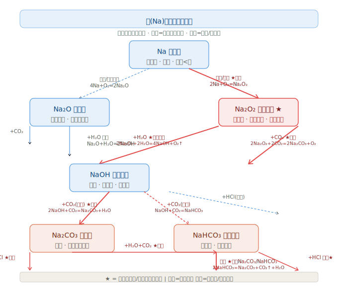
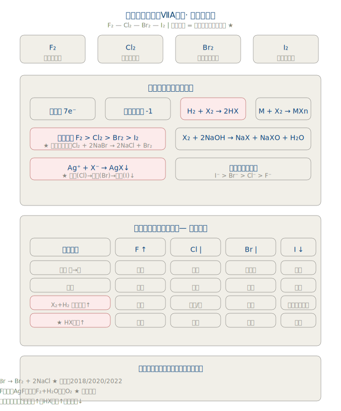
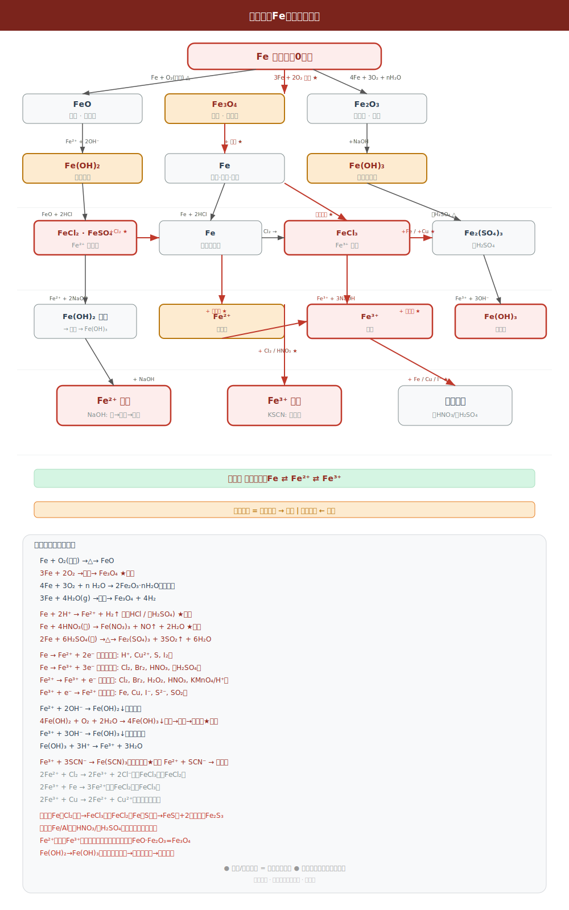

# 物质转化专题整理
> 来源：人教版高中化学必修第一册，涉及第一章、第二章、第三章及各章整理与提升

---

## 一、物质转化的核心思路（第一章第一节）

> 教材原文（第16页）：**"在化学变化过程中，元素是不会改变的，这是考虑如何实现物质之间的转化时最基本的依据。"**

**两大认识视角**（第三章整理与提升 总结）：
1. **物质类别视角**：单质 → 氧化物 → 碱/酸 → 盐
2. **元素价态视角**：利用氧化还原反应实现不同价态物质之间的转化

---

## 二、物质类别间转化关系总图


```
金属单质 ——+O₂——→ 碱性氧化物 ——+H₂O——→ 碱 ——+酸——→ 盐
                         ↕（+对方→盐+H₂O）      ↕（中和反应）
非金属单质 ——+O₂——→ 酸性氧化物 ——+H₂O——→ 酸 ——+碱——→ 盐
```

**补充规律**：
- 酸性氧化物 + 碱 → 盐 + H₂O（如 CO₂ + 2NaOH = Na₂CO₃ + H₂O）
- 碱性氧化物 + 酸 → 盐 + H₂O（如 CaO + H₂SO₄ = CaSO₄ + H₂O）
- 盐 + 酸 → 新盐 + 新酸（满足离子反应条件）
- 盐 + 碱 → 新盐 + 新碱（满足离子反应条件）
- 盐 + 盐 → 两种新盐（满足离子反应条件）

---

## 三、典型元素转化链（教材第16页）


### 3.1 金属路线——以 Ca 为例

| 步骤 | 物质 | 类别 | 方程式 |
|------|------|------|--------|
| 起点 | Ca | 金属单质 | — |
| 第一步 | CaO | 碱性氧化物 | 2Ca + O₂ → 2CaO |
| 第二步 | Ca(OH)₂ | 碱 | CaO + H₂O = Ca(OH)₂ |
| 第三步 | CaSO₄ | 盐 | Ca(OH)₂ + H₂SO₄ = CaSO₄ + 2H₂O |

> 拓展：Ca → NaOH 时 Ca 与水剧烈反应：Ca + 2H₂O = Ca(OH)₂ + H₂↑

---

### 3.2 非金属路线——以 C 为例

| 步骤 | 物质 | 类别 | 方程式 |
|------|------|------|--------|
| 起点 | C | 非金属单质 | — |
| 第一步 | CO₂ | 酸性氧化物 | C + O₂ →（点燃）CO₂ |
| 第二步 | H₂CO₃ | 酸 | CO₂ + H₂O = H₂CO₃ |
| 第三步 | CaCO₃ | 盐 | H₂CO₃ + Ca(OH)₂ = CaCO₃↓ + 2H₂O |

---

### 3.3 教材练习题——Cu 和 C 的综合转化链（第18页第6题）

**Cu 的转化链：**
```
Cu → CuO → CuSO₄ → Cu(OH)₂ → CuSO₄ → Cu
```

| 步骤 | 方程式 |
|------|--------|
| Cu → CuO | 2Cu + O₂ →（加热）2CuO |
| CuO → CuSO₄ | CuO + H₂SO₄ = CuSO₄ + H₂O |
| CuSO₄ → Cu(OH)₂ | CuSO₄ + 2NaOH = Cu(OH)₂↓ + Na₂SO₄ |
| Cu(OH)₂ → CuSO₄ | Cu(OH)₂ + H₂SO₄ = CuSO₄ + 2H₂O |
| CuSO₄ → Cu | CuSO₄ + Fe = FeSO₄ + Cu（置换反应）|

**C 的转化链：**
```
C → CO₂ → CaCO₃ → CaO → Ca(OH)₂ → CaCl₂
```

| 步骤 | 方程式 |
|------|--------|
| C → CO₂ | C + O₂ →（点燃）CO₂ |
| CO₂ → CaCO₃ | CO₂ + Ca(OH)₂ = CaCO₃↓ + H₂O |
| CaCO₃ → CaO | CaCO₃ →（高温）CaO + CO₂↑ |
| CaO → Ca(OH)₂ | CaO + H₂O = Ca(OH)₂ |
| Ca(OH)₂ → CaCl₂ | Ca(OH)₂ + 2HCl = CaCl₂ + 2H₂O |

---

## 四、钠及其化合物的转化（第二章）


### 4.1 以物质类别为线索

```
Na ——O₂点燃——→ Na₂O₂ ——+H₂O——→ NaOH ——+CO₂——→ Na₂CO₃ ——+CO₂+H₂O——→ NaHCO₃
 └——+H₂O直接——→ NaOH（同时放H₂）
```

| 转化 | 方程式 | 备注 |
|------|--------|------|
| Na → Na₂O | 4Na + O₂ = 2Na₂O | 常温，表面变暗 |
| Na → Na₂O₂ | 2Na + O₂ →（点燃）Na₂O₂ | 点燃，淡黄色固体 |
| Na → NaOH | 2Na + 2H₂O = 2NaOH + H₂↑ | 浮熔游响红 |
| Na₂O₂ → NaOH | 2Na₂O₂ + 2H₂O = 4NaOH + O₂↑ | 供氧剂原理 |
| Na₂O₂ → Na₂CO₃ | 2Na₂O₂ + 2CO₂ = 2Na₂CO₃ + O₂ | 净化CO₂空气 |
| NaOH → Na₂CO₃ | 2NaOH + CO₂ = Na₂CO₃ + H₂O | CO₂过少 |
| NaOH → NaHCO₃ | NaOH + CO₂ = NaHCO₃ | CO₂过量 |
| Na₂CO₃ → NaHCO₃ | Na₂CO₃ + CO₂ + H₂O = 2NaHCO₃ | — |
| NaHCO₃ → Na₂CO₃ | 2NaHCO₃ →（加热）Na₂CO₃ + H₂O + CO₂↑ | 鉴别两者的方法 |

> ⚠️ **常见错误**：Na₂O₂ 与水/CO₂反应都有 O₂ 生成，均为氧化还原反应（Na₂O₂ 中氧为 -1 价，既做氧化剂又做还原剂）



---

## 五、氯及其化合物的转化（第二章）

转化关系图_高中.svg)

### 5.1 以价态为线索：-1 → 0 → +1

```
Cl⁻ (−1价)  ←————氧化————→  Cl₂ (0价)  ——+H₂O——→  HClO (+1价) ——+Ca(OH)₂——→ Ca(ClO)₂
```

| 价态 | 物质代表 | 关键性质 |
|------|----------|----------|
| −1 | HCl, NaCl, CaCl₂ | 无氧化性，Cl⁻ 可被检验（AgNO₃法） |
| 0 | Cl₂ | 氧化性强，有毒，黄绿色 |
| +1 | HClO, NaClO, Ca(ClO)₂ | 漂白性，不稳定，光照分解 |

**关键转化反应**：

| 转化 | 方程式 | 条件 |
|------|--------|------|
| HCl → Cl₂ | MnO₂ + 4HCl(浓) → MnCl₂ + Cl₂↑ + 2H₂O | 加热 |
| Cl₂ + H₂O ⇌ HCl + HClO | 氯水的成分来源 | 可逆 |
| Cl₂ → 漂白粉 | 2Cl₂ + 2Ca(OH)₂ = Ca(ClO)₂ + CaCl₂ + 2H₂O | — |
| Ca(ClO)₂ → HClO | Ca(ClO)₂ + CO₂ + H₂O = CaCO₃↓ + 2HClO | 漂白原理 |
| HClO 分解 | 2HClO →（光照）2HCl + O₂↑ | 光照 |
| Cl₂ → Cl⁻ | Cl₂ + 2NaOH = NaCl + NaClO + H₂O | 尾气吸收 |

### 5.2 卤族元素（F₂、Cl₂、Br₂、I₂）—— 通性与个性

> 卤族元素位于周期表第ⅦA族，最外层均为 7 电子，化学性质相似但存在递变规律。

转化关系图_高中.svg)

转化关系图_高中.svg)

转化关系图_高中.svg)



**卤族元素递变规律**：

| 性质 | F₂ | Cl₂ | Br₂ | I₂ | 递变方向 |
|------|-----|------|------|------|----------|
| 颜色 | 淡黄绿色 | 黄绿色 | 深红棕色 | 紫黑色 | 颜色逐渐加深 |
| 状态 | 气体 | 气体 | 液体 | 固体 | 熔沸点逐渐升高 |
| 氧化性 | 最强 | 强 | 较弱 | 弱 | **F₂ > Cl₂ > Br₂ > I₂** |
| 与H₂反应 | 暗处爆炸 | 光照爆炸 | 加热缓慢 | 持续加热可逆 | 越来越难 |
| 置换反应 | — | Cl₂置換Br⁻/I⁻ | Br₂置换I⁻ | 不能置换 | — |

> ⚠️ **易错提醒**：F₂ 是最活泼的非金属，F⁻ 不能被任何化学试剂氧化（电解除外）；卤族元素从上到下氧化性减弱、还原性增强。

---

## 六、铁及其化合物的转化（第三章）


### 6.1 以物质类别为线索

```
Fe → FeCl₂ / FeSO₄（亚铁盐）→ Fe(OH)₂（白色↓）→ Fe(OH)₃（红褐色↓）→ Fe₂O₃
Fe → FeCl₃（铁盐）          → Fe(OH)₃（红褐色↓）→ Fe₂O₃
```

### 6.2 以价态为线索——铁三角（★ 最重要）

```
              Fe（0价）
             ↗         ↘
    H⁺/Cu²⁺↗             ↘ Cl₂/HNO₃/H₂O₂
           ↙               ↙
    Fe²⁺（+2价） ←→ Fe³⁺（+3价）
         ↑  还原剂(Fe/Cu/KI)   ↓ 氧化剂(Cl₂/KMnO₄)
         └───────────────────┘
```

| 转化方向 | 所需试剂 | 离子方程式 |
|----------|----------|------------|
| Fe → Fe²⁺ | H⁺（稀酸） | Fe + 2H⁺ = Fe²⁺ + H₂↑ |
| Fe → Fe³⁺ | Cl₂（强氧化剂） | 2Fe + 3Cl₂ →（点燃）2FeCl₃ |
| Fe²⁺ → Fe³⁺ | Cl₂ | 2Fe²⁺ + Cl₂ = 2Fe³⁺ + 2Cl⁻ |
| Fe³⁺ → Fe²⁺ | Fe | 2Fe³⁺ + Fe = 3Fe²⁺ |
| Fe³⁺ → Fe²⁺ | Cu | 2Fe³⁺ + Cu = 2Fe²⁺ + Cu²⁺ |
| Fe²⁺ → Fe | Zn | Zn + Fe²⁺ = Zn²⁺ + Fe |
| Fe(OH)₂ → Fe(OH)₃ | O₂ | 4Fe(OH)₂ + O₂ + 2H₂O = 4Fe(OH)₃ |

> ⚠️ **颜色记忆**：Fe²⁺ 浅绿色 → Fe(OH)₂ 白色 → 灰绿色 → **Fe(OH)₃ 红褐色**



---

## 七、C 的价态转化链（教材第37页第11题）

```
        ① +O₂     ② +O₂(限量)   ③ 高温   ④ +Ca(OH)₂   ⑤ +HCl
C ────────→ CO₂ ←──────────── CO ─────→ CaCO₃ ──────→ ...
                                  ↑ 还原 CO₂（⑥高温）
```

| 转化 | 方程式 | 是否氧化还原 |
|------|--------|------------|
| C → CO₂ | C + O₂ →（点燃）CO₂ | 是（C升价） |
| C → CO | 2C + O₂ →（点燃，不足）2CO | 是 |
| CO → CO₂ | 2CO + O₂ →（点燃）2CO₂ | 是 |
| CO₂ → CaCO₃ | CO₂ + Ca(OH)₂ = CaCO₃↓ + H₂O | 否 |
| CO₂ → CO | CO₂ + C →（高温）2CO | 是 |

---

## 八、两个认识视角总结（教材第79页方法导引）

| 视角 | 功能 | 举例 |
|------|------|------|
| **物质类别** | 预测化学性质，设计转化途径 | Fe₂O₃（金属氧化物）→ 可与酸反应 |
| **元素价态** | 判断氧化还原特征，设计氧化还原转化 | Fe₂O₃中 Fe 为+3价（高价）→ 具氧化性 |

> **核心原则**：知道一种物质的物质类别 + 元素价态，就能推导出该物质的主要反应路径。

---

## 九、制备某类物质的常见方法（教材第17页）

| 目标物质 | 常用方法 1 | 常用方法 2 |
|----------|------------|------------|
| 制碱（如 NaOH） | 碱性氧化物 + H₂O | 盐 + 碱（复分解） |
| 制酸（如 H₂SO₄） | 酸性氧化物 + H₂O | 盐 + 酸（复分解） |
| 制盐 | 酸 + 碱（中和） | 金属 + 酸（置换） |
| 工业制 NaOH | 电解饱和食盐水（主要） | Na₂CO₃ + Ca(OH)₂（历史方法）|

---

## 十、高考常见考点汇总

### 10.1 物质转化中的氧化还原判断
- **置换反应**：全部属于氧化还原反应 ✓
- **复分解反应**：全部不属于氧化还原反应 ✗
- **化合/分解反应**：部分属于，部分不属于（判断：有无化合价变化）

### 10.2 转化需要加入氧化剂 / 还原剂
| 需要氧化剂 | 需要还原剂 |
|------------|------------|
| Fe²⁺ → Fe³⁺ | Fe³⁺ → Fe²⁺ |
| I⁻ → I₂ | I₂ → I⁻ |
| Cu → Cu²⁺ | CuO → Cu |
| SO₂ → SO₃ | MnO₄⁻ → Mn²⁺ |

### 10.3 易错点
1. Na₂O₂ 与水/CO₂ 反应，**O₂** 是产物（供氧剂应用）
2. Fe 与**足量**Cl₂ 反应，只生成 FeCl₃（**Cl₂ 氧化性强**，不生成 FeCl₂）
3. Fe(OH)₂ 制备必须**隔绝空气**，否则白色沉淀迅速变红褐色
4. 漂白粉有效成分是 **Ca(ClO)₂**，而非 CaCl₂
5. Na₂CO₃ 和 NaHCO₃ 与酸反应的速率：**NaHCO₃ 更快**（一步完成）

---

## 十一、物质转化推断题 · 互动练习

> 点击每题「显示答案」按钮展开完整解析；共 6 题，由易到难排列。

<iframe src="./物质转化推断题组_互动练习.html" width="100%" height="3200" style="border: 1px solid #e0e0e0; border-radius: 8px;"></iframe>

> 如果上方 iframe 没有正常渲染，也可以[直接打开页面查看](./物质转化推断题组_互动练习.html)。
