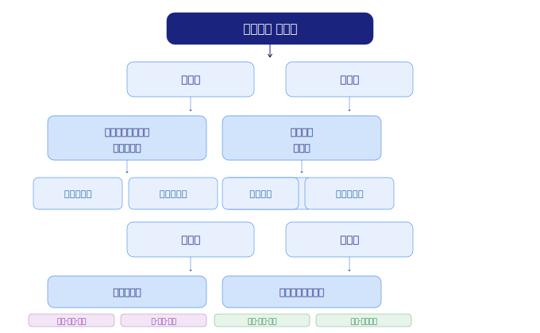
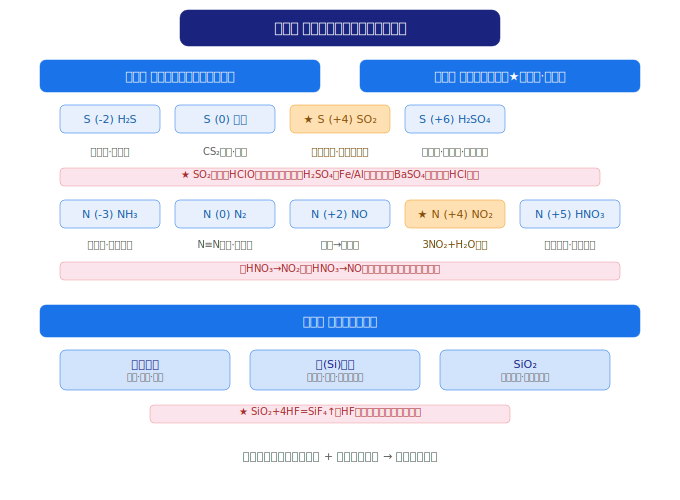

# 普通高中教科书·化学必修 第二册 知识图谱
> 来源：人教版高中化学必修第二册（第五章~第八章），共 139 页

**快速导航**：[第五章·硫氮元素](#第五章-化工生产中的重要非金属元素) | [第六章·反应与能量](#第六章-化学反应与能量) | [第七章·有机化合物](#第七章-有机化合物) | [第八章·化学与社会](#第八章-化学与可持续发展) | [高考易错汇总](#高考常考易错汇总必修二) | [互动练习](#互动练习)

---

## 全书总览

```
化学必修 第二册（第五章~第八章）

第五章                   第六章                   第七章                   第八章
化工生产中的             化学反应与能量           有机化合物               化学与可持续发展
重要非金属元素
├─ 硫及其化合物           ├─ 化学反应与能量变化     ├─ 认识有机化合物        ├─ 自然资源的开发利用
├─ 氮及其化合物           └─ 化学反应的速率与限度   ├─ 乙烯与有机高分子材料   ├─ 化学品的合理使用
└─ 无机非金属材料                                 ├─ 乙醇与乙酸           └─ 环境保护与绿色化学
                                                  └─ 基本营养物质
```



> **全书逻辑线**：元素化学进阶（S/N）→ 反应原理（能量/速率/限度）→ 有机化学入门 → 化学与社会的连接

---

## 第五章 化工生产中的重要非金属元素



> **地位**：必修二元素化学的核心，延续必修一"物质类别+元素价态"的双视角，学习硫和氮两大非金属家族。

### 第一节 硫及其化合物

#### 核心概念

- **硫（S）**：第三周期第ⅥA族，最外层 6 电子，常见价态 -2、0、+4、+6
- **硫单质**：黄色晶体（俗称硫磺），不溶于水、微溶于酒精、易溶于 CS₂
- **SO₂**：无色、有刺激性气味的有毒气体，易溶于水（1:40）
- **SO₃**：酸性氧化物，常温为固体
- **H₂SO₄（浓）**：三大特性——吸水性、脱水性、强氧化性

#### 重要反应方程式

| 反应 | 方程式 | 条件/备注 |
|------|--------|-----------|
| 硫燃烧 | S + O₂ →（点燃）SO₂ | 产生明亮蓝紫色火焰 |
| SO₂ + 水 | SO₂ + H₂O ⇌ H₂SO₃ | 可逆反应，酸性氧化物 |
| SO₂ + O₂ | 2SO₂ + O₂ ⇌（催化剂，加热）2SO₃ | 可逆，接触法制硫酸 |
| SO₃ + 水 | SO₃ + H₂O = H₂SO₄ | 工业制硫酸最后一步 |
| SO₂ 漂白 | SO₂ + 品红 → 褪色 →（加热）恢复红色 | **可逆漂白**，与 HClO 不同 |
| 浓 H₂SO₄ + Cu | Cu + 2H₂SO₄(浓) →（加热）CuSO₄ + SO₂↑ + 2H₂O | 体现浓 H₂SO₄ 的氧化性和酸性 |
| 浓 H₂SO₄ + C | C + 2H₂SO₄(浓) →（加热）CO₂↑ + 2SO₂↑ + 2H₂O | 体现强氧化性 |
| 硫酸根检验 | Ba²⁺ + SO₄²⁻ = BaSO₄↓（白色） | 需先加 HCl 酸化排除干扰 |

#### 规律总结

| 价态 | +4（SO₂、H₂SO₃、SO₃²⁻） | +6（SO₃、H₂SO₄、SO₄²⁻） | -2（H₂S、S²⁻） |
|------|--------------------------|--------------------------|-----------------|
| 氧化还原 | 既有氧化性又有还原性（中间价态） | 只有氧化性 | 只有还原性 |
| 代表反应 | SO₂ + 2H₂S = 3S↓ + 2H₂O | Cu + 2H₂SO₄(浓) → CuSO₄ + SO₂↑ | H₂S + Cl₂ = S↓ + 2HCl |

#### 易错提醒

1. **SO₂ 漂白 vs HClO 漂白**：SO₂ 是化合漂白（可逆，加热恢复），HClO 是氧化漂白（不可逆）
2. **浓 H₂SO₄ 三大特性**：吸水性（干燥气体）、脱水性（使有机物碳化）、强氧化性（与金属/非金属反应）
3. **BaSO₄ 检验**：必须先加 HCl 酸化，排除 BaCO₃、BaSO₃ 干扰
4. ⚠️ 浓 H₂SO₄ 与 Fe、Al 在常温下发生**钝化**

---

### 第二节 氮及其化合物

#### 核心概念

- **N₂**：占空气 78%，N≡N 键能极高（946 kJ/mol），化学性质稳定
- **NH₃**：无色、有刺激性气味，极易溶于水（1:700），水溶液呈碱性
- **NO**：无色有毒气体，不溶于水，易被 O₂ 氧化
- **NO₂**：红棕色、有刺激性气味的有毒气体，与水反应生成 HNO₃
- **HNO₃**：三大特性——强氧化性、不稳定性（见光分解）、酸性

#### 重要反应方程式

| 反应 | 方程式 | 条件/备注 |
|------|--------|-----------|
| N₂ + H₂ | N₂ + 3H₂ ⇌（高温高压，催化剂）2NH₃ | 合成氨（哈伯法），可逆 |
| N₂ + O₂ | N₂ + O₂ →（放电）2NO | 雷雨发庄稼 |
| NO + O₂ | 2NO + O₂ = 2NO₂ | 无色→红棕色 |
| NO₂ + 水 | 3NO₂ + H₂O = 2HNO₃ + NO | 工业制硝酸 |
| NH₃ + H₂O | NH₃ + H₂O ⇌ NH₃·H₂O ⇌ NH₄⁺ + OH⁻ | 氨水呈弱碱性 |
| NH₃ + HCl | NH₃ + HCl = NH₄Cl | 产生白烟（检验 NH₃） |
| NH₃ 催化氧化 | 4NH₃ + 5O₂ →（催化剂，加热）4NO + 6H₂O | 工业制硝酸第一步 |
| NH₄Cl 分解 | NH₄Cl →（加热）NH₃↑ + HCl↑ | 冷却后重新化合 |
| NH₄HCO₃ 分解 | NH₄HCO₃ →（加热）NH₃↑ + CO₂↑ + H₂O | 碳铵不稳定 |
| Cu + HNO₃(稀) | 3Cu + 8HNO₃(稀) = 3Cu(NO₃)₂ + 2NO↑ + 4H₂O | 生成 NO |
| Cu + HNO₃(浓) | Cu + 4HNO₃(浓) = Cu(NO₃)₂ + 2NO₂↑ + 2H₂O | 生成 NO₂（红棕色） |
| C + HNO₃(浓) | C + 4HNO₃(浓) →（加热）CO₂↑ + 4NO₂↑ + 2H₂O | 体现强氧化性 |
| NH₄⁺ 检验 | NH₄⁺ + OH⁻ →（加热）NH₃↑ + H₂O | 湿润红色石蕊试纸变蓝 |

#### 氮的化合价态转化链（★核心）

```
   −3          0          +2         +4         +5
  NH₃/H₃N ←→ N₂  ←→  NO  ←→  NO₂  ←→  HNO₃
        ↓ 氧化     ↓ 还原     ↓ 氧化     ↓ 还原
```

#### 氨的实验室制法

- 原理：2NH₄Cl + Ca(OH)₂ →（加热）CaCl₂ + 2NH₃↑ + 2H₂O
- 收集：向下排空气法（NH₃ 密度小于空气）
- 干燥：碱石灰（不能用浓 H₂SO₄ 或无水 CaCl₂）
- 验满：湿润红色石蕊试纸变蓝 / 蘸浓盐酸的玻璃棒靠近产生白烟

#### 易错提醒

1. ⚠️ NO₂ 与水反应：**3NO₂ + H₂O = 2HNO₃ + NO**，N 元素发生歧化反应（+4→+5 和 +4→+2）
2. ⚠️ **浓 HNO₃ 与 Cu 反应**：浓→NO₂，稀→NO，产物不同！
3. NH₄NO₃ 受热分解与 NH₄Cl 不同，NH₄NO₃ 分解可能发生爆炸
4. 铵态氮肥不能与碱性物质（如草木灰 K₂CO₃）混用

---

### 第三节 无机非金属材料

#### 核心概念

**传统无机非金属材料**：
| 材料 | 主要成分 | 原料 | 特点 |
|------|----------|------|------|
| 玻璃 | Na₂SiO₃·CaSiO₃·SiO₂ | 纯碱、石灰石、石英 | 无固定熔点 |
| 水泥 | 硅酸三钙、硅酸二钙、铝酸三钙 | 石灰石、黏土 | 水硬性 |
| 陶瓷 | 硅酸盐 | 黏土 | 绝缘、耐高温 |

**新型无机非金属材料**：
| 材料 | 组成 | 特性与应用 |
|------|------|-----------|
| 硅（Si） | 单质 | 半导体材料（芯片、太阳能电池） |
| 二氧化硅（SiO₂） | 氧化物 | 光导纤维、石英玻璃 |
| 碳化硅（SiC） | 共价化合物 | 高温结构陶瓷 |
| 氮化硅（Si₃N₄） | 共价化合物 | 高温陶瓷轴承 |

#### 重要反应

| 反应 | 方程式 |
|------|--------|
| SiO₂ + NaOH | SiO₂ + 2NaOH = Na₂SiO₃ + H₂O |
| SiO₂ + CaO | SiO₂ + CaO →（高温）CaSiO₃ |
| SiO₂ + 4HF | SiO₂ + 4HF = SiF₄↑ + 2H₂O（**氢氟酸腐蚀玻璃**） |
| SiO₂ + CaCO₃ | SiO₂ + CaCO₃ →（高温）CaSiO₃ + CO₂↑（制玻璃） |
| SiO₂ + Na₂CO₃ | SiO₂ + Na₂CO₃ →（高温）Na₂SiO₃ + CO₂↑（制玻璃） |
| 制粗硅 | SiO₂ + 2C →（高温）Si + 2CO↑ |

#### 易错提醒

1. ⚠️ **SiO₂ 是酸性氧化物**，能与碱和碱性氧化物反应，但不与水反应
2. 玻璃被 HF 腐蚀：**SiO₂ + 4HF = SiF₄↑ + 2H₂O**（HF 不能用玻璃瓶保存）
3. 硅是良好的半导体，SiO₂ 不导电（光导纤维利用光的全反射，非导电）

---

## 第六章 化学反应与能量

> **地位**：由定性描述转向定量理解的开端。能量变化 + 速率/限度 = 化学反应调控的两大维度。

### 第一节 化学反应与能量变化

#### 核心概念

| 类型 | 放热反应 | 吸热反应 |
|------|----------|----------|
| 定义 | 放出热量的反应（ΔH < 0） | 吸收热量的反应（ΔH > 0） |
| 能量关系 | 反应物总能量 > 生成物总能量 | 反应物总能量 < 生成物总能量 |
| 断键/成键 | 成键放热 > 断键吸热 | 断键吸热 > 成键放热 |
| 常见实例 | 燃烧、中和反应、金属+酸、CaO+H₂O | Ba(OH)₂·8H₂O+NH₄Cl、C+CO₂、CaCO₃ 分解 |

#### 化学能与电能的转化

**原电池**：
- 定义：将化学能转化为电能的装置
- 构成条件：①两个活泼性不同的电极 ②电解质溶液 ③闭合回路 ④自发氧化还原反应

**铜锌原电池（★典型）**：
```
负极（Zn）：Zn − 2e⁻ = Zn²⁺（氧化反应，溶解）
正极（Cu）：2H⁺ + 2e⁻ = H₂↑（还原反应，气泡）
总反应：Zn + 2H⁺ = Zn²⁺ + H₂↑
电子流向：Zn → 导线 → Cu
电流方向：Cu → 导线 → Zn（外电路）
```

#### 规律总结

- 放热反应：大多数燃烧、中和反应、金属与酸反应、CaO 与水反应
- 吸热反应：大多数分解反应、C + CO₂、C + H₂O、Ba(OH)₂·8H₂O + NH₄Cl
- 中和热：强酸与强碱在稀溶液中反应生成 1 mol H₂O 时放出的热量（约 57.3 kJ/mol）

#### 易错提醒

1. ⚠️ **需要加热的反应不一定是吸热反应**：燃烧需要点燃但属于放热反应
2. 原电池中，较活泼金属作负极，但 Mg-Al-NaOH 体系中 Al 作负极（Al 与 NaOH 反应）
3. 化学键断裂**吸收**能量，化学键形成**放出**能量

---

### 第二节 化学反应的速率与限度

#### 核心概念

**化学反应速率**：
- 表示：v = Δc/Δt（单位：mol/(L·s) 或 mol/(L·min)）
- 同一反应中，各物质的速率之比 = 化学计量数之比

**影响速率的因素**：

| 因素 | 影响规律 | 原因 |
|------|----------|------|
| 浓度 ↑ | 速率 ↑ | 单位体积内活化分子数增多 |
| 压强 ↑（气体） | 速率 ↑ | 相当于增大浓度 |
| 温度 ↑ | 速率 ↑（显著） | 活化分子百分数增大 |
| 催化剂 | 速率 ↑（大幅） | 降低活化能 |
| 固体表面积 ↑ | 速率 ↑ | 增大接触面积 |

**化学平衡**：
- 定义：在一定条件下，可逆反应中正逆反应速率相等，各组分浓度保持不变的状态
- 特征：动（动态平衡）、等（v正 = v逆）、定（浓度恒定）、变（条件改变平衡移动）

#### 变量控制法（方法导引）

> 实验中只改变一个变量，其他条件保持不变，观察该变量对实验结果的影响。

#### 易错提醒

1. ⚠️ **催化剂不改变平衡**，只改变达到平衡的时间
2. 压强只影响**有气体参与**的反应
3. 升温同时增大正逆反应速率，只是增大幅度不同
4. 化学平衡状态判断：各组分浓度/百分含量不变 = 达到平衡

---

## 第七章 有机化合物

> **地位**：高中有机化学的入门篇章，掌握"碳四价"核心思想和官能团决定性质的基本规律。

### 第一节 认识有机化合物

#### 核心概念

**有机化合物**：含碳元素的化合物（少数含碳物质如 CO、CO₂、碳酸盐等归为无机物）

**碳原子的成键特点**（★基础）：
- 碳原子最外层 4 个电子，形成 **4 个共价键**
- 可形成 C—C、C＝C、C≡C 等键型
- 碳原子之间可连接成链状或环状

**甲烷（CH₄）——最简单的有机物**：
- 分子结构：正四面体形，键角 109°28'
- 物理性质：无色无味气体，密度比空气小，难溶于水
- 化学性质：通常情况下稳定，不与强酸强碱反应

#### 烷烃

| 项目 | 内容 |
|------|------|
| 通式 | CₙH₂ₙ₊₂（n ≥ 1） |
| 命名 | 甲、乙、丙、丁、戊、己、庚、辛、壬、癸 |
| 特点 | 碳碳单键（C—C），饱和烃 |

**甲烷的取代反应**（★特征反应）：
```
CH₄ + Cl₂ →（光照）CH₃Cl + HCl  （一氯甲烷）
CH₃Cl + Cl₂ →（光照）CH₂Cl₂ + HCl （二氯甲烷）
CH₂Cl₂ + Cl₂ →（光照）CHCl₃ + HCl （三氯甲烷/氯仿）
CHCl₃ + Cl₂ →（光照）CCl₄ + HCl （四氯化碳）
```
> 产物为**混合物**，光照条件下逐步取代

**同系物**：结构相似，分子组成相差一个或若干个 CH₂ 原子团的有机物
**同分异构体**：分子式相同但结构不同的化合物（C₄H₁₀ 有两种异构体）

#### 易错提醒

1. ⚠️ **甲烷的取代反应是逐步进行的**，得到的是四种氯代甲烷的**混合物**，不是单一产物
2. 取代反应 vs 置换反应：取代反应不一定有单质参加或生成
3. 同分异构现象从丁烷（C₄H₁₀）开始出现

---

### 第二节 乙烯与有机高分子材料

#### 核心概念

**乙烯（C₂H₄）**：
- 结构：C＝C 双键（一个 σ 键 + 一个 π 键），平面形分子，键角约 120°
- 物理性质：无色稍有气味的气体，密度与空气接近，难溶于水
- 化学性质：比烷烃活泼（因为有碳碳双键）

**烯烃通式**：CₙH₂ₙ（n ≥ 2，单烯烃）

#### 重要反应

| 反应 | 方程式 | 类型 |
|------|--------|------|
| 乙烯燃烧 | C₂H₄ + 3O₂ →（点燃）2CO₂ + 2H₂O | 氧化（火焰明亮，有黑烟） |
| 乙烯 + Br₂ | CH₂=CH₂ + Br₂ → CH₂Br—CH₂Br | **加成反应**（溴水褪色） |
| 乙烯 + H₂ | CH₂=CH₂ + H₂ →（催化剂）CH₃CH₃ | 加成 |
| 乙烯 + HCl | CH₂=CH₂ + HCl → CH₃CH₂Cl | 加成 |
| 乙烯 + H₂O | CH₂=CH₂ + H₂O →（催化剂）CH₃CH₂OH | 加成（工业制乙醇） |
| 乙烯聚合 | nCH₂=CH₂ →（催化剂）−[CH₂−CH₂]−ₙ | **加聚反应** |

#### 有机高分子材料

| 类别 | 代表 | 来源 |
|------|------|------|
| 塑料 | 聚乙烯（PE）、聚氯乙烯（PVC）、聚丙烯（PP） | 加聚反应 |
| 合成纤维 | 涤纶、锦纶、腈纶 | 缩聚或加聚 |
| 合成橡胶 | 顺丁橡胶、丁苯橡胶 | 加聚反应 |

#### 易错提醒

1. ⚠️ **乙烯使溴水和酸性 KMnO₄ 溶液褪色的原理不同**：溴水是加成、KMnO₄ 是氧化
2. 鉴别烷烃和烯烃：用溴水或酸性 KMnO₄ 溶液
3. 加聚反应产物中没有小分子副产物，原子利用率 100%

---

### 第三节 乙醇与乙酸

#### 核心概念

**乙醇（C₂H₅OH）**：
- 结构：CH₃CH₂OH，官能团为羟基（—OH）
- 俗称：酒精
- 物理性质：无色有特殊香味的液体，易挥发，与水以任意比互溶

**乙酸（CH₃COOH）**：
- 结构：CH₃COOH，官能团为羧基（—COOH）
- 俗称：醋酸（无水乙酸称冰醋酸）
- 物理性质：有强烈刺激性气味的无色液体，易溶于水

#### 重要反应

| 反应 | 方程式 |
|------|--------|
| Na + 乙醇 | 2CH₃CH₂OH + 2Na → 2CH₃CH₂ONa + H₂↑ |
| 乙醇氧化成乙醛 | 2CH₃CH₂OH + O₂ →（催化剂，加热）2CH₃CHO + 2H₂O |
| 乙醇燃烧 | C₂H₅OH + 3O₂ →（点燃）2CO₂ + 3H₂O |
| 乙酸酸性 | 2CH₃COOH + Na₂CO₃ = 2CH₃COONa + CO₂↑ + H₂O |
| **酯化反应** | CH₃COOH + C₂H₅OH ⇌（浓 H₂SO₄，加热）CH₃COOC₂H₅ + H₂O |

#### 酯化反应（★重点）

- 条件：浓 H₂SO₄ 作催化剂和吸水剂，加热
- 特征：可逆反应，酸脱羟基醇脱氢
- 产物：乙酸乙酯（有果香味，难溶于水）
- 饱和 Na₂CO₃ 溶液的作用：①吸收乙醇 ②中和乙酸 ③降低乙酸乙酯溶解度

#### 烃的衍生物官能团总结

| 物质 | 官能团 | 特征反应 |
|------|--------|----------|
| 乙醇（醇） | —OH（羟基） | 与 Na 反应、催化氧化、酯化 |
| 乙酸（羧酸） | —COOH（羧基） | 酸性、酯化反应 |
| 乙酸乙酯（酯） | —COO—（酯基） | 水解反应 |

#### 易错提醒

1. ⚠️ **酯化反应是取代反应**，不是中和反应
2. 乙醇与 Na 反应比水与 Na 反应**缓和**（乙醇中 O—H 键更难断裂）
3. 乙酸虽然是弱酸，但酸性强于碳酸（能使 Na₂CO₃ 产生 CO₂）

---

### 第四节 基本营养物质

#### 核心概念

**六大基本营养物质**：糖类、油脂、蛋白质、维生素、无机盐、水

#### 糖类

| 类别 | 代表物 | 分子式 | 关系 |
|------|--------|--------|------|
| 单糖 | 葡萄糖、果糖 | C₆H₁₂O₆ | 同分异构体 |
| 二糖 | 蔗糖、麦芽糖 | C₁₂H₂₂O₁₁ | 同分异构体 |
| 多糖 | 淀粉、纤维素 | (C₆H₁₀O₅)ₙ | n 值不同 |

**葡萄糖的特征反应**：
- 银镜反应：与银氨溶液反应生成银镜（检验醛基）
- 与新制 Cu(OH)₂ 反应：加热生成砖红色 Cu₂O 沉淀

**淀粉的检验**：遇碘变蓝

**水解反应**：
```
(C₆H₁₀O₅)ₙ + nH₂O →（酸或酶）n C₆H₁₂O₆（葡萄糖）
C₁₂H₂₂O₁₁ + H₂O →（酸或酶）C₆H₁₂O₆ + C₆H₁₂O₆（蔗糖→葡萄糖+果糖）
```

#### 蛋白质

- 组成元素：C、H、O、N、S 等
- 基本单元：α-氨基酸（含—NH₂ 和 —COOH）
- **盐析**：加 NaCl/(NH₄)₂SO₄ 等使蛋白质析出，**可逆**，蛋白质不变性
- **变性**：加热、紫外线、强酸强碱、重金属盐、乙醇等，**不可逆**
- 检验：灼烧有烧焦羽毛气味；与浓 HNO₃ 显黄色（含苯环的蛋白质）

#### 油脂

- 组成：高级脂肪酸甘油酯
- 分类：油（液态，不饱和脂肪酸酯）、脂肪（固态，饱和脂肪酸酯）
- 水解：酸性水解 → 高级脂肪酸 + 甘油；碱性水解 → 高级脂肪酸盐（肥皂）+ 甘油

#### 易错提醒

1. ⚠️ **盐析和变性的区别**：盐析可逆（物理变化）、变性不可逆（化学变化）
2. 葡萄糖是**多羟基醛**，既能发生银镜反应也能与羧酸酯化
3. 淀粉和纤维素分子式均为 (C₆H₁₀O₅)ₙ，但 n 值不同，**不是同分异构体**

---

## 第八章 化学与可持续发展

> **地位**：将化学知识与社会实践结合，体现"绿色化学"理念，是高考 STSE（科学·技术·社会·环境）题型的主要来源。

### 第一节 自然资源的开发利用

#### 金属冶炼

| 方法 | 适用金属 | 原理 | 实例 |
|------|----------|------|------|
| 热分解法 | Hg、Ag | 加热分解 | 2HgO →（加热）2Hg + O₂↑ |
| 热还原法 | Zn、Fe、Cu 等 | 用还原剂还原 | Fe₂O₃ + 3CO →（高温）2Fe + 3CO₂ |
| 电解法 | Na、Mg、Al 等 | 电解熔融化合物 | 2Al₂O₃ →（电解）4Al + 3O₂↑ |

**铝热反应**：2Al + Fe₂O₃ →（高温）2Fe + Al₂O₃（焊接铁轨）

#### 海水资源的开发利用

| 资源 | 提取方法 |
|------|----------|
| 淡水 | 蒸馏法、离子交换法、反渗透法 |
| NaCl | 海水晒盐 |
| Br₂ | Cl₂ 氧化 Br⁻ → 溴水 → 热空气或水蒸气吹出 |
| I₂ | 海带灼烧 → 浸取 → 氧化（H₂O₂） → 萃取 |
| Mg | 石灰乳沉淀 Mg²⁺ → Mg(OH)₂ → MgCl₂ → 电解熔融 MgCl₂ |

#### 化石燃料的综合利用

| 方法 | 原料 | 主要产品 |
|------|------|----------|
| 石油分馏 | 石油 | 汽油、煤油、柴油（物理变化） |
| 石油裂化 | 重油 | 轻质油（化学变化） |
| 石油裂解 | 石油 | 乙烯、丙烯等（深度裂化） |
| 煤的干馏 | 煤 | 焦炭、煤焦油、焦炉气（化学变化） |
| 煤的气化 | 煤 + H₂O | CO + H₂（水煤气） |
| 煤的液化 | 煤 + H₂ | 液体燃料 |

#### 易错提醒

1. ⚠️ **石油分馏是物理变化**（利用沸点不同），裂化/裂解/煤干馏是化学变化
2. 铝热反应不是置换反应也非离子反应，是氧化还原反应

---

### 第二节 化学品的合理使用

#### 化肥与农药

- 氮肥（NH₄HCO₃、CO(NH₂)₂）、磷肥（Ca(H₂PO₄)₂）、钾肥（KCl、K₂SO₄）
- 复合肥：NH₄H₂PO₄、(NH₄)₂HPO₄
- 农药使用原则：高效、低毒、低残留

#### 合理用药

- 处方药（Rx）vs 非处方药（OTC）
- 阿司匹林：解热镇痛，长期大量服用有副作用
- 抗酸药：中和胃酸（如 CaCO₃、Mg(OH)₂、Al(OH)₃）

#### 食品添加剂类型

| 类别 | 代表物质 | 作用 |
|------|----------|------|
| 着色剂 | 柠檬黄、胡萝卜素、焦糖色 | 改善色泽 |
| 增味剂 | 味精（谷氨酸钠） | 增加鲜味 |
| 膨松剂 | NaHCO₃、NH₄HCO₃、复合膨松剂 | 使食品松软 |
| 凝固剂 | MgCl₂、CaSO₄ | 豆腐凝固 |
| 防腐剂 | 苯甲酸钠、山梨酸钾 | 抑制微生物 |
| 抗氧化剂 | 维生素C（抗坏血酸） | 防止氧化变质 |
| 营养强化剂 | 碘酸钾、铁强化剂 | 补充营养 |

#### 易错提醒

1. ⚠️ NaNO₂ 既是防腐剂又是护色剂，但有毒性，与食盐外观相似，防止误食
2. 在规定范围内合理使用食品添加剂是安全的

---

### 第三节 环境保护与绿色化学

#### 核心概念

**主要环境问题**：
| 问题 | 主要污染物 | 化学原理 |
|------|-----------|----------|
| 酸雨 | SO₂、NOₓ | pH < 5.6（正常雨水 pH≈5.6 因 CO₂） |
| 雾霾 | PM2.5、PM10 | 颗粒物 + 气态污染物 |
| 光化学烟雾 | NOₓ、碳氢化合物 | 紫外线作用下反应 |
| 臭氧层破坏 | 氟氯代烃（CFCs） | 催化分解 O₃ |
| 温室效应 | CO₂、CH₄ | 红外吸收 |
| 水华/赤潮 | N、P 元素过量 | 水体富营养化 |

**污水处理**：物理法 → 生物法 → 化学法（三级处理）

**绿色化学核心**：从源头减少或消除污染，**原子利用率 = 期望产物质量 / 所有产物质量 × 100%**

**3R 原则**：减量化（Reduce）、再利用（Reuse）、再循环（Recycle）

#### 易错提醒

1. ⚠️ 正常雨水 pH ≈ 5.6（因溶解 CO₂），酸雨 pH < 5.6
2. 原子利用率为 100% 的反应：化合反应、加成反应、加聚反应（无副产物）
3. 绿色化学不等于环境保护，前者强调从源头上避免污染

---

## 必修一 & 必修二 知识衔接总览

```
必修一                                必修二
──────────────────────────────────────────────────
第一章 物质及其变化          →    第五章 硫/氮（元素化学进阶）
第二章 钠和氯（元素入门）    →    第六章 能量/速率（反应原理）
第三章 铁 金属材料           →    第七章 有机化合物（新领域）
第四章 物质结构 周期律       →    第八章 化学与社会（综合应用）

物质类别 + 元素价态           →    两个视角贯穿始终
氧化还原                       →    原电池、速率/限度调控
离子反应                       →    有机反应类型（取代/加成/酯化）
物质的量                       →    化学计算持续应用
```

---

## 高考常考易错汇总（必修二）

1. SO₂ 漂白可逆，HClO 漂白不可逆
2. 浓 H₂SO₄ 与 Fe、Al 常温钝化
3. NO₂ 与水是歧化反应（3NO₂ + H₂O = 2HNO₃ + NO）
4. 铵态氮肥不能与碱性物质混用
5. 甲烷取代产物是混合物，乙烯加成是纯净物
6. 酯化反应是取代反应，浓 H₂SO₄ 作催化剂和吸水剂
7. 盐析可逆，变性不可逆
8. 淀粉和纤维素不是同分异构体
9. 石油分馏是物理变化，裂化/裂解是化学变化
10. BaSO₄ 检验必须先加 HCl 酸化
11. 原电池中电子从负极经外电路流向正极
12. 吸热反应不一定需要加热，加热反应不一定是吸热

---

## 互动练习

> 配合本知识图谱进行自测练习，涵盖硫/氮元素化学、反应与能量、有机化合物等核心考点。

<iframe src="./物质转化推断题组_必修二_互动练习.html" width="100%" height="3200" style="border: 1px solid #e0e0e0; border-radius: 8px;"></iframe>

> 如果上方 iframe 没有正常渲染，也可以[直接打开页面查看](./物质转化推断题组_必修二_互动练习.html)。
