# 化学必修二 · 物质转化专题

> 基于教材全文提取，梳理必修二中所有物质转化关系。
> 核心视角：**物质类别** + **元素价态** 双线并行。

---



> 上图涵盖三大转化板块：硫/氮无机转化 + 有机化合物转化，建议先整体浏览再分章学习。

---

## 一、硫及其化合物的转化（第五章）

### 1.1 自然界中硫的存在与转化

```
火山口/地壳深层：FeS₂、CuFeS₂（硫化物）
        ↓ O₂ + H₂O（长期作用）
地表附近：CaSO₄·2H₂O（石膏）、Na₂SO₄·10H₂O（芒硝）（硫酸盐）
        ↓ 火山口附近
      S（硫单质） —O₂→ SO₂ —O₂→ SO₃ —H₂O→ H₂SO₄
        ↓ H₂S（硫化氢）
```

**价态总览**：
```
S²⁻ (−2)  ←→  S (0)  ←→  SO₂ (+4)  ←→  SO₃ (+6)
H₂S         S单质     H₂SO₃/HSO₃⁻    H₂SO₄/SO₄²⁻
```

### 1.2 不同价态含硫物质的实验室转化

| 转化目标（价态变化） | 转化前含硫物质 | 选择试剂（氧化剂/还原剂） | 转化后含硫物质 | 预期现象 |
|---|---|---|---|---|
| −2 → 0 | H₂S / Na₂S | 氧化剂（Cl₂、浓H₂SO₄、KMnO₄） | S单质 | 乳白色/淡黄色沉淀 |
| 0 → −2 | S单质 | 还原剂（金属单质如Fe、Cu） | FeS / CuS | 生成黑色固体 |
| 0 → +4 | S单质 | O₂（加热） | SO₂ | 无色刺激性气体 |
| +4 → +6 | SO₂ / Na₂SO₃ | 氧化剂（H₂O₂、Cl₂、KMnO₄、O₂催化氧化） | H₂SO₄ / Na₂SO₄ | — |
| +6 → +4 | 浓H₂SO₄（含氧酸盐） | 还原剂（Cu、C） | SO₂ | 无色→红棕色气体（遇空气） |
| +4 → 0 | SO₂ | 还原剂（H₂S） | S单质 | 淡黄色沉淀（酸雨腐蚀金属） |

**核心方程式**：
```
Cu + 2H₂SO₄(浓) △ CuSO₄ + SO₂↑ + 2H₂O   （Cu被氧化，浓H₂SO₄被还原）
C + 2H₂SO₄(浓) △ CO₂↑ + 2SO₂↑ + 2H₂O
2H₂S + SO₂ = 3S↓ + 2H₂O   （归中反应，验证酸性气体）
```

### 1.3 浓硫酸的特性与转化

```
浓H₂SO₄
├── 吸水性   → 作干燥剂（不能干燥NH₃、H₂S）
├── 脱水性   → 使有机物脱水碳化（蔗糖变黑）
├── 强氧化性（加热）→ 氧化Cu、C等（S元素降价）
└── 酸性     → 与金属反应生成硫酸盐（溶液中的H⁺）
```

**常见错误提醒**：
- 浓硫酸与Cu反应，需**加热**，生成的CuSO₄溶液是**蓝色**（稀释后）
- 浓硫酸使蔗糖碳化是**脱水性**，吸水性≠脱水性
- 硫酸盐的检验：先加稀HCl酸化（排除CO₃²⁻干扰），再加BaCl₂ → 白色沉淀

---

## 二、氮及其化合物的转化（第五章）

### 2.1 氮的循环（自然界 + 人工固氮）

```
大气：N₂（游离态氮）
  ├── 闪电/高温 ─→ NO ──O₂→ NO₂ ──H₂O→ HNO₃ ──土壤→ 硝酸盐
  ├── 豆科植物根瘤菌 ───────────────────────→ 含氮化合物
  └── 人工固氮：N₂ + 3H₂ 高温高压/催化剂 2NH₃（哈伯法，诺贝尔化学奖）
```

### 2.2 氮元素的价态转化图

```
N₂  (0)
 ↑     ↓  （固氮）
NH₃ (−3)    NO (+2)  ←─O₂─→  NO₂ (+4)  ──H₂O─→  HNO₃ (+5)
 │                                 │
 └─── NH₄⁺（铵盐）                 └── NO（+4价态归中产物）
```

### 2.3 关键物质转化关系

**（1）氨气（NH₃）的转化**
```
NH₃（−3价氮）
├── 与H₂O：NH₃ + H₂O ⇌ NH₃·H₂O ⇌ NH₄⁺ + OH⁻  （氨水显碱性，酚酞变红）
├── 与酸：NH₃ + HCl = NH₄Cl（白烟，用于检验HCl或NH₃）
├── 催化氧化（工业制硝酸基础）：
│   4NH₃ + 5O₂ 催化剂/△ 4NO + 6H₂O
└── 与O₂（燃烧）：4NH₃ + 3O₂(纯氧) 点燃 2N₂ + 6H₂O
```

**（2）一氧化氮（NO）与二氧化氮（NO₂）**
```
2NO + O₂ = 2NO₂    （无色 → 红棕色，常温下迅速发生）
3NO₂ + H₂O = 2HNO₃ + NO   （工业制硝酸原理；歧化反应）
4NO₂ + O₂ + 2H₂O = 4HNO₃  （NO₂完全转化为硝酸）
```

**（3）铵盐（NH₄⁺）的转化**
```
NH₄Cl △ NH₃↑ + HCl↑        （类似升华，遇冷重新结合）
NH₄HCO₃ △ NH₃↑ + H₂O + CO₂↑
2NH₄Cl + Ca(OH)₂ △ CaCl₂ + 2NH₃↑ + 2H₂O  （实验室制NH₃）
检验：NH₄⁺ + OH⁻ △ NH₃↑ + H₂O  （湿润红色石蕊试纸变蓝）
```

**（4）硝酸（HNO₃）的转化**
```
4HNO₃ 光照/△ 4NO₂↑ + O₂↑ + 2H₂O   （保存于棕色试剂瓶）
浓HNO₃ + Cu → Cu(NO₃)₂ + NO₂↑ + H₂O   （浓：还原产物NO₂）
稀HNO₃ + Cu → Cu(NO₃)₂ + NO↑ + H₂O    （稀：还原产物NO）
※ 常温Fe/Al遇浓HNO₃钝化（表面生成致密氧化膜）
```

### 2.4 工业制硝酸的流程

```
NH₃  —催化氧化→  NO  —O₂→  NO₂  —H₂O→  HNO₃
（第一步：4NH₃+5O₂→4NO+6H₂O）
（第二步：2NO+O₂=2NO₂）
（第三步：3NO₂+H₂O=2HNO₃+NO，通入空气使NO循环氧化）
```

**记忆口诀**：「一氧二氮三水酸，循环氧化产率高」

---

## 三、无机非金属材料中的物质转化（第五章第三节）

### 3.1 硅及其化合物的转化

```
SiO₂（二氧化硅，石英/沙子）
├── + 2C 1800~2000℃ → Si（粗硅，98%）+ 2CO↑
├── + 2NaOH → Na₂SiO₃ + H₂O  （SiO₂是酸性氧化物）
└── + HF → SiF₄↑ + 2H₂O        （唯一能与SiO₂反应的酸）

Si（硅单质）
├── + 3HCl 300℃ → SiHCl₃ + H₂
└── SiHCl₃ + H₂ 1100℃ → 高纯Si + 3HCl   （高纯硅用于半导体）
```

**光导纤维**：SiO₂ → 拉制光纤（通信容量大，抗干扰）

---

## 四、化学反应与能量转化（第六章）

### 4.1 化学能转化为电能（原电池）

```
氧化还原反应（电子转移）
        ↓  设计原电池装置
化学能  ───→  电能

Zn | ZnSO₄ ‖ CuSO₄ | Cu
 Zn极（负极）：Zn − 2e⁻ = Zn²⁺（氧化反应，Zn溶解）
 Cu极（正极）：Cu²⁺ + 2e⁻ = Cu（还原反应，Cu析出）
 Zn + Cu²⁺ = Zn²⁺ + Cu  （总反应）
```

**判断正负极口诀**：「活泼金属作负极，发生氧化失电子」

### 4.2 化学反应速率与限度中的转化

```
反应物   ←── 可逆反应 ──→  生成物
  A + B ⇌ C + D
  （反应不能进行到底，达到化学平衡）

影响因素：
  浓度↑ → 反应速率↑
  温度↑ → 反应速率↑
  催化剂  → 改变反应速率（本身质量和化学性质不变）
```

---

## 五、有机化合物的转化（第七章）⭐ 重点

### 5.1 认识有机化合物的一般思路

```
组成（元素分析）
    ↓
结构（碳骨架 + 官能团）
    ↓
分类（烷烃/烯烃/醇/酸/酯…）
    ↓
性质（由官能团决定）
    ↓
转化（有机反应：取代、加成、氧化、酯化…）
```

### 5.2 甲烷（烷烃代表物）的转化

```
CH₄（甲烷，饱和烃）
├── 燃烧：CH₄ + 2O₂ 点燃 CO₂ + 2H₂O  （火焰淡蓝色）
├── 取代反应（与Cl₂，光照条件）：
│   CH₄ + Cl₂ 光 CH₃Cl（一氯甲烷，气体）+ HCl
│   CH₃Cl + Cl₂ 光 CH₂Cl₂（二氯甲烷，液体）+ HCl
│   … 最终生成 CCl₄（四氯化碳）
└── 高温分解：CH₄ 高温 C + 2H₂  （化工制氢）
```

**取代反应特点**：步步可停，多种产物共存，需控制条件

---

### 5.3 乙烯（烯烃代表物）的转化 ⭐ 高考高频

```
CH₂=CH₂（乙烯，含C=C双键，不饱和烃）
├── 氧化反应
│   ├── 燃烧：C₂H₄ + 3O₂ 点燃 2CO₂ + 2H₂O（火焰明亮，有黑烟）
│   └── 使酸性KMnO₄褪色（C=C被氧化，鉴别烷烃和烯烃）
│
├── 加成反应（C=C中一个键断裂，加两个原子/基团）
│   ├── + Br₂（CCl₄溶液）→ CH₂Br−CH₂Br（1,2-二溴乙烷，溴水褪色）
│   ├── + H₂ 催化剂 → CH₃−CH₃（乙烷）
│   ├── + HCl → CH₃−CH₂Cl（氯乙烷）
│   └── + H₂O 催化剂/加热加压 → CH₃CH₂OH（乙醇，工业制乙醇）
│
└── 加聚反应（聚合反应）
    nCH₂=CH₂ 催化剂 [CH₂−CH₂]ₙ（聚乙烯，塑料）
```

**鉴别烷烃与烯烃**：溴水（或Br₂/CCl₄）褪色 = 烯烃（加成）；酸性KMnO₄褪色 = 烯烃（氧化）

---

### 5.4 乙醇（醇类代表物）的转化 ⭐ 高考高频

```
CH₃CH₂OH（乙醇，官能团：−OH 羟基）
├── 与Na反应（置换反应，比水与Na反应缓和）：
│   2CH₃CH₂OH + 2Na → 2CH₃CH₂ONa + H₂↑
│   （醇羟基氢不如水中氢活泼）
│
├── 氧化反应
│   ├── 燃烧：CH₃CH₂OH + 3O₂ 点燃 2CO₂ + 3H₂O
│   ├── 催化氧化（Cu或Ag催化，加热）：
│   │   2CH₃CH₂OH + O₂ Cu/△ 2CH₃CHO（乙醛）+ 2H₂O
│   │   「铜丝现象」：红热Cu → 插入乙醇 → 变黑(CuO) → 又变红(Cu)
│   └── 被KMnO₄(H⁺)或K₂Cr₂O₇氧化（酒驾检测原理）
│
└── 酯化反应（与羧酸，见5.5）
```

**乙醇→乙醛→乙酸的氧化链**：
```
CH₃CH₂OH  −[O]→  CH₃CHO  −[O]→  CH₃COOH
（乙醇）         （乙醛）         （乙酸）
```

---

### 5.5 乙酸（羧酸代表物）的转化 ⭐ 高考高频

```
CH₃COOH（乙酸，官能团：−COOH 羧基）
├── 酸性（弱酸，强于H₂CO₃）：
│   CH₃COOH ⇌ CH₃COO⁻ + H⁺
│   与CaCO₃：CaCO₃ + 2CH₃COOH → (CH₃COO)₂Ca + CO₂↑ + H₂O
│   （食醋除水垢原理）
│
└── 酯化反应（与醇，浓硫酸催化，可逆反应）：
     CH₃COOH + CH₃CH₂OH ⇌ CH₃COOCH₂CH₃ + H₂O
     （乙酸）    （乙醇）    （乙酸乙酯，果香味）+ 水
     条件：浓硫酸，加热；产物分离：饱和Na₂CO₃溶液吸收乙醇、中和乙酸
```

**酯化反应机理**：「酸脱羟基醇脱氢」，可用同位素¹⁸O标记法验证

---

### 5.6 基本营养物质之间的转化（第七章第四节）

**（1）糖类转化**
```
淀粉[(C₆H₁₀O₅)ₙ]  ──水解（酸或酶）→  葡萄糖(C₆H₁₂O₆)
    ↓（咀嚼，唾液淀粉酶）
  麦芽糖(C₁₂H₂₂O₁₁)
葡萄糖  ──氧化 →  CO₂ + H₂O + 能量（人体供能）
葡萄糖  ──酒化酶→  乙醇 + CO₂↑  （酿酒原理）
```

**（2）油脂转化**
```
油脂（甘油三酯） ──水解（酸/碱/酶）→  高级脂肪酸 + 甘油
                 ──皂化反应（碱）→  高级脂肪酸盐（肥皂）+ 甘油
                 ──氢化（与H₂加成）→  硬化油（人造奶油）
```

**（3）蛋白质转化**
```
蛋白质  ──水解（酸/碱/酶）→  多肽  ──水解→  氨基酸
氨基酸  ──聚合→  多肽  ──折叠→  蛋白质
```

**蛋白质检验**：
- 灼烧：**烧焦羽毛气味**
- 颜色反应：加浓HNO₃ → **黄色**（含苯环的蛋白质，如酪氨酸）
- 变性条件：重金属盐、强酸、强碱、乙醇、甲醛、加热、紫外线

---

## 六、有机转化总图（必修二核心）

```
甲烷(CH₄) ──取代→  氯代甲烷
    │
    └──完全燃烧→ CO₂ + H₂O

乙烯(CH₂=CH₂) ──加成→  乙醇(CH₃CH₂OH)
    │
    ├── 加聚 →  聚乙烯
    └── 氧化 →  乙醛 → 乙酸

乙醇(CH₃CH₂OH)
    ├── 氧化 →  乙醛(CH₃CHO) ──氧化→ 乙酸(CH₃COOH)
    ├── 与Na →  氢气（H₂）
    └── 酯化 →  乙酸乙酯（果香）

乙酸(CH₃COOH)
    ├── 酸性 →  与CaCO₃反应（除水垢）
    └── 酯化 →  酯类（果香物质）

葡萄糖(C₆H₁₂O₆)
    ├── 氧化 →  CO₂ + H₂O + 能量
    ├── 酿酒 →  乙醇 + CO₂
    ├── 与Cu(OH)₂ → 砖红色Cu₂O（检验还原糖）
    └── 银镜反应 →  Ag（检验还原糖）
```

---

## 七、高考易错点汇总（必修二物质转化篇）

| 序号 | 易错点 | 正确认知 |
|---|---|---|
| 1 | SO₂使溴水褪色是漂白性 | 是**还原性**（SO₂ + Br₂ + 2H₂O = H₂SO₄ + 2HBr） |
| 2 | 浓硫酸与Cu反应常温能发生 | 必须**加热**，稀H₂SO₄与Cu不反应 |
| 3 | NH₃催化氧化是工业制NH₃ | 是工业制**HNO₃**的基础，制NH₃是**合成氨** |
| 4 | NO₂溶于水产物只有HNO₃ | 还有**NO**生成（3NO₂ + H₂O = 2HNO₃ + NO） |
| 5 | 铵盐受热分解都能得到NH₃ | NH₄NO₃受热可能发生**氧化还原反应**，不一定生成NH₃ |
| 6 | 乙烯与Br₂加成产物是CH₃CHBr₂ | 正确是**CH₂Br−CH₂Br**（1,2-二溴乙烷） |
| 7 | 乙醇催化氧化的Cu丝现象不理解 | 红热→插入乙醇变黑(CuO)→又变红(Cu)，反复证明Cu作**催化剂** |
| 8 | 酯化反应"酸脱羟基醇脱氢"记反 | 记住：**酸脱−OH，醇脱−H**，生成H₂O |
| 9 | 聚乙烯分子中含有C=C双键 | 聚合后C=C已打开，聚乙烯**不能**使溴水褪色 |
| 10 | 蛋白质变性是物理变化 | 变性是**化学变化**（二、三级结构破坏，但肽键未断） |

---

## 八、必背方程式速查（物质转化核心）

```
### 硫转化
Cu + 2H₂SO₄(浓) △ CuSO₄ + SO₂↑ + 2H₂O
2H₂S + SO₂ = 3S↓ + 2H₂O

### 氮转化
N₂ + 3H₂ 高温高压/催化剂 2NH₃
4NH₃ + 5O₂ 催化剂/△ 4NO + 6H₂O
3NO₂ + H₂O = 2HNO₃ + NO
NH₄⁺ + OH⁻ △ NH₃↑ + H₂O

### 有机转化
CH₂=CH₂ + Br₂ → CH₂Br−CH₂Br
2CH₃CH₂OH + O₂ Cu/△ 2CH₃CHO + 2H₂O
CH₃COOH + CH₃CH₂OH ⇌ CH₃COOCH₂CH₃ + H₂O
CH₄ + Cl₂ 光 CH₃Cl + HCl

### 营养物质
(C₆H₁₀O₅)ₙ + nH₂O 酸/酶 nC₆H₁₂O₆
蛋白质 + H₂O 酸/碱/酶 氨基酸
```

---

## 九、物质转化推断题 · 互动练习

> 配合本专题进行自测练习，涵盖硫/氮转化、有机物转化等核心推断题型。

<iframe src="./物质转化推断题组_必修二_互动练习.html" width="100%" height="3200" style="border: 1px solid #e0e0e0; border-radius: 8px;"></iframe>

> 如果上方 iframe 没有正常渲染，也可以[直接打开页面查看](./物质转化推断题组_必修二_互动练习.html)。
