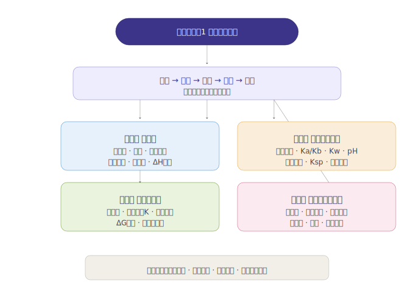
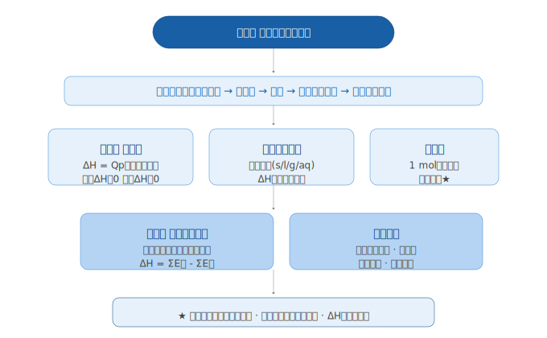
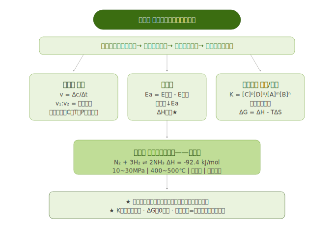
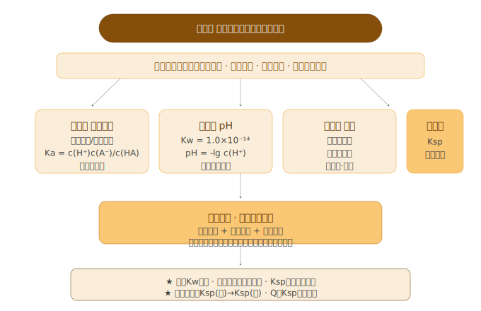
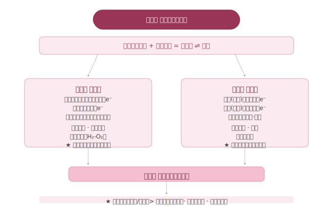

# 普通高中教科书·化学 选择性必修1《化学反应原理》知识图谱

> **教材定位**：高中化学理论核心。在必修阶段定性认识的基础上，从定量和微观角度深入理解化学反应的能量变化、速率限度、离子行为、电化学转化四大原理体系。

---

## 全书总览

```
                     选择性必修1《化学反应原理》
                              |
          ┌──────────┬──────────┼──────────┬──────────┐
          │          │          │          │          │
        第一章      第二章      第三章      第四章
       热效应      速率平衡    溶液中的    化学反应
                   与方向      离子平衡    与电能
          │          │          │          │
    反应热+盖斯  速率+平衡+    电离+水解   原电池+电解
        定律      方向+调控   +沉淀溶解    +金属防护
                              |
                     定性→定量，宏观→微观
```

> **全书逻辑线**：**能量→速率→方向→限度→应用**。先定量研究反应的热效应（第一章），再研究反应的快慢与限度（第二章），然后将平衡思想扩展到水溶液体系（第三章），最后将氧化还原与能量耦合，实现化学能与电能的相互转化（第四章）。



| 章节 | 核心主题 | 与必修衔接 | 进阶点 |
|------|---------|-----------|--------|
| 第一章 热效应 | 反应热·焓变·盖斯定律 | 必修二"化学能与热能" | 定性→定量（ΔH计算） |
| 第二章 速率与平衡 | v、K、勒夏特列原理、ΔG | 必修二"反应速率与限度" | 引入活化能、平衡常数、熵 |
| 第三章 溶液中的离子平衡 | Ka/Kb、Kw、Kh、Ksp | 必修一"离子反应" | 引入水溶液四大平衡体系 |
| 第四章 化学反应与电能 | 原电池、电解池、腐蚀 | 必修二"原电池初步" | 双液电池、电解规律、Ksp应用 |

---

## 第一章 化学反应的热效应



> **地位**：定量研究化学反应能量变化的基础。从必修二的定性认识（吸热/放热）上升到定量计算（ΔH），是盖斯定律和反应热计算的根基。

### 第一节 反应热

#### 一、反应热与焓变

**核心概念：**

- **体系与环境**：被研究的物质系统为体系，体系以外的其他部分为环境
- **反应热**：等温条件下，化学反应体系向环境释放或从环境吸收的热量
- **焓（H）**：与内能有关的物理量，等压条件下的反应热等于焓变：**Qp = ΔH**
- **ΔH的正负**：
  - 放热反应：ΔH < 0（体系能量降低）
  - 吸热反应：ΔH > 0（体系能量升高）

**从微观角度理解反应热：**

| 过程 | 能量变化 | 化学键角度 |
|------|---------|-----------|
| 放热反应 | ΔH < 0 | 断键吸热 < 成键放热 |
| 吸热反应 | ΔH > 0 | 断键吸热 > 成键放热 |

ΔH ≈ Σ(反应物断键吸收能量) - Σ(生成物成键放出能量)

> **口诀**：断键吸，成键放；吸>放则吸热，放>吸则放热。

#### 二、热化学方程式

**定义**：表明反应所释放或吸收的热量的化学方程式。

**书写规则（必考！）**：

| 规则 | 说明 | 常见错误 |
|------|------|---------|
| 注明ΔH符号和数值 | "+"表示吸热，"-"表示放热 | 忘记写"+"号 |
| 注明物质聚集状态 | s/l/g/aq | 漏写状态符号 |
| 化学计量数可以是分数 | 但ΔH必须与方程式对应 | 配平后ΔH不随系数变化 |
| 一般不注明条件 | 默认25℃、101 kPa | — |

**示例**：
```
H₂(g) + 1/2 O₂(g) = H₂O(l)  ΔH = -285.8 kJ/mol
H₂(g) + 1/2 O₂(g) = H₂O(g)  ΔH = -241.8 kJ/mol
```

> **易错提醒**：H₂O(l)与H₂O(g)的ΔH不同！因为液态水变为水蒸气需要吸热，所以生成H₂O(l)放热更多。

#### 三、燃烧热

- **定义**：101 kPa时，1 mol纯物质完全燃烧生成**指定产物**时放出的热量
- **指定产物**：C→CO₂(g)，H→H₂O(l)，S→SO₂(g)，N→N₂(g)
- **单位**：kJ/mol

> **易错提醒**：燃烧热对应的可燃物计量数必须是**1**，产物必须是**指定产物**（H→液态水！）。

#### 四、中和反应反应热的测定

- 强酸强碱稀溶液中和生成1 mol H₂O：ΔH = **-57.3 kJ/mol**
- 弱酸/弱碱参与中和：放热 < 57.3 kJ/mol（电离吸热）
- 浓酸/浓碱参与中和：放热 > 57.3 kJ/mol（稀释放热）

---

### 第二节 反应热的计算

#### 一、盖斯定律

**核心表述**：一个化学反应，不管是一步完成还是分几步完成，其反应热是相同的。

**本质**：反应热只与**始态**和**终态**有关，与**途径**无关。

**应用**：间接计算无法直接测定的反应热。

```
已知：
① C(s) + O₂(g) = CO₂(g)        ΔH₁ = -393.5 kJ/mol
② CO(g) + 1/2 O₂(g) = CO₂(g)    ΔH₂ = -283.0 kJ/mol
求：C(s) + 1/2 O₂(g) = CO(g)   ΔH = ?

解：① - ② 得目标反应
    ΔH = ΔH₁ - ΔH₂ = -393.5 - (-283.0) = -110.5 kJ/mol
```

> **口诀**：盖斯定律记心间，反应热只与始终相关，不怕一步变多步！

#### 二、反应热的计算方法

1. **盖斯定律法**：已知反应叠加/消去中间物质
2. **键能法**：ΔH ≈ ΣE(断) - ΣE(成)
3. **燃烧热法**：ΔH = ΣΔH_c(反应物) - ΣΔH_c(生成物)
4. **生成焓法**：ΔH = ΣΔH_f(生成物) - ΣΔH_f(反应物)

> **易错提醒**：键能法计算ΔH时，注意反应物断键与生成物成键的方向不要搞反！

---

## 第二章 化学反应速率与化学平衡



> **地位**：化学动力学与热力学的入门。研究"多快"（速率）、"到哪"（限度）、"往哪"（方向）、"怎么调控"（应用）四大问题。

### 第一节 化学反应速率

#### 一、化学反应速率的表示

对于反应 **mA + nB → pC + qD**：

```
v(A) = -Δc(A)/Δt    （反应物消耗速率）
v(C) = +Δc(C)/Δt    （生成物生成速率）
```

各物质速率之比 = 化学计量数之比：**v(A):v(B):v(C):v(D) = m:n:p:q**

- **单位**：mol/(L·s) 或 mol/(L·min)

#### 二、影响化学反应速率的因素

| 因素 | 影响规律 | 活化能解释 |
|------|---------|-----------|
| **浓度** ↑ | v ↑ | 单位体积活化分子数↑ → 有效碰撞↑ |
| **温度** ↑ | v ↑↑（每升10℃增2~4倍） | 活化分子百分数↑ → 有效碰撞↑↑ |
| **压强** ↑（气体） | v ↑ | 相当于浓度增大 |
| **催化剂** | v ↑↑（正催化剂） | 降低活化能 → 活化分子百分数↑ |
| **固体表面积**↑ | v ↑ | 接触面积↑ |

#### 三、活化能与碰撞理论

- **有效碰撞**：能发生化学反应的碰撞（需足够能量 + 合适取向）
- **活化分子**：能发生有效碰撞的分子
- **活化能Ea**：活化分子平均能量 - 反应物分子平均能量
- **催化剂**：降低活化能，不改变反应热（ΔH不变！）

> **易错提醒**：催化剂只改变**活化能**，不改变**反应热ΔH**！也不改变**平衡转化率**！

---

### 第二节 化学平衡

#### 一、化学平衡状态

**特征**（五字诀）：
- **逆**：可逆反应
- **等**：v正 = v逆
- **定**：各组分浓度/百分含量不变
- **动**：动态平衡（v正 = v逆 ≠ 0）
- **变**：条件改变，平衡移动

**判断依据**：同一物质，v正 = v逆（或某一物质的消耗速率 = 生成速率）

#### 二、化学平衡常数 K

对于反应：**mA + nB ⇌ pC + qD**

$$K = \frac{c^p(C) \cdot c^q(D)}{c^m(A) \cdot c^n(B)}$$

| K值特征 | 意义 |
|---------|------|
| K很大（>10⁵） | 反应进行较完全 |
| K很小（<10⁻⁵） | 反应很难进行 |
| K中等 | 典型的可逆反应 |

**影响因素**：K只与**温度**有关！（浓度、压强、催化剂不影响K）

> **口诀**：升温吸热K变大，升温放热K变小。

#### 三、影响化学平衡的因素（勒夏特列原理）

> **勒夏特列原理**：改变影响平衡的一个条件，平衡向**减弱**这种改变的方向移动。

| 条件改变 | 平衡移动方向 | 说明 |
|---------|-------------|------|
| 增大反应物浓度 | 正向移动 | 降低反应物浓度 |
| 减小生成物浓度 | 正向移动 | 补充生成物 |
| 升温（放热反应） | 逆向移动 | 降温 = 吸热方向 |
| 升温（吸热反应） | 正向移动 | 降温 = 吸热方向 |
| 加压（气体分子数↓） | 向气体分子数↓方向 | — |
| 加压（气体分子数↑） | 向气体分子数↑方向 | — |
| 加催化剂 | **不移动** | 同等加速正逆反应 |

> **易错提醒**：催化剂不改变平衡！恒容条件充入稀有气体（不参与反应），平衡也不移动！

---

### 第三节 化学反应的方向

**自发反应判据**：**ΔG = ΔH - TΔS**

| 条件 | 结论 |
|------|------|
| ΔG < 0 | 反应**自发**进行 |
| ΔG = 0 | 反应达到**平衡** |
| ΔG > 0 | 反应**非自发**（逆反应自发） |

| ΔH | ΔS | 反应自发性 |
|----|-----|-----------|
| -（放热）| +（熵增）| **任何温度都自发** |
| -（放热）| -（熵减）| **低温自发** |
| +（吸热）| +（熵增）| **高温自发** |
| +（吸热）| -（熵减）| **任何温度都不自发** |

> **记忆口诀**：焓减熵增全自发，焓增熵减永不行；焓减熵减低可行，焓增熵增高可行。

---

### 第四节 化学反应的调控——合成氨

**合成氨反应**：N₂ + 3H₂ ⇌ 2NH₃  **ΔH = -92.4 kJ/mol**（放热、气体分子数减少）

| 条件 | 选择 | 理论依据 |
|------|------|---------|
| 压强 | 10~30 MPa | 加压有利（气体分子数减少） |
| 温度 | 400~500 ℃ | 折中选择：高温加快速率但不利于平衡 |
| 催化剂 | 铁触媒 | 降低活化能，加快反应速率 |

> **核心思想**：工业条件选择是速率与平衡的**综合优化**，不是单一因素的最大化！

---

## 第三章 水溶液中的离子反应与平衡



> **地位**：选择性必修1的核心难点。四大水溶液平衡 + pH计算 + 离子浓度比较 + 沉淀转化，是高考选择题和综合题的必考模块。

### 第一节 电离平衡

#### 一、强弱电解质

| 类型 | 代表物质 | 特点 |
|------|---------|------|
| 强电解质 | 强酸(HCl,H₂SO₄,HNO₃)、强碱(NaOH,KOH)、大多数盐 | 完全电离，不可逆 |
| 弱电解质 | 弱酸(CH₃COOH,H₂CO₃)、弱碱(NH₃·H₂O)、H₂O | 部分电离，存在电离平衡 |
| 非电解质 | 乙醇、蔗糖、CO₂、NH₃ | 不电离 |

#### 二、弱电解质的电离平衡

对于 **HA ⇌ H⁺ + A⁻**：

$$K_a = \frac{c(H^+) \cdot c(A^-)}{c(HA)}$$

- Ka越大，酸性越强
- Ka只与温度有关
- **稀释定律**：稀释促进电离（但离子浓度不一定增大）

> **口诀**：越稀越电离，越热越电离。

---

### 第二节 水的电离和溶液的pH

#### 一、水的离子积

$$K_w = c(H^+) \cdot c(OH^-)$$

- 25℃时：Kw = 1.0 × 10⁻¹⁴
- 升温，Kw **增大**（水的电离吸热）
- 纯水中：c(H⁺) = c(OH⁻) = 1.0 × 10⁻⁷ mol/L（25℃）

#### 二、溶液的pH

**pH = -lg c(H⁺)**

| 溶液类型 | c(H⁺) 与 c(OH⁻) 关系 | pH范围（25℃） |
|---------|---------------------|---------------|
| 酸性 | c(H⁺) > c(OH⁻) | pH < 7 |
| 中性 | c(H⁺) = c(OH⁻) | pH = 7 |
| 碱性 | c(H⁺) < c(OH⁻) | pH > 7 |

#### 三、酸碱中和滴定

- **原理**：c₁V₁ = c₂V₂（一元酸与一元碱）
- **指示剂选择**：
  - 强酸+强碱：酚酞或甲基橙均可
  - 强酸+弱碱：甲基橙（终点在酸性）
  - 强碱+弱酸：酚酞（终点在碱性）
- **操作关键**：润洗 → 装液 → 调零 → 滴定 → 读数

> **易错提醒**：滴定管未用待装液润洗 → 待装液被稀释 → 结果偏大（待测液浓度算出来偏大）！

---

### 第三节 盐类的水解

#### 一、水解规律

| 盐的类型 | 举例 | 溶液酸碱性 | 水解离子方程式 |
|---------|------|-----------|--------------|
| 强酸弱碱盐 | NH₄Cl | 酸性 | NH₄⁺ + H₂O ⇌ NH₃·H₂O + H⁺ |
| 强碱弱酸盐 | CH₃COONa | 碱性 | CH₃COO⁻ + H₂O ⇌ CH₃COOH + OH⁻ |
| 强酸强碱盐 | NaCl | 中性 | 不水解 |
| 弱酸弱碱盐 | CH₃COONH₄ | 取决于Ka和Kb | 双水解 |

> **口诀**：谁弱谁水解，谁强显谁性；都强不水解，都弱双水解。

#### 二、影响水解的因素

| 因素 | 效果 |
|------|------|
| 升温 | 促进水解（水解吸热） |
| 稀释 | 促进水解 |
| 加酸（对弱酸盐） | 抑制水解 |
| 加碱（对弱碱盐） | 抑制水解 |

#### 三、水解的应用

- 配制FeCl₃溶液：加少量HCl抑制水解
- 明矾净水：Al³⁺ + 3H₂O ⇌ Al(OH)₃(胶体) + 3H⁺
- 泡沫灭火器：Al³⁺ + 3HCO₃⁻ = Al(OH)₃↓ + 3CO₂↑（双水解）

---

### 第四节 沉淀溶解平衡

#### 一、溶度积常数 Ksp

对于 **AmBn(s) ⇌ mAⁿ⁺(aq) + nBᵐ⁻(aq)**：

$$K_{sp} = c^m(A^{n+}) \cdot c^n(B^{m-})$$

| 应用 | 判断方法 |
|------|---------|
| Q < Ksp | 不饱和，沉淀溶解 |
| Q = Ksp | 饱和，平衡 |
| Q > Ksp | 过饱和，生成沉淀 |

#### 二、沉淀的转化

**规律**：溶解度大的沉淀 → 溶解度小的沉淀（Ksp大的→Ksp小的）

- 锅炉水垢（CaSO₄）→ 用Na₂CO₃处理 → CaCO₃ → 酸洗除去
- 重晶石（BaSO₄）→ 饱和Na₂CO₃ → BaCO₃（条件：反复、足量）

> **易错提醒**：沉淀转化方向的判断依据是**Ksp对比**，不是溶解度对比！只有同类型（如AB型vs AB型）的沉淀才可直接比较Ksp。

---

## 第四章 化学反应与电能



> **地位**：将氧化还原反应与能量转化结合。必修二学过的单液原电池升级为双液原电池，新增电解池和金属腐蚀防护。

### 第一节 原电池

#### 一、原电池工作原理

| 组成部分 | 说明 |
|---------|------|
| **负极** | 较活泼金属，发生**氧化**反应，电子流出 |
| **正极** | 较不活泼金属/石墨，发生**还原**反应，电子流入 |
| **盐桥** | 离子通道，保持溶液电中性，使电流持续 |
| **电解质溶液** | 提供离子导电介质 |

**形成条件**：
1. 自发的氧化还原反应
2. 两个活泼性不同的电极
3. 电解质溶液
4. 闭合回路

#### 二、化学电源

| 类型 | 代表 | 特点 |
|------|------|------|
| **一次电池** | 锌锰干电池 | 不可充电 |
| **二次电池** | 铅蓄电池、锂离子电池 | 可充放电 |
| **燃料电池** | 氢氧燃料电池 | 燃料+氧化剂，高效环保 |

**铅蓄电池（二次电池）**：
- 放电：Pb + PbO₂ + 2H₂SO₄ = 2PbSO₄ + 2H₂O
- 充电：2PbSO₄ + 2H₂O = Pb + PbO₂ + 2H₂SO₄（电解）

**氢氧燃料电池**：
- 酸性介质：负极 H₂ - 2e⁻ = 2H⁺；正极 O₂ + 4H⁺ + 4e⁻ = 2H₂O
- 碱性介质：负极 H₂ + 2OH⁻ - 2e⁻ = 2H₂O；正极 O₂ + 2H₂O + 4e⁻ = 4OH⁻

> **易错提醒**：燃料电池的电极反应式取决于电解质溶液的性质（酸性/碱性/熔融盐）！

---

### 第二节 电解池

#### 一、电解原理

| 电极 | 反应类型 | 电子得失 | 与外电源连接 |
|------|---------|---------|-------------|
| **阳极** | 氧化反应 | 失电子 | 接电源**正极** |
| **阴极** | 还原反应 | 得电子 | 接电源**负极** |

> **口诀**：阴阳阳阴——阳极接正极，阴极接负极。

#### 二、放电顺序

**阳极（氧化）优先顺序**：
> 活性电极（除Pt/Au外）> S²⁻ > I⁻ > Br⁻ > Cl⁻ > OH⁻ > 含氧酸根 > F⁻

**阴极（还原）优先顺序**：
> Ag⁺ > Hg²⁺ > Fe³⁺ > Cu²⁺ > H⁺(酸) > Pb²⁺ > Sn²⁺ > Fe²⁺ > Zn²⁺ > H⁺(水) > Al³⁺ > Mg²⁺ > Na⁺ > Ca²⁺ > K⁺

#### 三、电解应用

| 应用 | 阳极反应 | 阴极反应 |
|------|---------|---------|
| 氯碱工业 | 2Cl⁻ - 2e⁻ = Cl₂↑ | 2H⁺ + 2e⁻ = H₂↑ |
| 电镀（镀铜） | Cu - 2e⁻ = Cu²⁺ | Cu²⁺ + 2e⁻ = Cu |
| 电解精炼铜 | 粗铜溶解 | Cu²⁺ + 2e⁻ = 精铜 |
| 电解熔融NaCl | 2Cl⁻ - 2e⁻ = Cl₂↑ | 2Na⁺ + 2e⁻ = 2Na |

---

### 第三节 金属的腐蚀与防护

#### 一、电化学腐蚀（更常见）

| 类型 | 条件 | 电极反应 |
|------|------|---------|
| **析氢腐蚀** | 酸性较强 | 负极 Fe-2e⁻=Fe²⁺；正极 2H⁺+2e⁻=H₂↑ |
| **吸氧腐蚀** | 弱酸/中性/碱性 | 负极 Fe-2e⁻=Fe²⁺；正极 O₂+2H₂O+4e⁻=4OH⁻ |

> 铁锈形成：Fe²⁺ → Fe(OH)₂ → Fe(OH)₃ → Fe₂O₃·xH₂O（铁锈）

#### 二、金属防护方法

| 方法 | 原理 | 举例 |
|------|------|------|
| 涂覆保护层 | 隔断腐蚀介质 | 涂漆、镀锌 |
| 改变金属结构 | 制成合金 | 不锈钢（Fe/Cr/Ni） |
| 电化学保护——**牺牲阳极法** | 活泼金属作负极被腐蚀 | 船体连锌块 |
| 电化学保护——**外加电流法** | 被保护金属作阴极 | 地下管道外加直流电源 |

> **口诀**：牺牲阳极保护阴极——活泼金属做负极（阳极），保护不活泼金属。

---

## 全书公式汇总

| 公式 | 含义 | 章节 |
|------|------|------|
| ΔH = ΣE(断) - ΣE(成) | 键能与反应热 | Ch1 |
| ΔG = ΔH - TΔS | 吉布斯自由能判据 | Ch2 |
| v = Δc/Δt | 化学反应速率 | Ch2 |
| K = [C]ᵖ[D]ᵠ/[A]ᵐ[B]ⁿ | 化学平衡常数 | Ch2 |
| Kw = c(H⁺)·c(OH⁻) = 1.0×10⁻¹⁴ | 水的离子积（25℃） | Ch3 |
| Ka = c(H⁺)·c(A⁻)/c(HA) | 弱酸电离常数 | Ch3 |
| Ksp = cᵐ(Aⁿ⁺)·cⁿ(Bᵐ⁻) | 溶度积常数 | Ch3 |
| pH = -lg c(H⁺) | 溶液酸碱性 | Ch3 |

---

## 高考核心难点预警

1. **ΔH比较**：注意物质状态（l vs g）、计量数对应关系
2. **盖斯定律叠加**：目标反应 = 已知反应加减，消去中间物
3. **平衡移动 vs 速率变化**：催化剂只改变速率，不改变平衡！
4. **Ksp比较**：同类型沉淀才可直接比较Ksp
5. **电极反应书写**：必须考虑电解质溶液环境（酸性/碱性）
6. **pH计算**：混合溶液要考虑过量，注意温度对Kw的影响
7. **离子浓度排序**：用电荷守恒 + 物料守恒 + 质子守恒
8. **电解池 vs 原电池**：电解池有外接电源，电极名称正极→阳极、负极→阴极

---

## 附录：互动练习

<iframe src="化学反应原理_综合练习题.html" width="100%" height="600px" style="border:1px solid #D3D1C7; border-radius:8px;"></iframe>

> 如果上方 iframe 不显示，请直接打开 `化学反应原理_综合练习题.html`

**专题深挖文档**（独立文档）：
- [四大平衡专题：水溶液万能解题框架](四大平衡专题_水溶液解题框架.md)
- [电化学综合专题：原电池 + 电解池 + 金属防护](电化学综合专题_原电池电解池.md)
