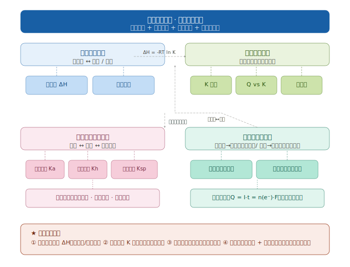

# 物质转化专题 · 化学反应原理

> **视角转换**：前两册的物质转化是**元素价态转化**（铁三角、硫氮链），本册的"物质转化"是**能量转化 + 平衡转化 + 电化学转化**。



---

## 一、能量转化主线

### 1.1 化学反应中的能量转化类型

| 转化类型 | 实例 | ΔH 符号 | 能量去向 |
|--------|------|---------|---------|
| 化学能 → 热能 | 燃烧、中和反应 | ΔH < 0（放热） | 系统内能减少 |
| 化学能 → 电能 | 原电池、燃料电池 | ΔH < 0（自发） | 电子经外电路做功 |
| 电能 → 化学能 | 电解池、电镀 | ΔH > 0（非自发） | 外界对系统做功 |
| 热能 → 化学能 | 热分解反应 | ΔH > 0（吸热） | 系统从环境吸热 |

### 1.2 反应热（ΔH）的两种计算方法

**方法一：键能计算法**
```
ΔH = Σ(反应物键能) - Σ(生成物键能)
```
> 例：H₂ + Cl₂ = 2HCl  
> ΔH = (436 + 243) - 2×431 = -183 kJ/mol

**方法二：盖斯定律（Hess's Law）**
```
ΔH_total = ΣΔH(步骤1) + ΣΔH(步骤2) + ...
```
> 反应热与途径无关，只与始态和终态有关！

### 1.3 热化学方程式书写规范

**★ 高考必考规范**：
1. 必须注明**温度压强**（常用 25 ℃，101 kPa）
2. 必须注明**物质聚集状态**（g / l / s）
3. ΔH 单位必须是 **kJ/mol**
4. 系数可以是**分数**（表示1 mol反应）

**常见易错点**：
- ❌ 漏写状态：`H₂ + ½O₂ = H₂O`（错误）
- ✅ 正确写法：`H₂(g) + ½O₂(g) = H₂O(l)  ΔH = -285.8 kJ/mol`

---

## 二、平衡转化主线（可逆反应的限度）

### 2.1 四大平衡体系对比

| 平衡类型 | 平衡常数 | 表达式示例 | 影响因素 |
|---------|-----------|------------|---------|
| 化学平衡 | K | `K = [CO₂][H₂] / [CO][H₂O]` | T ↑，K可能↑或↓（看ΔH） |
| 电离平衡 | Kₐ / Kᵦ | `Kₐ(HAc) = [H⁺][Ac⁻] / [HAc]` | T ↑，Kₐ略↑；稀释，α↑但[H⁺]↓ |
| 水解平衡 | Kₕ | `Kₕ = K_w / Kₐ` | 升温促进水解；稀释促进水解 |
| 沉淀溶解平衡 | Kₛₚ | `Kₛₚ(AgCl) = [Ag⁺][Cl⁻]` | 同离子效应抑制溶解；升温一般促进溶解 |

### 2.2 平衡移动的判断（Q vs K）

```
若 Q < K → 反应正向进行（向右）
若 Q = K → 处于平衡状态
若 Q > K → 反应逆向进行（向左）
```

**勒夏特列原理（Le Chatelier's Principle）**：
> 改变影响平衡的一个条件，平衡将向着**减弱这种改变**的方向移动。

| 条件改变 | 平衡移动方向 | 转化率变化 |
|---------|------------|---------|
| [反应物] ↑ | 正向移动 | 其他反应物转化率↑，自身转化率↓ |
| [生成物] ↑ | 逆向移动 | 各物质转化率↓ |
| 压强 ↑（气体分子数↓方向） | 向分子数↓方向移动 | 转化率↑ |
| 温度 ↑（吸热方向） | 向吸热方向移动 | 取决于ΔH符号 |
| 加催化剂 | **不移动** | 不变（只改v，不改限度） |

### 2.3 转化率计算模板

**三步法**：
```
① 列三段式（起始-变化-平衡）
② 代入K表达式
③ 求x，算转化率 = 已转化量 / 起始量 × 100%
```

**示例**：CO(g) + H₂O(g) ⇌ CO₂(g) + H₂(g)，K = 1.0，起始 [CO]=2.0 M，[H₂O]=10 M，求CO转化率。

```
         CO   +   H₂O   ⇌   CO₂   +   H₂
起始:   2.0       10       0         0
变化:    -x       -x      +x        +x
平衡:   2.0-x     10-x     x         x

K = x² / [(2.0-x)(10-x)] = 1.0
→ x = 5/3 mol
→ 转化率 = (5/3) / 2.0 × 100% = 83%
```

---

## 三、离子平衡转化（水溶液中的竞争）

### 3.1 离子反应竞争顺序

**强强先反应原则**：
```
氧化性/酸性/Ag⁺ 更强的优先反应
```

**常见竞争情景**：
1. **中和反应优先**：HCl + NaOH → 先中和，再考虑弱酸/弱碱平衡
2. **沉淀反应优先**：Ag⁺ + Cl⁻ → 先沉淀，再考虑配位/氧化还原
3. **氧化还原优先**：Fe³⁺ + I⁻ → 先氧化还原，再考虑络合

### 3.2 离子浓度大小比较（电荷守恒 + 物料守恒）

**三大守恒**：
1. **电荷守恒**：`[正离子]总 = [负离子]总`
2. **物料守恒**：某元素总浓度在各形态间分配
3. **质子守恒**：得质子总数 = 失质子总数

**示例（Na₂CO₃溶液）**：
```
电荷守恒：[Na⁺] + [H⁺] = [HCO₃⁻] + 2[CO₃²⁻] + [OH⁻]
物料守恒：[Na⁺] = 2([H₂CO₃] + [HCO₃⁻] + [CO₃²⁻])
质子守恒：[OH⁻] = [H⁺] + [HCO₃⁻] + 2[H₂CO₃]
```

### 3.3 沉淀转化（Kₛₚ的应用）

**核心问题**：两种沉淀共存时，哪种先转化？

```
若 Kₛₚ(AgCl) > Kₛₚ(AgI)，则 AgCl 能转化为 AgI（白色→黄色）
```

**滴定终点判断（AgNO₃滴定Cl⁻，K₂CrO₄指示剂）**：
- 原理：Kₛₚ(Ag₂CrO₄) > Kₛₚ(AgCl)，Cl⁻先沉淀完全后，Ag₂CrO₄才沉淀（砖红色）
- 计算：当[Cl⁻] = 1.0×10⁻⁵ M时，[Ag⁺] = Kₛₚ(AgCl) / [Cl⁻]，再算所需[CrO₄²⁻]

---

## 四、电化学转化主线

### 4.1 原电池 vs 电解池对比

| 对比维度 | 原电池（Galvanic） | 电解池（Electrolytic） |
|---------|-------------------|---------------------|
| 能量转化 | 化学能 → 电能（自发） | 电能 → 化学能（非自发） |
| ΔG | ΔG < 0 | ΔG > 0 |
| 电极名称 | 负极（氧化）= 阳极？NO！ | 阳极（氧化）= 正极？NO！ |
| 电子流向 | 负极 → 外电路 → 正极 | 电源负极 → 阴极；阳极 → 电源正极 |
| 离子移动 | 阴离子→负极；阳离子→正极 | 阴离子→阳极；阳离子→阴极 |
| 应用 | 燃料电池、干电池 | 电镀、精炼、氯碱工业 |

### 4.2 电极反应式书写（四步法）

```
① 判断电极（原电池：负极氧化；电解池：阴极还原）
② 写出氧化剂/还原剂
③ 配平电子数
④ 用H⁺/OH⁻/H₂O配平电荷和原子
```

**常见陷阱**：
- 酸性介质：用 H⁺ 和 H₂O 配平
- 碱性介质：用 OH⁻ 和 H₂O 配平
- 燃料电池：燃料在**负极**氧化（不是正极！）

**示例（氢氧燃料电池，酸性介质）**：
```
负极：H₂ → 2H⁺ + 2e⁻  （×2）→ 2H₂ → 4H⁺ + 4e⁻
正极：O₂ + 4H⁺ + 4e⁻ → 2H₂O
总反应：2H₂ + O₂ = 2H₂O
```

### 4.3 电化学计算（电子守恒法）

**核心**：转移电子数守恒！

```
Q = I × t = n(e⁻) × F
n(e⁻) = 电量 / 法拉第常数 F = 96500 C/mol
```

**示例**：电解 CuSO₄溶液，电流 2A，通电 1930 秒，求阴极析出 Cu 质量。
```
Q = 2A × 1930s = 3860 C
n(e⁻) = 3860 / 96500 = 0.04 mol
Cu²⁺ + 2e⁻ → Cu，故 n(Cu) = 0.04/2 = 0.02 mol
m(Cu) = 0.02 × 64 = 1.28 g
```

---

## 五、物质转化综合推断（高考题型）

### 5.1 能量-平衡-电化学综合题解题框架

```
读题 → 判断转化类型 → 选公式/原理 → 计算/判断 → 检查单位
  ↓
能量转化？→ 写热化学方程式 / 算ΔH
平衡转化？→ 算K / 判断移动方向 / 算转化率
离子转化？→ 写离子方程式 / 用Kₐ/Kₛₚ计算
电化学转化？→ 判断阴阳极 / 写电极反应 / 电子守恒计算
```

### 5.2 常见"转化"关键词对应原理

| 题干关键词 | 对应原理 | 常用公式/常数 |
|-----------|---------|--------------|
| "反应热"、"焓变" | 反应热计算 | ΔH = ΣH(生成物) - ΣH(反应物) |
| "转化率"、"产率" | 化学平衡 | K表达式、三段式 |
| "电离度"、"pH" | 电离平衡 | Kₐ、[H⁺] = √(Kₐ·c)（近似） |
| "沉淀"、"溶度积" | 沉淀溶解平衡 | Kₛₚ、同离子效应 |
| "电极"、"电池"、"电解" | 电化学 | 法拉第常数、电极反应式 |
| "盖斯定律"、"途径无关" | 反应热计算 | ΔH₁ + ΔH₂ = ΔH总 |

---

## 六、易错点精编 ★

### 能量转化篇
1. **燃烧热**定义：1 mol 纯物质**完全燃烧**生成**稳定氧化物**放出的热量（必须生成液态水！）
2. **中和热**：稀溶液中，强酸强碱中和生成 1 mol 水放出的热量（ΔH = -57.3 kJ/mol）

### 平衡转化篇
3. **平衡常数单位**：K 一般**无单位**（浓度平衡常数），Kₚ 用分压表示
4. **催化剂不影响平衡**：只改速率，不改限度，不出现在平衡常数表达式中
5. **压强对固/液无影响**：Only 影响气体参与的平衡！

### 离子转化篇
6. **盐类水解规律**：谁弱谁水解，谁强显谁性，越弱越水解
7. **滴定终点判断**：强酸滴强碱用甲基橙（黄→橙），强碱滴强酸用酚酞（无→粉红）

### 电化学篇
8. **原电池电极命名混淆**：负极 = 阳极？❌ 原电池：**负极=阳极（氧化）**？NO！原电池负极是**氧化反应发生处**，但叫**负极**（电子流出），电解池阳极是**正极**（电子流入）？NO！电解池阳极接电源正极，发生**氧化反应**。
   - 记忆口诀：**原电池：负氧正还；电解池：阳氧阴还**
9. **活泼金属作负极**：但燃料电池的电极本身不参与反应（惰性电极Pt/C）

---

## 七、互动练习

> 💡 下方是专门为本专题设计的互动练习题，覆盖能量转化、平衡移动、离子竞争、电化学计算四大板块。

<iframe src="物质转化_化学反应原理_互动练习.html" width="100%" height="700px"></iframe>

[→ 如果上方练习题无法正常显示，请点击这里直接打开](物质转化_化学反应原理_互动练习.html)

---

## 八、本章小结

```
化学反应原理的"物质转化" = 能量转化 + 平衡转化 + 离子转化 + 电化学转化

核心思想：
1. 能量守恒 → ΔH 计算（键能法 / 盖斯定律）
2. 平衡移动 → Q vs K 判断方向
3. 离子竞争 → 守恒法（电荷/物料/质子）
4. 电化学 → 电子守恒（法拉第常数）
```

