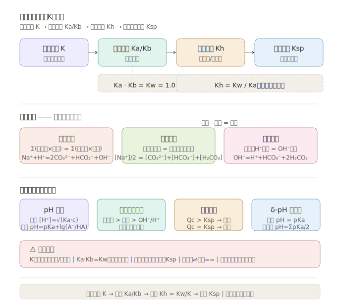

# 四大平衡判据与 K 值计算 —— 水溶液万能解题框架

> **来源**：选择性必修1《化学反应原理》第二章~第三章  
> **定位**：高考选择题第2~3题 + 综合题压轴模块，分值 12~18 分

---

## 一、四大平衡总览

| 平衡类型 | 研究对象 | 平衡常数 | 核心表达式 | 温度影响 |
|----------|---------|---------|-----------|---------|
| 化学平衡 | 任意可逆反应 | **K** | $K = \frac{[C]^c[D]^d}{[A]^a[B]^b}$ | 吸热↑/放热↓ |
| 弱电解质电离平衡 | 弱酸HA/弱碱BOH | **Ka/Kb** | $K_a = \frac{[H^+][A^-]}{[HA]}$ | 吸热↑ |
| 盐类水解平衡 | 弱酸盐/弱碱盐 | **Kh** | $K_h = \frac{K_w}{K_a}$（弱酸强碱盐） | 吸热↑ |
| 沉淀溶解平衡 | 难溶电解质 | **Ksp** | $K_{sp} = [M^{m+}]^a[X^{x-}]^b$ | 多数吸热↑ |

> **口诀**：化学 K 是根基，酸 Ka / 碱 Kb 分强弱，盐 Kh = Kw / K，沉淀只看 Ksp。

---

## 二、详细拆解

### 2.1 化学平衡常数 K

**公式回忆**：
$$aA + bB \rightleftharpoons cC + dD \quad \Rightarrow \quad K = \frac{[C]^c[D]^d}{[A]^a[B]^b}$$

**关键规则**：
- 固体和纯液体**不写入** K 表达式
- 稀溶液中水的浓度视为常数（≈55.6 mol/L），不写入
- K 只随**温度**变化，与浓度、压强无关

**K 值意义**：
| K 值范围 | 平衡位置 | 
|----------|---------|
| K >> 1 (如 10⁵) | 正向几乎完全 |
| K ≈ 1 | 正逆均显著 |
| K << 1 (如 10⁻⁵) | 逆向几乎完全 |

**Qc 与 K 比较**（判断方向）：
- Qc < K → 正向移动
- Qc = K → 已达平衡
- Qc > K → 逆向移动

> **常见错误**：K 表达式写纯固体！如 CaCO₃(s) ⇌ CaO(s) + CO₂(g)，K = [CO₂]，不写 CaCO₃ 和 CaO。

---

### 2.2 弱电解质电离平衡 Ka/Kb

**一元弱酸 HA**：
$$HA \rightleftharpoons H^+ + A^- \quad K_a = \frac{[H^+][A^-]}{[HA]}$$

**一元弱碱 BOH**：
$$BOH \rightleftharpoons B^+ + OH^- \quad K_b = \frac{[B^+][OH^-]}{[BOH]}$$

**近似公式**（当 c/Ka ≥ 500 时）：
$$[H^+] = \sqrt{K_a \cdot c}$$

**多元弱酸分步电离**：
$$H_2CO_3 \rightleftharpoons H^+ + HCO_3^- \quad K_{a1} = 4.3 \times 10^{-7}$$
$$HCO_3^- \rightleftharpoons H^+ + CO_3^{2-} \quad K_{a2} = 5.6 \times 10^{-11}$$

> **重点**：Ka1 >> Ka2，第一步电离远大于第二步！

**Ka/Kb 互算**（共轭酸碱对）：
$$K_a \cdot K_b = K_w = 1.0 \times 10^{-14} \text{ (25°C)}$$

> **常见错误**：忘记 Ka·Kb = Kw 只适用于**共轭酸碱对**（如 HAc 和 Ac⁻），不适用于任意酸碱！

---

### 2.3 盐类水解平衡 Kh

**本质**：盐的离子与水电离出的 H⁺ 或 OH⁻ 结合，促进水的电离。

**Kh 与 Ka/Kb 的关系**：

| 盐类型 | Kh 表达式 | 溶液酸碱性 |
|--------|----------|-----------|
| 强酸弱碱盐 (NH₄Cl) | $K_h = \frac{K_w}{K_b}$ | 酸性 |
| 弱酸强碱盐 (NaAc) | $K_h = \frac{K_w}{K_a}$ | 碱性 |
| 弱酸弱碱盐 (NH₄Ac) | $K_h = \frac{K_w}{K_a \cdot K_b}$ | 比较 Ka 和 Kb |

**水解程度判断**：
- 越弱越水解：Ka/Kb 越小，Kh 越大，水解程度越大
- 温度越高，水解程度越大（水解吸热）

> **口诀**：谁弱谁水解，越弱越水解，谁强显谁性。

---

### 2.4 沉淀溶解平衡 Ksp

**通式**：
$$A_mB_n(s) \rightleftharpoons mA^{n+}(aq) + nB^{m-}(aq)$$
$$K_{sp} = [A^{n+}]^m \cdot [B^{m-}]^n$$

**Qc 与 Ksp 比较**（判断沉淀生成）：
- Qc > Ksp → 有沉淀生成
- Qc = Ksp → 饱和溶液
- Qc < Ksp → 无沉淀或沉淀溶解

**沉淀转化条件**：Ksp 大的 → Ksp 小的（同类型）
$$AgCl(K_{sp}=1.8\times10^{-10}) \xrightarrow{KI} AgI(K_{sp}=8.5\times10^{-17})$$

> **常见错误**：不同类型沉淀不能直接比较 Ksp！需计算溶解度：$S = \sqrt[3]{\frac{K_{sp}}{4}}$（AB₂型）

---

## 三、三大守恒 —— 水溶液万能工具

### 3.1 电荷守恒

> 溶液中**阳离子所带正电荷总量 = 阴离子所带负电荷总量**

**通式**：
$$\sum (阳离子浓度 \times 电荷数) = \sum (阴离子浓度 \times 电荷数)$$

**Na₂CO₃ 溶液示例**：
$$[Na^+] + [H^+] = 2[CO_3^{2-}] + [HCO_3^-] + [OH^-]$$

> **注意**：CO₃²⁻ 带 2 个负电荷，系数为 2！

---

### 3.2 物料守恒（元素守恒）

> 某元素的**所有存在形式浓度之和 = 初始浓度**

**Na₂CO₃ 溶液示例**（设初始浓度 c）：
$$\frac{1}{2}[Na^+] = [CO_3^{2-}] + [HCO_3^-] + [H_2CO_3] = c$$

---

### 3.3 质子守恒

> 水电离出的 H⁺ 总量 = 水电离出的 OH⁻ 总量

**Na₂CO₃ 溶液示例**：
$$[OH^-] = [H^+] + [HCO_3^-] + 2[H_2CO_3]$$

> **技巧**：质子守恒 = 电荷守恒 − 物料守恒（减去时可以消元）

---

## 四、四大题型解题框架

### 题型 1：pH 计算

| 溶液类型 | 公式 |
|----------|------|
| 强酸 (HCl) | $[H^+] = c$，$pH = -\lg c$ |
| 强碱 (NaOH) | $[OH^-] = c$，$[H^+] = K_w/c$，$pH = 14 + \lg c$ |
| 弱酸 (HAc) | $[H^+] = \sqrt{K_a \cdot c}$（近似） |
| 弱碱 (NH₃·H₂O) | $[OH^-] = \sqrt{K_b \cdot c}$ |
| 缓冲溶液 | $pH = pK_a + \lg\frac{[A^-]}{[HA]}$ |

---

### 题型 2：离子浓度大小比较

**核心原则**：
1. 先判断溶质是什么（强/弱电解质、水解情况）
2. 列出三大守恒
3. 按"主要成分 > 次要成分 > 微量成分"排序

**Na₂CO₃ 溶液排序示例**：
$$[Na^+] > [CO_3^{2-}] > [OH^-] > [HCO_3^-] > [H^+]$$

> **口诀**：不水解的排第一，水解的排第二，弱酸根水解出 OH⁻ 排第三

---

### 题型 3：沉淀生成/溶解/转化判断

**步骤**：
1. 写 Ksp 表达式
2. 计算 Qc = 离子积
3. 比较 Qc 与 Ksp

**沉淀完全条件**：离子浓度 < 10⁻⁵ mol/L

---

### 题型 4：分布系数 δ-pH 图分析

- 一元弱酸：两条曲线交叉点 pH = pKa
- 二元弱酸：δ(H₂A) 与 δ(HA⁻) 交叉点 pH = pKa1；δ(HA⁻) 与 δ(A²⁻) 交叉点 pH = pKa2
- 当 δ(HA⁻) 最大时：pH = (pKa1 + pKa2)/2

---

## 五、常见错误提醒

| 错误 | 正确做法 |
|------|---------|
| 稀释弱酸时用强酸公式算 pH | 弱酸稀释需考虑电离度增大 |
| 混淆"恰好中和"和"pH=7" | 弱酸弱碱中和终点 ≠ 中性（水解） |
| 沉淀转化只看 Ksp 大小 | 同类型才可比；不同类型需算溶解度 S |
| 水解方程写"==" | 水解是**可逆反应**，写"⇌" |
| 电荷守恒忘乘电荷数 | Na₂SO₄ 中 $[Na^+]=2[SO_4^{2-}]$，系数 2！ |

---

## 六、高考链接

> **全国乙卷高频**：① 分布系数图分析 ② 离子浓度排序 ③ Ksp 与沉淀转化 ④ 缓冲溶液 pH 计算

**典型考法**：给出一元弱酸滴定曲线，判断：各点溶质组成 → 离子浓度关系 → K 值计算 → 指示剂选择。

---

*下接 [四大平衡 · 互动练习](#)*
