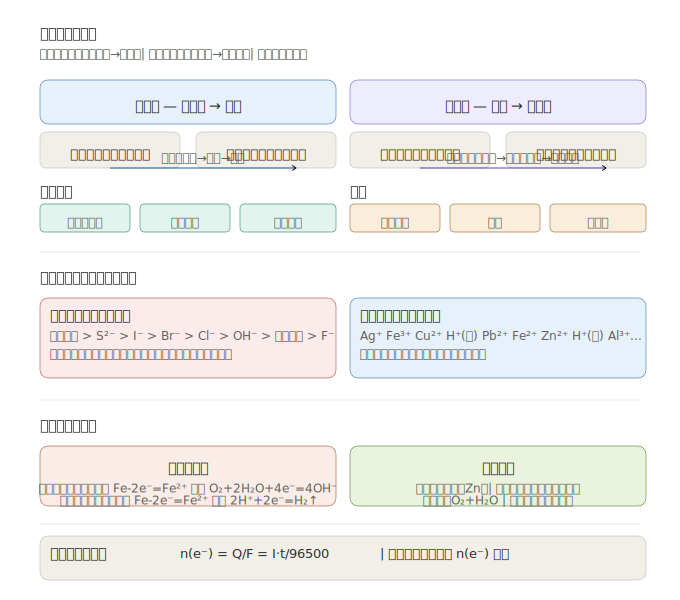

# 电化学综合 —— 原电池 + 电解池 + 金属防护

> **来源**：选择性必修1《化学反应原理》第四章  
> **定位**：高考选择题必考 + 综合题电极反应式书写，分值 6~12 分

---

## 一、电化学体系总览

| 装置 | 本质 | 能量转化 | 电极名称 | 电子流向 |
|------|------|----------|----------|----------|
| **原电池** | 自发氧化还原 | 化学能 → 电能 | 负极/正极 | 负极→导线→正极 |
| **电解池** | 外加电源驱动 | 电能 → 化学能 | 阴极/阳极 | 电源负极→阴极；阳极→电源正极 |

> **口诀**：原电池"负失正得"（负极失电子、正极得电子）；电解池"阳氧阴还"（阳极氧化、阴极还原）

---

## 二、原电池

### 2.1 构成条件

1. 两个**活泼性不同**的电极（或一个电极 + 惰性电极如石墨/Pt）
2. **电解质溶液**
3. **闭合回路**（导线 + 盐桥/离子交换膜）
4. **自发氧化还原反应**

### 2.2 单液原电池 vs 双液原电池

| 类型 | 特点 | 缺点 |
|------|------|------|
| 单液 | 结构简单 | 电流不稳定（Zn 直接与 Cu²⁺ 反应） |
| 双液（盐桥） | 电流稳定 | 结构复杂 |

### 2.3 燃料电池

**氢氧燃料电池**（酸性介质）：
- 负极：$2H_2 - 4e^- = 4H^+$
- 正极：$O_2 + 4H^+ + 4e^- = 2H_2O$
- 总反应：$2H_2 + O_2 = 2H_2O$

**氢氧燃料电池**（碱性介质）：
- 负极：$2H_2 + 4OH^- - 4e^- = 4H_2O$
- 正极：$O_2 + 2H_2O + 4e^- = 4OH^-$

> **关键**：同一总反应，介质不同则电极反应式不同！

### 2.4 常见电池

| 电池类型 | 负极 | 正极 | 电解质 |
|----------|------|------|--------|
| 锌锰干电池 | Zn | MnO₂ | NH₄Cl 糊状 |
| 铅蓄电池 | Pb | PbO₂ | H₂SO₄ |
| 锂离子电池 | LiC₆ | LiCoO₂ | LiPF₆ 有机溶液 |

---

## 三、电解池

### 3.1 放电顺序

**阳极（氧化）**：
活性电极（除 Pt/Au 外）> S²⁻ > I⁻ > Br⁻ > Cl⁻ > OH⁻ > 含氧酸根 > F⁻

**阴极（还原）**：
Ag⁺ > Fe³⁺ > Cu²⁺ > H⁺（酸）> Pb²⁺ > Sn²⁺ > Fe²⁺ > Zn²⁺ > H⁺（水）> Al³⁺ > Mg²⁺ > Na⁺ > Ca²⁺ > K⁺

> **口诀（阳极）**：活性电极先溶解，硫碘溴氯氢氧根，含氧酸根排最后  
> **口诀（阴极）**：银铁铜氢铅锡铁，锌水铝镁钠钙钾

### 3.2 典型电解

| 电解质 | 阳极产物 | 阴极产物 | pH 变化 |
|--------|----------|----------|---------|
| CuCl₂ | Cl₂↑ | Cu | — |
| NaCl | Cl₂↑ | H₂↑+NaOH | ↑ |
| CuSO₄ | O₂↑+H₂SO₄ | Cu | ↓ |
| H₂SO₄（电解水） | O₂↑ | H₂↑ | ↓ |
| NaOH（电解水） | O₂↑ | H₂↑ | ↑ |

### 3.3 电解应用

| 应用 | 阳极 | 阴极 | 电解液 |
|------|------|------|--------|
| 氯碱工业 | 石墨（Cl₂↑） | Fe（H₂↑+NaOH） | 饱和 NaCl |
| 电镀（镀铜） | 铜（Cu-2e⁻=Cu²⁺） | 待镀件（Cu²⁺+2e⁻=Cu） | CuSO₄ |
| 电解精炼铜 | 粗铜 | 纯铜 | CuSO₄ |
| 电冶金（炼铝） | 石墨（2O²⁻-4e⁻=O₂↑） | 石墨（Al³⁺+3e⁻=Al） | 熔融 Al₂O₃ |

---

## 四、金属腐蚀与防护

### 4.1 电化学腐蚀（主要形式）

| 类型 | 条件 | 正极反应 | 负极反应 |
|------|------|----------|----------|
| 吸氧腐蚀 | 弱酸性/中性 | O₂+2H₂O+4e⁻=4OH⁻ | Fe-2e⁻=Fe²⁺ |
| 析氢腐蚀 | 较强酸性 | 2H⁺+2e⁻=H₂↑ | Fe-2e⁻=Fe²⁺ |

> **重点**：自然界中以**吸氧腐蚀**为主！

### 4.2 防护方法

| 方法 | 原理 |
|------|------|
| 涂保护层 | 隔绝 O₂ 和 H₂O |
| 牺牲阳极法 | 连活泼金属（Zn）→ Zn 被腐蚀，Fe 被保护 |
| 外加电流法 | 被保护金属接电源**负极** → 作阴极，不腐蚀 |
| 改变金属结构 | 制成合金（不锈钢） |

---

## 五、电极反应式书写万能公式

### 步骤

1. **判断装置类型**：原电池 or 电解池
2. **确定电极**：负极/正极（原电池）或 阴极/阳极（电解池）
3. **写出反应物 → 产物的"骨架"**（含化合价变化的物质）
4. **配平电子数**
5. **补全介质离子**（H⁺、OH⁻、H₂O 等）
6. **检查：电荷守恒 + 原子守恒**

### 示例

**甲醇燃料电池（碱性介质）**：

负极（CH₃OH → CO₃²⁻，碱性介质补 OH⁻）：
$$CH_3OH + 8OH^- - 6e^- = CO_3^{2-} + 6H_2O$$

正极（O₂ → OH⁻）：
$$O_2 + 2H_2O + 4e^- = 4OH^-$$

---

## 六、电解池定量计算

**核心关系**：电子守恒！

$$n(e^-) = \frac{Q}{F} = \frac{I \cdot t}{96500}$$

- Q：电量（C）
- I：电流（A）
- t：时间（s）
- F：法拉第常数 = 96500 C/mol

**串联电解池**：通过各池的电子物质的**量相等**。

| 产物 | 每生成 1 mol 所需电子 |
|------|----------------------|
| H₂ | 2 mol e⁻ |
| O₂ | 4 mol e⁻ |
| Cl₂ | 2 mol e⁻ |
| Cu | 2 mol e⁻ |
| Ag | 1 mol e⁻ |
| Al | 3 mol e⁻ |

---

## 七、常见错误提醒

| 错误 | 正确做法 |
|------|---------|
| 燃料电池负极写"失电子"不管介质 | 介质决定补 OH⁻ 还是 H⁺ |
| 电解池阳极用惰性电极顺序 | 惰性电极：S²⁻>I⁻>Br⁻>Cl⁻>OH⁻ |
| 混淆"原电池"和"电解池"电极名 | 原电池：正/负极；电解池：阴/阳极 |
| 牺牲阳极保护法接活泼金属 | 被保护金属作**正极**（原电池） |
| 电解池计算忘乘法拉第常数 | Q=I·t，n(e⁻)=Q/96500 |

---

*下接 [电化学综合 · 互动练习](#)*

