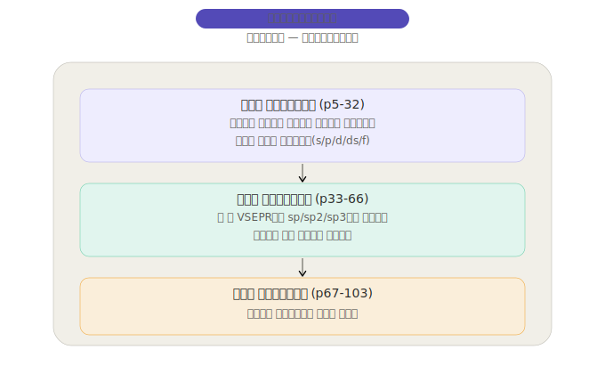
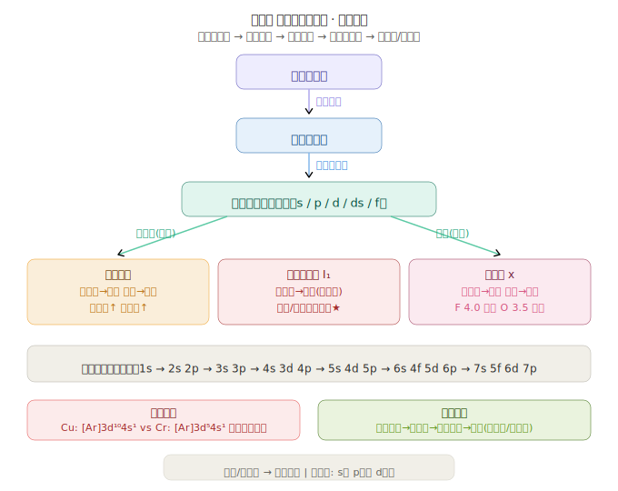
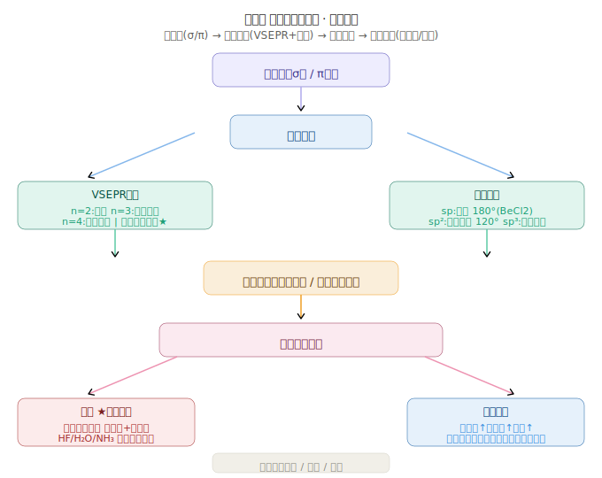
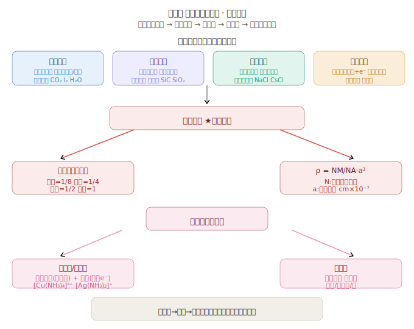

# 物质结构与性质 专题 — 结构决定性质的推理链

> **核心视角**：选必2不同于必修阶段的"物质转化"（化学反应视角），本书的核心是"结构推理性质"——从微观结构参数推断宏观物质行为。本专题梳理从原子到晶体的结构-性质推理链条。

---

## 一、核心推理框架

```
原子结构(电子排布/轨道)
    ↓
元素性质(周期位置/电离能/电负性)
    ↓
化学键类型(离子键/共价键/金属键)
    ↓
分子结构(空间构型/极性)
    ↓
分子间作用力(范德华力/氢键)
    ↓
晶体结构(堆积方式/晶胞)
    ↓
物质宏观性质(熔沸点/硬度/导电性/溶解性)
```



---

## 二、性质比较推理链

### 2.1 熔沸点比较推理

**推理步骤**：
1. 先判断晶体类型 → 共价晶体 > 离子晶体 > 金属晶体 > 分子晶体（大致顺序）
2. 同类型再比较作用力强弱

| 晶体类型 | 比较依据 | 比较规则 | 示例 |
|---------|---------|---------|------|
| 共价晶体 | 共价键强弱 | 键长越短(原子半径越小)熔沸点越高 | 金刚石 > SiC > Si |
| 离子晶体 | 晶格能 | 离子电荷↑、半径↓ → 晶格能↑ → 熔沸点↑ | MgO > NaCl > KCl |
| 金属晶体 | 金属键强弱 | 价电子↑、半径↓ → 熔沸点↑ | Al > Mg > Na |
| 分子晶体 | 分子间作用力 | 相对分子质量↑、有氢键→熔沸点↑ | H₂O > H₂S; I₂ > Br₂ > Cl₂ |

**氢键干扰链**：
```
H₂O(100°C) > H₂Te(-2°C) > H₂Se(-41°C) > H₂S(-60°C)
HF(19.5°C) > HI(-35°C) > HBr(-67°C) > HCl(-85°C)
NH₃(-33°C) 异常高（分子间氢键）
```

### 2.2 溶解性推理链

| 推理起点 | 推理终点 | 规则 |
|---------|---------|------|
| 键的极性 | 分子极性 | 极性键+空间不对称→极性分子 |
| 分子极性 | 溶解性 | 极性分子溶于极性溶剂(H₂O) |
| 氢键存在 | 溶解性 | 能与水形成氢键→易溶于水 |
| 离子键 | 溶解性 | 离子晶体部分溶于水（水合能>晶格能） |

**实例链**：
- NH₃ → 极性分子 + 能与水形成氢键 → 极易溶于水(1:700)
- I₂ → 非极性分子 → 难溶于水、易溶于CCl₄ → "相似相溶"
- 乙醇 → 含-OH(能与水形成氢键) → 与水任意比互溶

---

## 三、电子排布 → 化学性质推理链



### 3.1 价电子排布 → 元素分区 → 典型性质

| 价电子排布 | 分区 | 典型元素 | 性质特征 |
|-----------|------|---------|---------|
| ns¹⁻² | s区 | Na, Mg | 活泼金属，易失电子 |
| ns²np¹⁻⁶ | p区 | C, N, O, Cl | 非金属为主，多变价态 |
| (n-1)d¹⁻⁹ns¹⁻² | d区 | Fe, Cu, Cr | 过渡金属，多变价态，配合物 |
| (n-1)d¹⁰ns¹⁻² | ds区 | Cu, Zn | d轨道全满，性质介于s区和d区 |

### 3.2 电离能推理金属性

```
I₁越小 → 越容易失电子 → 金属性越强
同周期：I₁(Na) < I₁(Mg) < I₁(Al) → 金属性递减
同主族：I₁(Li) > I₁(Na) > I₁(K) > I₁(Rb) > I₁(Cs) → 金属性递增
```

### 3.3 电负性推理化学键类型

| Δχ(电负性差) | 键型 | 实例 |
|-------------|------|------|
| Δχ ≈ 0 | 非极性共价键 | H-H, Cl-Cl |
| 0 < Δχ < 1.7 | 极性共价键 | H-Cl(Δχ=0.9), C=O(Δχ=1.0) |
| Δχ > 1.7 | 离子键 | NaCl(Δχ=2.1), MgO(Δχ=2.3) |

---

## 四、分子结构 → 分子性质推理链



### 4.1 中心原子杂化+孤对 → 空间构型 → 极性

| 实例 | 杂化 | 孤对数 | 构型 | 极性 |
|------|------|--------|------|------|
| CO₂ | sp | 0 | 直线形 | 非极性 |
| BF₃ | sp² | 0 | 平面三角形 | 非极性 |
| SO₂ | sp² | 1 | V形 | 极性 |
| CH₄ | sp³ | 0 | 正四面体 | 非极性 |
| NH₃ | sp³ | 1 | 三角锥形 | 极性 |
| H₂O | sp³ | 2 | V形 | 极性 |

### 4.2 分子间作用力 → 熔沸点 → 状态

```
相对分子质量↑ → 范德华力↑ → 熔沸点↑
F₂(气) < Cl₂(气) < Br₂(液) < I₂(固) ← 常温状态变化
```

---

## 五、晶体结构 → 物理性质推理链



### 5.1 晶体类型识别 → 性质预测

**识别口诀**：
- 含金属元素 + 非金属元素 → 可能是离子晶体
- 全是非金属元素 → 分子晶体或共价晶体
- 只有金属元素 → 金属晶体
- 熔沸点很高、很硬 → 共价晶体
- 熔沸点很低 → 分子晶体

### 5.2 晶胞结构 → 化学式 → 密度

**NaCl晶胞推理链**：
```
均摊Na⁺: 12×1/4(棱) + 1(体心) = 4
均摊Cl⁻: 8×1/8(顶角) + 6×1/2(面心) = 4
→ 化学式 NaCl (Na:Cl = 1:1)
→ ρ = 4×58.5/(Nᴀ×a³)
```

### 5.3 金刚石 vs 石墨 → 同素异形体的性质差异

```
          C(金刚石)              C(石墨)
杂化      sp³                    sp²
结构      三维网状               层状
键        每C形成4个σ键          层内σ键+π键，层间范德华力
硬度      最硬(10)              柔软(1)
导电性    不导电                 导电(离域π电子)
用途      钻头/切割              电极/润滑剂
```

---

## 六、高考常见考点

1. **电子排布式推断元素** — 根据价电子排布确定周期表位置和性质
2. **电离能/电负性比较** — 同周期同主族递变+反常解释(N>O, Be>B)
3. **VSEPR+杂化联合判断** — 给定分子式→推空间构型→判极性
4. **氢键对熔沸点影响** — H₂O/HF/NH₃的异常行为解释
5. **四种晶体熔沸点排序** — 先分类再比较
6. **晶胞均摊+密度计算** — 固定题型，务必掌握
7. **配合物配位数判断** — 常见配体及配位键

---

## 附录：互动练习

> 配合本专题进行自测练习，涵盖电子排布、分子构型判断、晶体结构计算等核心题型。

<iframe src="./物质结构与性质_互动练习.html" width="100%" height="3200" style="border: 1px solid #e0e0e0; border-radius: 8px;"></iframe>

> 如果上方 iframe 没有正常渲染，也可以[直接打开页面查看](./物质结构与性质_互动练习.html)。
