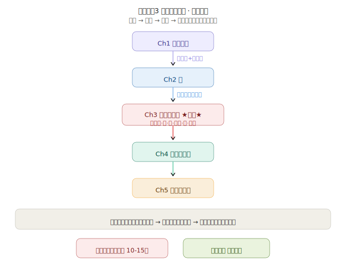
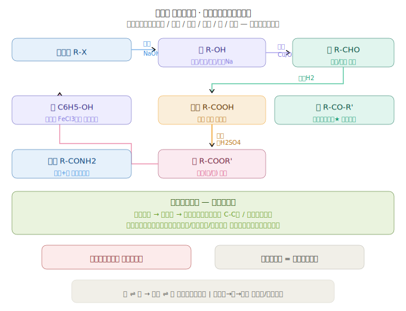

# 化学选择性必修3 有机化学基础 知识图谱

> **教材定位**：在必修二第7章"有机化合物"基础上，系统深入地学习有机化学。从官能团视角，按"烃→烃的衍生物→生物大分子→合成高分子"层层递进。本书是全国乙卷有机选做题的知识来源，也是理科生化学学习的重头戏。

---

## 全书总览

### 章节结构树

```
化学选择性必修3 · 有机化学基础 (163页)
│
├── 第一章 有机化合物的结构特点与研究方法 (p3-26)
│   ├── 第一节 有机化合物的结构特点
│   │   ├── 分类方法（碳骨架+官能团）
│   │   ├── 共价键（σ键/π键与反应类型）
│   │   └── 同分异构现象
│   └── 第二节 研究有机化合物的一般方法
│       ├── 分离提纯（蒸馏/萃取/重结晶/色谱）
│       └── 结构测定（元素分析/质谱/红外/核磁共振）
│
├── 第二章 烃 (p27-52)
│   ├── 第一节 烷烃（取代反应）
│   ├── 第二节 烯烃 · 炔烃（加成/加聚/氧化）
│   └── 第三节 芳香烃（苯及同系物、取代/加成）
│
├── 第三章 烃的衍生物 (p53-97) ★核心★
│   ├── 第一节 卤代烃（水解/消去）
│   ├── 第二节 醇 · 酚
│   ├── 第三节 醛 · 酮
│   ├── 第四节 羧酸 · 羧酸衍生物（酯/酰胺）
│   └── 第五节 有机合成（逆合成分析法）
│
├── 第四章 生物大分子 (p101-129)
│   ├── 第一节 糖类（葡萄糖/蔗糖/淀粉/纤维素）
│   ├── 第二节 蛋白质（氨基酸/肽键/酶）
│   └── 第三节 核酸（DNA/RNA）
│
└── 第五章 合成高分子 (p131-153)
    ├── 第一节 合成高分子的基本方法（加聚/缩聚）
    └── 第二节 高分子材料（塑料/纤维/橡胶）
```

### 全书逻辑线

> **官能团决定性质，结构决定反应**：碳骨架 → 官能团 → 反应类型 → 转化关系 → 有机合成路线设计

### 各章核心主题

| 章 | 核心主题 | 与必修二衔接 | 进阶点 |
|----|---------|------------|--------|
| 第1章 | 有机物研究方法 | 必修二有机化合物认识 | 同分异构/仪器分析（质谱/红外/NMR） |
| 第2章 | 烃 | 必修二甲烷/乙烯/苯 | 系统命名/炔烃/苯同系物/共轭二烯烃 |
| 第3章 | 烃的衍生物 | 必修二乙醇/乙酸 | ★卤代烃/醛酮/酯/酰胺/逆合成 |
| 第4章 | 生物大分子 | 必修二糖类/蛋白质 | 核酸/酶/手性/更深层结构 |
| 第5章 | 合成高分子 | 必修二塑料/橡胶 | 缩聚反应/功能高分子 |



---

## 第一章 有机化合物的结构特点与研究方法

> **地位**：有机化学的"方法论"章节，掌握官能团分类和研究方法。

### 第一节 有机化合物的结构特点

#### 一、分类方法

**碳骨架分类**：
```
有机化合物 → 链状化合物（脂肪烃/脂肪烃衍生物）
           → 环状化合物 → 脂环化合物（脂环烃/衍生物）
                        → 芳香族化合物（芳香烃/衍生物）
```

**官能团分类（14类）**：

| 类别 | 官能团 | 代表物 |
|------|--------|--------|
| 烷烃 | — | CH₄ |
| 烯烃 | C=C | CH₂=CH₂ |
| 炔烃 | C≡C | CH≡CH |
| 芳香烃 | 苯环 | C₆H₆ |
| 卤代烃 | —X | CH₃CH₂Br |
| 醇 | —OH | CH₃CH₂OH |
| 酚 | —OH(连苯环) | C₆H₅OH |
| 醚 | —O— | CH₃CH₂OCH₂CH₃ |
| 醛 | —CHO | CH₃CHO |
| 酮 | —CO— | CH₃COCH₃ |
| 羧酸 | —COOH | CH₃COOH |
| 酯 | —COOR | CH₃COOCH₂CH₃ |
| 胺 | —NH₂ | CH₃NH₂ |
| 酰胺 | —CONH₂ | CH₃CONH₂ |

#### 二、共价键类型与反应

| 键型 | 存在 | 典型反应 | 实例 |
|------|------|---------|------|
| σ键 | 单键 | 取代反应 | CH₄+Cl₂→(光) |
| π键 | 双键/三键 | 加成反应 | CH₂=CH₂+Br₂→ |

#### 三、同分异构现象

| 类型 | 描述 | 实例 |
|------|------|------|
| 碳链异构 | 碳骨架不同 | 正丁烷/异丁烷 |
| 位置异构 | 官能团位置不同 | 1-丁烯/2-丁烯 |
| 官能团异构 | 官能团不同 | 乙醇/二甲醚 |
| 顺反异构 | π键限制旋转 | 顺-2-丁烯/反-2-丁烯 |
| 对映异构 | 手性碳 | 乳酸对映体 |

### 第二节 研究有机化合物的一般方法

- **分离提纯**：蒸馏、萃取、重结晶、色谱法
- **元素分析**：确定实验式
- **质谱(MS)**：确定相对分子质量
- **红外光谱(IR)**：确定官能团种类
- **核磁共振氢谱(NMR)**：确定氢原子种类和数目（峰面积比=氢原子数比）

---

## 第二章 烃

> **地位**：有机化学的基础骨架。掌握烷/烯/炔/苯四大类烃的结构、命名、反应。

### 第一节 烷烃

- **通式**：CₙH₂ₙ₊₂
- **特征反应**：取代反应（光照条件下与卤素）
- **系统命名法**：选主链→编号→写名称（长多近简小）

### 第二节 烯烃 · 炔烃

| 比较 | 烯烃(C=C) | 炔烃(C≡C) |
|------|----------|----------|
| 通式 | CₙH₂ₙ | CₙH₂ₙ₋₂ |
| 加成 | +H₂/+X₂/+HX/+H₂O | 同左（分步加成） |
| 氧化 | 使KMnO₄褪色 | 使KMnO₄褪色 |
| 加聚 | nCH₂=CH₂→[CH₂-CH₂]ₙ | nCH≡CH→[CH=CH]ₙ |
| 代表物 | 乙烯 CH₂=CH₂ | 乙炔 CH≡CH |

**二烯烃**：1,3-丁二烯 → 1,2-加成 + 1,4-加成（共轭体系）

### 第三节 芳香烃

- **苯(C₆H₆)**：平面正六边形，大π键，易取代难加成
  - 卤代：+Br₂(FeBr₃催化)→溴苯
  - 硝化：+HNO₃(浓H₂SO₄,50-60°C)→硝基苯
  - 磺化：+浓H₂SO₄→苯磺酸
- **苯的同系物**：侧链使KMnO₄褪色（与苯区别重要实验现象！）
- **定位效应**：邻对位定位基(-CH₃,-OH,-NH₂,-X)；间位定位基(-NO₂,-COOH,-CHO)

---

## 第三章 烃的衍生物 ★★★




> **地位**：本书最核心的一章，官能团转化的完整体系。从卤代烃到羧酸衍生物，每一步都是有机合成的基础，也是高考有机大题的出题来源。

### 第一节 卤代烃

| 反应 | 条件 | 方程式 |
|------|------|--------|
| 水解(取代) | NaOH水溶液,△ | R-X + NaOH → R-OH + NaX |
| 消去 | NaOH醇溶液,△ | R-CH₂-CH₂-X + NaOH → R-CH=CH₂ + NaX + H₂O |

### 第二节 醇 · 酚

**醇**：
| 反应 | 条件 | 说明 |
|------|------|------|
| 与Na置换 | | 2ROH+2Na→2RONa+H₂↑ |
| 与HX取代 | | ROH+HX→RX+H₂O |
| 消去 | 浓H₂SO₄,170°C | C₂H₅OH→CH₂=CH₂+H₂O |
| 分子间脱水 | 浓H₂SO₄,140°C | 2C₂H₅OH→C₂H₅OC₂H₅+H₂O |
| 氧化(1°醇) | Cu/Ag,△ | →醛→酸 |
| 氧化(2°醇) | Cu/Ag,△ | →酮 |
| 酯化 | 浓H₂SO₄,△ | ROH+R'COOH→R'COOR+H₂O |

**酚**：苯酚(石炭酸)，弱酸性，与FeCl₃显紫色，易被氧化

### 第三节 醛 · 酮

| | 醛(—CHO) | 酮(—CO—) |
|------|----------|----------|
| 代表物 | 乙醛CH₃CHO / 甲醛HCHO | 丙酮CH₃COCH₃ |
| 还原(加H₂) | →伯醇 | →仲醇 |
| 氧化 | →羧酸(银镜/新制Cu(OH)₂) | 不被弱氧化剂氧化 |
| 特征反应 | 银镜反应★、斐林反应★ | — |

**银镜反应**：CH₃CHO+2[Ag(NH₃)₂]OH→(△)→CH₃COONH₄+2Ag↓+3NH₃+H₂O
**与新制Cu(OH)₂**：CH₃CHO+2Cu(OH)₂+NaOH→(△)→CH₃COONa+Cu₂O↓+3H₂O（砖红色沉淀）

### 第四节 羧酸 · 羧酸衍生物

**羧酸**：
- 酸性：RCOOH ⇌ RCOO⁻ + H⁺（弱酸，比H₂CO₃强）
- 酯化：RCOOH+R'OH ⇌(浓H₂SO₄,△) RCOOR'+H₂O

**酯**：
- 水解（酸性）：RCOOR'+H₂O ⇌(H⁺,△) RCOOH+R'OH
- 水解（碱性/皂化）：RCOOR'+NaOH→(△)→RCOONa+R'OH

**酰胺**：—CONH₂，水解生成羧酸和氨/胺

### 第五节 有机合成 ★★★

**核心方法——逆合成分析法**：
```
目标分子 → 切断 → 中间体 → 再切断 → ... → 起始原料
```

**官能团转化"高速公路"**：
```
烷烃(R-H) 
  →(取代/光照/X₂)→ 卤代烃(R-X)
    →(水解/NaOH水溶液)→ 醇(R-OH)
      →(氧化/Cu,△)→ 醛(R-CHO)
        →(氧化)→ 羧酸(R-COOH)
          →(酯化/醇+浓H₂SO₄)→ 酯(R-COOR')
    →(消去/NaOH醇溶液)→ 烯烃(R-CH=CH₂)
      →(加成/H₂O)→ 醇(R-CH₂-CH₂OH)

烯烃(R-CH=CH₂)
  →(加成/HX)→ 卤代烃
  →(加成/H₂O)→ 醇
  →(加聚)→ 高分子

芳香烃(苯)
  →(卤代/FeX₃)→ 卤苯→(水解)→苯酚
  →(硝化)→ 硝基苯→(还原)→苯胺
```

**碳链增长方法**：
- 格氏试剂法、羟醛缩合、酯缩合、Diels-Alder反应（高中了解即可）

**官能团保护**：合成中保护易被氧化的-OH（先酯化后水解恢复）

---

## 第四章 生物大分子

### 第一节 糖类

| 类别 | 代表物 | 特征 |
|------|--------|------|
| 单糖 | 葡萄糖C₆H₁₂O₆、果糖 | 还原性糖，能发生银镜反应 |
| 二糖 | 蔗糖、麦芽糖 | 蔗糖非还原性，麦芽糖还原性★ |
| 多糖 | 淀粉(C₆H₁₀O₅)ₙ、纤维素 | 无还原性，水解最终产物为葡萄糖 |

**葡萄糖**：多羟基醛，链状+环状结构，银镜反应/与新制Cu(OH)₂反应
**淀粉遇碘变蓝★**，纤维素水解比淀粉难

### 第二节 蛋白质

- **氨基酸**：α-氨基酸 H₂N-CHR-COOH（两性、等电点）
- **肽键**：—CO—NH—（脱水缩合形成）
- **蛋白质**：多肽链折叠而成
- **变性**：加热/酸/碱/重金属盐/紫外线→空间结构破坏
- **显色**：与浓HNO₃→黄色（含苯环的氨基酸）；双缩脲反应→紫色（检验肽键）★

### 第三节 核酸

- **DNA**：脱氧核糖核酸，双螺旋结构，A-T/C-G碱基配对
- **RNA**：核糖核酸，单链，A-U/C-G

---

## 第五章 合成高分子

### 第一节 合成高分子的基本方法

| 反应类型 | 特征 | 实例 |
|---------|------|------|
| 加聚反应 | 含不饱和键单体→加成聚合 | nCH₂=CH₂→[CH₂-CH₂]ₙ |
| 缩聚反应 | 含双官能团单体→缩合+小分子 | nHOOC-COOH+nHOCH₂CH₂OH→聚酯+nH₂O |

### 第二节 高分子材料

| 类型 | 代表 | 用途 |
|------|------|------|
| 塑料 | 聚乙烯PE/聚氯乙烯PVC/聚苯乙烯PS/酚醛树脂 | 日用品/管材/绝缘 |
| 合成纤维 | 涤纶(聚酯)/锦纶(聚酰胺)/腈纶 | 服装/工业 |
| 合成橡胶 | 顺丁橡胶/丁苯橡胶 | 轮胎/密封 |
| 功能高分子 | 高吸水性树脂/离子交换树脂 | 卫生/水处理 |

---

## 高考核心考点预警

1. **系统命名法** — 选主链/编号/写名称
2. **同分异构体书写** — 碳链异构/位置异构/官能团异构（限制条件型）★
3. **官能团转化"高速公路"** — 卤代烃→醇→醛→酸→酯
4. **有机反应类型判断** — 取代/加成/消去/氧化/还原/加聚/缩聚
5. **银镜反应/与新制Cu(OH)₂** — 检验醛基的经典反应★
6. **酯化与酯的水解** — 条件不同方向不同（浓H₂SO₄ vs H⁺/OH⁻）
7. **有机合成路线设计** — 逆合成分析法 + 官能团保护
8. **红外/NMR谱图推断结构** — 有机选做题固定题型★

---

## 附录：互动练习

<iframe src="./有机化学基础_互动练习.html" width="100%" height="650" style="border:1px solid #D3D1C7;border-radius:12px;"></iframe>

---

## 专题深挖

- [有机官能团转化高速公路 —— 物质转化专题](./substance_transformation_selective3.md)
