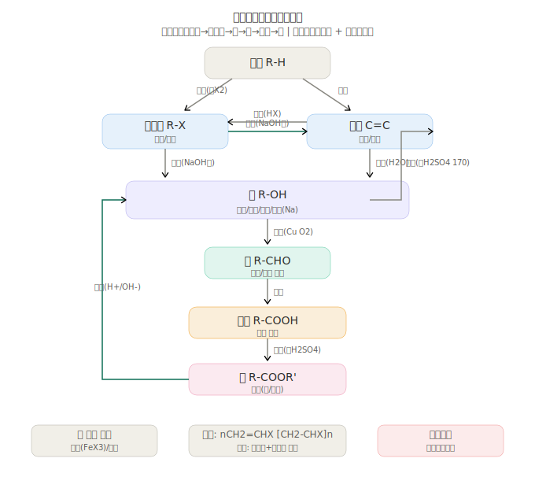

# 有机化学基础 物质转化专题 —— 官能团转化高速公路

> **核心视角**：有机化学不同于无机化学的"价态变化+物质类别转化"，有机化学的核心是**官能团转化**。本专题以官能团为节点，系统梳理所有转化路径、反应条件和高考高频考点。

---

## 有机官能团转化高速公路总图



---

## 一、核心转化链（纵轴）

### 1.1 烷烃 → 卤代烃

| 反应 | 条件 | 特点 |
|------|------|------|
| R-H + X₂ → R-X + HX | 光照（自由基取代） | 多步取代，产物复杂 |
| 选择性：3°H > 2°H > 1°H | — | 高考常考点 |

### 1.2 卤代烃 ⇌ 烯烃（经典可逆对）

| 方向 | 反应 | 条件 |
|------|------|------|
| 卤代烃→烯烃 | R-CH₂-CH₂-X + NaOH → R-CH=CH₂ + NaX + H₂O | **NaOH醇溶液,△** |
| 烯烃→卤代烃 | R-CH=CH₂ + HX → R-CHX-CH₃ | 马氏规则★ |

**马氏规则**：H加在含H多的C上，X加在含H少的C上（不对称烯烃）

### 1.3 卤代烃/烯烃 → 醇

| 路径 | 反应 | 条件 |
|------|------|------|
| 卤代烃水解 | R-X + NaOH → R-OH + NaX | **NaOH水溶液,△** |
| 烯烃水化 | R-CH=CH₂ + H₂O → R-CHOH-CH₃ | 催化剂,△（马氏规则） |

### 1.4 醇的双向转化

| 方向 | 反应 | 条件 | 温度 |
|------|------|------|------|
| 醇→烯烃 | C₂H₅OH → CH₂=CH₂ + H₂O | 浓H₂SO₄ | **170°C**★ |
| 醇→醚 | 2C₂H₅OH → C₂H₅OC₂H₅ + H₂O | 浓H₂SO₄ | **140°C**★ |
| 醇→醛 | RCH₂OH + CuO → RCHO + Cu + H₂O | Cu/Ag催化,△ | — |
| 醇→酮 | R₂CHOH + CuO → R₂CO + Cu + H₂O | Cu/Ag催化,△ | — |

**口诀**："醇消170醚140，醇氧化铜加热成醛酮"

### 1.5 醇 → 醛 → 羧酸（氧化链）

```
伯醇(1°醇) →(Cu,△) 醛 →(氧化) 羧酸
仲醇(2°醇) →(Cu,△) 酮（不再被氧化）
叔醇(3°醇) → 不被氧化（无α-H）
```

| 步骤 | 氧化剂 | 现象 |
|------|--------|------|
| 醇→醛 | CuO/Cu+O₂ | Cu由黑变红 |
| 醛→羧酸 | KMnO₄/K₂Cr₂O₇ | KMnO₄褪色 |
| 检验醛基 | 银氨溶液 / 新制Cu(OH)₂ | Ag镜 / Cu₂O砖红↓ |

### 1.6 羧酸 → 酯（可逆反应）

| 方向 | 条件 | 特点 |
|------|------|------|
| 酯化（正向） | 浓H₂SO₄,△ | 浓H₂SO₄吸水和催化 |
| 水解（酸性） | H⁺,△ | 可逆，不完全 |
| 水解（碱性/皂化） | NaOH,△ | **不可逆**，生成羧酸盐★ |

---

## 二、关键可逆对总结

| 可逆对 | 正向条件 | 逆向条件 | 高考频率 |
|--------|---------|---------|---------|
| 醇 ⇌ 烯烃 | 浓H₂SO₄,170°C | H₂O,催化剂 | ★★★ |
| 醇+酸 ⇌ 酯+水 | 浓H₂SO₄,△ | H⁺或OH⁻,△ | ★★★ |
| 卤代烃 ⇌ 醇 | NaOH水溶液,△ | HX | ★★ |

---

## 三、特征反应速查

| 反应 | 试剂 | 现象 | 检验对象 |
|------|------|------|---------|
| 银镜反应★ | [Ag(NH₃)₂]OH,△ | 光亮的银镜 | 醛基(—CHO) |
| 斐林反应 | Cu(OH)₂+NaOH,△ | Cu₂O砖红色↓ | 醛基(脂肪醛) |
| 碘仿反应 | I₂+NaOH | CHI₃黄色↓ | CH₃CO—或CH₃CHOH— |
| 与Na反应 | Na | 气泡(H₂) | —OH(醇/酚/酸) |
| 与FeCl₃ | FeCl₃溶液 | 紫色 | 酚羟基(苯酚) |
| 使Br₂水褪色 | Br₂/CCl₄ | 褪色 | C=C / C≡C |
| 使KMnO₄褪色 | KMnO₄/H⁺ | 褪色 | C=C/C≡C/—CHO/苯同系物侧链 |

---

## 四、芳香烃转化链

```
苯(C₆H₆) →(Br₂/FeBr₃) 溴苯(C₆H₅Br)
          →(HNO₃/浓H₂SO₄) 硝基苯(C₆H₅NO₂)
              →(Fe+HCl还原) 苯胺(C₆H₅NH₂)

甲苯(C₆H₅CH₃) →(KMnO₄/H⁺) 苯甲酸(C₆H₅COOH)
```

**定位效应规律**：
- 邻对位定位基（—CH₃,—OH,—NH₂,—X）→ 新基团上邻位和对位
- 间位定位基（—NO₂,—COOH,—CHO,—SO₃H）→ 新基团上间位

---

## 五、高分子合成

| 类型 | 单体特征 | 反应 | 聚合物 |
|------|---------|------|--------|
| 加聚 | 含C=C | nCH₂=CHX → [CH₂-CHX]ₙ | PE/PVC/PS |
| 缩聚 | 含双官能团 | HO-R-COOH → [O-R-CO]ₙ+nH₂O | 聚酯/聚酰胺 |

**加聚 vs 缩聚判断**：
- 加聚：单体不饱和，聚合无小分子生成
- 缩聚：单体有双官能团，聚合有小分子(H₂O/HCl/NH₃)生成

---

## 六、高考有机合成解题框架

**逆合成分析法三步走**：
1. 比较原料和目标分子的**碳骨架变化**（增长/缩短/重排）
2. 比较**官能团变化**（引入/转化/保护）
3. 设计合成路线（选最短路径，用最熟悉的反应）

**碳链增长策略**：
- 格氏试剂法（R-MgX + 羰基化合物）
- 羟醛缩合（含α-H的醛→α,β-不饱和醛）
- 炔烃的烷基化（R-C≡C⁻Na⁺ + R'-X）
- Diels-Alder（共轭二烯+亲双烯体→六元环）

---

## 附录：互动练习

> 配合本专题进行自测练习，涵盖官能团转化、有机合成路线设计等核心题型。

<iframe src="./有机化学基础_互动练习.html" width="100%" height="3200" style="border: 1px solid #e0e0e0; border-radius: 8px;"></iframe>

> 如果上方 iframe 没有正常渲染，也可以[直接打开页面查看](./有机化学基础_互动练习.html)。
