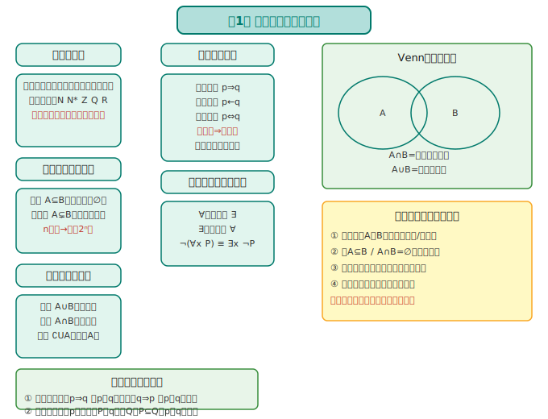
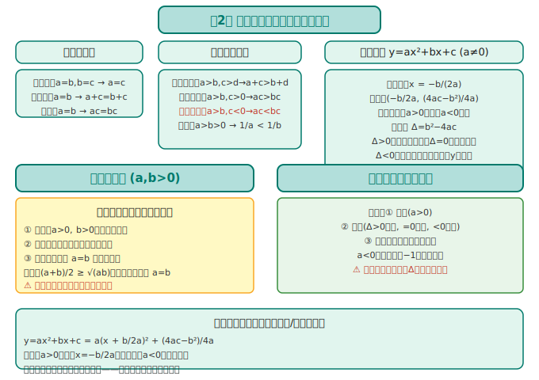
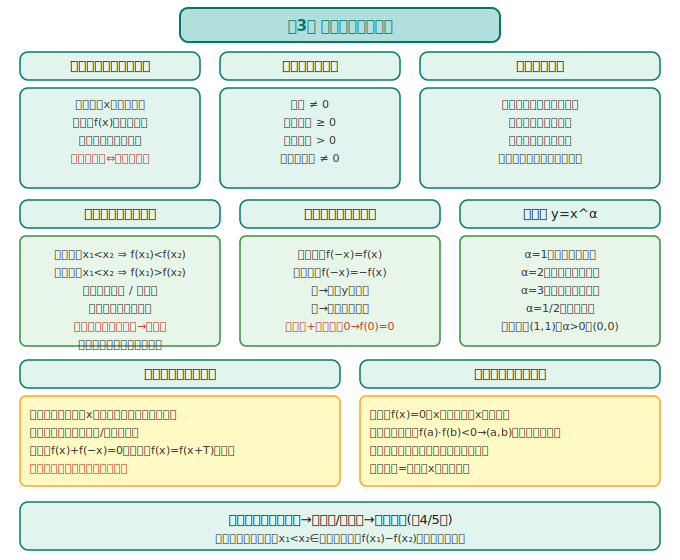
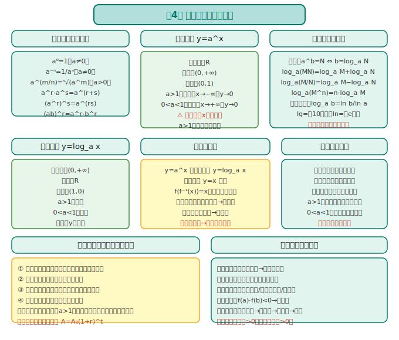
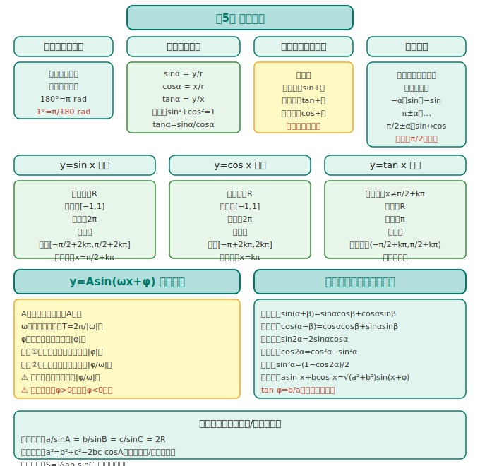

# 数学必修第一册 · 知识图谱

> 人教版 A 版（2019版）· 函数主线（上）

---

## 全书框架

```
必修第一册 = 预备知识 + 函数主线
                  │
    ┌─────────────┼─────────────┐
    │             │             │
  预备知识      三大函数      三角函数
 (第1~2章)    (第3~4章)      (第5章)
```

**核心线索**：从"数"到"函数"，从"一次/二次"到"指数/对数/三角"，建立函数观念和分析框架。

---

## 第1章：集合与常用逻辑用语



### 1.1 集合的概念

| 概念 | 要点 | 易错 |
|------|------|------|
| **元素特性** | 确定性、互异性、无序性 | 互异性是解题关键，参数求出后必须回代检验 |
| **常用数集** | N(自然数), N\*(正整数), Z(整数), Q(有理数), R(实数) | N 含 0，N\* 不含 0 |
| **表示法** | 列举法、描述法、Venn图 | 描述法中竖线前后不要混淆 |

### 1.2 集合间的基本关系

```
子集 A⊆B：A 中元素全在 B 中（A 可能等于 B）
真子集 A⫋B：A⊆B 且 A≠B
相等 A=B：A⊆B 且 B⊆A
空集 ∅：任何集合的子集，任何非空集合的真子集
```

> **易错提醒**：子集包含自身和空集。n 元素集合的子集个数 = 2^n，非空子集 = 2^n−1，真子集 = 2^n−1，非空真子集 = 2^n−2。

### 1.3 集合的基本运算

| 运算 | 符号 | 含义 | 口诀 |
|------|:---:|------|------|
| 并集 | A∪B | {x｜x∈A 或 x∈B} | 全都要 |
| 交集 | A∩B | {x｜x∈A 且 x∈B} | 共同点 |
| 补集 | ∁UA | {x｜x∈U 且 x∉A} | 不在A里 |

### 1.4 常用逻辑用语

| 概念 | 要点 |
|------|------|
| **充分条件** | p⇒q：p 是 q 的充分条件（有 p 就有 q） |
| **必要条件** | q⇒p：p 是 q 的必要条件（没 p 就没 q） |
| **充要条件** | p⇔q：互为充要 |
| **全称量词 ∀** | "任意"——否定变"存在"：¬(∀x P(x)) ≡ ∃x ¬P(x) |
| **存在量词 ∃** | "存在"——否定变"任意"：¬(∃x P(x)) ≡ ∀x ¬P(x) |

> **口诀**：全称否定换存在，存在否定换全称，谓词加个"不"。

---

## 第2章：一元二次函数、方程和不等式



### 2.1 等式与不等式的性质

| 性质 | 内容 | 注意事项 |
|------|------|----------|
| 传递性 | a>b, b>c ⇒ a>c | — |
| 加法 | a>b ⇒ a+c > b+c | 加减不改变方向 |
| 乘法 | a>b, c>0 ⇒ ac>bc | **c<0 时方向反转！** |
| 倒数 | a>b>0 ⇒ 1/a < 1/b | 同号正数才成立 |

### 2.2 基本不等式

**核心公式**：对于 a,b>0：
$$\frac{a+b}{2} \geq \sqrt{ab}$$

等号成立条件：a = b

**配凑技巧**：
- 和为定值，积有最大值：$ab \leq \left(\frac{a+b}{2}\right)^2$
- 积为定值，和有最小值：$a+b \geq 2\sqrt{ab}$

> **口诀**：一正二定三相等——先判断正数、再找定值、最后验证等号能否取到。

### 2.3 二次函数与一元二次方程/不等式

**三合一关系**：

| | 二次函数 y=ax²+bx+c | 方程 ax²+bx+c=0 | 不等式 ax²+bx+c>0 (a>0) |
|:---:|------|------|------|
| Δ>0 | 与 x 轴两交点 | 两不等实根 x₁<x₂ | x<x₁ 或 x>x₂ |
| Δ=0 | 与 x 轴一交点（切点） | 两相等实根 x₁=x₂ | x≠x₁ |
| Δ<0 | 在 x 轴上方 | 无实根 | R（全体实数） |

> **易错提醒**：解不等式先看 a 的正负！a<0 时两边乘 −1（方向反转），化成正的再解。

---

## 第3章：函数的概念与性质



### 3.1 函数的概念

| 要素 | 说明 |
|------|------|
| **定义域** | 自变量 x 的取值范围（自然定义域/实际意义定义域） |
| **值域** | 函数值 f(x) 的取值范围 |
| **对应关系** | 从 x 到 f(x) 的法则（解析式/图象/列表） |
| **三要素** | 定义域、值域、对应关系——两函数相等 ⇔ 三要素相同 |
| **同一函数** | 定义域相同 + 对应关系相同（值域自然相同） |

**常见定义域限制**：
- 分母 ≠ 0
- 偶次根号下 ≥ 0
- 对数真数 > 0
- 零次幂底数 ≠ 0

### 3.2 函数的表示法

解析法 → 列表法 → 图象法，三种表示灵活转化。

**分段函数**：不同区间不同解析式，注意：
- 分段点处左右分别代入
- 值域 = 各段值域的并集

### 3.3 函数的单调性

| 概念 | 定义 | 图象特征 |
|------|------|----------|
| 增函数 | x₁<x₂ ⇒ f(x₁)<f(x₂) | 从左到右上坡 |
| 减函数 | x₁<x₂ ⇒ f(x₁)>f(x₂) | 从左到右下坡 |

**判断方法**：
1. 定义法：设定 x₁<x₂，计算 f(x₁)−f(x₂) 符号
2. 图象法：看走势
3. 复合函数："同增异减"

> **口诀**：同增异减——内外单调性相同则复合为增，相异则减。

### 3.4 函数的奇偶性

| 类型 | 定义 | 图象特征 |
|------|------|----------|
| 偶函数 | f(−x)=f(x) | 关于 y 轴对称 |
| 奇函数 | f(−x)=−f(x) | 关于原点对称 |

**重要结论**：
- 奇函数若在 x=0 处有定义，则 f(0)=0
- 奇±奇=奇，偶±偶=偶，奇×奇=偶，奇×偶=奇
- 多项式：只有奇次项→奇函数；只有偶次项→偶函数

### 3.5 幂函数

**形式**：y = x^α（α 为常数）

**五类基本幂函数**：

| α | 图象特征 | 定义域 | 奇偶性 |
|:---:|------|------|:---:|
| 1 | 直线(一三象限平分线) | R | 奇 |
| 2 | 抛物线(开口向上) | R | 偶 |
| 3 | 立方抛物线(S形) | R | 奇 |
| 1/2 | 根号曲线(第一象限) | [0,+∞) | — |
| −1 | 双曲线 | (−∞,0)∪(0,+∞) | 奇 |

**公共性质**：
- 都过定点 (1,1)
- α>0 时过 (0,0)，在 (0,+∞) 上递增
- α<0 时在 (0,+∞) 上递减

---

## 第4章：指数函数与对数函数



### 4.1 指数与指数幂运算

| 概念 | 公式 |
|------|------|
| 正整数指数幂 | aⁿ = a·a·...·a（n个a） |
| 零指数幂 | a⁰ = 1（a≠0） |
| 负整数指数幂 | a⁻ⁿ = 1/aⁿ（a≠0） |
| 分数指数幂 | a^(m/n) = ⁿ√(a^m)（a>0） |

**运算性质**（a>0, b>0, r,s∈R）：
- a^r · a^s = a^(r+s)
- (a^r)^s = a^(rs)
- (ab)^r = a^r · b^r

### 4.2 指数函数 y=a^x

| a>1 | 0<a<1 |
|------|------|
| 单调递增 | 单调递减 |
| x→−∞ 时 y→0 | x→+∞ 时 y→0 |
| 过定点 (0,1) | 过定点 (0,1) |

**特性**：定义域 R，值域 (0,+∞)，恒过 (0,1)

### 4.3 对数与对数运算

**定义**：若 a^b = N（a>0, a≠1），则 b = log_a N

| 运算法则 | 公式 |
|------|------|
| 积的对数 | log_a(MN) = log_aM + log_aN |
| 商的对数 | log_a(M/N) = log_aM − log_aN |
| 幂的对数 | log_a(M^n) = n·log_aM |
| 换底公式 | log_a b = log_c b / log_c a |

**两个重要对数**：
- 常用对数：lg N = log_10 N
- 自然对数：ln N = log_e N（e≈2.71828...）

> **口诀**：积变和，商变差，指数提到前面来。

### 4.4 对数函数 y=log_a x

| a>1 | 0<a<1 |
|------|------|
| 单调递增 | 单调递减 |
| x→0⁺ 时 y→−∞ | x→0⁺ 时 y→+∞ |
| 过定点 (1,0) | 过定点 (1,0) |

**特性**：定义域 (0,+∞)，值域 R，恒过 (1,0)

### 4.5 指数函数与对数函数的关系

- 互为反函数：y=a^x ⇔ y=log_a x
- 图象关于 y=x 对称
- f(f⁻¹(x)) = x，f⁻¹(f(x)) = x（在定义域内）

### 4.6 函数的应用

**函数零点**：使 f(x)=0 的 x 值（方程的根，图象与 x 轴交点）

**零点存在性定理**：若 f(x) 在 [a,b] 上连续且 f(a)·f(b)<0，则 (a,b) 内至少有一个零点。

**二分法**：不断取中点缩小区间，逼近零点。

---

## 第5章：三角函数



### 5.1 任意角和弧度制

| 概念 | 要点 |
|------|------|
| 正角 | 逆时针旋转 |
| 负角 | 顺时针旋转 |
| 零角 | 没有旋转 |
| 象限角 | 终边所在象限（注意轴线角：终边在坐标轴上） |
| 弧度制 | 180° = π rad，1° = π/180 rad，1 rad ≈ 57.3° |

> **口诀**：度化弧度乘以 π/180，弧度化度乘以 180/π。

### 5.2 三角函数的概念

**单位圆定义**：

| 函数 | 定义 | 符号分布 |
|:---:|------|------|
| sin α | y/r（r=1时=y） | 一三正，二四负（看y） |
| cos α | x/r（r=1时=x） | 一四正，二三负（看x） |
| tan α | y/x | 一三正，二四负 |

> **口诀**：一全正，二正弦，三正切，四余弦——第一象限全正，第二象限只有sin正，第三象限只有tan正，第四象限只有cos正。

**同角关系**：
- sin²α + cos²α = 1
- tan α = sin α / cos α

### 5.3 诱导公式

| 公式 | sin | cos | tan |
|------|:---:|:---:|:---:|
| −α | −sin α | cos α | −tan α |
| π−α | sin α | −cos α | −tan α |
| π+α | −sin α | −cos α | tan α |
| 2π−α | −sin α | cos α | −tan α |
| π/2−α | cos α | sin α | cot α |
| π/2+α | cos α | −sin α | −cot α |

> **口诀**：奇变偶不变，符号看象限。
> - "奇偶"指 π/2 的倍数：奇数次(π/2, 3π/2)函数名变(sin↔cos, tan↔cot)，偶数次(π, 2π)函数名不变。
> - "符号"看原函数在对应象限的符号。

### 5.4 三角函数的图象与性质

#### 正弦函数 y=sin x

| 性质 | 值 |
|------|------|
| 定义域 | R |
| 值域 | [−1, 1] |
| 周期 | 2π |
| 奇偶性 | 奇函数 |
| 增区间 | [−π/2+2kπ, π/2+2kπ] |
| 减区间 | [π/2+2kπ, 3π/2+2kπ] |
| 对称轴 | x = π/2 + kπ |
| 对称中心 | (kπ, 0) |

#### 余弦函数 y=cos x

| 性质 | 值 |
|------|------|
| 定义域 | R |
| 值域 | [−1, 1] |
| 周期 | 2π |
| 奇偶性 | 偶函数 |
| 增区间 | [−π+2kπ, 2kπ] |
| 减区间 | [2kπ, π+2kπ] |
| 对称轴 | x = kπ |
| 对称中心 | (π/2+kπ, 0) |

#### 正切函数 y=tan x

| 性质 | 值 |
|------|------|
| 定义域 | {x｜x≠π/2+kπ} |
| 值域 | R |
| 周期 | π |
| 奇偶性 | 奇函数 |
| 增区间 | (−π/2+kπ, π/2+kπ) |

### 5.5 y=Asin(ωx+φ) 的图象变换

**参数含义**：
- A：振幅（纵向伸缩，|A| 倍）
- ω：角频率（横向伸缩，周期 T=2π/|ω|）
- φ：初相（横向平移，左加右减）

**变换步骤**（两种路径）：
1. 先平移后伸缩：y=sin x → y=sin(x+φ) → y=sin(ωx+φ) → y=Asin(ωx+φ)
2. 先伸缩后平移：y=sin x → y=sin ωx → y=sin[ω(x+φ/ω)] → y=Asin(ωx+φ)

> **易错提醒**：先伸缩后平移时，平移量是 |φ/ω|，不是 |φ|！

### 5.6 三角恒等变换

| 公式 | 内容 |
|------|------|
| 两角和 sin | sin(α+β) = sinα·cosβ + cosα·sinβ |
| 两角和 cos | cos(α+β) = cosα·cosβ − sinα·sinβ |
| 两角差 sin | sin(α−β) = sinα·cosβ − cosα·sinβ |
| 两角差 cos | cos(α−β) = cosα·cosβ + sinα·sinβ |
| 两角和/差 tan | tan(α±β) = (tanα±tanβ)/(1∓tanα·tanβ) |
| 二倍角 sin | sin 2α = 2 sinα cosα |
| 二倍角 cos | cos 2α = cos²α−sin²α = 2cos²α−1 = 1−2sin²α |
| 二倍角 tan | tan 2α = 2tanα/(1−tan²α) |
| 降幂 sin² | sin²α = (1−cos2α)/2 |
| 降幂 cos² | cos²α = (1+cos2α)/2 |
| 辅助角 | a sin x + b cos x = √(a²+b²) sin(x+φ)，其中 tan φ = b/a |

---

## 📊 必修一各章关联图

```
第1章(集合逻辑) → 第2章(不等式) → 第3章(函数概念) → 第4章(指对函数)
                                                    ↘ 第5章(三角函数)
                                                    
第3章是核心枢纽：函数概念→具体函数(第4、5章)
第2章的不等式为第3章单调性证明和第4章解不等式打基础
第1章的逻辑用语贯穿始终（充分必要条件的判断）
```

---

> 📝 最后更新：2026-05-31
