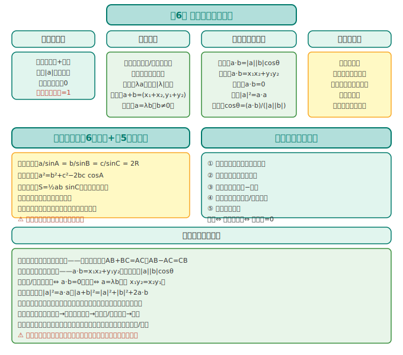
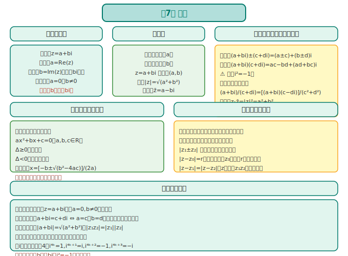
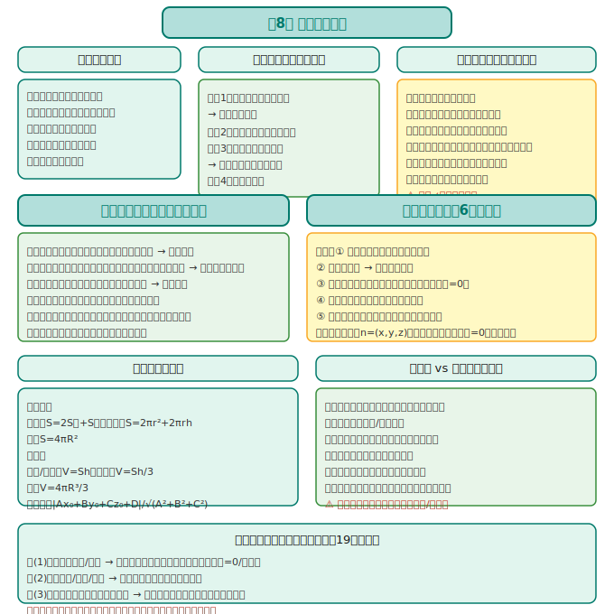
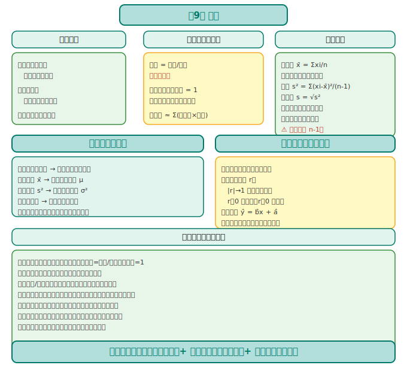
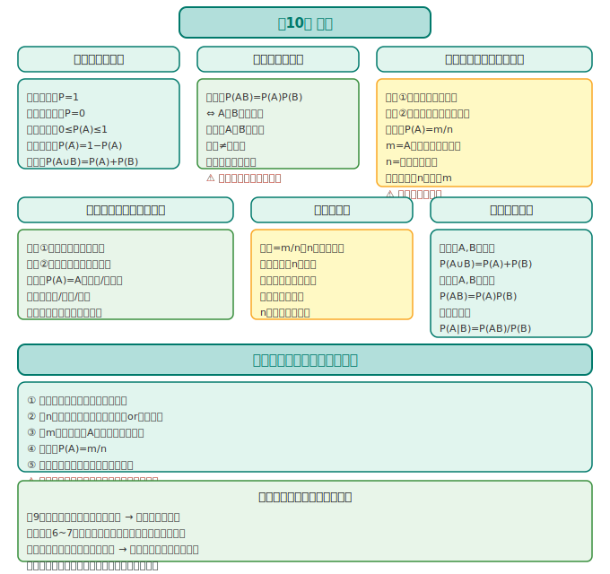

# 数学必修第二册 · 知识图谱

> 人教版 A 版（2019版）· 几何与统计主线

---

## 全书框架

```
必修第二册 = 向量 + 几何 + 统计概率
                  │
      ┌───────────┼───────────┐
      │           │           │
    平面向量     立体几何      统计与概率
   (第6章)    (第8章)    (第9~10章)
      │
    复数(第7章) —— 向量扩展
```

**核心线索**：向量是贯穿平面→空间→复数的统一工具；几何培养空间想象；统计概率是数据处理的基础。

---

## 第6章：平面向量及其应用



### 6.1 平面向量的概念

| 概念 | 定义 | 注意 |
|------|------|------|
| **向量** | 既有大小又有方向的量 | 记作 **a** 或有向线段 AB |
| **模** | 向量的长度，记作 \|**a**\| | 模为 0 的向量是零向量 **0** |
| **单位向量** | 模为 1 的向量 | 与 **a** 同方向的单位向量 = **a**/\|**a**\| |
| **相等向量** | 大小相等、方向相同 | **a**=**b** ⇔ 模等且方向同 |
| **相反向量** | 大小相等、方向相反 | **a** 的相反向量记作 −**a** |

> **区分**：向量（有方向）vs 数量（无方向）。平行向量=共线向量。

### 6.2 向量的线性运算

| 运算 | 法则 | 坐标运算（若 **a**=(x₁,y₁), **b**=(x₂,y₂)） |
|------|------|------|
| **加法** | 三角形法则、平行四边形法则 | **a**+**b**=(x₁+x₂, y₁+y₂) |
| **减法** | 三角形法则（终点减起点） | **a**−**b**=(x₁−x₂, y₁−y₂) |
| **数乘** | λ**a**：模变\|λ\|倍，方向由 λ 符号决定 | λ**a**=(λx₁, λy₁) |

**重要结论**：
- **a**+**b**=**b**+**a**（加法交换律）
- (λμ)**a**=λ(μ**a**)（结合律）
- 共线定理：**a** 与 **b**（**b**≠**0**）共线 ⇔ 存在唯一 λ 使 **a**=λ**b**

### 6.3 平面向量的数量积

**定义**：**a**·**b** = \|**a**\|·\|**b**\|·cosθ（θ 为 **a** 与 **b** 的夹角）

| 性质 | 公式 |
|------|------|
| 坐标公式 | **a**·**b** = x₁x₂ + y₁y₂ |
| 模的公式 | \|**a**\|² = **a**·**a** = x₁²+y₁² |
| 夹角公式 | cosθ = (**a**·**b**)/(\|**a**\|·\|**b**\|) |
| 垂直条件 | **a**⊥**b** ⇔ **a**·**b**=0 ⇔ x₁x₂+y₁y₂=0 |

> **口诀**：数量积=对应坐标相乘再相加。垂直⇔数量积为 0。

### 6.4 向量的应用

- **几何证明**：用向量法证明平行、垂直、长度关系
- **物理应用**：力、速度、位移的合成与分解
- **解三角形**：利用向量数量积推导余弦定理

---

## 第7章：复数



### 7.1 复数的概念

**定义**：形如 z=a+bi（a,b∈R）的数，其中 i²=−1。

| 概念 | 含义 |
|------|------|
| **实部** | a = Re(z) |
| **虚部** | b = Im(z)（注意：虚部是 b，不是 bi！） |
| **虚数** | b≠0 的复数 |
| **纯虚数** | a=0 且 b≠0（即 z=bi） |
| **复数相等** | a+bi = c+di ⇔ a=c 且 b=d |

**复平面**：横轴（实轴）表示实部，纵轴（虚轴）表示虚部。z=a+bi 对应点 (a,b)。

### 7.2 复数的运算

| 运算 | 法则 | 坐标表示 |
|------|------|------|
| **加减** | (a+bi)±(c+di)=(a±c)+(b±d)i | 对应分量相加减 |
| **乘法** | (a+bi)(c+di)=ac−bd+(ad+bc)i | 注意 i²=−1 |
| **除法** | (a+bi)/(c+di)，分母实数化 | 分子分母同乘共轭复数 |
| **共轭复数** | z=a+bi 的共轭记作 **z̄**=a−bi | z·**z̄**=\|z\|²=a²+b² |

> **分母实数化技巧**：(a+bi)/(c+di) = (a+bi)(c−di)/[(c+di)(c−di)] = ... 分母变成 c²+d²（实数）。

### 7.3 复数的三角表示（选学/拓展）

- **模**：\|z\|=√(a²+b²)（复平面上点到原点的距离）
- **辐角**：与正实轴的夹角 θ（满足 cosθ=a/\|z\|，sinθ=b/\|z\|）
- **三角形式**：z=\|z\|(cosθ+isinθ)
- **欧拉公式**：e^(iθ)=cosθ+isinθ（拓展，高考有时涉及）

---

## 第8章：立体几何初步



### 8.1 基本立体图形

| 图形 | 结构特征 | 侧面展开 |
|------|------|------|
| **棱柱** | 两底面全等且平行，侧棱平行且相等 | 平行四边形拼接 |
| **棱锥** | 底面多边形，顶点投影在底面内 | 三角形拼接 |
| **棱台** | 棱锥被平行于底面的平面所截 | — |
| **圆柱** | 矩形绕一边旋转而成 | 矩形 |
| **圆锥** | 直角三角形绕直角边旋转而成 | 扇形 |
| **圆台** | 直角梯形绕垂直底边的腰旋转而成 | 扇环 |
| **球** | 半圆绕直径旋转而成 | — |

### 8.2 平面的基本性质（公理体系）

| 公理 | 内容 | 用途 |
|------|------|------|
| **公理1** | 如果一条直线上的两点在一个平面内，那么这条直线在此平面内 | 判断直线是否在平面内 |
| **公理2** | 过不在一条直线上的三点，有且只有一个平面 | 确定平面 |
| **公理3** | 如果两个不重合的平面有一个公共点，那么它们有且只有一条过该点的公共直线 | 判断两平面相交 |
| **公理4** | 平行于同一条直线的两条直线平行（平行线的传递性） | 证明线线平行 |

### 8.3 空间点、直线、平面的位置关系

#### 直线与直线

| 位置 | 判定 | 性质 |
|------|------|------|
| 平行 | 公理4 / 中位线 / 平行四边形对边 | 无公共点，共面 |
| 相交 | 共面且有唯一公共点 | — |
| 异面 | 不同在任何一个平面内（既不平行也不相交） | 不共面 |

#### 直线与平面的位置关系

| 位置 | 判定定理 | 性质 |
|------|------|------|
| 线面平行 | 平面外一条直线与此平面内一条直线平行 | 该直线与此平面平行 |
| 线面垂直 | 一条直线垂直于平面内两条相交直线 | 垂直于平面内任意直线 |

#### 平面与平面的位置关系

| 位置 | 判定 | 性质 |
|------|------|------|
| 面面平行 | 一个平面内两条相交直线分别平行于另一平面 | 交线平行、截面与底面平行 |
| 面面垂直 | 一个平面过另一个平面的垂线 | 在一个平面内作交线的垂线，则该垂线垂直于另一平面 |

### 8.4 空间向量的应用（与第6章呼应）

- **法向量**：垂直于平面的向量，用来判断平行/垂直/求二面角
- **空间向量法解立体几何**：建系→求点的坐标→求向量→利用数量积判垂直/求夹角
- **距离公式**：点 P(x₀,y₀,z₀) 到平面 Ax+By+Cz+D=0 的距离 d=\|Ax₀+By₀+Cz₀+D\|/√(A²+B²+C²)

> **口诀**：立体几何两法宝——综合法（逻辑推理）+ 向量法（坐标运算）。向量法更程序化，不易漏步骤。

---

## 第9章：统计



### 9.1 随机抽样

| 抽样方法 | 特点 | 适用场景 |
|---------|------|------|
| **简单随机抽样** | 每个个体被抽到的概率相等 | 总体容量小、无层次差异 |
| **分层抽样** | 先分层，再在各层内简单随机抽样 | 总体有明显分层结构 |
| **系统抽样** | 等距抽取（如每 10 个抽 1 个） | 总体容量大、无周期规律 |

> **注意**：随机抽样的关键是"每个个体被抽到的概率相等"，保证样本代表性。

### 9.2 用样本估计总体

| 图形 | 用途 |
|------|------|
| **频率分布直方图** | 估计总体分布形状（纵轴=频率/组距） |
| **折线图** | 观察变化趋势 |
| **扇形图** | 观察各部分占比 |
| **箱线图** | 观察中位数、四分位数、异常值 |

**数字特征**：

| 特征 | 公式/含义 | 估计对象 |
|------|------|------|
| **平均数** | x̄ = (1/n)Σxi | 总体均值 μ |
| **中位数** | 排序后中间位置的数 | 总体中位数 |
| **方差** | s² = (1/(n−1))Σ(xi−x̄)² | 总体方差 σ²（衡量离散程度） |
| **标准差** | s = √s² | 总体标准差 σ |

> **易错提醒**：频率分布直方图的纵轴是"频率/组距"，不是频率！所有矩形面积之和=1。

### 9.3 两个变量的线性相关

- **散点图**：观察两个变量是否线性相关
- **样本相关系数 r**：衡量线性相关程度
  - \|r\| 越接近 1，线性相关程度越强
  - r>0 为正相关，r<0 为负相关
  - \|r\| 接近 0 则说明线性相关性弱
- **回归直线**：ŷ = b̂x + â（最小二乘法估计）

---

## 第10章：概率



### 10.1 随机事件与概率

| 概念 | 定义 |
|------|------|
| **随机事件** | 样本空间的子集 |
| **必然事件** | 一定发生的事件（概率=1） |
| **不可能事件** | 一定不发生的事件（概率=0） |
| **概率** | 衡量事件发生可能性大小的数，0≤P(A)≤1 |

**概率的性质**：
- P(Ω)=1，P(∅)=0
- 若 A∩B=∅（互斥），则 P(A∪B)=P(A)+P(B)
- P(Ā)=1−P(A)（对立事件）

### 10.2 事件的相互独立性

- **定义**：P(AB)=P(A)·P(B) ⇔ 事件 A 与 B 相互独立
- **判定**：若 A 与 B 独立，则 A 与 B̄、Ā 与 B、Ā 与 B̄ 也相互独立
- **乘法法则**：独立事件同时发生的概率 = 各事件概率的乘积

> **口诀**：独立看乘积——P(AB)=P(A)P(B) 成立则独立。

### 10.3 频率与概率的关系

- **频率**：在 n 次试验中事件 A 发生的次数 m，频率 = m/n
- **大数定律**：当试验次数 n 很大时，频率在概率附近摆动，且稳定于概率
- **频率估计概率**：试验次数足够多时，可以用频率估计概率

### 10.4 古典概型与几何概型

| 概型 | 特征 | 概率公式 |
|------|------|------|
| **古典概型** | ① 试验中所有可能出现的基本事件只有有限个；② 每个基本事件出现的可能性相等 | P(A)=A包含的基本事件数/基本事件总数 |
| **几何概型** | ① 试验中所有可能的结果（基本事件）有无限多个；② 每个基本事件出现的可能性相等 | P(A)=构成事件A的区域长度(面积或体积)/试验的全部结果所构成的区域长度(面积或体积) |

> **解题模板（古典概型）**：① 确定基本事件总数 n；② 确定事件 A 包含的基本事件数 m；③ P(A)=m/n。

---

## 📊 必修二各章关联图

```
第6章(向量) ← 工具章节，为第8章(立体几何)空间向量法打基础
                    ↓
第7章(复数) ← 向量概念的推广（二维→复平面）
                    ↓
第8章(立体几何) ← 综合法 + 向量法（第6章的应用）
                    ↓
第9章(统计) ← 数据处理，与第10章并列
第10章(概率) ← 随机思维，为选必三（随机变量）打基础
```

---

> 📝 最后更新：2026-05-31
