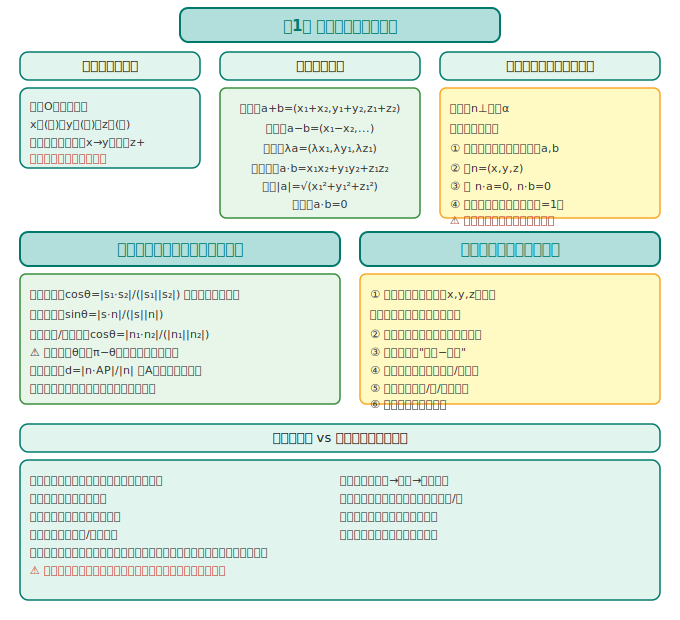
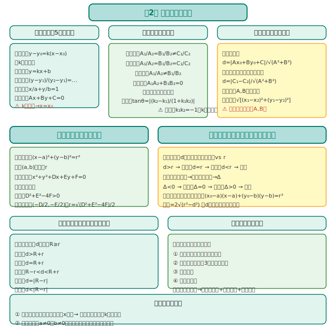
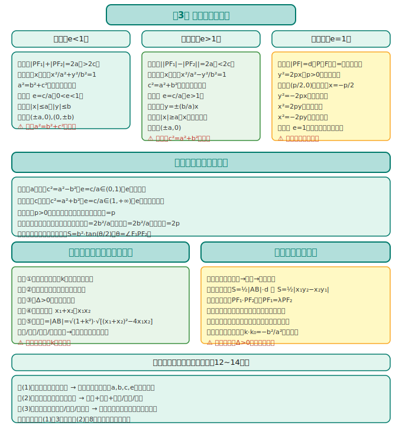

# 数学选择性必修第一册 · 知识图谱

> 人教版 A 版（2019版）· 解析几何主线

---

## 全书框架

```
选必第一册 = 空间向量 + 平面解析几何
                  │
      ┌───────┼────────┐
      │                │
   空间向量        平面解析几何
  (第1章)      (第2~3章)
                  │
            ┌─────┴─────┐
           直线和圆      圆锥曲线
          (第2章)     (第3章)
```

**核心线索**：向量工具从平面延伸到空间；解析几何核心思想——用代数方法研究几何问题（坐标化）。

---

## 第1章：空间向量与立体几何



### 1.1 空间直角坐标系

| 概念 | 含义 |
|------|------|
| **原点** | 三条互相垂直的数轴交点 O |
| **坐标轴** | x轴（横），y轴（纵），z轴（竖） |
| **坐标** | 点 P 对应有序三元组 (x, y, z) |
| **右手系** | 右手四指从 x 到 y，拇指指向 z 正方向 |

> **建系技巧**：选互相垂直的三条直线为坐标轴，使尽量多的点坐标简单（含 0 或 1）。

### 1.2 空间向量的运算

空间向量 **a**=(x₁,y₁,z₁)，**b**=(x₂,y₂,z₂)

| 运算 | 坐标公式 |
|------|---------|
| **加法** | **a**+**b**=(x₁+x₂, y₁+y₂, z₁+z₂) |
| **减法** | **a**−**b**=(x₁−x₂, y₁−y₂, z₁−z₂) |
| **数乘** | λ**a**=(λx₁, λy₁, λz₁) |
| **数量积** | **a**·**b**=x₁x₂+y₁y₂+z₁z₂ |
| **模** | \|**a**\|=√(x₁²+y₁²+z₁²) |
| **夹角** | cosθ=(**a**·**b**)/(\|**a**\|·\|**b**\|) |
| **垂直** | **a**⊥**b** ⇔ **a**·**b**=0 ⇔ x₁x₂+y₁y₂+z₁z₂=0 |

### 1.3 空间向量的应用（立体几何向量法）

#### 直线的方向向量

直线 l 的方向向量 **s**=(m,n,p)，则直线 l 上任意点 P 满足：
$$\vec{OP} = \vec{OA} + t\textbf{s} \quad (t \in \mathbb{R})$$

#### 平面的法向量

平面 α 的法向量 **n**=(A,B,C)，满足 **n**⊥**a** 对任意 **a**⊂α 成立。

**求法向量步骤**：
1. 在平面内取两个不共线向量 **a**, **b**
2. 设 **n**=(x,y,z)
3. 解方程组：**n**·**a**=0，**n**·**b**=0
4. 取一组简单解（令某个变量=1）

#### 空间角与距离

| 量 | 计算方法 |
|------|---------|
| **线线角** | cosθ=\|**s₁**·**s₂**\|/(\|**s₁**\|·\|**s₂**\|)（取绝对值——锐角） |
| **线面角** | sinθ=\|**s**·**n**\|/(\|**s**\|·\|**n**\|) |
| **面面角（二面角）** | cosθ=\|**n₁**·**n₂**\|/(\|**n₁**\|·\|**n₂**\|)（注意方向——锐/钝） |
| **点面距** | d=\|**n**·**AP**\|/\|**n**\|（A为平面上一点） |

> **易错提醒**：二面角可能是钝角！用向量法算出 cosθ 后，需判断是取 θ 还是 π−θ（观察法向量的方向）。

---

## 第2章：直线和圆的方程



### 2.1 直线的方程

| 形式 | 方程 | 适用场景 |
|------|------|---------|
| **点斜式** | y−y₀=k(x−x₀) | 已知点和斜率（k存在） |
| **斜截式** | y=kx+b | 已知斜率和截距 |
| **两点式** | (y−y₁)/(y₂−y₁)=(x−x₁)/(x₂−x₁) | 已知两点（x₁≠x₂,y₁≠y₂） |
| **截距式** | x/a+y/b=1 | 已知横、纵截距（a≠0,b≠0） |
| **一般式** | Ax+By+C=0 | 任何直线（A,B不同时为0） |

> **斜率不存在**：直线垂直于 x 轴，方程 x=x₀（不能用点斜式）。

### 2.2 两条直线的位置关系

| 关系 | 判定（一般式） |
|------|---------|
| **平行** | A₁/A₂=B₁/B₂≠C₁/C₂（比例相等但不全等） |
| **重合** | A₁/A₂=B₁/B₂=C₁/C₂（三者比例全等） |
| **相交** | A₁/A₂≠B₁/B₂ |
| **垂直** | A₁A₂+B₁B₂=0（法向量数量积=0） |

**交点**：联立两条直线方程，解方程组。

**距离公式**：
- 点 P(x₀,y₀) 到直线 Ax+By+C=0 的距离：d=\|Ax₀+By₀+C\|/√(A²+B²)
- 两条平行线间的距离：d=\|C₁−C₂\|/√(A²+B²)（先化成 A,B 相同）

### 2.3 圆的方程

| 形式 | 方程 | 特征 |
|------|------|------|
| **标准式** | (x−a)²+(y−b)²=r² | 圆心(a,b)，半径 r |
| **一般式** | x²+y²+Dx+Ey+F=0 | 配方得标准式；条件：D²+E²−4F>0 |

**圆心和半径求法**：一般式配方：(x+D/2)²+(y+E/2)²=(D²+E²−4F)/4

### 2.4 直线与圆的位置关系

| 关系 | 判定方法1（几何法） | 判定方法2（代数法） |
|------|---------|---------|
| **相离** | d>r（d为圆心到直线距离） | Δ<0 |
| **相切** | d=r | Δ=0 |
| **相交** | d<r | Δ>0 |

> **切线方程**：过圆 (x−a)²+(y−b)²=r² 上一点 (x₀,y₀) 的切线：(x₀−a)(x−a)+(y₀−b)(y−b)=r²

### 2.5 圆与圆的位置关系

| 关系 | 判定（几何法） |
|------|---------|
| **外离** | d>R+r |
| **外切** | d=R+r |
| **相交** | R−r<d<R+r |
| **内切** | d=\|R−r\| |
| **内含** | d<\|R−r\| |

（d 为两圆圆心距离，R,r 为两圆半径）

---

## 第3章：圆锥曲线的方程



### 3.1 椭圆

**定义**：平面内与两个定点 F₁,F₂ 的距离之和等于常数（大于\|F₁F₂\|）的点的轨迹。

| 焦点位置 | 标准方程 | a,b,c 关系 | 焦点坐标 |
|---------|---------|---------|---------|
| **x轴** | x²/a²+y²/b²=1（a>b>0） | c²=a²−b² | F₁(−c,0),F₂(c,0) |
| **y轴** | x²/b²+y²/a²=1（a>b>0） | c²=a²−b² | F₁(0,−c),F₂(0,c) |

**性质**：
- 范围：\|x\|≤a，\|y\|≤b
- 对称性：关于 x 轴、y 轴、原点对称
- 顶点：(±a,0),(0,±b)
- 离心率：e=c/a（0<e<1，e 越大椭圆越扁）

### 3.2 双曲线

**定义**：平面内与两个定点 F₁,F₂ 的距离之差的绝对值等于常数（小于\|F₁F₂\|）的点的轨迹。

| 焦点位置 | 标准方程 | a,b,c 关系 | 焦点坐标 |
|---------|---------|---------|---------|
| **x轴** | x²/a²−y²/b²=1（a,b>0） | c²=a²+b² | F₁(−c,0),F₂(c,0) |
| **y轴** | y²/a²−x²/b²=1（a,b>0） | c²=a²+b² | F₁(0,−c),F₂(0,c) |

**性质**：
- 范围：\|x\|≥a（x轴双曲线）；\|y\|≥a（y轴双曲线）
- 渐近线：y=±(b/a)x（x轴双曲线）；y=±(a/b)x（y轴双曲线）
- 离心率：e=c/a（e>1，e 越大开口越大）

> **口诀**：椭圆 c²=a²−b²（减）；双曲线 c²=a²+b²（加）。别搞混！

### 3.3 抛物线

**定义**：平面内与一个定点 F 和一条定直线 l（F∉l）距离相等的点的轨迹。

| 开口方向 | 标准方程 | 焦点坐标 | 准线方程 |
|---------|---------|---------|---------|
| **右** | y²=2px（p>0） | F(p/2,0) | x=−p/2 |
| **左** | y²=−2px（p>0） | F(−p/2,0) | x=p/2 |
| **上** | x²=2py（p>0） | F(0,p/2) | y=−p/2 |
| **下** | x²=−2py（p>0） | F(0,−p/2) | y=p/2 |

**性质**：
- 离心率：e=1（所有抛物线 e 相同）
- 通径：过焦点垂直对称轴的弦，长度=2p

### 3.4 直线与圆锥曲线（解析几何大题核心）

**联立方程法**（通用解法）：
1. 设直线方程（注意斜率不存在情况！）
2. 联立直线与圆锥曲线方程，消元得一元二次方程
3. 令 Δ>0（相交条件），用韦达定理求 x₁+x₂，x₁x₂
4. 用弦长公式：\|AB\|=√(1+k²)·\|x₁−x₂\|=√(1+k²)·√[(x₁+x₂)²−4x₁x₂]

> **易错提醒**：设直线方程时，一定要讨论斜率不存在的情况！很多题目答案有两个，漏了斜率不存在就少一个解。

---

## 📊 选必一各章关联图

```
第1章(空间向量) → 立体几何向量法（与必修二第8章呼应）
                      ↓
第2章(直线与圆) → 解析几何基础（坐标法思想）
                      ↓
第3章(圆锥曲线) → 解析几何综合（联立方程+韦达定理）
                      ↓
高考解答题第20/21题：圆锥曲线综合（12~14分）
```

---

> 📝 最后更新：2026-05-31
