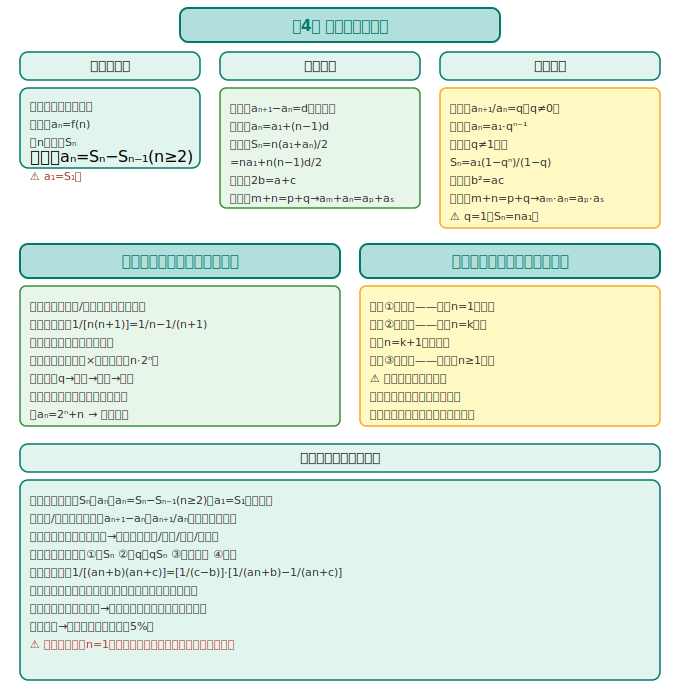
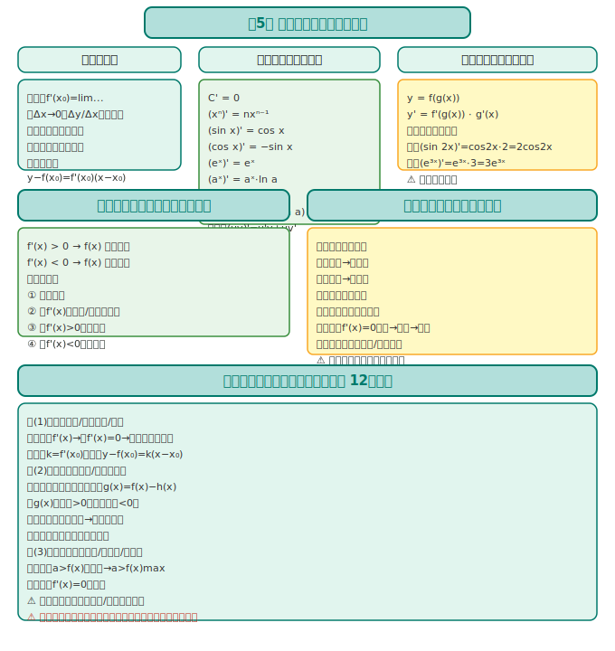

# 数学选择性必修第二册 · 知识图谱

> 人教版 A 版（2019版）· 数列与导数主线

---

## 全书框架

```
选必第二册 = 数列 + 导数
                  │
      ┌───────┼────────┐
      │                    │
    数列              导数
  (第4章)          (第5章)
  │
  ├─ 等差/等比
  ├─ 数列求和
  └─ 数学归纳法
                        │
                  导数应用
                 ├─ 单调性
                 ├─ 极值/最值
                 └─ 实际建模
```

**核心线索**：数列是"离散的函数"；导数是"函数的瞬时变化率"——两者都是研究变化规律的核心工具。

---

## 第4章：数列



### 4.1 数列的概念

| 概念 | 定义 |
|------|------|
| **数列** | 按照一定顺序排列的一列数 a₁, a₂, ..., aₙ, ... |
| **通项公式** | aₙ = f(n)，表示第 n 项与 n 的关系 |
| **递推公式** | 用前几项表示后一项（如 aₙ₊₁ = aₙ + d） |
| **前 n 项和** | Sₙ = a₁ + a₂ + ... + aₙ |

> **关系**：Sₙ 与 aₙ 的关系：aₙ = Sₙ − Sₙ₋₁（n≥2）；a₁ = S₁。

### 4.2 等差数列

**定义**：aₙ₊₁ − aₙ = d（常数 d 为公差）

| 公式 | 内容 |
|------|------|
| **通项** | aₙ = a₁ + (n−1)d |
| **前 n 项和** | Sₙ = n(a₁+aₙ)/2 = na₁ + n(n−1)d/2 |
| **中项** | a, b, c 成等差 ⇔ 2b = a + c |
| **性质** | m+n = p+q ⇔ aₘ + aₙ = aₚ + aₛ |

> **口诀**：等差通项是直线（关于 n 的一次函数）；Sₙ 是关于 n 的二次函数（无常数项）。

### 4.3 等比数列

**定义**：aₙ₊₁ / aₙ = q（常数 q≠0 为公比）

| 公式 | 内容 |
|------|------|
| **通项** | aₙ = a₁·qⁿ⁻¹ |
| **前 n 项和** | q≠1 时，Sₙ = a₁(1−qⁿ)/(1−q) = (a₁−aₙq)/(1−q) |
| **中项** | a, b, c 成等比 ⇔ b² = ac |
| **性质** | m+n = p+q ⇔ aₘ·aₙ = aₚ·aₛ |

> **易错提醒**：q=1 时，Sₙ = na₁（不能用分式公式，分母为 0！）。

### 4.4 数列求和

| 方法 | 适用场景 | 举例 |
|------|---------|------|
| **公式法** | 等差/等比数列 | 直接用 Sₙ 公式 |
| **裂项相消** | 分式型（如 1/[n(n+1)]） | 1/[n(n+1)] = 1/n − 1/(n+1) |
| **错位相减** | 等差×等比型（如 n·2ⁿ） | 乘 q 后错位相减 |
| **分组求和** | 数列可拆成几部分 | aₙ = 2ⁿ + n → 分别求和 |

> **裂项公式速记**：1/[(an+b)(an+c)] = [1/(c−b)]·[1/(an+b)−1/(an+c)]

### 4.5 数学归纳法

**步骤**：
1. **奠基**：验证 n=1（或 n=n₀）时命题成立
2. **归纳**：假设 n=k 时成立，证明 n=k+1 时也成立
3. **结论**：对任意 n≥1（或 n≥n₀）命题成立

> **易错提醒**：归纳步骤中，必须"用上"归纳假设，否则不完整。

---

## 第5章：一元函数的导数及其应用



### 5.1 导数的概念

**定义**：函数 y=f(x) 在 x=x₀ 处的导数：
$$f'(x_0) = \lim_{\Delta x \to 0} \frac{f(x_0+\Delta x) - f(x_0)}{\Delta x}$$

| 几何意义 | 物理意义 |
|---------|---------|
| 切线斜率 k = f'(x₀) | 瞬时速度 v(t) = s'(t) |

**切线方程**：y − f(x₀) = f'(x₀)(x − x₀)

### 5.2 导数的运算

| 函数 | 导数 |
|------|------|
| C（常数） | 0 |
| xⁿ | nxⁿ⁻¹ |
| sin x | cos x |
| cos x | −sin x |
| eˣ | eˣ |
| aˣ | aˣ·ln a |
| ln x | 1/x |
| logₐx | 1/(x·ln a) |
| **四则运算** | (u±v)' = u' ± v'；(uv)' = u'v + uv'；(u/v)' = (u'v−uv')/v² |

### 5.3 导数与函数单调性

| 条件 | 结论 |
|------|------|
| f'(x) > 0 在 (a,b) 上恒成立 | f(x) 在 (a,b) 上单调递增 |
| f'(x) < 0 在 (a,b) 上恒成立 | f(x) 在 (a,b) 上单调递减 |

> **解题步骤**：① 求定义域；② 求 f'(x)；③ 解 f'(x)>0 得增区间，解 f'(x)<0 得减区间。

### 5.4 导数与极值/最值

| 概念 | 判定 |
|------|------|
| **极大值** | x₀ 左侧 f'(x)>0，右侧 f'(x)<0 |
| **极小值** | x₀ 左侧 f'(x)<0，右侧 f'(x)>0 |
| **最值** | 比较所有极值和区间端点函数值 |

> **口诀**：左正右负是极大；左负右正是极小。求最值：先找极值，再比端点。

### 5.5 导数在实际中的应用

- **优化问题**：利润最大、成本最低、面积最大——列函数，求导，找极值点。
- **增长率问题**：某量随时间变化率 → 导数 = 瞬时变化率。
- **切线逼近**：用切线近似代替曲线（微分思想）。

---

## 📊 选必二各章关联图

```
第4章(数列) → 函数思想的离散版本
                ↓
第5章(导数) → 函数变化的瞬时率
                ↓
两章结合：用导数研究函数性质（单调/极值/最值）
              → 为高考解答题第20/21题做准备
```

---

> 📝 最后更新：2026-05-31
