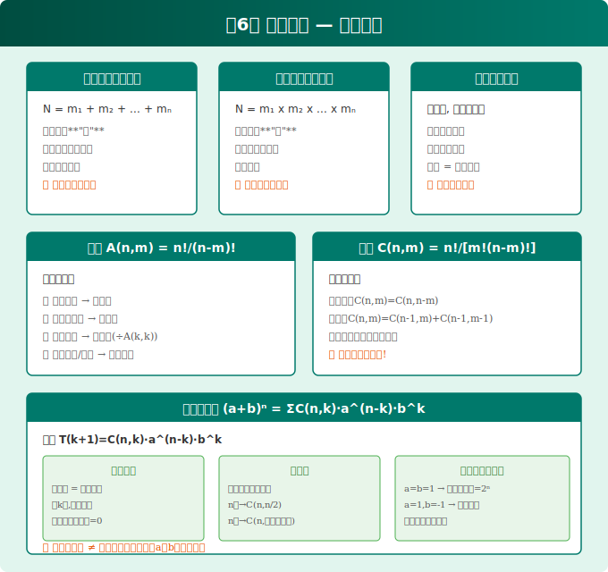
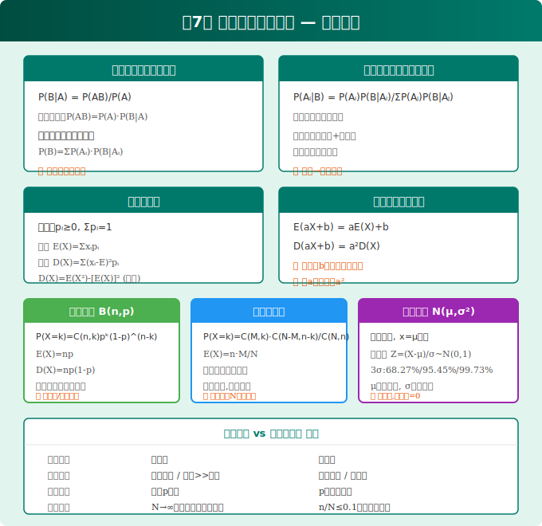
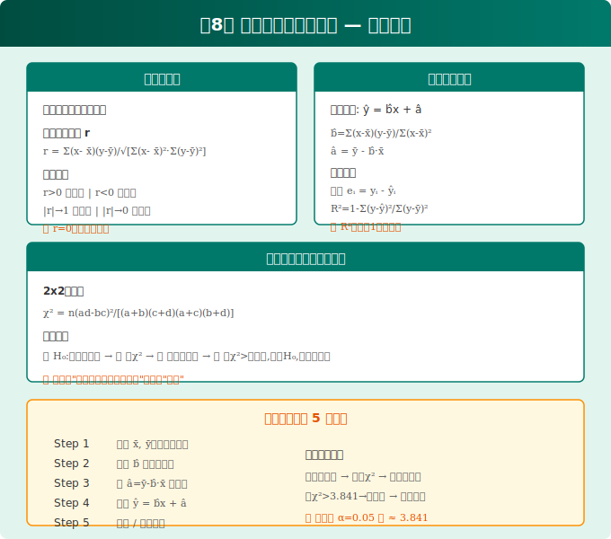

# 数学 选择性必修第三册 知识图谱

> 人教版A版（2019版）| 统计与概率深化 | 对应全国乙卷

---

## 本书概览

| 章节 | 核心内容 | 高考权重 | 难度 |
|:---:|---------|:------:|:--:|
| 6 计数原理 | 排列组合、二项式定理 | ★★★ | ⭐⭐⭐ |
| 7 随机变量及其分布 | 分布列、二项分布、正态分布 | ★★★★★ | ⭐⭐⭐⭐ |
| 8 成对数据的统计分析 | 回归分析、独立性检验 | ★★★ | ⭐⭐⭐ |

---

## 第6章 计数原理

### 6.1 分类加法与分步乘法计数原理

**两个基本计数原理**

| | 分类加法计数原理 | 分步乘法计数原理 |
|---|---|---|
| **核心** | 完成一件事有 n 类办法 | 完成一件事有 n 个步骤 |
| **特征** | 各类独立完成、任选其一 | 各步依次完成、缺一不可 |
| **公式** | N = m₁ + m₂ + ... + mₙ | N = m₁ × m₂ × ... × mₙ |
| **关键词** | **"或"** | **"且"** |

> **易错提醒**：分步时每一步的方法数必须与前面步骤的结果无关（独立性）！如果有关联，不能直接用乘法原理。

**综合应用**：复杂问题常常是分类和分步的组合——先分类（把大问题拆成互斥情形），每类内再分步。

---

### 6.2 排列

**排列数公式**

$$A_n^m = n(n-1)(n-2)\cdots(n-m+1) = \frac{n!}{(n-m)!}$$

- **全排列**：$A_n^n = n!$
- **规定**：0! = 1

**常见排列模型**

| 模型 | 策略 | 公式/方法 |
|------|------|----------|
| **无限制排列** | 直接选排 | $A_n^m$ |
| **相邻问题** | **捆绑法** | 相邻元素视为一个整体 |
| **不相邻问题** | **插空法** | 先排无限制的，再插空 |
| **定序问题** | 除法消序 | $\frac{A_n^n}{A_k^k}$（k个元素顺序固定）|
| **特殊元素/位置** | **优先安排** | 先排特殊的，再排一般的 |

> **口诀**：相邻捆绑不相邻插，特殊优先在头排。

---

### 6.3 组合

**组合数公式**

$$C_n^m = \frac{A_n^m}{A_m^m} = \frac{n!}{m!(n-m)!}$$

**核心性质**

| 性质 | 公式 | 含义 |
|------|------|------|
| 对称性 | $C_n^m = C_n^{n-m}$ | 选谁 = 剩谁 |
| 递推性 | $C_n^m = C_{n-1}^m + C_{n-1}^{m-1}$ | 含 / 不含某元素 |
| 求和 | $C_n^0 + C_n^1 + ... + C_n^n = 2^n$ | 子集总数 |

**分组分配问题**

| 类型 | 特征 | 处理方法 |
|------|------|---------|
| **均匀分组** | 每组人数相同且无序 | 除以组数的阶乘消序 |
| **不均匀分组** | 每组人数不同 | 直接组合相乘 |
| **分配问题** | 分组后再分给人/位置 | 先分组，再排列 |

> **解题心法**：分组分配，先分再配；均匀分组要消序，不均匀直接乘！

---

### 6.4 二项式定理

$$(a+b)^n = \sum_{k=0}^{n} C_n^k a^{n-k} b^k$$

**通项公式**（第 k+1 项）

$$T_{k+1} = C_n^k a^{n-k} b^k$$

**核心考点**

| 考点 | 方法 |
|------|------|
| **特定项**（含 $x^m$ 项） | 令通项的指数 = m，解出 k |
| **常数项** | 令通项的指数 = 0 |
| **二项式系数最大项** | n 为偶数 → $C_n^{n/2}$；奇数 → $C_n^{(n-1)/2} = C_n^{(n+1)/2}$ |
| **系数最大项** | 解不等式组 $T_{k+1} \geq T_k$ 且 $T_{k+1} \geq T_{k+2}$ |
| **系数和** | 赋值法：令 a=b=1 得所有系数和 $2^n$ |

**赋值法求系数和**
- 令 a=b=1：所有项系数之和 = $2^n$
- 令 a=1, b=-1：奇偶项系数差
- 灵活赋值求解各种系数和

---

## 第7章 随机变量及其分布

### 7.1 条件概率与全概率

**条件概率**

$$P(B|A) = \frac{P(AB)}{P(A)} \quad (P(A) > 0)$$

**乘法公式**：$P(AB) = P(A) \cdot P(B|A)$

**全概率公式**（$A_1, A_2, ..., A_n$ 是完备事件组）

$$P(B) = \sum_{i=1}^{n} P(A_i) \cdot P(B|A_i)$$

**贝叶斯公式**

$$P(A_i|B) = \frac{P(A_i)P(B|A_i)}{\sum_{j=1}^{n} P(A_j)P(B|A_j)}$$

> **理解**：全概率是"由因求果"；贝叶斯是"由果推因"。

---

### 7.2 离散型随机变量及其分布列

**分布列的基本性质**
1. $p_i \geq 0$（非负性）
2. $\sum p_i = 1$（归一性）

**均值（期望）**：$E(X) = \sum x_i p_i$

**方差**：$D(X) = \sum [x_i - E(X)]^2 p_i$

**常用公式**

| 公式 | 说明 |
|------|------|
| $E(aX+b) = aE(X)+b$ | 线性性质 |
| $D(aX+b) = a^2 D(X)$ | 方差平移不变 |
| $D(X) = E(X^2) - [E(X)]^2$ | 计算技巧 |

---

### 7.3 二项分布

**n 重伯努利试验**：每次试验只有两个结果，各次独立，概率不变。

**二项分布** $X \sim B(n, p)$
$$P(X=k) = C_n^k p^k (1-p)^{n-k}$$

| 统计量 | 公式 |
|--------|------|
| 期望 | $E(X) = np$ |
| 方差 | $D(X) = np(1-p)$ |

**识别要点**：独立重复、每次概率相同、关注成功次数。

---

### 7.4 超几何分布

**模型**：N 件产品中有 M 件次品，不放回抽取 n 件，其中次品数 X。

$$P(X=k) = \frac{C_M^k \cdot C_{N-M}^{n-k}}{C_N^n}$$

| 统计量 | 公式 |
|--------|------|
| 期望 | $E(X) = n \cdot \frac{M}{N}$ |
| 方差 | $D(X) = n \cdot \frac{M}{N} \cdot \frac{N-M}{N} \cdot \frac{N-n}{N-1}$ |

> **二项 vs 超几何**：二项是**有放回**（或总体很大），超几何是**不放回**。

---

### 7.5 正态分布

**正态分布** $X \sim N(\mu, \sigma^2)$

$$f(x) = \frac{1}{\sqrt{2\pi}\sigma} e^{-\frac{(x-\mu)^2}{2\sigma^2}}$$

**3σ 原则（必须记！）**

| 区间 | 概率 |
|------|------|
| $(\mu-\sigma, \mu+\sigma)$ | 约 68.27% |
| $(\mu-2\sigma, \mu+2\sigma)$ | 约 95.45% |
| $(\mu-3\sigma, \mu+3\sigma)$ | 约 99.73% |

**标准化**：$Z = \frac{X-\mu}{\sigma} \sim N(0,1)$（标准正态分布）

> **3σ 原则应用**：超出 $\mu \pm 3\sigma$ 几乎不可能，常用于质量控制。

---

## 第8章 成对数据的统计分析

### 8.1 成对数据的统计相关性

**散点图**：直观判断线性相关趋势和强弱。

**样本相关系数 r**

$$r = \frac{\sum (x_i-\bar{x})(y_i-\bar{y})}{\sqrt{\sum (x_i-\bar{x})^2 \cdot \sum (y_i-\bar{y})^2}}$$

| r 的范围 | 含义 |
|----------|------|
| r > 0 | 正相关 |
| r < 0 | 负相关 |
| \|r\| 越接近 1 | 线性相关越强 |
| \|r\| 越接近 0 | 线性相关越弱 |

> **注意**：r=0 只说明无**线性**相关，可能存在曲线相关！

---

### 8.2 一元线性回归模型

**经验回归方程**：$\hat{y} = \hat{b}x + \hat{a}$

$$\hat{b} = \frac{\sum (x_i-\bar{x})(y_i-\bar{y})}{\sum (x_i-\bar{x})^2}$$

$$\hat{a} = \bar{y} - \hat{b}\bar{x}$$

**残差**：$e_i = y_i - \hat{y}_i$

**决定系数 $R^2$**：越接近 1，拟合效果越好。

$$R^2 = 1 - \frac{\sum (y_i - \hat{y}_i)^2}{\sum (y_i - \bar{y})^2}$$

> **解题模板**：①算 $\bar{x}, \bar{y}$ → ②代入 $\hat{b}$ 公式 → ③求 $\hat{a}$ → ④写出回归方程 → ⑤预测/分析残差

---

### 8.3 独立性检验（列联表分析）

**2×2 列联表**

| | 属性 B₁ | 属性 B₂ | 合计 |
|--|:-----:|:-----:|:---:|
| **属性 A₁** | a | b | a+b |
| **属性 A₂** | c | d | c+d |
| **合计** | a+c | b+d | n |

**卡方统计量**

$$\chi^2 = \frac{n(ad-bc)^2}{(a+b)(c+d)(a+c)(b+d)}$$

**解题步骤**
1. 提出假设 $H_0$：两变量独立
2. 根据列联表计算 $\chi^2$
3. 查临界值表（$\alpha = 0.05$ 临界值 ≈ 3.841）
4. 若 $\chi^2 >$ 临界值 → 拒绝 $H_0$，认为有关联
5. 得出结论

> **口诀**：先假设独立，算卡方，查表比大小，大则否定独立性。

---

## 全书易错点汇总

| 易错点 | 提醒 |
|--------|------|
| 分类与分步混淆 | "或"是分类（加），"且"是分步（乘） |
| 均匀分组忘消序 | 人数相同的组之间若无序，除以组数阶乘 |
| 二项式系数 ≠ 系数 | $C_n^k$ 只是二项式系数，系数还要乘 $a^{n-k}b^k$ 的系数 |
| 期望线性 $E(aX+b)$ | b 直接加，但方差 $D(aX+b)$ 中 b 消失 |
| 超几何 vs 二项混淆 | 看是否有放回 / 总体是否够大 |
| 相关系数为 0 ≠ 不相关 | 只是无线性相关，可能有曲线关系 |
| 独立性检验结论写法 | "有充分证据认为有关联"，不写"证明有关联" |

---

*下接：函数综合专题 / 解析几何专题 / 数列与导数专题*
