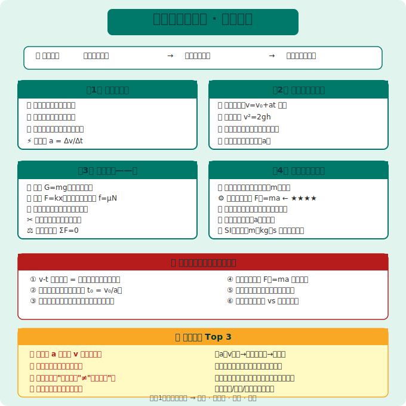
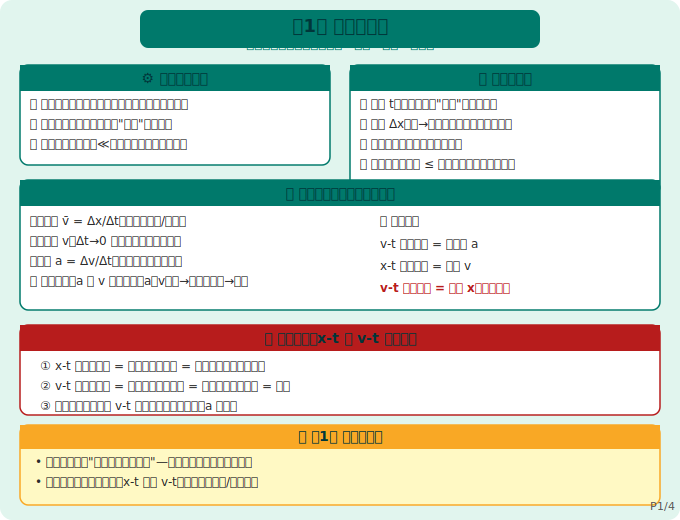
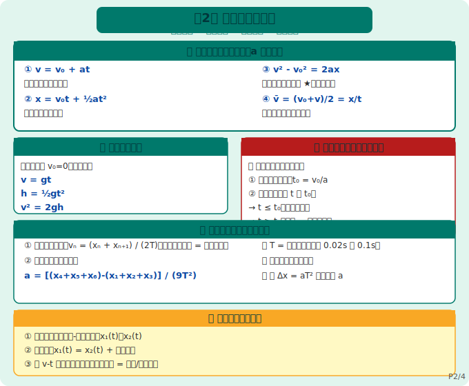
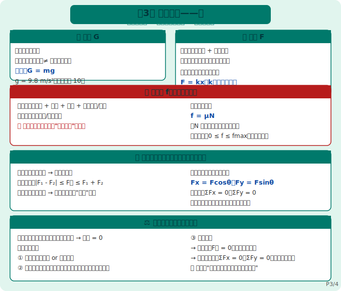
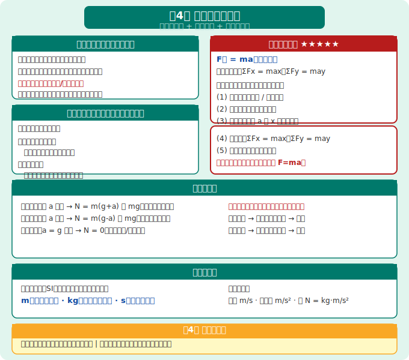

# 物理必修第一册 知识图谱

> Eva · 西安（全国乙卷）· 人教版（2019版）· 必修第一册
>
> 🎯 **本册核心：** 运动学基础 + 力学基础 + 牛顿定律入门
> 📌 **高考占比：** 必修1内容是整个高中物理的基石，选择题必考，解答题常考匀变速公式 + 牛顿第二定律综合

---

## 全书框架

```
必修第一册（力学+运动学基础）
├── 第1章 运动的描述（运动学语言）
├── 第2章 匀变速直线运动（四大公式 + 自由落体）
├── 第3章 相互作用——力（三种常见力 + 力的合成分解）
└── 第4章 运动和力的关系（牛顿三定律 + 超重失重）
```

> 🔑 **全书逻辑链：** 先学会"描述运动"（第1章）→ 再学"运动规律"（第2章）→ 再学"力如何改变运动"（第3~4章）



---



## 第1章 运动的描述

### 1.1 核心概念速查表

| 概念 | 符号 | 定义 | 标/矢量 | 单位 |
|------|------|------|----------|------|
| **质点** | — | 有质量、无大小形状的点（理想化模型） | — | — |
| **参考系** | — | 描述运动时选作"静止"的参照物 | — | — |
| **时间** | t | 时间轴上的"间隔"（时间段） | 标量 | s |
| **位移** | Δx / s | 初位置→末位置的有向线段 | **矢量** | m |
| **路程** | — | 实际运动轨迹的长度 | 标量 | m |
| **速度（平均）** | v̄ | v̄ = Δx / Δt | **矢量** | m/s |
| **瞬时速度** | v | Δt→0 时的平均速度 | **矢量** | m/s |
| **加速度** | a | a = Δv / Δt（速度变化率） | **矢量** | m/s² |

> 🔴 **超级易错：** 加速度 a 与速度 v **方向无关**！
> - a 与 v 同向 → 加速；a 与 v 反向 → 减速
> - a = 0 → 匀速或静止（**不是** v = 0！）

### 1.2 两种图像对比（高考必考）

| 图像类型 | 斜率含义 | 面积含义 | 纵轴截距 |
|----------|----------|----------|----------|
| **x-t 图像**（位移-时间）| **速度 v** | 无意义 | t=0时位移 |
| **v-t 图像**（速度-时间）| **加速度 a** | **位移 x**（净面积） | t=0时速度 |

> 🔴 **x-t 图像切线斜率 = 瞬时速度**；**v-t 图像切线斜率 = 瞬时加速度**

### 1.3 什么时候可以"把物体看成质点"？

```
✅ 可以看成质点：
  ① 物体大小 ≪ 运动范围（如：地球绕太阳 → 地球可看成质点）
  ② 只研究平动，不研究转动（如：计算火车过桥时间 → 不能质点！）

❌ 不能看成质点：
  ① 研究转动/自转（如：地球自转、陀螺）
  ② 物体大小与运动范围相当（如：计算火车长度对过桥时间的影响）
```

---



## 第2章 匀变速直线运动

### 2.1 四大基本公式（必背！）

> 🔑 **四大公式前提：** 加速度 a **恒定不变**（匀变速）

| 公式名称 | 公式 | 适用条件 |
|----------|------|----------|
| **速度公式** | **v = v₀ + at** | 通用 |
| **位移公式①** | **x = v₀t + ½at²** | 通用 |
| **位移公式②** | **v² - v₀² = 2ax** | 不涉及时间时用（最高频！）|
| **平均速度** | **x = v̄t，v̄ = (v₀+v)/2** | 仅适用于匀变速！ |

> 🔴 **解题最高频组合：** v² - v₀² = 2ax（不涉及 t 时优先用）

### 2.2 自由落体运动（a = g = 9.8 m/s²）

| 公式 | 表达式 |
|------|----------|
| 速度公式 | **v = gt** |
| 下落高度 | **h = ½gt²** |
| 速度-高度关系 | **v² = 2gh** |

> 📌 ** g 取值：** 全国乙卷计算题通常用 g = 10 m/s²（除非题目特别说明用 9.8）

### 2.3 三种常见题型解题模板

**题型一：刹车问题（注意"停止后不再运动"！）**

```
解题步骤：
① 先算"从刹车到停止所需时间"：t₀ = v₀/a
② 再判断题目给的时间 t 与 t₀ 的关系：
   → 若 t ≤ t₀：车还在动，用正常公式
   → 若 t > t₀：车已停止，位移 = 刹车总距离（用 v₀²=2ax 算）
```

> 🔴 **刹车问题超级易错：** 车停了之后**不会再反向运动**！（和竖直上抛不同）

**题型二：追及问题（图像法最直观）**

```
追及问题本质：两物体的位移关系
① 写出两物体的位移-时间函数：x₁(t)，x₂(t)
② 追及时：x₁(t) = x₂(t) + 初始距离
③ 用 v-t 图像验证：两图线之间的面积 = 追及/拉开的距离
```

**题型三：纸带问题（实验题高频）**

| 求法 | 公式 |
|------|------|
| 某点瞬时速度 | **vₙ = (xₙ + xₙ₊₁) / (2T)**（中间时刻速度 = 平均速度）|
| 加速度 | **Δx = aT²**（逐差法：a = [(x₄+x₅+x₆)-(x₁+x₂+x₃)] / (9T²)）|

---



## 第3章 相互作用——力

### 3.1 三种常见力对比

| 力 | 产生条件 | 方向 | 大小计算 |
|----|----------|------|----------|
| **重力 G** | 地球吸引 | 竖直向下（≠ 垂直向下！）| **G = mg** |
| **弹力 F** | 接触 + 弹性形变 | 垂直接触面指向受力物体 | 弹簧：**F = kx**（胡克定律）|
| **摩擦力 f** | 接触 + 挤压 + 粗糙 + **相对运动/趋势** | 与相对运动/趋势方向相反 | 滑动：**f = μN** |

> 🔴 **重力方向：** 是"竖直向下"（指向地心方向），不是"垂直向下"（垂直向下要看接触面）！
> 🔴 **摩擦力方向：** 与"相对运动方向"相反，不是与"运动方向"相反！（传送带上的物体可能摩擦力与运动方向相同）

### 3.2 弹力：弹簧串联与并联

| 连接方式 | 等效劲度系数 k' | 记忆方法 |
|----------|----------------|----------|
| **串联** | 1/k' = 1/k₁ + 1/k₂ + ... | 越串越软（k' < 任一k）|
| **并联** | k' = k₁ + k₂ + ... | 越并越硬（k' > 任一k）|

### 3.3 力的合成与分解（平行四边形定则）

```
力的合成（已知两个分力 → 求合力）：
  → 用平行四边形定则，合力范围：|F₁ - F₂| ≤ F合 ≤ F₁ + F₂

力的分解（已知一个力 → 求两个分力）：
  → 按"效果"分解（最常见的两种正交分解法）
  → 正交分解：Fx = Fcosθ，Fy = Fsinθ
```

> 🔴 **力的分解多解性：** 已知一个力的大小方向，若无其他限制条件，可以分解为**无数组**分力 → 所以分解时要说明"按什么效果分解"

### 3.4 共点力平衡（静态平衡）

```
平衡条件：物体静止或匀速直线运动 → 合力 = 0

解题步骤（三步走）：
① 选对象（整体法 or 隔离法）
② 画受力图（重力一定有；弹力看接触；摩擦力看相对运动趋势）
③ 列方程：
   → 合成法：F合 = 0（适用于三力平衡，用平行四边形/三角形定则）
   → 正交分解法：ΣFx = 0，ΣFy = 0（适用于多力平衡，最通用）
```

> 🔑 **整体法 vs 隔离法选择口诀：**
> "求外力用整体，求内力用隔离；不知内力先用整体，再隔离求内力"

---



## 第4章 运动和力的关系

### 4.1 牛顿第一定律（惯性定律）

| 概念 | 要点 |
|------|------|
| **惯性** | 物体保持原来运动状态的性质（**质量越大，惯性越大**）|
| **力与运动的关系** | 力是**改变**运动状态的原因（不是维持运动的原因！）|
| **伽利略理想实验** | 推论：若无摩擦，物体将一直运动下去 |

> 🔴 **易错：** 惯性大小只与**质量**有关，与速度/受力/运动状态**无关**！

### 4.2 牛顿第二定律（核心中的核心！）

```
公式：F合 = ma（矢量式）
→ 在直角坐标系中：ΣFx = max，ΣFy = may

使用前提：惯性参考系（地面参考系最常用）
```

**解题标准步骤（必须养成习惯！）：**

```
① 选对象（整体/隔离）
② 画受力图（隔离每个研究对象，标出所有力）
③ 建坐标系（一般让加速度 a 沿 x 轴正方向，简化计算）
④ 列方程：ΣFx = max，ΣFy = may
⑤ 解方程（注意矢量方向，设正方向）
```

> 🔴 **牛顿第二定律解题最高频陷阱：**
> - 忘记"受力分析"就直接写 F=ma（必须先画受力图！）
> - 漏掉某个力（特别是摩擦力、弹力）
> - 坐标系建错，导致符号混乱

### 4.3 牛顿第三定律（作用力与反作用力）

| 对比项 | 作用力与反作用力 | 一对平衡力 |
|--------|----------------|------------|
| 作用对象 | **两个物体** | **同一个物体** |
| 力的性质 | 一定相同 | 可以不同 |
| 共存性 | 同时产生同时消失 | 无此要求 |
| 效果 | 不能抵消 | 效果抵消 |

> 🔴 **判断口诀：** "作用在两个物体上 → 是作用力反作用力；作用在同一个物体上 → 是平衡力"

### 4.4 超重与失重

| 状态 | 加速度方向 | 视重（支持力 N）| 本质 |
|------|------------|-----------------|------|
| **超重** | 向上（a↑）| N = m(g+a) > mg | 加速度向上（**不是**速度向上！）|
| **失重** | 向下（a↓）| N = m(g-a) < mg | 加速度向下 |
| **完全失重** | a = g 向下 | N = 0 | 自由落体/轨道运行 |

> 🔴 **超重失重判断依据：加速度方向，不是速度方向！**
> 向上加速 → 超重；向上减速 → 失重；向下加速 → 失重；向下减速 → 超重

### 4.5 力学单位制

> 国际单位制（SI）中，**力学的三个基本单位**是：
> **m（长度）、kg（质量）、s（时间）**
> 导出单位：速度（m/s）、加速度（m/s²）、力（N = kg·m/s²）

---

## 全书公式汇总

```
【第2章 匀变速直线运动】
v = v₀ + at
x = v₀t + ½at²
v² - v₀² = 2ax
v̄ = (v₀+v)/2 = x/t        （仅匀变速适用）

【第3章 力】
弹簧弹力：F = kx
滑动摩擦力：f = μN
共点力平衡：F合 = 0

【第4章 牛顿定律】
牛顿第二定律：F合 = ma
超重视重：N = m(g+a)
失重视重：N = m(g-a)
```

---

## 高考高频考点 + 易错提醒

| 考点 | 出现频率 | 易错提醒 |
|------|----------|----------|
| v-t 图像斜率 = 加速度 | ⭐⭐⭐⭐⭐ | 注意正负号含义 |
| 刹车问题（停止后不反向）| ⭐⭐⭐⭐ | 先算停止时间 t₀ |
| 自由落体 v²=2gh | ⭐⭐⭐⭐ | g取10还是9.8看题目 |
| 摩擦力方向判断 | ⭐⭐⭐⭐⭐ | 相对运动方向 ≠ 运动方向 |
| 牛顿第二定律解题步骤 | ⭐⭐⭐⭐⭐ | 必须画受力图！|
| 超重失重判断 | ⭐⭐⭐ | 看加速度方向，不看速度 |
| 作用力反作用力 vs 平衡力 | ⭐⭐⭐ | 作用对象不同 |

---

> 📝 最后更新：2026-05-31
