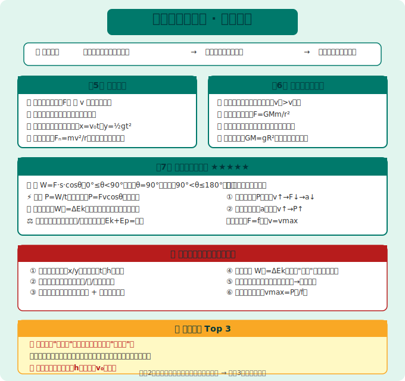
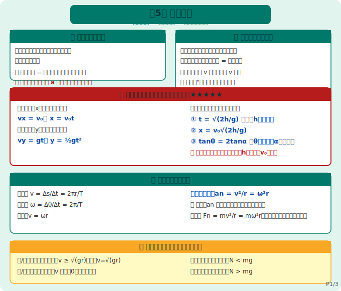
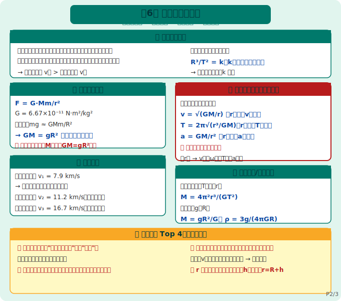
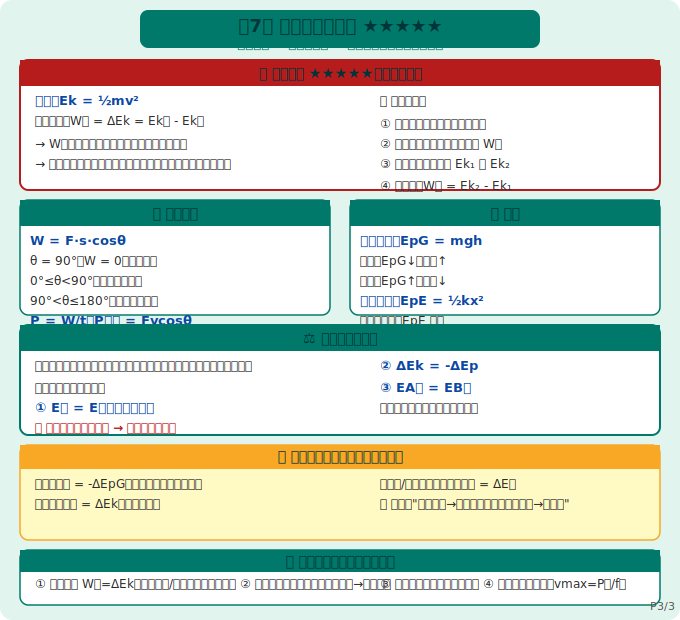

# 物理必修第二册 知识图谱

> Eva · 西安（全国乙卷）· 人教版（2019版）· 必修第二册
>
> 🎯 **本册核心：** 曲线运动（平抛+圆周）+ 万有引力（天体运动）+ 机械能（动能定理 ★★★★★）
> 📌 **高考占比：** 平抛/圆周/天体/动能定理每年必考，选择题+解答题均高频

---

## 全书框架

```
必修第二册（曲线运动 + 天体 + 机械能）
├── 第5章 曲线运动（平抛 + 圆周）
├── 第6章 万有引力与航天（天体运动）
└── 第7章 机械能守恒定律（动能定理 + 机械能守恒）
```

> 🔑 **全书逻辑链：** 从直线运动拓展到曲线运动（第5章）→ 用牛顿定律研究天体（第6章）→ 用能量观点研究运动（第7章，贯穿整个高中物理）



---



## 第5章 曲线运动

### 5.1 曲线运动的条件

```
曲线运动条件：
  合外力（加速度）与速度方向不在同一直线上
  → 速度方向时刻改变（曲线运动的速度方向 = 轨迹切线方向！）
```

> 🔴 **易错：** 曲线运动中，加速度可以恒定（如平抛），≠ 一定变化！

### 5.2 运动的合成与分解（核心方法：正交分解！）

| 原则 | 说明 |
|------|------|
| **独立性原理** | 两个方向上的运动互不影响，可以分别研究 |
| **等效原理** | 分运动的合效果 = 实际运动 |
| **分解方法** | 通常沿 **v 方向** 和 **垂直于 v 方向** 分解（或沿合力方向）|

> 🔑 **解题口诀：** "看得见的是实际运动，看不见的是分运动；实际运动是两个分运动的矢量和"

### 5.3 平抛运动（高考解答题超级高频！）

**两个方向独立分析（最常用解题方法）：**

```
水平方向（x）：匀速直线运动
  → vx = v₀，x = v₀t

竖直方向（y）：自由落体运动
  → vy = gt，y = ½gt²

合速度：v = √(vx² + vy²)，方向 tanθ = vy/vx

合位移：s = √(x² + y²)
```

**平抛运动三个重要推论（解答题直接使用！）：**

| 推论 | 公式 | 说明 |
|------|------|------|
| **推论一** | 落地时间 t = √(2h/g) | 只与高度 h 有关，与 v₀ 无关！ |
| **推论二** | 水平射程 x = v₀√(2h/g) | v₀ 越大、h 越高 → 射程越远 |
| **推论三** | 速度与水平夹角 θ：tanθ = 2tanα | α 是位移与水平夹角（常考！）|

> 🔴 **超级易错：** 平抛运动的时间由**高度 h** 决定，与初速度 v₀ **无关**！

### 5.4 圆周运动

**基础公式：**

| 物理量 | 公式 | 单位 |
|--------|------|------|
| 线速度 v | v = Δs/Δt = 2πr/T | m/s |
| 角速度 ω | ω = Δθ/Δt = 2π/T | rad/s |
| 周期 T | T = 1/f | s |
| v 与 ω 关系 | **v = ωr** | — |

**向心加速度 an（指向圆心！）：**

```
an = v²/r = ω²r = (2π/T)²r = 4π²f²r
```

> 🔴 **易错：** 向心加速度**不改变速度大小**，只改变速度方向！（aₙ ⊥ v）

**向心力 Fn（不是"新的力"，是合力！）：**

```
Fn = man = mv²/r = mω²r
```

> 🔴 **超级重要：** 向心力是**效果力**，不是物体"受到"的力！受力分析时**不能**画"向心力"这个力！

### 5.5 生活中的圆周运动（高考应用题）

| 模型 | 向心力来源 | 临界条件 |
|------|------------|----------|
| **绳/轨道模型**（最高点）| 重力 + 弹力（向下）| vₘᵢₙ = √(gr)（恰好通过最高点）|
| **杆/管模型**（最高点）| 重力 + 弹力（可向上可向下）| v = 0 也能通过最高点！|
| **拱桥模型**（最高点）| 重力 - 支持力 = mv²/r | 失重！N < mg |
| **凹桥模型**（最低点）| 支持力 - 重力 = mv²/r | 超重！N > mg |

> 🔴 **拱桥 vs 凹桥：** 拱桥（顶部）失重，凹桥（底部）超重，画受力图时方向别搞反！

---



## 第6章 万有引力与航天

### 6.1 开普勒三定律

| 定律 | 内容 | 公式 |
|------|------|------|
| **第一定律**（轨道定律）| 行星轨道是椭圆，太阳在一个焦点上 | — |
| **第二定律**（面积定律）| 行星与太阳连线在相同时间内扫过相同面积 | v近 > v远 |
| **第三定律**（周期定律）| 轨道半长轴立方与周期平方之比恒定 | **R³/T² = k**（k 与中心天体有关）|

### 6.2 万有引力定律

```
公式：F = G·Mm/r²
  G = 6.67×10⁻¹¹ N·m²/kg²（万有引力常数）
  r：两天体球心之间的距离
```

**地面上物体重力近似等于万有引力：**

```
mg ≈ G·Mm/R²  →  GM = gR²（"黄金代换式"，天体计算超高频使用！）
```

> 🔴 **"黄金代换式" GM = gR²：** 当题目不知道 M 但知道 g 和 R 时，用这个式子把 GM 替换掉，是天体题最高频技巧！

### 6.3 人造卫星（高考选择题必考）

**三个 cosmic 速度：**

| 速度 | 数值 | 意义 |
|------|------|------|
| **第一宇宙速度** v₁ | 7.9 km/s | 最大环绕速度，最小发射速度 |
| **第二宇宙速度** v₂ | 11.2 km/s | 脱离地球引力（绕太阳）|
| **第三宇宙速度** v₃ | 16.7 km/s | 脱离太阳系 |

**卫星运行规律（口诀：高轨低速长周期）：**

```
由 G·Mm/r² = mv²/r = m·4π²r/T² = ma

→ v = √(GM/r)      （r 越大，v 越小）
→ ω = √(GM/r³)     （r 越大，ω 越小）
→ T = 2π√(r³/GM)  （r 越大，T 越大）
→ a = GM/r²          （r 越大，a 越小）
```

> 🔑 **口诀：高轨低速长周期**（r 大 → v小、ω小、T大、a小）

> 🔴 **易错：** "第一宇宙速度是最大发射速度" ❌ → 正确：第一宇宙速度是**最小发射速度、最大环绕速度**

### 6.4 天体质量/密度计算

| 情境 | 已知量 | 求法 |
|------|--------|------|
| 已知地表 g 和 R | g, R | M = gR²/G |
| 已知卫星周期 T 和轨道 r | T, r | M = 4π²r³/(GT²) |
| 求密度 ρ | M, R | ρ = M/(4πR³/3) = 3π/(GT²)（近地卫星时）|

---



## 第7章 机械能守恒定律

### 7.1 功 W

```
定义式：W = F·s·cosθ（θ 是 F 与 s 的夹角）

正功 vs 负功：
  → 0° ≤ θ < 90°：W > 0，力对物体做正功（动力）
  → θ = 90°：W = 0，力不做功
  → 90° < θ ≤ 180°：W < 0，力对物体做负功（阻力，物体消耗能量）
```

> 🔴 **判断力是否做功：** 看 F 与 s 的夹角；判断力做正功还是负功：看能量是"输入"还是"输出"

### 7.2 功率 P

```
定义式：P = W/t（平均功率）
瞬时功率：P = F·v·cosθ（θ 是 F 与 v 的夹角）

汽车启动两模型（高考解答题高频！）：

模型一：恒定功率启动
  → P 不变，v↑ → F = P/v ↓ → a = (F-f)/m ↓
  → 最终：F = f 时，vmax = P/f（匀速）

模型二：恒定加速度启动
  → a 不变 → F 不变 → P = Fv ↑
  → 达到额定功率 P额 后，变为恒定功率启动模式
```

> 🔴 **汽车启动最高频考点：** vmax = P额/f（不管是哪种启动方式，最终都是这个等式！）

### 7.3 动能和动能定理 ★★★★★（最重要！）

```
动能：Ek = ½mv²

动能定理：W合 = ΔEk = Ek末 - Ek初
  → W合：所有力对物体做的总功（可正可负）
  → 使用动能定理不需要关心运动过程细节，只关心初末状态！
```

> 🔑 **动能定理使用步骤：**
> ① 确定研究对象和一段位移过程
> ② 分析该过程中所有力做的功（W合 = ΣW）
> ③ 确定初末状态的动能 Ek₁ 和 Ek₂
> ④ 列方程：W合 = Ek₂ - Ek₁

> 🔴 **超级技巧：** 涉及"变力做功"或"曲线运动做功"时，**优先用动能定理**！不需要知道加速度 a，比用牛顿定律简单得多！

### 7.4 势能

| 势能类型 | 公式 | 变化规律 |
|----------|------|----------|
| **重力势能** EpG | EpG = mgh | 下落：EpG↓，动能↑；上升：EpG↑，动能↓ |
| **弹性势能** EpE | EpE = ½kx² | 形变量越大，EpE 越大 |

> 📌 **重力势能正负：** 参考平面以上为正，以下为负；重力势能是**地球+物体**共有的！

### 7.5 机械能守恒定律

```
内容：只有重力或弹力做功时，动能与势能相互转化，机械能总量保持不变

表达式（三种等价形式）：
  ① E初 = E末（总量不变）
  ② ΔEk = -ΔEp（动能增量 = 势能减少量）
  ③ EA增 = EB减（A物体机械能增加量 = B物体机械能减少量）

使用条件：**只有重力或弹力做功**（有摩擦力或其他外力做功时，机械能不守恒！）
```

> 🔴 **机械能守恒 vs 动能定理：**
> - 动能定理**永远成立**（不论什么力做功都能用）
> - 机械能守恒**有条件**（只有重力/弹力做功）

### 7.6 功能关系（能量观点解题的最高境界）

| 力做的功 | 对应能量变化 |
|------------|--------------|
| 重力做的功 | 重力势能变化的负值：WG = -ΔEpG |
| 弹力做的功 | 弹性势能变化的负值：W弹 = -ΔEpE |
| 合外力做的功 | 动能变化：W合 = ΔEk（动能定理）|
| 除重力/弹力外其他力做的总功 | 机械能变化：W其他 = ΔE机 |

> 🔑 **功能关系速记：** "重力做功→重力势能变；合外力做功→动能变；其他力做功→机械能变"

---

## 全书公式汇总

```
【第5章 曲线运动】
平抛：x = v₀t，y = ½gt²
圆周：v = ωr，an = v²/r = ω²r，Fn = mv²/r

【第6章 万有引力】
F = G·Mm/r²
黄金代换：GM = gR²
卫星运行：v = √(GM/r)，T = 2π√(r³/GM)
宇宙速度：v₁ = 7.9 km/s

【第7章 机械能】
功：W = Fscosθ
功率：P = W/t，P瞬时 = Fvcosθ
动能：Ek = ½mv²
动能定理：W合 = ΔEk
机械能守恒：Ek₁+Ep₁ = Ek₂+Ep₂（只有重力/弹力做功时）
```

---

## 高考高频考点 + 易错提醒

| 考点 | 出现频率 | 易错提醒 |
|------|----------|----------|
| 平抛运动分解（x/y方向独立）| ⭐⭐⭐⭐⭐ | 时间 t 由高度 h 决定，与 v₀ 无关！|
| 圆周运动向心力分析 | ⭐⭐⭐⭐ | 向心力是效果力，不是"受到的力"！|
| 万有引力提供向心力（卫星）| ⭐⭐⭐⭐⭐ | 记得"高轨低速长周期"口诀 |
| 黄金代换式 GM=gR² 应用 | ⭐⭐⭐⭐ | 不知道 M 但知道 g 和 R 时用 |
| 动能定理 W合=ΔEk | ⭐⭐⭐⭐⭐ | 变力做功/曲线运动优先用动能定理！|
| 汽车启动两模型 | ⭐⭐⭐⭐ | vmax = P额/f（两种启动最终都一样）|
| 机械能守恒条件判断 | ⭐⭐⭐⭐ | 有摩擦力做功 → 机械能不守恒！|
| 功能关系（能量观点大题）| ⭐⭐⭐⭐⭐ | 看到"能量"/"做功"/"损失"就用功能关系 |

---

> 📝 最后更新：2026-05-31
