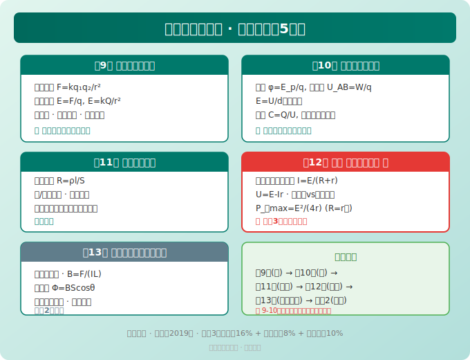
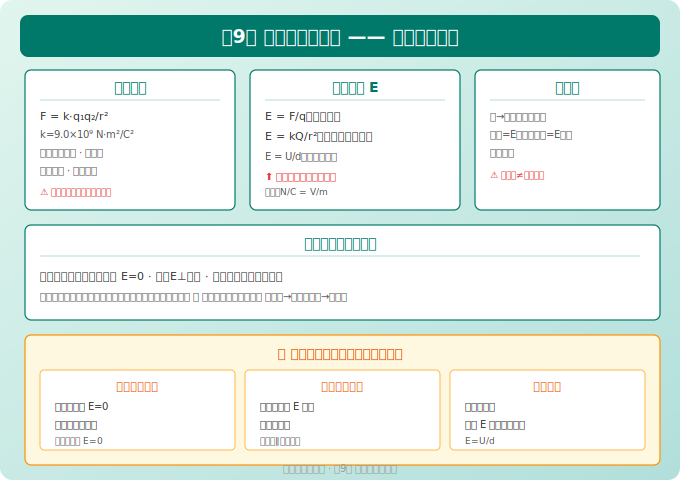
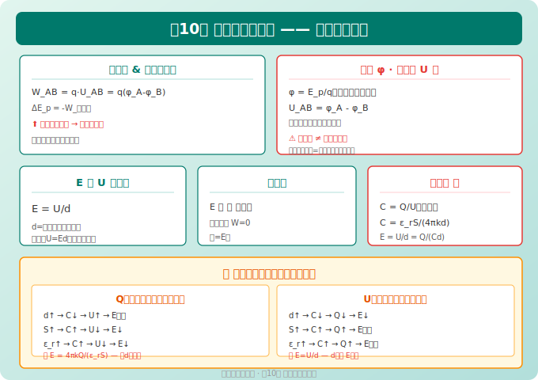
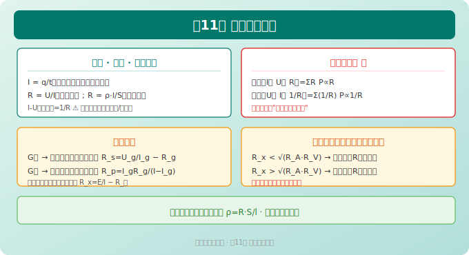
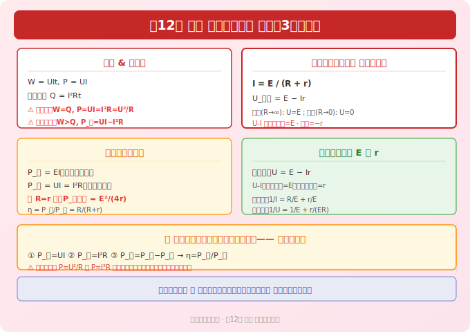
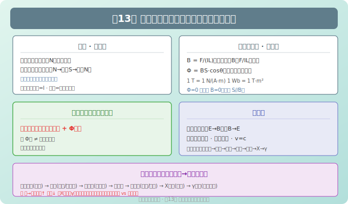

# 高中物理必修第三册 · 知识图谱

> Eva · 西安（全国乙卷）· 人教版（2019版）
> 📝 最后更新：2026-05-31

---

## 全书概览（5章）

```
必修3 = 电磁学入门
├── 第9章  静电场及其应用       ← 力的角度（电场强度、电场线）
├── 第10章 静电场中的能量        ← 能的角度（电势、电势能、电容）
├── 第11章 电路及其应用          ← 电路基础（电阻定律、串并联）
├── 第12章 电能 能量守恒定律      ← 能量角度（电功、焦耳定律、闭合电路欧姆定律）
└── 第13章 电磁感应与电磁波初步   ← 电磁纽带（磁现象、电磁感应定性、电磁波）
```

> 🔴 **全国乙卷规律：** 必修3 + 选必2 组成电磁学完整体系。第9-10章是**整个电磁学的基石**，电势/电势能概念搞不清楚，后面选必2的带电粒子在磁场中运动会很难学。



---



## 第9章 静电场及其应用

### 9.1 电荷与库仑定律

| 概念 | 公式 | 说明 |
|------|------|------|
| 电荷守恒定律 | — | 电荷既不能创造也不能消灭，只能转移 |
| 元电荷 | e = 1.60×10⁻¹⁹ C | 物体带电量是 e 的整数倍 |
| 库仑定律 | F = k·q₁q₂/r² | k = 9.0×10⁹ N·m²/C²，适用：**真空中、点电荷** |
| 方向判定 | 同性相斥、异性相吸 | — |

> ⚠️ **易错：** 库仑定律公式与万有引力公式形式相同，但库仑力可以是斥力或引力，方向判断看电性符号。

#### 三个点电荷平衡问题

```
条件：每个电荷受合力为零
同一直线上三点电荷 q₁ → q₂ → q₃：
  - 中间电荷与两侧电荷电性相反（两同夹一异）
  - √(q₁·q₃) = √(q₁·q₂) + √(q₂·q₃)（根号关系）
```

### 9.2 电场 电场强度

| 概念 | 定义式 | 决定因素 |
|------|--------|----------|
| 电场强度 | E = F/q | 由场源电荷和位置决定，与试探电荷无关 |
| 点电荷电场 | E = kQ/r² | Q 为场源电荷量 |
| 匀强电场 | E = U/d | 第10章 |

#### 电场强度三公式对比 ⚠️ 重点

| 公式 | 适用条件 | 物理意义 |
|------|----------|----------|
| E = F/q | 任意电场 | 定义式，E 与 q 无关 |
| E = kQ/r² | 真空中点电荷 | 决定式 |
| E = U/d | 匀强电场 | d 为沿电场线方向距离 |

#### 电场强度的叠加

- 电场强度是**矢量**，叠加遵循**平行四边形定则**
- 等量同种电荷中垂线上：中点 E=0，两侧先增后减
- 等量异种电荷中垂线上：中点 E 最大，向两侧递减（方向平行于连线）

### 9.3 电场线

| 特征 | 说明 |
|------|------|
| 方向 | 正电荷出发→负电荷终止（或无穷远）；切线方向=E 方向 |
| 疏密 | 电场线越密，E 越大 |
| 不相交 | 电场中每点只有一个 E 方向 |
| 不是轨迹 | 电场线≠带电粒子运动轨迹（除非：电场线是直线 + v₀=0 或 v₀//E） |

#### 常见电场线分布

| 电场类型 | 特征 |
|----------|------|
| 正点电荷 | 放射状向外 |
| 负点电荷 | 放射状向内 |
| 等量同种 | 相斥型，中点 E=0 |
| 等量异种 | 相吸型，中点 E 最大指向负电荷 |
| 匀强电场 | 平行等间距直线 |

### 9.4 静电平衡与静电屏蔽

| 知识点 | 内容 |
|--------|------|
| 静电平衡条件 | 导体内部 E=0，表面 E 垂直于表面 |
| 电荷分布 | 只分布在导体**外表面**，曲率大处电荷密度大 |
| 静电屏蔽 | 空腔导体可屏蔽外电场；接地空腔可屏蔽内外电场 |
| 尖端放电 | 避雷针原理 |

---



## 第10章 静电场中的能量

> 🎯 本章是整个电磁学最绕的一章——**电势、电势能、电势差、电场力做功**四个概念容易混淆。

### 10.1 电势能与电场力做功

| 概念 | 公式/说明 |
|------|----------|
| 电场力做功 | W = q·U_AB = q(φ_A - φ_B) |
| 电势能变化 | ΔE_p = -W_电场力（电场力做正功，电势能减少） |
| 类比 | 电势能 ↔ 重力势能，电场力 ↔ 重力 |

> 🔴 **核心类比：** 电场力做功 = 电势能减少量，正如重力做功 = 重力势能减少量。

### 10.2 电势与电势差

| 概念 | 定义式 | 说明 |
|------|--------|------|
| 电势 φ | φ = E_p/q | 标量，有正负，沿电场线方向电势降低 |
| 电势差 U_AB | U_AB = φ_A - φ_B = W_AB/q | 与路径无关 |
| 等势面 | — | 电场线与等势面处处垂直 |

#### 电势高低判断 ⭐ 高频考点

| 方法 | 规则 |
|------|------|
| 电场线方向 | 沿电场线方向→电势降低（最常用） |
| 电场力做功 | 正电荷从高电势→低电势（顺电场线方向做功为正） |
| 电势能 | 正电荷在电势高处电势能大；负电荷相反 |

> ⚠️ **易错：** "电势高"≠"电势能大"——正电荷在高电势处电势能大，负电荷在低电势处电势能大。

### 10.3 电势差与电场强度的关系

$$
E = \frac{U}{d} \quad (d\text{ 为沿电场方向的距离})
$$

| 推论 | 内容 |
|------|------|
| 匀强电场中 | 沿任意方向电势降落与距离成正比 |
| 非匀强电场 | 只能定性判断（U 相等时 d 越短 E 越大） |
| 单位关系 | 1 V/m = 1 N/C |

### 10.4 等势面

| 特征 | 说明 |
|------|------|
| 等势面上移动电荷 | 电场力不做功（W=0，∵U_AB=0） |
| 电场线与等势面 | 处处垂直 |
| 等势面密→电场强 | 疏密反映电场强弱 |
| 常见等势面 | 点电荷=同心球面，匀强电场=平行平面 |

### 10.5 电容器与电容

| 公式 | 说明 |
|------|------|
| C = Q/U | 定义式，1 F = 1 C/V |
| C = ε_r·S/(4πkd) | 平行板电容器决定式（ε_r 相对介电常数，S 正对面积，d 板间距） |
| E = U/d = Q/(Cd) | 板间电场强度 |

#### 电容器动态分析 ⭐ 重要题型

| 条件 | Q不变（充电后断开） | U不变（始终连接电源） |
|------|---------------------|------------------------|
| d↑ | C↓ → U↑ → E不变 | C↓ → Q↓ → E↓ |
| S↑ | C↑ → U↓ → E↓ | C↑ → Q↑ → E不变 |
| 插入介质 ε_r↑ | C↑ → U↓ → E↓ | C↑ → Q↑ → E不变 |

> 🔑 **口诀：** Q 不变时 E 与 d 无关（匀强电场结论）；U 不变时 E=U/d，d 越大 E 越小。

---



## 第11章 电路及其应用

### 11.1 电流与电阻

| 概念 | 公式 | 说明 |
|------|------|------|
| 电流 | I = q/t | 单位：A；方向：正电荷定向移动方向（与电子运动相反） |
| 电阻 | R = U/I | 定义式（R 与 U、I 无关） |
| 电阻定律 | R = ρ·l/S | 电阻率 ρ 由材料决定，随温度变化 |
| 欧姆定律 | I = U/R | 适用：金属导体、电解液（纯电阻元件） |

> ⚠️ **易错：** 欧姆定律不适用于气体导电、半导体元件。I-U 图像中斜率=1/R（不是 R）。

### 11.2 串并联电路

| 特征 | 串联 | 并联 |
|------|------|------|
| 电流 | I = I₁ = I₂ = ... | I = I₁ + I₂ + ... |
| 电压 | U = U₁ + U₂ + ... | U = U₁ = U₂ = ... |
| 电阻 | R = R₁ + R₂ + ... | 1/R = 1/R₁ + 1/R₂ + ... |
| 功率分配 | P∝R | P∝1/R |

#### 电表改装 ⭐ 高频

| 改装类型 | 方法 | 计算 |
|----------|------|------|
| 电流表→电压表 | **串联**大电阻 | R_s = U_g/I_g - R_g |
| 电流表→大量程电流表 | **并联**小电阻 | R_p = I_g·R_g/(I - I_g) |
| 欧姆表原理 | 闭合电路 | R_x = E/I - R_内 |

> 🔑 **口诀：** "压串大，流并小"——改装电压表串大电阻，改装电流表并小电阻。

### 11.3 导体电阻率的测量（实验）

| 实验 | 原理 | 关键步骤 |
|------|------|----------|
| 伏安法测电阻 | R = U/I | 电流表内接/外接选择 |
| 测金属丝电阻率 | ρ = R·S/l | 螺旋测微器测直径 |

#### 伏安法内外接判断

| 接法 | 适用 | R_x 与 √(R_A·R_V) 的关系 | 误差来源 |
|------|------|---------------------------|----------|
| 外接法 | 小电阻 | R_x < √(R_A·R_V) | 电压表分流→R测偏小 |
| 内接法 | 大电阻 | R_x > √(R_A·R_V) | 电流表分压→R测偏大 |

---



## 第12章 电能 能量守恒定律

### 12.1 电功与电功率

| 概念 | 公式 | 说明 |
|------|------|------|
| 电功 | W = UIt | 单位：J；1 kW·h = 3.6×10⁶ J |
| 电功率 | P = UI | 单位：W |
| 焦耳定律 | Q = I²Rt | 电流热效应 |

#### 纯电阻 vs 非纯电阻 ⚠️ 易混淆

| 类型 | 实例 | 电功=焦耳热? | 功率公式 |
|------|------|:----------:|----------|
| 纯电阻 | 电炉、白炽灯 | ✅ W=Q | P = UI = I²R = U²/R |
| 非纯电阻 | 电动机、电解槽 | ❌ W>Q | P_总 = UI, P_热 = I²R, P_输出 = UI - I²R |

> 🔴 **电动机问题步骤：** ① 输入功率 P=UI → ② 热功率 P_热=I²R → ③ 输出功率 P_出=P-P_热 → ④ 效率 η=P_出/P

### 12.2 闭合电路欧姆定律 ⭐⭐⭐⭐⭐

$$
I = \frac{E}{R + r}, \quad U_{路端} = E - Ir
$$

| 状态 | 路端电压 | 说明 |
|------|----------|------|
| 外电路断路 (R→∞) | U = E | 电流 I≈0 |
| 外电路短路 (R→0) | U = 0 | I = E/r（很大！危险！） |
| 一般情况 | U = E - Ir | U-I 图像是倾斜直线，斜率=-r |

#### 闭合电路功率分析

| 功率 | 公式 | 说明 |
|------|------|------|
| 电源总功率 | P_总 = EI | 电源提供的全部功率 |
| 电源输出功率 | P_出 = UI = I²R | 外电路消耗的功率 |
| 电源内耗功率 | P_内 = I²r | — |
| 当 R=r 时 | P_出最大 = E²/(4r) | 电源最大输出功率条件 |

### 12.3 实验：电池电动势和内阻的测量

| 方法 | 公式 | 数据处理 |
|------|------|----------|
| 伏安法 | U = E - Ir | 作 U-I 图，截距=E，斜率=-r |
| 安阻法 | 1/I = R/E + r/E | 作 1/I-R 图 |
| 伏阻法 | 1/U = 1/E + r/(ER) | 作 1/U - 1/R 图 |

### 12.4 能源与可持续发展

| 知识点 | 内容 |
|--------|------|
| 能量守恒定律 | 能量既不能凭空产生，也不能凭空消失 |
| 能量耗散 | 能量品质降低（有序→无序），不是能量消失 |
| 功率与效率 | 效率 η = P_有用/P_总 × 100% |

---



## 第13章 电磁感应与电磁波初步

### 13.1 磁场 磁感线

| 概念 | 说明 |
|------|------|
| 磁场方向 | 小磁针 N 极受力方向（切线方向） |
| 磁感线 | 闭合曲线（N→S→内部S→N） |
| 安培定则（右手螺旋） | 直导线：拇指=I方向，四指=磁感线；螺线管：四指=I方向，拇指=内部磁场方向 |

#### 常见磁场

| 磁体 | 磁感线特征 |
|------|-----------|
| 条形磁铁 | 外部 N→S，内部 S→N |
| 通电直导线 | 同心圆，离导线越远越疏 |
| 通电螺线管 | 内部近似匀强，外部类似条形磁铁 |

### 13.2 磁感应强度 磁通量

| 概念 | 公式 | 说明 |
|------|------|------|
| 磁感应强度 B | B = F/(IL) | 与 F、IL 无关（定义式） |
| 磁通量 Φ | Φ = BS（B⊥S） | Φ = BS·cosθ（一般情况） |
| 单位 | 1 T = 1 N/(A·m)，1 Wb = 1 T·m² | — |

> ⚠️ **注意：** 磁通量是**标量**，但有正负（穿入穿出之分）。

### 13.3 电磁感应现象（定性）

| 条件 | 内容 |
|------|------|
| 产生感应电流条件 | 穿过闭合回路的**磁通量发生变化** |
| 不是产生条件 | ❌ 磁通量大 ≠ 有感应电流；磁通量变化快 ≠ 有感应电流（还须回路闭合） |

> 🔑 **核心判据：** ① 回路闭合 + ② Φ 变化 → 有感应电流。两条件缺一不可。

### 13.4 电磁波

| 知识点 | 内容 |
|--------|------|
| 麦克斯韦理论 | 变化的电场产生磁场，变化的磁场产生电场 |
| 电磁波特点 | 横波、不需要介质、v=c=3×10⁸ m/s（真空中） |
| 电磁波谱 | 无线电波→微波→红外线→可见光→紫外线→X射线→γ射线（频率升高，波长减小） |

### 13.5 能量量子化（初步）

| 概念 | 说明 |
|------|------|
| 能量子 | 能量不是连续的，最小能量单元 ε = hν（h=6.63×10⁻³⁴ J·s） |
| 光子能量 | E = hν = hc/λ |

---

## 📊 全书公式速查

| 章节 | 核心公式 | 考试频率 |
|:----:|----------|:--------:|
| 第9章 | F = kq₁q₂/r²，E = F/q，E = kQ/r² | ⭐⭐⭐⭐ |
| 第10章 | W_AB = qU_AB，E = U/d，C = Q/U，C = ε_rS/(4πkd) | ⭐⭐⭐⭐⭐ |
| 第11章 | R = ρl/S，串并联公式，电表改装 | ⭐⭐⭐ |
| 第12章 | I = E/(R+r)，U = E-Ir，P=I²R，P_出max=E²/(4r) | ⭐⭐⭐⭐⭐ |
| 第13章 | Φ = BScosθ，B = F/(IL) | ⭐⭐ |

---

## ⚠️ 全册 Top 10 易错点

| # | 易错内容 | 正确理解 |
|---|----------|----------|
| 1 | 电势高=电势能大 | 正电荷在电势高处电势能大；**负电荷相反！** |
| 2 | 电场线=粒子轨迹 | 仅当 v₀=0 或 v₀∥E 且电场线为直线时才有此关系 |
| 3 | 欧姆定律对所有元件成立 | 非纯电阻元件不适用 |
| 4 | E = kQ/r² 在任何情况使用 | 仅适用于**真空中点电荷** |
| 5 | P=UI 和 P=I²R 总是相等 | 非纯电阻电路中 UI > I²R（电功>焦耳热） |
| 6 | 磁通量大→有感应电流 | 需要**Φ变化** + 回路闭合 |
| 7 | 电容器充电后断开电源，d↑→E↓ | Q不变时，E = 4πkQ/(ε_rS)，与 d 无关！ |
| 8 | 外接法测小电阻 | 应该是小电阻；口诀"大内偏大，小外偏小" |
| 9 | 路端电压 U=E-Ir 中 r 是外电阻 | r 是**电源内阻** |
| 10 | 电动机消耗功率 P=UI 全是热功率 | P_总=UI，P_热=I²R，两回事 |

---

> 📝 最后更新：2026-05-31
