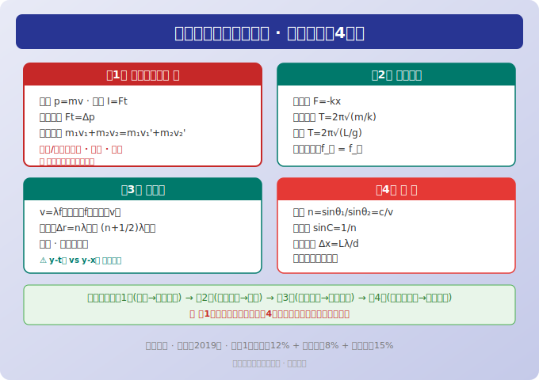
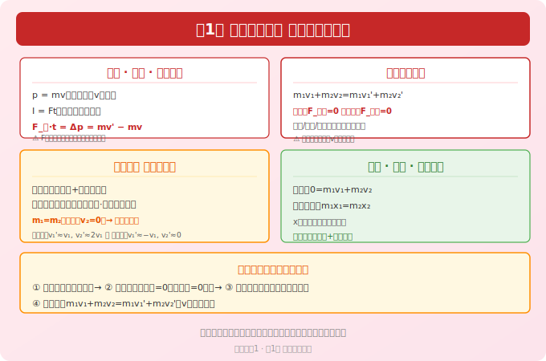
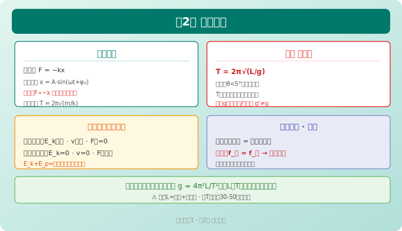
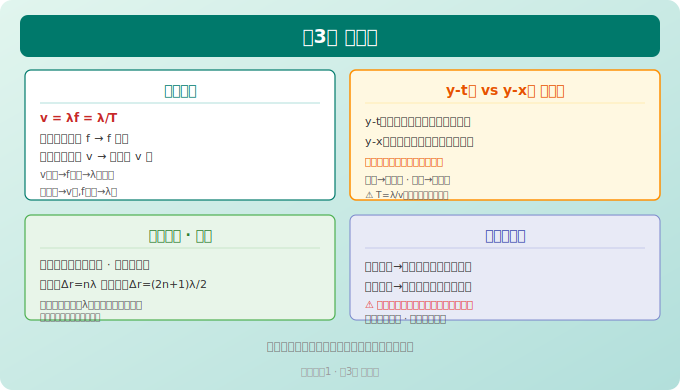
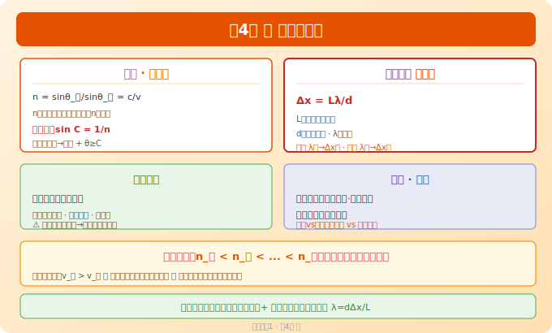

# 高中物理选择性必修第一册 · 知识图谱

> Eva · 西安（全国乙卷）· 人教版（2019版）
> 📝 最后更新：2026-05-31

---

## 全书概览（4章）

```
选必1 = 力学进阶 + 振动波动 + 光学
├── 第1章 动量守恒定律          ← 力学"第三大定律"（与牛二、能量并列）
├── 第2章 机械振动              ← 简谐运动、单摆、受迫振动
├── 第3章 机械波                ← 波的描述、干涉、衍射、多普勒效应
└── 第4章 光                    ← 折射、全反射、干涉、衍射、偏振
```

> 🔴 **全国乙卷规律：** 第1章动量守恒是力学压轴题的必备工具；第2-4章以选择题+实验题为主，光学大题偶尔出现。



---



## 第1章 动量守恒定律 ⭐⭐⭐⭐⭐

### 1.1 动量与冲量

| 概念 | 公式 | 说明 |
|------|------|------|
| 动量 p | p = mv | 矢量，方向与 v 相同 |
| 动量变化 Δp | Δp = p' - p = mv' - mv | 矢量差 |
| 冲量 I | I = Ft | 矢量，方向与 F 相同 |
| 动量定理 | Ft = Δp = mv' - mv | 合外力的冲量 = 动量变化量 |

#### 动量定理应用要点

| 步骤 | 内容 |
|------|------|
| ① 选取正方向 | 通常取初速度方向为正 |
| ② 写动量变化 | Δp = m(v' - v)，v' 和 v 带正负号 |
| ③ 列方程 | F_合·t = Δp |

> 🔴 **易错：** 动量定理中 F 是**合外力**。碰撞时间极短时可忽略重力（内力远大于外力）。

### 1.2 动量守恒定律

| 条件 | 说明 |
|------|------|
| 系统不受外力 | 理想条件 |
| 系统受外力但合外力=0 | 最常见条件（如光滑水平面） |
| 内力远大于外力 | 碰撞、爆炸等瞬时过程 |
| 某方向合外力=0 | 该方向动量守恒 |

$$
m_1v_1 + m_2v_2 = m_1v_1' + m_2v_2'
$$

### 1.3 碰撞分类 ⭐ 高频

| 类型 | 特点 | 公式 |
|------|------|------|
| **弹性碰撞** | 动量守恒 + 动能守恒 | 联立解 v₁'=(m₁-m₂)v₁/(m₁+m₂) + 2m₂v₂/(m₁+m₂) |
| **完全非弹性碰撞** | 动量守恒，碰后粘在一起 | m₁v₁+m₂v₂=(m₁+m₂)v'，动能损失最大 |
| **非弹性碰撞** | 动量守恒，动能有损失 | — |

#### 弹性碰撞特殊结论（背！）

| 情况 | v₁' | v₂' |
|------|-----|-----|
| m₁=m₂，v₂=0 | 0 | v₁（速度交换） |
| m₁≫m₂，v₂=0 | ≈v₁ | ≈2v₁ |
| m₁≪m₂，v₂=0 | ≈-v₁ | ≈0 |

> 🔑 **口诀：** 等质量弹性碰 → 交换速度；大碰小（静止）→ 小球飞走；小碰大（静止）→ 弹回来。

### 1.4 反冲与火箭

| 模型 | 原理 | 公式 |
|------|------|------|
| 反冲 | 动量守恒：0 = m₁v₁ + m₂v₂ | v₁ = -m₂v₂/m₁ |
| 人船模型 | 系统初动量为零，位移关系 | m₁x₁ = m₂x₂（x 为对地位移） |
| 火箭 | 动量守恒 + 反冲 | — |

---



## 第2章 机械振动

### 2.1 简谐运动

| 概念 | 公式/说明 |
|------|----------|
| 回复力 | F = -kx（与位移成正比、方向相反） |
| 位移方程 | x = A·sin(ωt + φ₀) |
| 周期（弹簧振子） | T = 2π√(m/k) |
| 单摆周期 | T = 2π√(L/g)（小角度，θ<5°） |

#### 简谐运动各量变化 ⚠️ 易混

| 位置 | x | F回 | a | v | E_k | E_p |
|------|:--:|:--:|:--:|:--:|:--:|:--:|
| 平衡位置 | 0 | 0 | 0 | 最大 | 最大 | 最小 |
| 最大位移处 | A | kA | kA/m | 0 | 0 | 最大 |

> 🔴 **注意：** 简谐运动中 E_k + E_p = 恒量（机械能守恒），但单个振子的 E_k 和 E_p 都随时间周期性变化。

### 2.2 单摆

| 知识点 | 内容 |
|--------|------|
| 回复力来源 | 重力的切向分力 mg·sinθ（非绳子拉力） |
| 周期公式 | T = 2π√(L/g) — 与振幅、摆球质量无关！ |
| 等效重力加速度 | 在加速系统中 g' = g ± a（取等效值） |
| 用单摆测重力加速度 | g = 4π²L/T² |

### 2.3 受迫振动与共振

| 概念 | 说明 |
|------|------|
| 固有频率 | 由系统本身决定（弹簧振子 f=(1/2π)√(k/m)） |
| 驱动力频率 | 周期性外力频率 |
| 受迫振动频率 | 等于驱动力频率（与固有频率无关） |
| 共振条件 | 驱动力频率 = 固有频率 → 振幅最大 |

---



## 第3章 机械波

### 3.1 波的描述

| 概念 | 公式/说明 |
|------|----------|
| 波长 λ | 相邻振动状态相同的两点距离 |
| 波速 | v = λ/T = λf（由介质决定） |
| 频率 | f = 1/T（由波源决定，与介质无关） |

> 🔴 **"波源决定频率，介质决定波速"** — 波从一种介质进入另一种介质时，f 不变，v 变 → λ 变。

### 3.2 波的图像（y-x 图）vs 振动图像（y-t 图）⚠️ 高考最爱对比

| | 振动图像 y-t | 波形图 y-x |
|------|-------------|-----------|
| 横轴 | 时间 t | 位置 x |
| 意义 | 一个质点位移随时间变化 | 某一时刻各质点位移分布 |
| 周期 | 直接读出 T | λ/v = T 间接求 |
| 波长 | 不能直接读 | 直接读出 λ |
| 判断质点振动方向 | — | "上下坡法"：上坡向下振，下坡向上振 |

### 3.3 波的干涉与衍射

| 现象 | 条件 | 特征 |
|------|------|------|
| **干涉** | 两列波频率相同、相位差恒定 | 某些区域振动加强（Δr=nλ），某些区域减弱（Δr=(2n+1)λ/2） |
| **衍射** | 障碍物尺寸与波长可比拟或更小 | 波长越长、障碍物越小→衍射越明显 |

> 🔑 **干涉图样：** 加强点始终加强，减弱点始终减弱（不是有时加强有时减弱）。

### 3.4 多普勒效应

| 情况 | 接收频率变化 |
|------|-------------|
| 波源靠近观察者 | 接收频率 > 波源频率（音调变高） |
| 波源远离观察者 | 接收频率 < 波源频率（音调变低） |

> ⚠️ 注意：波源频率本身不变，变的是**接收者感知的频率**！

---



## 第4章 光

### 4.1 光的折射

| 概念 | 公式 | 说明 |
|------|------|------|
| 折射定律 | n₁sinθ₁ = n₂sinθ₂ | — |
| 折射率 | n = sinθ_入/sinθ_折 = c/v | 与频率有关（频率越高 n 越大） |
| 光路可逆 | — | — |

> 🔴 **色散原理：** 同一介质中 n_红 < n_橙 < ... < n_紫，v_红 > v_橙 > ... > v_紫

### 4.2 全反射

| 条件 | 公式 |
|------|------|
| 光从光密→光疏介质 | n₁ > n₂ |
| 入射角≥临界角 C | sin C = 1/n（从介质→真空） |

| 应用 | 说明 |
|------|------|
| 光导纤维 | 内芯折射率 > 外套折射率 |
| 全反射棱镜 | 等腰直角棱镜，临界角约42° |

### 4.3 光的干涉 ⭐

| 类型 | 条件 | 条纹特征 |
|------|------|----------|
| 杨氏双缝干涉 | 相干光源（同一光源分束） | Δx = Lλ/d（等间距明暗条纹） |
| 薄膜干涉 | 薄膜上下表面反射光干涉 | 彩色条纹 |

#### 双缝干涉条纹间距公式 ⭐ 必考

$$
\Delta x = \frac{L\lambda}{d}
$$

| 符号 | 意义 | 关系 |
|------|------|------|
| Δx | 相邻明（暗）纹间距 | Δx 越大条纹越疏 |
| L | 双缝到屏距离 | L↑ → Δx↑ |
| λ | 光波长 | 红光 λ 大 → Δx 大 → 红光条纹比紫光宽 |
| d | 双缝间距 | d↑ → Δx↓ |

### 4.4 光的衍射与偏振

| 现象 | 说明 |
|------|------|
| 单缝衍射 | 中央亮纹宽且亮，两侧条纹宽度递减 |
| 圆孔衍射 | 艾里斑 |
| 偏振 | 证明光是横波（只有横波才能偏振） |

> 🔴 **干涉 vs 衍射区别：** 干涉是等间距条纹，单缝衍射是中央宽两侧窄的非等距条纹。

---

## 📊 全书公式速查

| 章节 | 核心公式 | 考试频率 |
|:----:|----------|:--------:|
| 第1章 | p=mv, Ft=Δp, m₁v₁+m₂v₂=m₁v₁'+m₂v₂' | ⭐⭐⭐⭐⭐ |
| 第2章 | T=2π√(m/k), T=2π√(L/g), F=-kx | ⭐⭐⭐ |
| 第3章 | v=λf, Δx=nλ(加强), Δx=(2n+1)λ/2(减弱) | ⭐⭐⭐ |
| 第4章 | n=sinθ₁/sinθ₂=c/v, sinC=1/n, Δx=Lλ/d | ⭐⭐⭐⭐ |

---

## ⚠️ 全册 Top 8 易错点

| # | 易错内容 | 正确理解 |
|---|----------|----------|
| 1 | 动量定理中 F=Δp/t | F 是**合外力**，碰撞中重力可忽略 |
| 2 | 动量守恒是标量式 | 动量是矢量！必须选正方向！ |
| 3 | 弹性碰撞动能守恒=碰后速度大小不变 | 可能改变方向（如 m₁=m₂ 碰后交换速度） |
| 4 | 单摆周期 T∝m 或 θ | T 只与 L 和 g 有关！与 m、θ(小角度)无关！ |
| 5 | 波速由频率决定 | **频率由波源决定，波速由介质决定！** |
| 6 | 干涉加强点始终加强 | 前提：两波源频率相同且相位差恒定 |
| 7 | 折射率 n=c/v 对所有光同一值 | n 随频率增大而增大（色散），紫光 n 最大 |
| 8 | 双缝干涉条纹间距 Δx∝1/λ | Δx = Lλ/d → λ 越大 Δx 越大 |

---

> 📝 最后更新：2026-05-31
