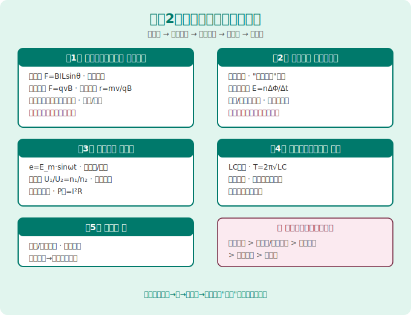
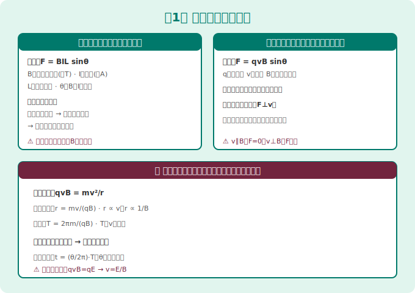
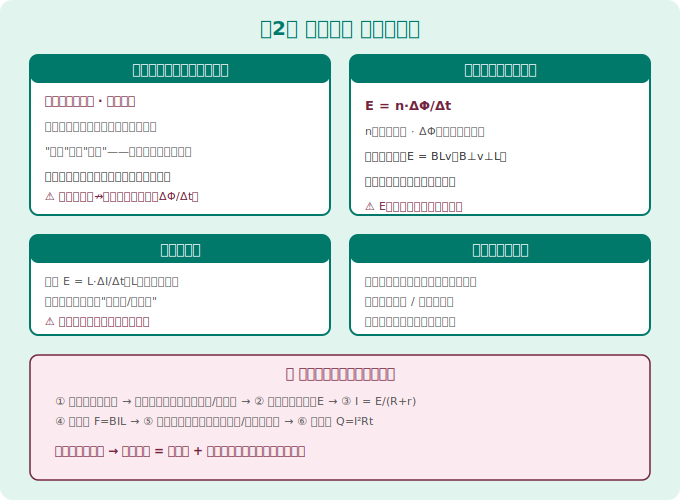
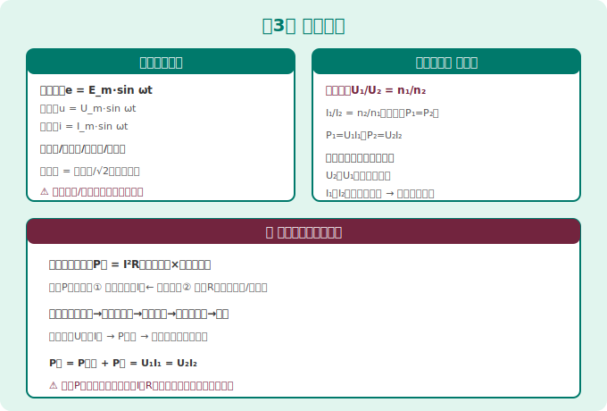
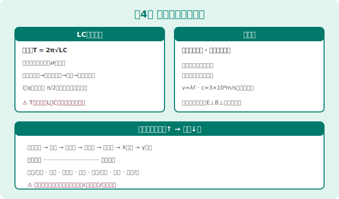
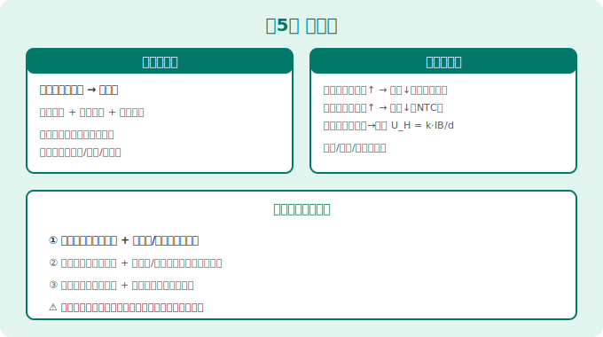

# 高中物理选择性必修第二册 · 知识图谱

> Eva · 西安（全国乙卷）· 人教版（2019版）
> 📝 最后更新：2026-05-31

---

## 全书概览（5章）

```
选必2 = 电磁学进阶（必修3的延伸）
├── 第1章 安培力与洛伦兹力      ← 磁场对电流/运动电荷的作用
├── 第2章 电磁感应              ← 磁生电 + 楞次定律 + 法拉第定律
├── 第3章 交变电流              ← 交流电 + 变压器 + 远距离输电
├── 第4章 电磁振荡与电磁波      ← LC振荡 + 电磁波发射接收
└── 第5章 传感器                ← 常见传感器原理（了解性内容）
```

> 🔴 **全国乙卷规律：** 第1-2章是选必2核心，电磁感应综合题（楞次定律+法拉第定律+安培力+能量）是物理压轴题的常客。第3章变压器每年必考1题。



---



## 第1章 安培力与洛伦兹力

### 1.1 安培力

| 概念 | 公式/说明 |
|------|----------|
| 安培力大小 | F = BIL·sinθ（θ为B与I夹角） |
| 方向判定 | 左手定则：磁感线穿掌心，四指=I方向，拇指=F方向 |
| B//I时 | F = 0 |
| B⊥I时 | F = BIL（最大值） |

### 1.2 洛伦兹力 ⭐

| 概念 | 公式/说明 |
|------|----------|
| 大小 | f = qvB·sinθ（θ为B与v夹角） |
| 方向 | 左手定则（注意：负电荷四指反向！） |
| 特点 | 洛伦兹力永不做功（F⊥v，只改变方向不改变速率） |

> ⚠️ **超级易错：** 负电荷用左手定则时，四指指向与v方向**相反**！

### 1.3 带电粒子在匀强磁场中的运动 ⭐⭐⭐⭐⭐

| 项目 | 公式 |
|------|------|
| 向心力来源 | qvB = mv²/r |
| 轨道半径 | r = mv/(qB) |
| 周期 | T = 2πm/(qB)（与速度无关！） |
| 回旋加速器 | 粒子最大动能取决于D形盒半径 |

#### 三种常见进出磁场模型

| 模型 | 特征 |
|------|------|
| 垂直进入 | 做完整圆周运动或半圆 |
| 角度进入 | 做圆弧，圆心角=2×偏转角 |
| 临界问题 | 从边界"恰好不射出"→找最大半径 |

> 🔑 **找圆心技巧：** ①作入射方向和出射方向的垂线→交点即圆心  ②已知入射方向+出射点→作入射垂线+弦的中垂线

### 1.4 洛伦兹力与现代科技

| 设备 | 原理 |
|------|------|
| 质谱仪 | 电场加速→磁场偏转→r=mv/(qB)→测m/q |
| 回旋加速器 | 电场加速+磁场回旋→f_电场=f_回旋=1/T |
| 速度选择器 | qE=qvB→v=E/B（只让特定速度粒子通过） |
| 磁流体发电机 | 等离子体→洛伦兹力分离正负电荷→产生电动势 |

---



## 第2章 电磁感应 ⭐⭐⭐⭐⭐

### 2.1 感应电流的产生条件

| 条件 | 说明 |
|------|------|
| 穿过闭合回路的**磁通量发生变化** | Φ=BS·cosθ 中任一因素变 |
| B变 / S变 / θ变 | 三种方式之一即可 |

### 2.2 楞次定律（判断感应电流方向）

> **核心表述：** 感应电流的磁场总是**阻碍**引起感应电流的磁通量变化。

#### 应用口诀："增反减同"

| 原磁通变化 | 感应磁场方向 | 口诀 |
|-----------|-------------|------|
| Φ增加 | 与原磁场**相反** | 增反 |
| Φ减少 | 与原磁场**相同** | 减同 |

> 🔑 **楞次定律四步法：** ① 判原磁场方向 → ② 判Φ的变化（增or减）→ ③ 用"增反减同"定感应磁场方向 → ④ 右手螺旋定感应电流方向

#### 右手定则（切割磁感线专用）

伸开右手：磁感线穿掌心，拇指=v方向，四指=感应电流方向。

### 2.3 法拉第电磁感应定律

$$
E = n\frac{\Delta\Phi}{\Delta t}
$$

| 类型 | 公式 | 适用 |
|------|------|------|
| 一般情况 | E = n·ΔΦ/Δt | 任何磁通量变化 |
| 导体切割磁感线 | E = BLv·sinθ（B、L、v两两垂直时E=BLv） | 平动切割 |
| 转动切割 | E = ½BL²ω | 导体棒绕一端转动 |

### 2.4 电磁感应中的电路问题 ⭐

| 步骤 | 内容 |
|------|------|
| ① | 确定等效电源（哪部分产生E） |
| ② | 画等效电路图（E+r+外电阻） |
| ③ | 用闭合电路欧姆定律求解 |

### 2.5 电磁感应中的能量问题 ⭐⭐⭐

> 核心：**克服安培力做的功 = 回路中产生的焦耳热**

| 过程 | 能量转化 |
|------|----------|
| 外力拉导体棒 | 机械能 → 电能 → 焦耳热 |
| 导体棒在磁场中减速 | 动能 → 电能 → 焦耳热 |
| 线圈中磁通量变化 | 磁场能/机械能 → 电能 → 焦耳热 |

### 2.6 自感

| 概念 | 说明 |
|------|------|
| 自感电动势 | E = L·ΔI/Δt（L为自感系数） |
| 通电自感 | 灯泡逐渐变亮（自感阻碍电流增大） |
| 断电自感 | 灯泡闪亮一下再灭（自感维持原电流） |

---



## 第3章 交变电流 ⭐⭐⭐⭐

### 3.1 正弦交变电流

| 概念 | 公式 |
|------|------|
| 瞬时值 | e = E_m·sin(ωt)，i = I_m·sin(ωt) |
| 峰值 | E_m = NBSω（N匝线圈面积S角速度ω） |
| 有效值 | E = E_m/√2，I = I_m/√2，U = U_m/√2 |
| 周期频率 | T = 2π/ω，f = 1/T |

> ⚠️ **有效值的使用：** 凡是说"220V交流电"，均为有效值！计算焦耳热用有效值！

### 3.2 变压器 ⭐ 必考

| 公式 | 说明 |
|------|------|
| U₁/U₂ = n₁/n₂ | 电压与匝数成正比 |
| I₁/I₂ = n₂/n₁（理想变压器） | 电流与匝数成反比 |
| P₁ = P₂（理想变压器） | 输入功率=输出功率 |

> 🔴 **变压器三决定关系：**
> - 副线圈电压U₂ **由 U₁ 和匝数比决定**
> - 副线圈电流I₂ **由 U₂ 和负载决定**
> - 原线圈电流I₁ **由 I₂ 和匝数比决定**（跟"负载需要多少就取多少"）

### 3.3 远距离输电

| 环节 | 说明 |
|------|------|
| 升压 | U升→I降→线路损耗 P_损=I²R 减小 |
| 输电线路 | P_损 = I²·R_线 = (P/U)²·R_线 |
| 降压 | 到用户端降回使用电压 |

> 🔑 **核心：** 提高输电电压是减小线路损耗的最有效措施！功率一定时，P_损 ∝ 1/U²。

---



## 第4章 电磁振荡与电磁波

| 知识点 | 内容 |
|--------|------|
| LC振荡 | T = 2π√(LC)，f = 1/(2π√(LC)) |
| 电磁波发射 | 开放电路+高频振荡 |
| 调制方式 | 调幅（AM）、调频（FM） |
| 电磁波接收 | 调谐→检波（解调） |

---



## 第5章 传感器

| 传感器类型 | 工作原理 |
|-----------|----------|
| 光敏电阻 | 光照越强，电阻越小 |
| 热敏电阻 | NTC：温度↑→电阻↓；PTC：温度↑→电阻↑ |
| 应变片 | 形变→电阻变化 |
| 霍尔元件 | 霍尔效应：U_H = k·IB/d |

---

## 📊 全书公式速查

| 章节 | 核心公式 | 考试频率 |
|:----:|----------|:--------:|
| 第1章 | F=BILsinθ, f=qvBsinθ, r=mv/(qB), T=2πm/(qB) | ⭐⭐⭐⭐⭐ |
| 第2章 | E=n·ΔΦ/Δt, E=BLv, 楞次定律"增反减同" | ⭐⭐⭐⭐⭐ |
| 第3章 | E=Em/√2, U₁/U₂=n₁/n₂, P_损=(P/U)²R | ⭐⭐⭐⭐ |
| 第4章 | T=2π√(LC) | ⭐⭐ |
| 第5章 | 传感器原理（定性了解） | ⭐ |

---

## ⚠️ 全册 Top 8 易错点

| # | 易错内容 | 正确理解 |
|---|----------|----------|
| 1 | 洛伦兹力做功能改变动能 | 洛伦兹力永不做功！（F⊥v）只改变方向 |
| 2 | 负电荷左手定则与正电荷相同 | 负电荷四指指向v的**反方向**！ |
| 3 | Φ大→感应电流大 | 感应电流取决于ΔΦ/Δt（变化率），不是Φ本身大 |
| 4 | 楞次定律"阻碍"=阻止 | 是"阻碍变化"不是"阻止变化"，最终还是会变 |
| 5 | 有效值=平均值 | 有效值=峰值/√2，平均值=2Em/π（不同！） |
| 6 | 变压器原线圈电流由U₁决定 | I₁由负载（副线圈）需要决定，"需要多少取多少" |
| 7 | 安培力一定做功 | 安培力可以做正功（电动机模型）或负功（发电机模型） |
| 8 | 远距离输电P_损与U无关 | P_损=(P/U)²R，U越大P_损越小 |

---

> 📝 最后更新：2026-05-31
