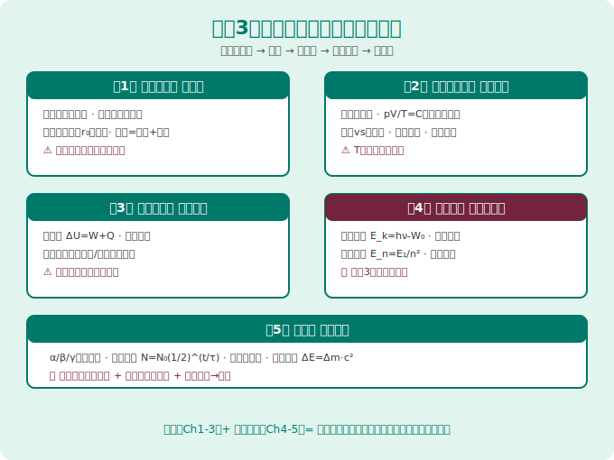
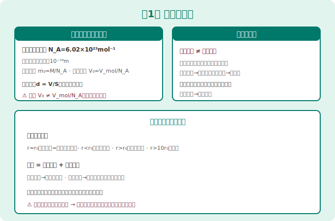
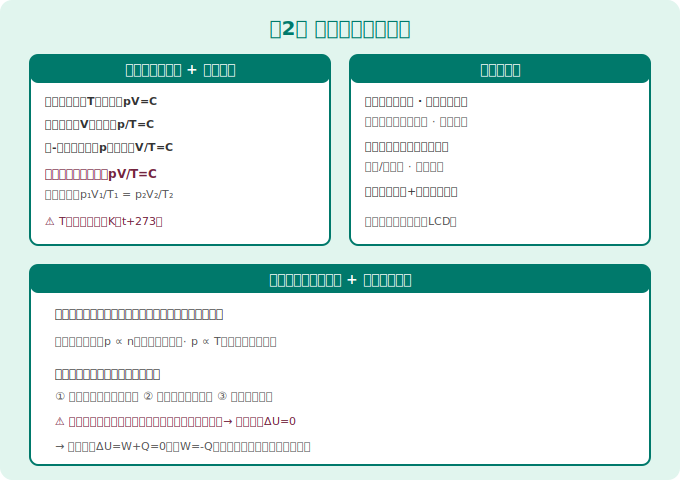
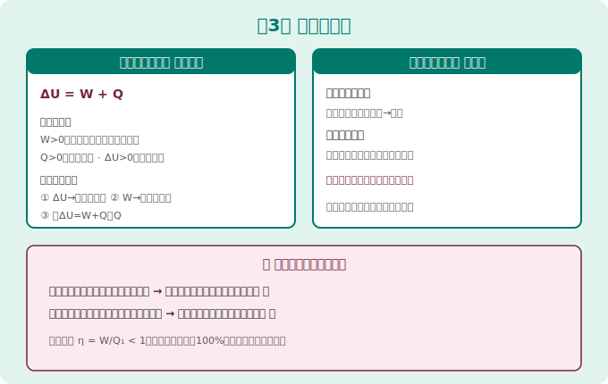
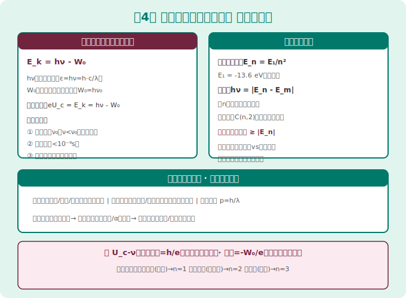
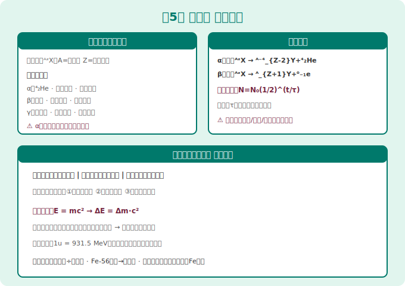

# 高中物理 选择性必修第三册 · 知识图谱

> Eva · 西安（全国乙卷）· 人教版（2019版）
> 📝 最后更新：2026-05-31

---

## 📚 全书概览

| 章 | 内容 | 核心考点 | 高考权重 |
|---|------|----------|:--------:|
| **第1章** | 分子动理论 | 阿伏加德罗常数、扩散/布朗运动、分子力曲线 | ⭐⭐⭐ |
| **第2章** | 气体、固体和液体 | 气体实验三定律、理想气体状态方程、表面张力 | ⭐⭐⭐⭐ |
| **第3章** | 热力学定律 | 热一律ΔU=W+Q、热二律两种表述、热机效率 | ⭐⭐⭐⭐ |
| **第4章** | 原子结构和波粒二象性 | 光电效应方程、玻尔模型、能级跃迁 | ⭐⭐⭐⭐⭐ |
| **第5章** | 原子核 | 核反应方程、质能方程E=mc²、半衰期 | ⭐⭐⭐⭐ |

> 🔴 全国乙卷：第4章 + 第5章 = 选必3必考组合（选择题常客），第2章气体定律出计算题



---



## 第1章 分子动理论

### 1.1 物质由大量分子组成

| 概念 | 公式/说明 |
|------|----------|
| 阿伏加德罗常数 | N_A = 6.02×10²³ mol⁻¹ |
| 分子大小数量级 | 10⁻¹⁰ m（直径） |
| 分子质量 | m₀ = M/N_A（M为摩尔质量） |
| 分子体积 | V₀ = V_mol/N_A（仅适用于固体、液体） |
| 油膜法测分子直径 | d = V/S（单分子油膜） |

> 🧪 实验：油膜法估测分子大小——重点掌握计算步骤！

### 1.2 分子热运动

| 现象 | 本质 | 影响因素 |
|------|------|----------|
| **扩散** | 分子无规则运动导致的物质迁移 | 温度↑→扩散加快 |
| **布朗运动** | 悬浮微粒被液体分子撞击的不规则运动 | 微粒越小、温度越高越明显 |

> 🔴 **超级易错：** 布朗运动不是液体分子的运动！它是**微粒**的运动，间接反映了液体分子的无规则运动。

### 1.3 分子间作用力

```
分子力曲线：
  r < r₀：斥力 > 引力 → 合力为斥力
  r = r₀：斥力 = 引力 → 合力为零（平衡位置）
  r > r₀：引力 > 斥力 → 合力为引力
  r > 10r₀：作用力忽略不计
```

| 状态 | r与r₀关系 | 分子力表现 |
|------|----------|-----------|
| 固体 | r ≈ r₀ | 引力=斥力，分子在平衡位置附近振动 |
| 液体 | r 略大于 r₀ | 引力为主导，分子可移动 |
| 气体 | r ≫ 10r₀ | 分子力可忽略，自由运动 |

### 1.4 温度和温标

| 概念 | 说明 |
|------|------|
| 热力学温度 T（单位K） | T = t + 273.15 |
| 摄氏温度 t（单位℃） | t = T - 273.15 |
| ΔT = Δt | 温差在两种温标下数值相同 |
| 绝对零度 | 0K = -273.15℃（不可达到） |

> ⚠ 温度是分子平均动能的标志，与分子势能无关！

### 1.5 内能

| 组成 | 说明 |
|------|------|
| 分子动能 | 所有分子动能之和，温度越高越大 |
| 分子势能 | 由分子间相对位置决定，与体积有关 |
| **内能 = 分子动能 + 分子势能** | 与温度和体积都有关 |

> 🔴 理想气体无分子势能（忽略分子间作用力）→ 内能只取决于温度！

---



## 第2章 气体、固体和液体

### 2.1 气体实验三定律

| 定律 | 条件 | 公式 | 图像 |
|------|------|------|------|
| **玻意耳定律** | T不变（等温） | pV = C（常数） | p-V双曲线 |
| **查理定律** | V不变（等容） | p/T = C | p-T过原点直线 |
| **盖-吕萨克定律** | p不变（等压） | V/T = C | V-T过原点直线 |

> ⚠ 上述公式中的T必须是**开尔文温标K**！

### 2.2 理想气体状态方程 ⭐⭐⭐⭐

```
pV/T = 常数（一定质量理想气体）
或 p₁V₁/T₁ = p₂V₂/T₂
```

**理想气体微观模型：**
- 分子本身无体积（质点）
- 除碰撞外无分子间作用力
- 碰撞为完全弹性碰撞
- **内能只取决于温度**

### 2.3 气体压强的微观解释

| 宏观量 | 微观解释 |
|--------|----------|
| 压强 p | 大量分子频繁撞击器壁的平均效果 |
| p∝n | 分子数密度越大→压强越大 |
| p∝T | 温度越高→分子平均动能越大→撞击越剧烈 |

### 2.4 固体

| 类型 | 熔点 | 各向 | 实例 |
|------|:---:|------|------|
| **晶体（单晶）** | 确定 | 各向异性 | 石英、食盐、云母 |
| **晶体（多晶）** | 确定 | 各向同性 | 金属、岩石 |
| **非晶体** | 无确定 | 各向同性 | 玻璃、松香、沥青 |

### 2.5 液体

| 概念 | 说明 |
|------|------|
| **表面张力** | 液体表面层分子间引力，使表面趋于收缩 |
| **浸润/不浸润** | 取决于附着层分子力与内聚力的比较 |
| **毛细现象** | 浸润液体在细管中上升，不浸润则下降 |
| **液晶** | 介于晶体和液体之间的状态（有流动性+光学各向异性） |

---



## 第3章 热力学定律

### 3.1 热力学第一定律 ⭐⭐⭐⭐

```
ΔU = W + Q（符号规定如下表）
```

| 物理量 | + | - |
|--------|---|---|
| W（做功） | 外界对系统做功 | 系统对外界做功 |
| Q（吸放热） | 系统吸热 | 系统放热 |
| ΔU（内能变化） | 内能增加 | 内能减少 |

> 🔴 **解题三步法：** ①判断ΔU方向（温度变化）→ ②判断W（体积变化）→ ③用ΔU=W+Q求Q

### 3.2 热力学第二定律

| 表述 | 内容 |
|------|------|
| **克劳修斯表述** | 热量不能自发地从低温物体传到高温物体 |
| **开尔文表述** | 不可能从单一热源吸收热量全部用来做功而不产生其他影响 |
| **实质** | 一切与热现象有关的宏观过程都具有**方向性** |

| 概念 | 说明 |
|------|------|
| 热机效率 | η = W/Q₁ < 1（不可能达到100%） |
| 熵 | 孤立系统的熵永不减小（熵增原理） |

### 3.3 能量守恒定律

> 能量既不会凭空产生，也不会凭空消失，只能从一种形式转化为另一种形式，或从一个物体转移到另一个物体，总量保持不变。

**第一类永动机**：不消耗能量而持续做功 → **违背热一律，不可能实现**
**第二类永动机**：从单一热源吸热全部做功 → **违背热二律，不可能实现**

---



## 第4章 原子结构和波粒二象性 ⭐⭐⭐⭐⭐

### 4.1 黑体辐射和能量量子化

| 概念 | 说明 |
|------|------|
| **黑体** | 能全部吸收各种波长电磁波的理想物体 |
| **能量子** | ε = hν（h = 6.63×10⁻³⁴ J·s） |
| **普朗克假设** | 电磁辐射的能量是不连续的 |

### 4.2 光电效应 ⭐⭐⭐⭐⭐

```
爱因斯坦光电效应方程：
E_k = hν - W₀
hν：光子能量（ε=hν=h·c/λ）
W₀：逸出功（金属特性常数）
E_k：最大初动能
```

| 规律 | 说明 |
|------|------|
| **截止频率 ν₀** | 仅当 ν ≥ ν₀ 时才有光电子（W₀ = hν₀） |
| **瞬时性** | 光照到产生光电子时间 < 10⁻⁹s |
| **饱和电流** | 光强越大→光子数越多→饱和电流越大 |
| **遏止电压** | eU_c = E_k = hν - W₀ |

> 🔴 **超级必考实验：** U_c-ν图像 → 斜率 = h/e，截距 = -W₀/e，所有金属斜率相同！

### 4.3 光的波粒二象性

| 表现 | 说明 |
|------|------|
| 波动性 | 干涉、衍射、偏振 |
| 粒子性 | 光电效应、康普顿效应 |
| 光子的动量 | p = h/λ |

> 大量光子表现波动性，个别光子表现粒子性；频率越低波动性越明显，频率越高粒子性越明显。

### 4.4 原子结构模型

| 模型 | 提出者 | 内容 |
|------|--------|------|
| 枣糕模型 | 汤姆孙 | 正电荷均匀分布，电子镶嵌其中 |
| 核式结构 | 卢瑟福 | α粒子散射实验→原子有核 |

> 🧪 **α粒子散射实验：** 绝大多数直穿→原子内部很空；少数大角度偏转→原子核质量大带正电

### 4.5 玻尔原子模型 ⭐⭐⭐⭐

```
氢原子能级：E_n = E₁/n²（E₁ = -13.6 eV）
跃迁：hν = |E_n - E_m|
```

| 概念 | 说明 |
|------|------|
| **基态** | n=1，能量最低最稳定 |
| **激发态** | n≥2，不稳定会自动跃迁回低能级 |
| **电离** | 从基态吸收 ≥13.6eV 能量使电子脱离原子 |
| **能级跃迁** | 吸收/放出光子，光子能量必须恰好等于能级差 |

> 🔴 **跃迁光谱计算：** 从n能级向低能级跃迁，最多产生 C(n,2) 种不同频率光子
>
> ⚠ 实物粒子碰撞激发：能量可以不是恰好等于能级差（多余能量由粒子带走）

---



## 第5章 原子核 ⭐⭐⭐⭐

### 5.1 原子核的组成

| 核子 | 符号 | 质量数 | 电荷 |
|------|------|:---:|:---:|
| 质子 | p 或 ¹₁H | 1 | +e |
| 中子 | n 或 ¹₀n | 1 | 0 |

> 原子核符号 ᴬᶻX：A=质量数（质子+中子），Z=质子数（原子序数）
> 同位素：质子数相同、中子数不同的原子（如 ¹²₆C、¹⁴₆C）

### 5.2 三种射线

| 射线 | 本质 | 电荷 | 穿透力 | 电离能力 |
|------|------|:---:|:---:|:---:|
| **α射线** | ⁴₂He核 | +2e | 最弱（纸可挡） | 最强 |
| **β射线** | 电子流 | -e | 中等（铝板挡） | 中等 |
| **γ射线** | 光子（电磁波） | 0 | 最强（铅板/混凝土） | 最弱 |

### 5.3 衰变

| 类型 | 方程 | 规律 |
|------|------|------|
| **α衰变** | ᴬᶻX → ᴬ⁻⁴_{Z-2}Y + ⁴₂He | 质量数-4，质子数-2 |
| **β衰变** | ᴬᶻX → ᴬ_{Z+1}Y + ⁰₋₁e | 质量数不变，质子数+1 |

```
衰变定律：N = N₀·(1/2)^(t/τ)
半衰期τ：放射性原子核剩下一半所需时间
```

> 🔴 半衰期由原子核内部决定，与温度、压强、化学状态**无关**！

### 5.4 核反应

| 反应类型 | 特点 | 实例 |
|----------|------|------|
| **人工转变** | 用粒子轰击原子核 | ¹⁴₇N+⁴₂He→¹⁷₈O+¹₁H（发现质子） |
| **核裂变** | 重核分裂 | ²³⁵₉₂U+¹₀n→¹⁴¹₅₆Ba+⁹²₃₆Kr+3¹₀n |
| **核聚变** | 轻核结合 | ²₁H+³₁H→⁴₂He+¹₀n |

### 5.5 质能方程 ⭐⭐⭐⭐⭐

```
E = mc²
ΔE = Δm·c²
```

| 概念 | 说明 |
|------|------|
| **质量亏损** | 核子结合成原子核时质量减少的量 |
| **结合能** | 核子结合成原子核释放的能量 |
| **比结合能** | 结合能÷核子数（越大越稳定） |

> 🔴 Fe-56比结合能最大→最稳定。轻核聚变和重核裂变都向Fe方向释放能量。
>
> ⚠ 计算时注意单位：Δm用kg时ΔE用J；Δm用u时 1u=931.5MeV

### 5.6 核反应方程书写要求

- ✅ 质量数守恒
- ✅ 电荷数守恒
- ✅ 用核符号书写（ᴬᶻX格式）
- ❌ 不能用化学方程式写法

---

## 📊 全书公式速查

| 公式 | 含义 | 章节 |
|------|------|:---:|
| d = V/S | 油膜法测分子直径 | Ch1 |
| N_A = 6.02×10²³ | 阿伏加德罗常数 | Ch1 |
| p₁V₁ = p₂V₂ | 玻意耳定律（等温） | Ch2 |
| p₁/T₁ = p₂/T₂ | 查理定律（等容） | Ch2 |
| V₁/T₁ = V₂/T₂ | 盖-吕萨克定律（等压） | Ch2 |
| pV/T = C | 理想气体状态方程 | Ch2 |
| ΔU = W + Q | 热力学第一定律 | Ch3 |
| E_k = hν - W₀ | 光电效应方程 | Ch4 |
| E_n = E₁/n² | 氢原子能级 | Ch4 |
| hν = ΔE | 能级跃迁条件 | Ch4 |
| N = N₀·(1/2)^(t/τ) | 衰变定律 | Ch5 |
| ΔE = Δm·c² | 质能方程 | Ch5 |
| 1u = 931.5 MeV | 原子质量单位换算 | Ch5 |

---

## 🔴 高频易错提醒

| 序号 | 易错点 | 正确理解 |
|:---:|--------|----------|
| 1 | 布朗运动 = 分子运动？ | ❌ 是微粒运动，**间接反映**分子运动 |
| 2 | 温度高→内能大？ | ❌ 内能还和体积（分子势能）有关 |
| 3 | 热传递改变内能等同做功？ | ✅ 都是能量转移方式，热一律统一 |
| 4 | 气体压强来自分子重力？ | ❌ 来自分子频繁碰撞器壁 |
| 5 | 光子能量越大→光电子越多？ | ❌ 光子能量决定能否打出，光强决定数量 |
| 6 | 半衰期受温度影响？ | ❌ 完全由核内部决定，不受外界影响 |
| 7 | 质量亏损 = 质量不守恒？ | ❌ 是静质量减少转化为能量，质能总量守恒 |

---

> 📝 最后更新：2026-05-31（创建）