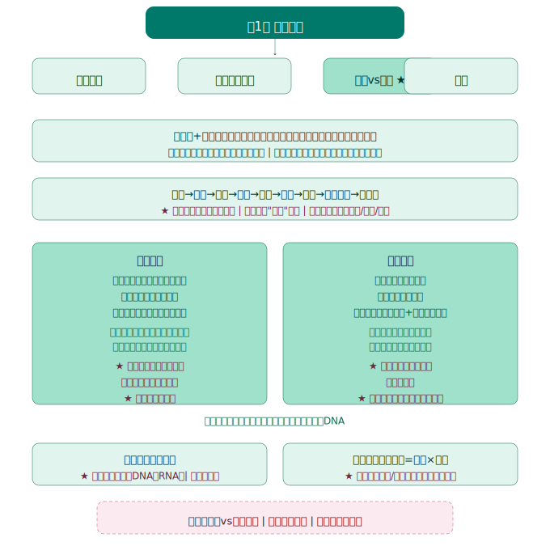
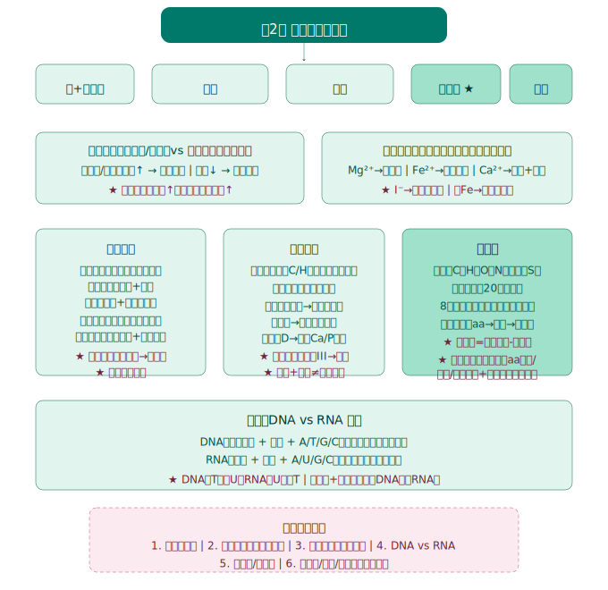
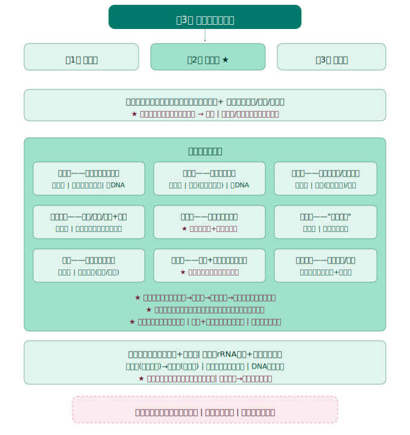
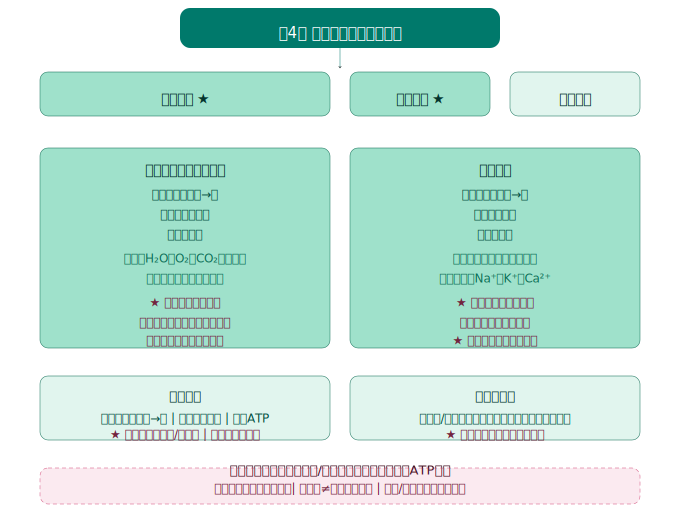
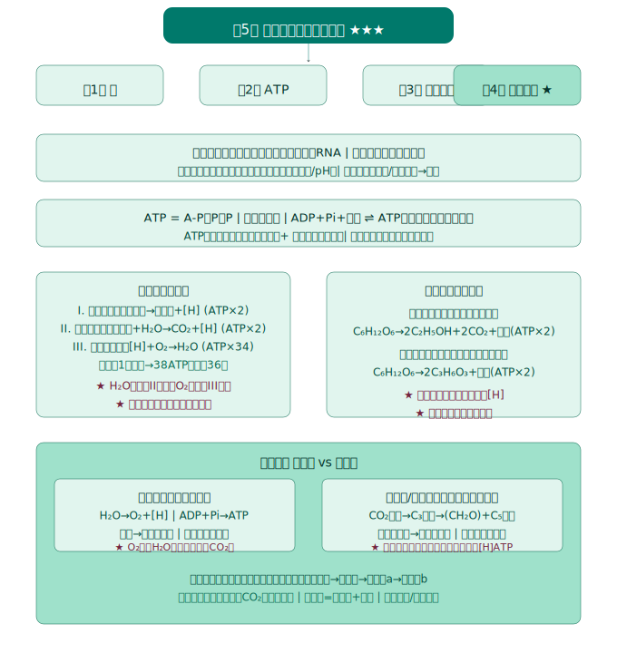
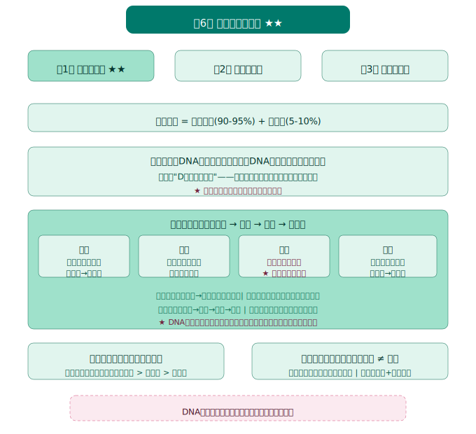
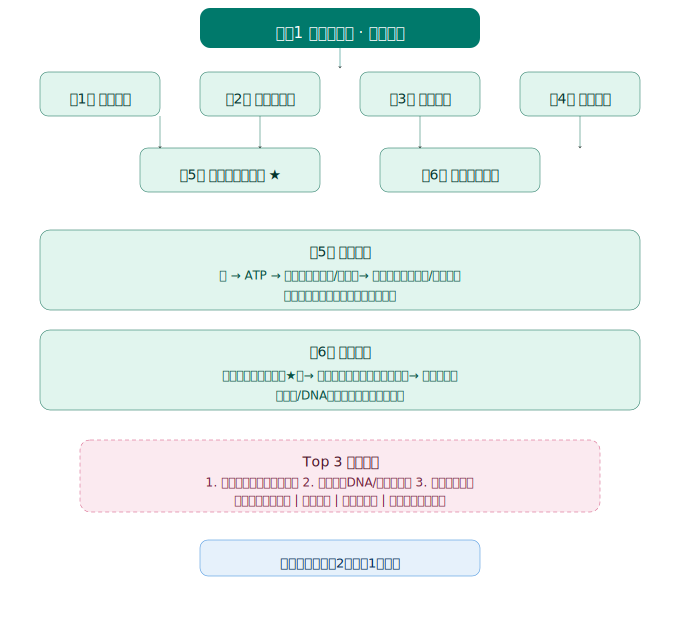

# 生物学必修1《分子与细胞》知识图谱

> Eva · 西安（全国乙卷）· 人教版 · 2019版

---

## 总体框架

**全书逻辑线：** 从"什么是细胞"出发 → 认识细胞的分子组成 → 了解细胞的结构 → 理解物质如何进出细胞 → 掌握细胞的能量代谢 → 认识细胞的生命历程（增殖→分化→衰老→死亡）

```
第1章 走近细胞        → 建立"细胞是基本生命系统"的观念
第2章 组成细胞的分子   → 分子层面认识细胞（元素→无机物→有机物）
第3章 细胞的基本结构   → 结构层面认识细胞（膜→质→核）
第4章 物质输入输出     → 功能层面（细胞膜的选择透过性）
第5章 能量供应和利用   → 代谢层面（酶→ATP→呼吸→光合）
第6章 细胞的生命历程   → 动态层面（增殖→分化→衰老→凋亡）
```

**各章地位：**
| 章节 | 在高考中的分量 | 说明 |
|:---:|:---:|------|
| 第1章 | ⭐ | 基础概念，选择题常客 |
| 第2章 | ⭐⭐⭐ | 蛋白质、核酸是分子生物学基础 |
| 第3章 | ⭐⭐ | 细胞器功能是高频考点 |
| 第4章 | ⭐⭐ | 物质运输方式对比 |
| 第5章 | ⭐⭐⭐⭐⭐ | **重中之重！** 酶+ATP+呼吸+光合≈高考必考大题 |
| 第6章 | ⭐⭐⭐ | 有丝分裂、细胞分化、凋亡 |

---



## 第1章 走近细胞

> 地位：建立"细胞是生命活动的基本单位"这一核心观念，为后续全部章节奠基。

### 第1节 细胞是生命活动的基本单位

#### 核心概念
- **细胞学说**（施莱登 & 施旺）：①细胞是一个有机体，一切动植物都由细胞发育而来；②细胞是一个相对独立的单位；③新细胞由老细胞分裂产生
- **生命系统的结构层次**：细胞→组织→器官→系统→个体→种群→群落→生态系统→生物圈
  - 细胞是**最基本的生命系统**
  - 分子、原子不属于生命系统
- **病毒**：无细胞结构，必须寄生在**活细胞**内；仅含一种核酸（DNA或RNA）

#### 易错提醒
- ❌ 细胞学说并未涉及"病毒"和"原核细胞"（时代局限）
- ❌ 生命系统层次中，植物没有"系统"层次
- ❌ 单细胞生物没有"组织、器官、系统"层次

### 第2节 细胞的多样性和统一性

#### 核心概念
- **原核细胞 vs 真核细胞** 比较：

| 比较项目 | 原核细胞 | 真核细胞 |
|---------|---------|---------|
| 细胞核 | 无核膜（拟核） | 有核膜包被的细胞核 |
| 染色体 | 无（有环状DNA） | 有染色体（DNA+蛋白质） |
| 细胞器 | 仅有核糖体 | 多种膜性细胞器 |
| 典型生物 | 细菌、蓝细菌、放线菌 | 动植物、真菌 |
| 细胞壁成分 | 肽聚糖（细菌） | 纤维素/果胶（植物）、几丁质（真菌） |

- **蓝细菌**：无叶绿体但含**叶绿素和藻蓝素**，能进行光合作用（自养）
- **高倍显微镜**使用：先低倍镜→再高倍镜；高倍镜下**不能调节粗准焦螺旋**

#### 易错提醒
- ❌ "蓝细菌是植物"——错误，它是原核生物
- ❌ 原核生物≠没有DNA，它有环状DNA分子
- ❌ 带"菌"字不一定是原核：酵母菌是真菌（真核）

---



## 第2章 组成细胞的分子

> 地位：从分子层面认识细胞，蛋白质和核酸是贯穿高中生物的核心分子。

### 第1节 细胞中的元素和化合物

#### 核心概念
- **大量元素**：C、H、O、N、P、S、K、Ca、Mg
- **微量元素**：Fe、Mn、Zn、Cu、B、Mo
- **最基本元素**：C（碳链是有机物的骨架）
- **化合物含量**：水(85-90%) > 蛋白质(7-10%) > 脂质(1-2%) > 无机盐(1-1.5%) > 糖类和核酸(1-1.5%)

#### 实验：检测生物组织中的有机物
| 待测物 | 试剂 | 颜色变化 | 条件 |
|-------|------|---------|------|
| 还原糖 | 斐林试剂 | 蓝色→砖红色沉淀 | 50-65℃水浴加热 |
| 脂肪 | 苏丹III染液 | 橘黄色 | — |
| 蛋白质 | 双缩脲试剂 | 紫色 | 先NaOH后CuSO₄ |

#### 易错提醒
- ❌ 斐林试剂与双缩脲试剂的CuSO₄浓度不同！斐林0.05g/mL，双缩脲0.01g/mL
- ❌ 甘蔗汁不适合做还原糖鉴定（含蔗糖，非还原糖）

### 第2节 细胞中的无机物

#### 核心概念
- **自由水 vs 结合水**：自由水是溶剂、参与反应；结合水是细胞结构的组成部分
- 代谢旺盛时，**自由水/结合水 比值高**（如萌发种子）
- 抗逆性强时，**自由水/结合水 比值低**（如越冬植物）
- **无机盐**：主要以**离子**形式存在
  - Fe²⁺→血红蛋白；Mg²⁺→叶绿素；I⁻→甲状腺激素
  - Ca²⁺→骨骼；P→ATP/核酸/磷脂

#### 易错提醒
- ❌ "晒干的种子不含水"——错误，晒干主要失去自由水，结合水仍存在
- ❌ 无机盐不是都溶于水（如CaCO₃不溶于水但仍是无机盐）

### 第3节 细胞中的糖类和脂质

#### 核心概念
**糖类分类：**

| 类别 | 举例 | 特点 |
|------|------|------|
| 单糖 | 葡萄糖、果糖、半乳糖、核糖 | 不能水解 |
| 二糖 | 蔗糖、麦芽糖、乳糖 | 水解产生两分子单糖 |
| 多糖 | 淀粉、纤维素、糖原 | 由葡萄糖缩合而成 |

- **动植物共有的糖**：葡萄糖、核糖、脱氧核糖
- **植物特有**：蔗糖、麦芽糖、淀粉、纤维素
- **动物特有**：乳糖、糖原

**脂质分类：**
- 脂肪（甘油三酯）：储能、保温、缓冲
- 磷脂：细胞膜的基本骨架（亲水头+疏水尾）
- 固醇：胆固醇（动物细胞膜）、性激素、维生素D

#### 易错提醒
- ❌ 纤维素不能被人体消化≠纤维素不是能源物质（草食动物能消化）
- ❌ 多糖彻底水解→葡萄糖（不仅是淀粉）

### 第4节 蛋白质是生命活动的主要承担者 ★

#### 核心概念
- **氨基酸**：至少含一个氨基(-NH₂)和一个羧基(-COOH)，且连在**同一个碳原子**上
- **必需氨基酸**（8种）：人体不能合成，必须从食物获取
- **肽键**：-CO-NH-（脱水缩合形成，脱去1分子水）
- **结构层次**：氨基酸 → 多肽链 → 空间结构 → 蛋白质
- **蛋白质多样性原因**：①氨基酸种类/数量/排列顺序 ②肽链盘曲折叠方式

**相关计算：**
- 肽键数 = 氨基酸数 - 肽链数 = 脱去水分子数
- 至少含有的氨基数 = 肽链数
- 蛋白质相对分子质量 = 氨基酸数×氨基酸平均分子量 - 脱水数×18

#### 规律总结
- 蛋白质变性：空间结构被破坏（加热/强酸强碱/重金属），肽键未断裂
- 盐析：蛋白质溶解度降低而析出，空间结构不变，加水可复溶

#### 易错提醒
- ❌ "每种氨基酸都只有一个氨基和一个羧基"——错！R基上也可能有
- ❌ 变性后不能用双缩脲试剂检测——错！依旧可以（肽键还在）

### 第5节 核酸是遗传信息的携带者

#### 核心概念
**DNA vs RNA：**

| 比较 | DNA | RNA |
|------|-----|-----|
| 五碳糖 | 脱氧核糖 | 核糖 |
| 碱基 | A、T、G、C | A、U、G、C |
| 结构 | 双链螺旋 | 单链 |
| 分布 | 细胞核（主）、线粒体、叶绿体 | 细胞质（主） |

- **核苷酸** = 磷酸 + 五碳糖 + 含氮碱基
- 核酸的功能：携带遗传信息，控制蛋白质合成

#### 易错提醒
- ❌ "DNA只存在于细胞核"——错！线粒体和叶绿体也有DNA
- ❌ 原核细胞的DNA在拟核和质粒中

---



## 第3章 细胞的基本结构

> 地位：建立"结构决定功能"的生物学核心观念。细胞膜和细胞器是选择题、填空题高频考点。

### 第1节 细胞膜的结构和功能

#### 核心概念
- **细胞膜的功能**：①将细胞与外界隔开 ②控制物质进出 ③进行细胞间信息交流
- **流动镶嵌模型**（辛格 & 尼科尔森）：
  - 基本骨架：**磷脂双分子层**
  - 蛋白质：镶嵌、贯穿或附着
  - 糖蛋白（糖被）：识别功能，位于细胞膜外侧
- **结构特点**：具有**流动性**（磷脂分子和大多数蛋白质可运动）
- **功能特点**：具有**选择透过性**

#### 规律总结
- 细胞融合实验（荧光标记）证明了膜的流动性
- 细胞膜成分：脂质约50%、蛋白质约40%、糖类2-10%

#### 易错提醒
- ❌ 混淆"流动性"（结构特点）与"选择透过性"（功能特点）

### 第2节 细胞器之间的分工合作 ★

#### 核心概念
**八大细胞器功能速记表：**

| 细胞器 | 膜层数 | 功能 | 分布特点 |
|--------|:---:|------|---------|
| 线粒体 | 双层 | 有氧呼吸主要场所（**动力车间**） | 动植物 |
| 叶绿体 | 双层 | 光合作用场所（**养料制造车间**） | 植物 |
| 内质网 | 单层 | 蛋白质加工、脂质合成 | 动植物 |
| 高尔基体 | 单层 | 加工/分类/包装蛋白质（**发送站**） | 动植物 |
| 溶酶体 | 单层 | 分解衰老细胞器、病菌（**消化车间**） | 动物为主 |
| 液泡 | 单层 | 调节渗透压、储存物质 | 植物为主 |
| 核糖体 | **无膜** | 蛋白质合成 | 所有细胞 |
| 中心体 | **无膜** | 与有丝分裂有关 | 动物+低等植物 |

- **分泌蛋白合成路径**：核糖体→内质网→高尔基体→细胞膜→胞外（线粒体供能）
- **生物膜系统**：细胞膜+核膜+细胞器膜（结构和功能紧密联系）

#### 易错提醒
- ❌ "所有植物细胞都有叶绿体"——错！根尖细胞没有
- ❌ "所有动物细胞都有中心体"——错！哺乳动物成熟红细胞没有
- ❌ 核糖体不属于生物膜系统（无膜结构）

### 第3节 细胞核的结构和功能

#### 核心概念
- **细胞核结构**：核膜（双层）→核孔→核仁→染色质
- **核孔**：大分子进出通道（RNA出、蛋白质进），具有**选择性**
- **染色质** 与 **染色体** 是**同种物质在不同时期的两种形态**
  - 染色质：细丝状（间期）←→ 染色体：棒状（分裂期）
- **功能**：遗传信息库，细胞代谢和遗传的控制中心

#### 易错提醒
- ❌ 核孔是自由通道——错！大分子进出需要消耗能量
- ❌ "所有的DNA都在细胞核"——错！线粒体和叶绿体也有DNA

---



## 第4章 细胞的物质输入和输出

> 地位：核心概念"选择透过性膜"的具体展开，理解物质跨膜运输对后续神经调节等至关重要。

### 第1节 被动运输

#### 核心概念
**自由扩散 vs 协助扩散：**

| 比较 | 自由扩散 | 协助扩散 |
|------|---------|---------|
| 是否需要载体 | ❌ 不需要 | ✅ 需要转运蛋白 |
| 是否需要能量 | ❌ 不需要 | ❌ 不需要 |
| 方向 | 高浓度→低浓度 | 高浓度→低浓度 |
| 举例 | O₂、CO₂、甘油、苯 | 葡萄糖进红细胞、水(水通道蛋白) |

- **渗透作用**：水分子通过**半透膜**从低浓度溶液向高浓度溶液的扩散
- **质壁分离**：植物细胞失水时，原生质层与细胞壁分离
  - 条件：①有细胞壁 ②有大液泡 ③外界溶液浓度 > 细胞液浓度
- 质壁分离复原有"自动复原"现象（如KNO₃、尿素等溶质可进入细胞）

#### 易错提醒
- ❌ 水分子只能自由扩散——错！水通道蛋白（协助扩散）也是重要方式
- ❌ 动物细胞不能质壁分离（无细胞壁）

### 第2节 主动运输与胞吞、胞吐

#### 核心概念
**跨膜运输方式对比：**

| 运输方式 | 载体蛋白 | 能量 | 方向 | 举例 |
|---------|:---:|:---:|------|------|
| 自由扩散 | ❌ | ❌ | 高→低 | O₂、CO₂、甘油 |
| 协助扩散 | ✅ | ❌ | 高→低 | 葡萄糖进红细胞 |
| 主动运输 | ✅ | ✅(ATP) | 低→高 | Na⁺/K⁺泵、植物吸收矿质离子 |
| 胞吞 | ❌ | ✅(ATP) | 细胞外→内 | 白细胞吞噬病菌 |
| 胞吐 | ❌ | ✅(ATP) | 细胞内→外 | 分泌蛋白释放 |

- **主动运输的意义**：保证活细胞按生命活动需要**主动选择**吸收所需物质

#### 易错提醒
- ❌ 胞吞/胞吐不属于跨膜运输——对！但它们确实涉及膜的流动性
- ❌ 只有主动运输消耗能量——错！胞吞胞吐也消耗能量

---



## 第5章 细胞的能量供应和利用 ★★★

> 地位：**全书最重要的章节！** 酶、ATP、呼吸作用、光合作用——每年高考大题必考。

### 第1节 降低化学反应活化能的酶

#### 核心概念
- **酶的本质**：绝大多数是**蛋白质**，极少数是**RNA**（核酶）
- **酶的作用机理**：降低化学反应的**活化能**
- **酶的特性**：
  ① **高效性**（与无机催化剂相比）
  ② **专一性**（"一把钥匙开一把锁"——锁钥学说）
  ③ **作用条件温和**（最适温度和pH）

- **影响酶活性的因素**：
  - 低温→活性降低（可恢复）
  - 高温/强酸/强碱→空间结构破坏→**失活**（不可恢复）
  - 重金属→使酶失活

#### 实验考点
- 过氧化氢酶的实验中，不能用H₂O₂来探究温度对酶活性的影响（H₂O₂受热分解）
- 探究pH的影响时，不能用淀粉酶（淀粉遇酸会水解）

#### 易错提醒
- ❌ "酶为化学反应提供能量"——错！酶降低活化能，不提供能量
- ❌ "低温使酶变性失活"——错！低温只抑制活性，升温可恢复

### 第2节 细胞的能量"货币"ATP

#### 核心概念
- **ATP结构**：A（腺苷）—P～P～P（一个腺苷+三个磷酸基团）
- **高能磷酸键**："～"表示，含较高能量
- **ATP ↔ ADP 转化**：ATP ⇌ ADP + Pi + 能量
  - 放能方向：ATP→ADP（为生命活动供能）
  - 储能方向：ADP→ATP（需要能量,来自呼吸作用或光合作用）
- **ATP的利用**：主动运输、肌肉收缩、生物发光、大脑思考等

#### 规律总结
- ATP在细胞中含量少，但转化速度极快（ATP ↔ ADP 转化永不停止）
- ATP ≠ 唯一直接能源物质（还有GTP、CTP等，但ATP是主要形式）

#### 易错提醒
- ❌ ATP与ADP的转化为可逆反应——错！催化两个方向的**酶不同**，条件不同
- ❌ ATP就是能量——错！ATP是储存能量的物质，不是能量本身

### 第3节 细胞呼吸的原理和应用 ★★

#### 核心概念
**有氧呼吸三阶段：**

| 阶段 | 场所 | 反应物 | 产物 | 释放能量 | ATP |
|------|------|--------|------|:---:|:---:|
| 第一阶段(糖酵解) | 细胞质基质 | 葡萄糖 | 丙酮酸+[H] | 少量 | 2 |
| 第二阶段 | 线粒体基质 | 丙酮酸+H₂O | CO₂+[H] | 少量 | 2 |
| 第三阶段 | 线粒体内膜 | [H]+O₂ | H₂O | **大量** | 34 |

- **总反应式**：C₆H₁₂O₆ + 6O₂ + 6H₂O → 6CO₂ + 12H₂O + 能量（酶催化）

**无氧呼吸：**

| 类型 | 生物 | 产物 | ATP |
|------|------|------|:---:|
| 酒精发酵 | 酵母菌、大多数植物 | 酒精(C₂H₅OH) + CO₂ | 2 |
| 乳酸发酵 | 动物、乳酸菌、马铃薯块茎 | 乳酸(C₃H₆O₃) | 2 |

#### 规律总结
- 有氧呼吸中H₂O的消耗→第二阶段；O₂的消耗→第三阶段
- CO₂释放量≠O₂消耗量时，可能有无氧呼吸（或有其他底物氧化）
- **呼吸商(RQ)** = CO₂释放量/O₂消耗量；葡萄糖呼吸商=1

#### 易错提醒
- ❌ 线粒体能直接分解葡萄糖——错！先糖酵解成丙酮酸才能进入线粒体
- ❌ 无氧呼吸不产生[H]——错！第一阶段仍产生[H]，只是不用O₂做受体

### 第4节 光合作用与能量转化 ★★

#### 核心概念
**光合色素：**
| 色素 | 颜色 | 主要吸收光 |
|------|:---:|------|
| 叶绿素a | 蓝绿色 | 红光、蓝紫光 |
| 叶绿素b | 黄绿色 | 红光、蓝紫光 |
| 胡萝卜素 | 橙黄色 | **蓝紫光** |
| 叶黄素 | 黄色 | **蓝紫光** |

- 色素分离（纸层析法）：溶解度大→跑得快→在滤纸条上方
  - 从上到下：胡萝卜素→叶黄素→叶绿素a→叶绿素b

**光反应 vs 暗反应（卡尔文循环）：**

| 比较 | 光反应 | 暗反应 |
|------|--------|--------|
| 场所 | 类囊体薄膜 | 叶绿体基质 |
| 条件 | 光、色素、酶 | 酶（不需光，但需光反应提供ATP和[H]） |
| 物质变化 | H₂O→O₂+[H]；ADP+Pi→ATP | CO₂固定→C₃还原→(CH₂O)+C₅再生 |
| 能量变化 | 光能→活跃化学能 | 活跃化学能→稳定化学能 |

- **光合作用总反应式**：6CO₂ + 12H₂O → C₆H₁₂O₆ + 6O₂ + 6H₂O（光能、叶绿体）

#### 影响因素
- 光照强度、CO₂浓度、温度
- **光补偿点**：光合速率 = 呼吸速率
- **光饱和点**：光合速率不再随光强增大

#### 易错提醒
- ❌ 光合产物只有葡萄糖——错！产物是(CH₂O)，最终可转化为淀粉、蔗糖等
- ❌ O₂来自CO₂——错！O₂来自**H₂O的光解**
- ❌ 暗反应不需要光=暗反应只能在暗处进行——错！不需要光 ≠ 有光不能进行

---



## 第6章 细胞的生命历程

> 地位：核心概念"细胞是生命活动的基本单位"的动态展开，有丝分裂是重难点。

### 第1节 细胞的增殖 ★★

#### 核心概念
- **细胞周期**：连续分裂的细胞，从一次分裂完成→下一次分裂完成
  - 分裂间期（90%-95%）：DNA复制、蛋白质合成
  - 分裂期（5%-10%）：前期→中期→后期→末期

**有丝分裂各时期要点（植物细胞）：**

| 时期 | 主要变化 | 记忆口诀 |
|------|---------|---------|
| 间期 | DNA复制、蛋白质合成；染色质状 | "D复蛋合做准备" |
| 前期 | 染色质→染色体；核膜核仁消失；纺锤体形成 | "膜仁消失两体现" |
| 中期 | 染色体排列在赤道板；形态最清晰 | "形定数清赤道齐" |
| 后期 | 着丝粒分裂；姐妹染色单体分开 | "粒裂数增均两极" |
| 末期 | 核膜核仁重现；纺锤体消失；细胞板→细胞壁 | "两消两现板成壁" |

**动植物有丝分裂区别：**

| 区别 | 植物 | 动物 |
|------|------|------|
| 纺锤体形成 | 细胞两极发出纺锤丝 | 中心体发出星射线 |
| 细胞质分裂 | 细胞板→细胞壁 | 细胞膜向内缢裂 |

**染色体/DNA数量变化：**
- 间期：DNA加倍(2n→4n)，染色体不变(2n)
- 后期：着丝粒分裂→染色体数加倍(2n→4n)
- 末期：细胞分裂→染色体和DNA恢复(2n,2n)

#### 实验：观察根尖分生区有丝分裂
- 步骤：解离→漂洗→染色→制片
- 解离液：15%盐酸 + 95%酒精(1:1)
- 染液：甲紫溶液或醋酸洋红液
- 观察：先低倍后高倍，**分生区细胞呈正方形，排列紧密**

#### 易错提醒
- ❌ 细胞周期=分裂间期+分裂期——错！只有连续分裂的细胞才有细胞周期
- ❌ "DNA在后期加倍"——错！DNA在间期复制加倍，后期加倍的是染色体数

### 第2节 细胞的分化

#### 核心概念
- **细胞分化**：在个体发育中，由一个或一种细胞增殖产生的后代，在形态、结构和功能上发生**稳定性差异**的过程
- 实质：**基因的选择性表达**（遗传物质不变）
- **细胞全能性**：细胞经分裂分化后，仍具有产生完整有机体或分化成其他各种细胞的潜能
  - 全能性大小：受精卵 > 早期胚胎细胞 > 干细胞 > 体细胞
  - 植物细胞 > 动物细胞（高度分化的植物细胞仍保持全能性）

#### 规律总结
- 分化程度越高，全能性越低（特例：卵细胞分化程度高但全能性高）
- 已分化动物细胞的**细胞核**具有全能性（克隆羊多莉原理）

#### 易错提醒
- ❌ "细胞分化使遗传物质改变"——错！分化是基因选择性表达，遗传物质不变
- ❌ 所有高度分化细胞都丧失全能性——错！植物细胞仍具全能性

### 第3节 细胞的衰老和死亡

#### 核心概念
**细胞衰老特征（"一大一小一多两低"）：**

| 特征 | 描述 |
|------|------|
| 核增大 | 核膜内折，染色质收缩 |
| 体积变小 | 水分减少，细胞萎缩 |
| 色素积累 | 脂褐素（老年斑成因） |
| 酶活性降低 | 如酪氨酸酶↓→白发 |
| 膜通透性改变 | 物质运输功能降低 |

- **细胞衰老学说**：自由基学说、端粒学说
- **细胞凋亡**：由**基因**决定的细胞自动结束生命的过程（程序性死亡）
  - 细胞凋亡≠细胞坏死（坏死是意外损伤导致）
- **细胞自噬**：溶酶体降解自身结构，维持内部环境稳定

#### 规律总结
- 单细胞生物：细胞衰老=个体衰老
- 多细胞生物：细胞衰老≠个体衰老（体内细胞不断更新）

#### 易错提醒
- ❌ "细胞凋亡对生物体不利"——错！细胞凋亡是有利的，是正常生命活动
- ❌ 细胞坏死=细胞凋亡——错！凋亡是程序性死亡，坏死是被动死亡

---

## 全书核心考点速记卡

| 排名 | 考点 | 出现频率 | 提醒 |
|:---:|------|:---:|------|
| 🥇 | 光合作用与呼吸作用综合 | 每年必考 | CO₂/O₂变化量、影响因素、曲线分析 |
| 🥈 | 有丝分裂过程与DNA/染色体数量变化 | 极高 | 动植物区别、各时期特征 |
| 🥉 | 蛋白质结构与功能 | 高 | 计算肽键数、脱水数、分子量 |
| 4 | 跨膜运输方式判断 | 高 | 尤其注意协助扩散和主动运输的区分 |
| 5 | 细胞器结构与功能 | 高 | 双层膜/无膜细胞器归纳 |
| 6 | 酶的特性与影响因素 | 中高 | 温度/pH对酶活性的曲线 |
| 7 | ATP结构与转化 | 中 | ATP与ADP的相互转化 |
| 8 | 原核与真核比较 | 中 | 蓝细菌的光合作用 |
| 9 | 细胞分化与全能性 | 中 | 基因的选择性表达 |
| 10 | 细胞凋亡与坏死 | 中 | 区分程序性死亡和被动死亡 |

---



> 最后更新：2026-05-30
