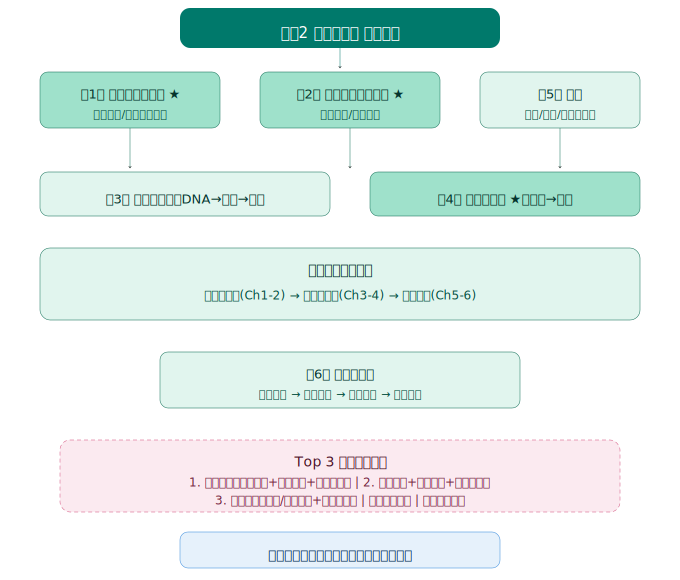
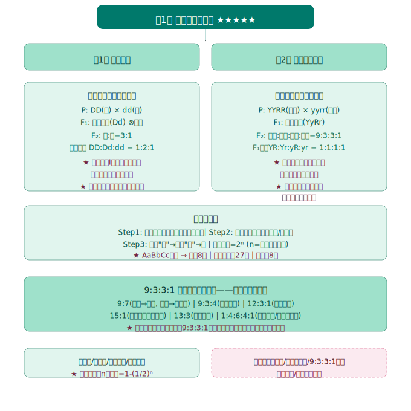
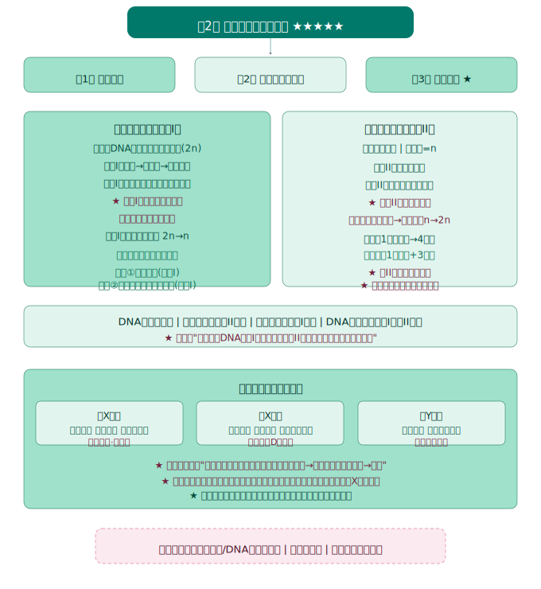
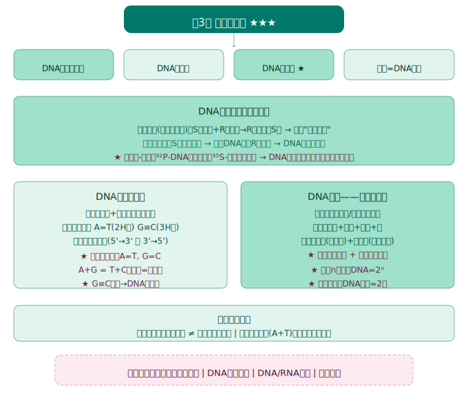
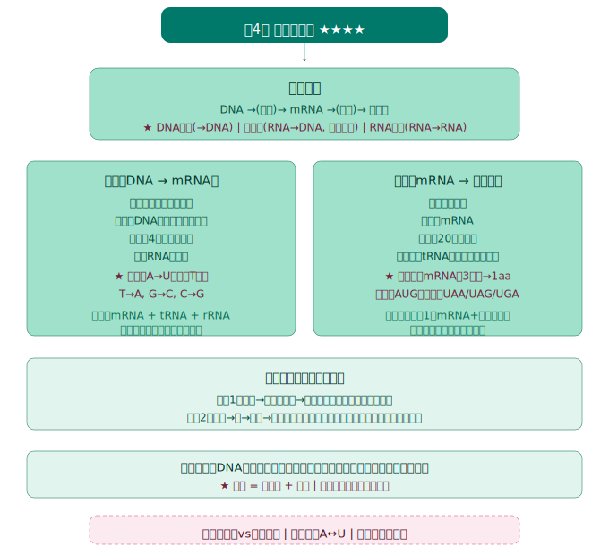
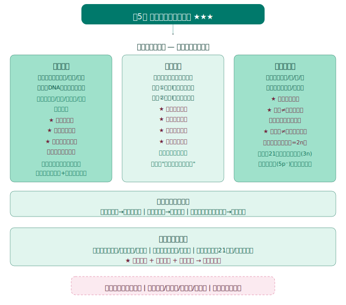
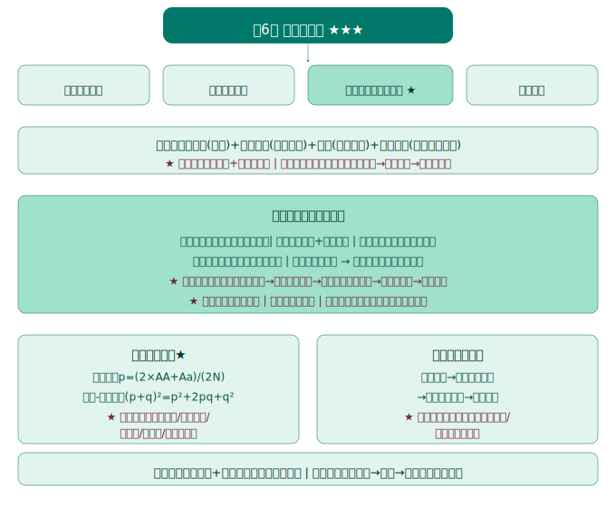

# 生物学必修2《遗传与进化》知识图谱

> Eva · 西安（全国乙卷）· 人教版 · 2019版



---

## 总体框架

**全书逻辑线：** 从孟德尔发现"遗传因子"开始 → 基因和染色体的关系 → 基因本质(DNA) → 基因如何表达 → 基因如何变异 → 生物如何进化

```
第1章 遗传因子的发现     → 分离定律 + 自由组合定律（经典遗传学）
第2章 基因和染色体的关系 → 减数分裂 + 基因在染色体上 + 伴性遗传
第3章 基因的本质         → DNA是遗传物质 + 结构 + 复制（分子遗传学）
第4章 基因的表达         → 转录 + 翻译 + 性状控制
第5章 基因突变及其他变异 → 基因突变 + 重组 + 染色体变异 + 遗传病
第6章 生物的进化         → 自然选择 + 基因频率 + 物种形成 + 协同进化
```

**各章地位：**

| 章节 | 高考分量 | 说明 |
|:---:|:---:|------|
| 第1章 | ⭐⭐⭐⭐⭐ | **遗传大题必考！** 分离定律+自由组合定律是全部遗传计算的基础 |
| 第2章 | ⭐⭐⭐⭐⭐ | 减数分裂+伴性遗传是必考难点，常与第1章综合出题 |
| 第3章 | ⭐⭐⭐ | DNA结构/复制/实验证据，选择题+填空题常客 |
| 第4章 | ⭐⭐⭐⭐ | 转录/翻译过程是核心考点，中心法则必考 |
| 第5章 | ⭐⭐⭐ | 三种可遗传变异的区分 + 染色体组/二倍体/多倍体概念 |
| 第6章 | ⭐⭐⭐ | 基因频率计算 + 自然选择学说 + 物种形成 |

---



## 第1章 遗传因子的发现 ★★★★★

> 地位：**全书根基。** 孟德尔两大定律是所有遗传题的计算基础。

### 第1节 孟德尔的豌豆杂交实验（一）——分离定律

#### 核心概念

| 术语 | 含义 | 示例 |
|------|------|------|
| 性状 | 生物体的形态特征或生理特性 | 高茎/矮茎 |
| 相对性状 | 同种生物同一性状的不同表现类型 | 圆粒/皱粒 |
| 显性性状 | F₁表现出来的性状 | 高茎(D) |
| 隐性性状 | F₁未表现、F₂重新出现的性状 | 矮茎(d) |
| 性状分离 | 杂种后代同时出现显性和隐性性状的现象 | F₂高:矮=3:1 |
| 纯合子 | 遗传因子组成相同的个体 | DD / dd |
| 杂合子 | 遗传因子组成不同的个体 | Dd |
| 等位基因 | 同源染色体相同位置上控制相对性状的基因 | D和d |

#### 孟德尔实验方法（豌豆的优点）

1. **自花传粉、闭花授粉** → 自然状态下是纯种
2. 具有**易于区分的相对性状**
3. 花大，便于人工去雄和授粉
4. 子代数量多，便于统计分析

#### 一对相对性状的杂交实验

```
P：  高茎(DD) × 矮茎(dd)
         ↓
F₁：     高茎(Dd)       ← 全部显性
         ↓⊗
F₂： 高茎 : 矮茎 = 3:1
     DD : Dd : dd = 1:2:1
```

#### 分离定律的实质

**在减数分裂形成配子时，等位基因随同源染色体的分开而分离，分别进入不同的配子。**

> 🔴 **易错提醒：**
> - 分离定律发生在**减数第一次分裂后期**（形成配子时）
> - 验证方法：**测交**（与隐性纯合子杂交）
> - F₂表现型比3:1的前提：完全显性、子代数量足够多、雌雄配子随机结合

### 第2节 孟德尔的豌豆杂交实验（二）——自由组合定律

#### 两对相对性状的杂交实验

```
P：  黄圆(YYRR) × 绿皱(yyrr)
              ↓
F₁：        黄圆(YyRr)        ← 双显性
              ↓⊗
F₂： 黄圆 : 黄皱 : 绿圆 : 绿皱 = 9:3:3:1
```

#### 对自由组合现象的解释

- F₁产生**4种**配子：YR、Yr、yR、yr，比例**1:1:1:1**
- 雌雄配子随机结合 → **16种**组合方式 → **9种**基因型 → **4种**表现型

| 表现型 | 比例 | 典型基因型 |
|:---:|:---:|------|
| 黄圆 | 9 | Y_R_ (YYRR, YYRr, YyRR, YyRr) |
| 黄皱 | 3 | Y_rr (YYrr, Yyrr) |
| 绿圆 | 3 | yyR_ (yyRR, yyRr) |
| 绿皱 | 1 | yyrr |

#### 自由组合定律的实质

**在减数分裂形成配子时，同源染色体上的等位基因彼此分离的同时，非同源染色体上的非等位基因自由组合。**

> 🔴 **易错提醒：**
> - 自由组合定律的前提：**两对基因位于两对同源染色体上**（非同源染色体）
> - 9:3:3:1的变形题型：9:7、9:3:4、12:3:1、15:1等，都是基因互作
> - 验证方法：**测交** → 若后代出现1:1:1:1，则符合自由组合
> - 🧪 **口诀：** "同源等位先分离，非同非等自由组"

#### 解题核心技能

**配子类型计算：**
- 基因型 AaBbCc → 配子种类 = 2³ = 8种
- 基因型 AABbCc → 配子种类 = 1×2×2 = 4种

**概率计算"三步法"：**
1. 每对基因独立计算概率
2. 按照题目要求组合（乘/加）
3. 注意"且"→乘法，"或"→加法

---



## 第2章 基因和染色体的关系 ★★★★★

> 地位：**减数分裂是遗传题的"底层操作系统"**，伴性遗传年年考。

### 第1节 减数分裂和受精作用

#### 核心概念

| 概念 | 含义 |
|------|------|
| 同源染色体 | 形态大小一般相同、一条来自父方一条来自母方、减数分裂中配对的染色体 |
| 联会 | 同源染色体两两配对的现象（减I前期） |
| 四分体 | 联会后的一对同源染色体含4条染色单体 |
| 交叉互换 | 同源染色体非姐妹染色单体之间交换片段（**基因重组的来源之一**） |

#### 减数分裂过程

**减数第一次分裂（减I）——同源染色体分离**

| 时期 | 主要特征 |
|------|----------|
| 间期 | DNA复制，染色体数不变（2n→2n），DNA: 2C→4C |
| 前期I | **联会**、形成四分体、可能发生**交叉互换** |
| 中期I | 同源染色体排列在赤道板**两侧**（不是一条线！） |
| 后期I | **同源染色体分离**，非同源染色体自由组合 |
| 末期I | 每个子细胞染色体数减半：2n→n |

**减数第二次分裂（减II）——姐妹染色单体分离（类似有丝分裂）**

| 时期 | 主要特征 |
|------|----------|
| 前期II | 染色体散乱分布 |
| 中期II | 着丝粒排列在赤道板上 |
| 后期II | **着丝粒分裂**，姐妹染色单体分开 |
| 末期II | 形成4个精细胞（或1个卵细胞+3个极体） |

#### 精子和卵细胞形成的区别

| 比较项目 | 精子形成 | 卵细胞形成 |
|----------|----------|------------|
| 场所 | 精巢（睾丸） | 卵巢 |
| 细胞质分裂 | 均等分裂 | 不均等分裂 |
| 结果 | 1精原细胞→4个精子 | 1卵原细胞→1卵细胞+3极体 |
| 是否变形 | 变形（形成尾部） | 不变形 |

> 🧪 **口诀：** "膜仁消失两体现（前），形定数清赤道齐（中），同源分开非同组（后I），着丝粒裂姐妹离（后II）"

#### 染色体和DNA的数量变化

| 时期 | 染色体数 | DNA数 | 染色单体数 |
|------|:---:|:---:|:---:|
| 间期（复制前） | 2n | 2C→4C | 0→4n |
| 减I前、中 | 2n | 4C | 4n |
| 减I后 | 2n→n | 4C→2C | 4n→2n |
| 减II前、中 | n | 2C | 2n |
| 减II后 | n→2n | 2C | 2n→0 |
| 减II末 | n | C | 0 |

> 🔴 **易错提醒：**
> - DNA加倍在**间期**，染色体加倍在**减II后期**（着丝粒分裂）
> - 染色体数减半发生在**减I完成后**（同源染色体分离）
> - DNA数减半两次：减I结束 + 减II结束
> - 减II后期染色体数暂时恢复为2n

#### 受精作用

- 精子和卵细胞融合，恢复二倍体（n+n→2n）
- 意义：维持每种生物前后代体细胞中染色体数目的恒定 + 增加了变异（不同配子随机结合）

### 第2节 基因在染色体上

**萨顿假说：** 基因在染色体上（依据：基因和染色体行为存在平行关系）

**摩尔根的果蝇实验——第一个把基因定位在染色体上的证据：**
- 红眼(♀) × 白眼(♂) → F₁全部红眼 → F₂红:白=3:1，但白眼全是雄性
- 证明：**控制眼色的基因位于X染色体上**

### 第3节 伴性遗传

#### 三种遗传方式对比

| 类型 | 特点 | 实例 |
|------|------|------|
| 伴X隐性 | 男性患者多于女性；隔代交叉遗传；女病父必病 | 红绿色盲、血友病 |
| 伴X显性 | 女性患者多于男性；连续遗传；男病母女必病 | 抗维生素D佝偻病 |
| 伴Y遗传 | 只有男性患者；父传子、子传孙 | 外耳道多毛症 |

> 🧪 **口诀：** "无中生有是隐性，有中生无是显性，隐性遗传看女病，显性遗传看男病"

#### 遗传系谱图判断口诀

1. 先判断显隐性：**"无中生有"→隐性，"有中生无"→显性**
2. 再判断是常染色体还是伴性：
   - 隐性：**"女病父正"→常染色体隐性**（若女病父也病，可能是伴X隐性）
   - 显性：**"男病母正"→常染色体显性**（若男病母女必病，可能是伴X显性）

---



## 第3章 基因的本质 ★★★

> 地位：**分子遗传学基础，** DNA结构/复制是必考点。

### 第1节 DNA是主要的遗传物质

#### 肺炎链球菌转化实验（格里菲思 → 艾弗里）

| 步骤 | 格里菲思实验 | 艾弗里实验 |
|------|-------------|-----------|
| 方法 | 活体小鼠实验 | 体外分离组分 |
| 结论 | 存在"转化因子" | **DNA是遗传物质** |
| 关键 | R型→S型转化（小鼠死） | DNA+蛋白酶/RNA酶后仍转化；DNA酶处理后不转化 |

#### 噬菌体侵染细菌实验（赫尔希和蔡斯）

- 用 ³²P 标记DNA，³⁵S 标记蛋白质外壳
- 结果：³²P进入细菌，³⁵S留在外面
- 结论：**DNA是遗传物质**（进入细菌的是DNA，不是蛋白质）

> 🔴 **易错提醒：**
> - 格里菲思只证明了存在转化因子，**没有证明是DNA**
> - 艾弗里证明了DNA是转化因子（即遗传物质）
> - 赫尔希-蔡斯用**同位素标记法**，是更直接的证据
> - 🧪 DNA是**主要**的遗传物质（有些病毒以RNA为遗传物质，如HIV、烟草花叶病毒）

### 第2节 DNA的结构

#### DNA双螺旋结构

```
5' → 3'
│
A = T  （腺嘌呤=胸腺嘧啶，两个氢键）
│ │
G ≡ C  （鸟嘌呤≡胞嘧啶，三个氢键）
│
3' ← 5'
```

**查哥夫法则：** A=T, G=C, A+G = T+C （嘌呤=嘧啶）

> 🔴 **易错：**
> - 外侧：磷酸+脱氧核糖交替连接形成骨架
> - 内侧：碱基对（A-T、G-C）以氢键连接
> - 两条链**反向平行**
> - G≡C越多，DNA越稳定（3个氢键 vs A=T的2个）

### 第3节 DNA的复制

#### 半保留复制过程

| 要素 | 内容 |
|------|------|
| 时期 | 有丝分裂间期 / 减数第一次分裂前的间期 |
| 场所 | 真核：细胞核（主要）+ 线粒体 + 叶绿体 |
| 条件 | 模板（两条母链）、原料（4种脱氧核苷酸）、能量（ATP）、酶（解旋酶+DNA聚合酶） |
| 特点 | **半保留复制**、边解旋边复制、多起点复制 |
| 结果 | 1个DNA→2个DNA（各含一条母链+一条新链） |

> 🧪 **口诀：** "解旋酶开双链，聚合酶加核苷，半保留是铁律，碱基配对准又准"

> 🔴 **易错：**
> - 解旋酶**断开氢键**，DNA聚合酶**连接磷酸二酯键**（不是氢键！）
> - 复制方向：5'→3'
> - 第n次复制需要 2ⁿ⁻¹ 条模板链？→ 需要区分"第n次"和"n次一共"

#### 与DNA复制相关的计算

- 复制n次后：DNA分子数 = 2ⁿ
- 含亲代链的DNA = 2个
- 消耗某种碱基数 = (2ⁿ-1) × 该碱基在DNA中的数量

### 第4节 基因通常是有遗传效应的DNA片段

- 基因 = 有遗传效应的DNA片段
- 每个DNA上有许多基因
- **基因不是连续分布，基因之间有非编码区**
- 染色体是DNA的主要载体（每条染色体含1个或2个DNA分子）

---



## 第4章 基因的表达 ★★★★

> 地位：**中心法则的核心环节。** 转录+翻译过程是每年必考点。

### 中心法则

```
   ┌──复制──┐
   ↓        │
  DNA → RNA → 蛋白质
        ↑        │
        └──逆转录─┘
        （某些病毒）
```

### 第1节 基因指导蛋白质的合成

#### 转录（DNA → mRNA）

| 要素 | 内容 |
|------|------|
| 场所 | 真核：细胞核（主要在核内） |
| 模板 | DNA的**一条链**（模板链/反义链） |
| 原料 | 4种核糖核苷酸 |
| 酶 | RNA聚合酶（兼具解旋功能） |
| 产物 | mRNA（还有tRNA、rRNA） |
| 原则 | 碱基互补配对：A-U、T-A、G-C、C-G |

#### 翻译（mRNA → 蛋白质）

| 要素 | 内容 |
|------|------|
| 场所 | 核糖体 |
| 模板 | mRNA |
| 原料 | 20种氨基酸 |
| 搬运工 | tRNA（一端是反密码子，另一端携带氨基酸） |
| 产物 | 多肽链→蛋白质 |

#### 密码子与反密码子

- **密码子：** mRNA上3个相邻碱基决定1个氨基酸
- **起始密码子：** AUG（甲硫氨酸），也是编码氨基酸的
- **终止密码子：** UAA、UAG、UGA（不编码氨基酸）
- **反密码子：** tRNA上与密码子互补的3个碱基

> 🔴 **易错：**
> - 转录时：DNA的A → mRNA的U（不是T！）
> - 翻译时：mRNA的密码子与tRNA的反密码子互补配对
> - 一个mRNA可同时结合多个核糖体→形成多聚核糖体→提高翻译效率
> - 原核生物转录和翻译可同时进行（没有核膜分隔）

### 第2节 基因表达与性状的关系

- **基因控制性状的两条途径：**
  1. 基因→蛋白质结构→直接控制性状（如镰刀型细胞贫血症）
  2. 基因→酶的合成→控制代谢→间接控制性状（如白化病）

- **表观遗传：** DNA序列不变，但基因表达发生可遗传的改变（甲基化等）

> 🔴 **易错提醒：** 性状 = 基因型 + 环境

---



## 第5章 基因突变及其他变异 ★★★

> 地位：**区分三种可遗传变异是选择题必考。** 染色体组概念是难点。

### 三种可遗传变异的比较

| 比较 | 基因突变 | 基因重组 | 染色体变异 |
|------|----------|----------|------------|
| 本质 | 基因结构改变（碱基对替换/增添/缺失） | 原有基因重新组合 | 染色体结构/数目改变 |
| 发生时间 | 主要是DNA复制时（间期） | 减I前期的交叉互换 + 减I后期自由组合 | 细胞分裂时 |
| 结果 | 产生新基因（等位基因） | 产生新基因型（不产生新基因） | 基因数量/排列改变 |
| 显微镜下 | **不可见** | **不可见** | **可见** |
| 意义 | 生物变异的根本来源，进化的原材料 | 生物变异的重要来源 | 物种形成/育种应用 |
| 实例 | 镰刀型细胞贫血症 | 一母生九子各不同 | 21三体综合征、无子西瓜 |

> 🧪 **核心判断题：**
> - "基因突变一定导致性状改变" → ❌（密码子简并性、隐性突变等）
> - "基因重组产生新基因" → ❌（产生新基因型，不产生新基因）
> - "染色体变异可在显微镜下观察到" → ✔️

### 基因突变

- 特点：**普遍性、随机性、不定向性、低频性、多害少利性**
- 诱变因素：物理（紫外线/X射线）、化学（亚硝酸/碱基类似物）、生物（病毒）
- **癌变：** 原癌基因和抑癌基因发生突变

### 染色体变异

#### 染色体结构变异

缺失、重复、倒位、易位（注意：易位≠交叉互换！易位发生在非同源染色体之间）

#### 染色体数目变异

| 概念 | 含义 | 实例 |
|------|------|------|
| 染色体组 | 一组非同源染色体（含全套遗传信息） | |
| 二倍体 | 体细胞含2个染色体组 | 多数动植物 |
| 多倍体 | 体细胞含≥3个染色体组 | 香蕉(3n)、马铃薯(4n)、小麦(6n) |
| 单倍体 | 体细胞含本物种配子染色体数 | 蜜蜂雄蜂(n=16) |

> 🔴 **易错：**
> - **单倍体不一定只有一个染色体组！**（四倍体植物的单倍体含2个染色体组）
> - 判断几倍体：先看发育起点 → 配子发育→单倍体；受精卵发育→看含几个染色体组
> - **交叉互换 = 基因重组**（同源染色体之间）
> - **易位 = 染色体结构变异**（非同源染色体之间）

### 人类遗传病

| 类型 | 举例 |
|------|------|
| 单基因遗传病 | 白化病(常隐)、红绿色盲(伴X隐)、抗维生素D佝偻病(伴X显) |
| 多基因遗传病 | 原发性高血压、冠心病、哮喘 |
| 染色体异常 | 21三体综合征、猫叫综合征(5p⁻)、特纳综合征(XO) |

---



## 第6章 生物的进化 ★★★

> 地位：基因频率计算 + 自然选择学说，选择题常考。

### 第1节 生物有共同祖先的证据

| 证据类型 | 内容 |
|------|------|
| 化石证据 | 地层越深→化石越古老→结构越简单 |
| 比较解剖学 | 同源器官（如脊椎动物前肢骨骼模式一致） |
| 胚胎学 | 脊椎动物胚胎早期相似（有鳃裂和尾） |
| 细胞和分子 | 细胞结构相似、遗传物质都是DNA、共用一套遗传密码 |

### 第2-3节 现代生物进化理论

#### 核心要点

| 要点 | 内容 |
|------|------|
| 基本单位 | **种群**（不是个体！） |
| 原材料 | 突变（基因突变+染色体变异）和基因重组 |
| 方向 | **自然选择**决定（定向的） |
| 实质 | 种群**基因频率的定向改变** |
| 物种形成标志 | **生殖隔离** |
| 必要条件 | 隔离（地理隔离→生殖隔离） |

#### 基因频率计算

**公式法：**
- 基因频率 = (纯合子数×2 + 杂合子数×1) ÷ (总个体数×2)

**哈代-温伯格平衡：** （理想条件下）
- (p+q)² = p² + 2pq + q² = 1
- p = A基因频率，q = a基因频率
- AA = p²，Aa = 2pq，aa = q²

> 🔴 **易错：** 哈代-温伯格平衡的前提条件：种群极大、随机交配、无突变、无迁移、无自然选择。**自然界的种群通常不符合！**

#### 物种形成

```
地理隔离 → 阻断基因交流 → 自然选择方向分化
→ 基因库差异增大 → 生殖隔离 → 新物种形成
```

**生殖隔离的方式：** 不能交配、交配后不能受精、受精后后代不育（如骡）

### 第4节 协同进化与生物多样性

- **协同进化：** 不同物种之间、生物与无机环境之间相互影响、共同进化
- 生物多样性三个层次：**遗传多样性（基因多样性）→ 物种多样性 → 生态系统多样性**

---

## 全书核心公式速查

| 用途 | 公式 |
|------|------|
| 基因型→配子种类 | = 2ⁿ（n=杂合基因对数） |
| 自交n代杂合子比例 | (1/2)ⁿ |
| DNA复制n次总数 | 2ⁿ |
| 复制n次需某碱基数 | (2ⁿ−1)×a（a=原DNA中该碱基数） |
| 蛋白质相对分子质量 | 氨基酸数×平均分子量 − 18×(氨基酸数−肽链数) |
| 基因频率（公式法） | P_A = (2×AA + Aa)/(2N) |

---

## 遗传学核心专题

> 必修2最核心的解题模型合集，建议配合知识图谱一起学习。

### 一、孟德尔遗传定律解题模型

#### 1.1 分离定律解题三步法

**核心思路：** 判断显隐性 → 写出基因型 → 计算概率

| 步骤 | 方法 | 关键提醒 |
|:---:|------|----------|
| ① 判显隐 | **无中生有**（父母正常，孩子患病 → 隐性）<br>**有中生无**（父母患病，孩子正常 → 显性） | 看"患者"和"正常"的关系 |
| ② 写基因型 | 隐性患者：`aa`<br>显性患者：先写 `A_`（杂合子），再看父母/孩子推 `AA` 或 `Aa` | 不确定就写 `A_` |
| ③ 算概率 | 用 **配子法** 或 **棋盘法** | 注意"生男孩概率" = 1/2（性别已定）|

**口诀：** "无中生有是隐性，有中生无是显性"

#### 1.2 自由组合定律解题模型

**核心：** 两对相对性状独立遗传，用 **分枝法** 简化计算。

**例题模型：**
```
亲本：YyRr × YyRr（黄色圆粒 × 黄色圆粒）
问：黄色皱粒的比例？

解法：
黄色（Y_）= 3/4
皱粒（rr）= 1/4
→ 黄色皱粒 = 3/4 × 1/4 = 3/16
```

**9:3:3:1 的变形：**
| 比例 | 基因型 | 表现型 |
|:---:|--------|----------|
| 9 | Y_R_ | 黄色圆粒 |
| 3 | Y_rr | 黄色皱粒 |
| 3 | yyR_ | 绿色圆粒 |
| 1 | yyrr | 绿色皱粒 |

**易错提醒：** 
- 看到 **9:3:3:1** → 自由组合
- 看到 **3:1** → 一对相对性状（分离定律）
- 看到 **1:1:1:1** → 测交结果（YyRr × yyrr）

---

### 二、伴性遗传专题

#### 2.1 人类遗传病系谱图判断

**判断顺序：** 先判显隐性 → 再判常/性染色体

**第一步：判显隐性**
```
无中生有 → 隐性
有中生无 → 显性
```

**第二步：判常/性（隐性遗传为例）**
| 特征 | 常染色体隐性 | X染色体隐性 |
|------|--------------|-------------|
| 男女发病率 | 相等 | **男性多于女性** |
| 交叉遗传 | 无 | **有**（外公 → 外孙，通过女儿）|
| 举例 | 白化病、苯丙酮尿症 | 红绿色盲、血友病 |

**第三步：写基因型**
- X染色体隐性：女性患者 `X^aX^a`，男性患者 `X^aY`
- X染色体显性：女性患者 `X^A_`，男性患者 `X^AY`（**男性患者女儿必患病**）

**口诀：** "隐雌显雄看性别，交叉遗传是X隐"

#### 2.2 遗传系谱图解题模板

```
题目：判断遗传病类型和基因型

步骤：
1. 看系谱图 → 无中生有 → 隐性
2. 看性别 → 男性患者多于女性 → 可能是X隐性
3. 验证：外公（患病）→ 女儿（携带者）→ 外孙（患病）✓
4. 写基因型：
   - 外公：X^aY
   - 女儿：X^AX^a（携带者，不患病）
   - 外孙：X^aY（患病）
```

---

### 三、减数分裂与遗传定律的联系

#### 3.1 减数分裂核心过程

**减数第一次分裂（减I）：**
- 同源染色体分离 → **分离定律的细胞学基础**
- 非同源染色体自由组合 → **自由组合定律的细胞学基础**

**减数第二次分裂（减II）：**
- 着丝点分裂，姐妹染色单体分开

**结果：** 1个精原细胞 → 4个精子（2种类型）  
**结果：** 1个卵原细胞 → 1个卵细胞 + 3个极体

#### 3.2 减数分裂与遗传定律的联系

| 时期 | 发生事件 | 对应遗传定律 |
|------|----------|--------------|
| 减I前期 | 同源染色体联会、交叉互换 | 基因重组 |
| 减I后期 | 同源染色体分离 | **分离定律** |
| 减I后期 | 非同源染色体自由组合 | **自由组合定律** |
| 减II后期 | 着丝点分裂，姐妹染色单体分开 | —— |

**核心图像记忆：**
```
减I后期：同源染色体分离（向两极移动）
减II后期：着丝点分裂（姐妹染色单体分开）
```

---

### 四、基因突变及其他变异

#### 4.1 变异类型对比

| 变异类型 | 发生时期 | 是否可逆 | 是否遗传 | 举例 |
|----------|----------|----------|----------|------|
| 基因突变 | **DNA复制时**（有丝分裂间期/减I间期） | 可逆 | 可遗传 | 镰刀型贫血症 |
| 基因重组 | **减I前期（交叉互换）/减I后期（自由组合）** | 不可逆 | 可遗传 | 黄色圆粒 × 绿色皱粒 |
| 染色体变异 | 细胞分裂期 | 不可逆 | 可遗传 | 21三体综合征 |

**易错提醒：**
- 基因突变 **不改变染色体数目**，只改变基因内部碱基序列
- 基因重组 **不产生新基因**，只产生新的基因型
- 染色体变异 **可用显微镜观察**（基因突变不行）

---

### 五、互动练习

<iframe src="genetics_practice.html" width="100%" height="600px"></iframe>

[→ 在新窗口打开遗传学专题练习](genetics_practice.html)

> 📝 最后更新：2026-05-31
