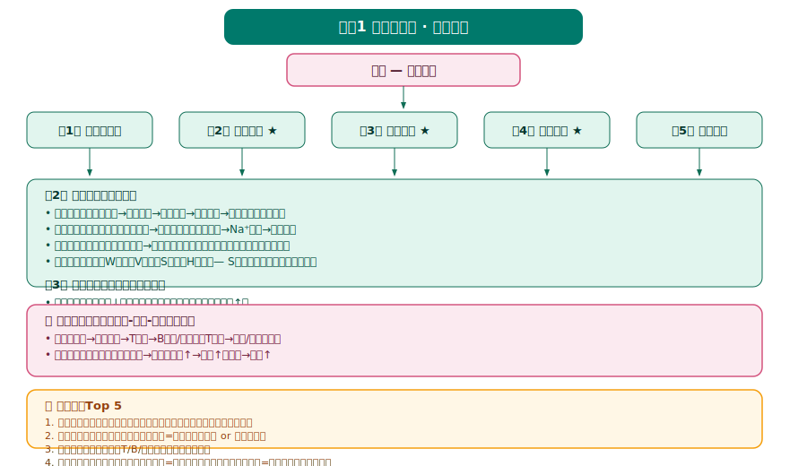
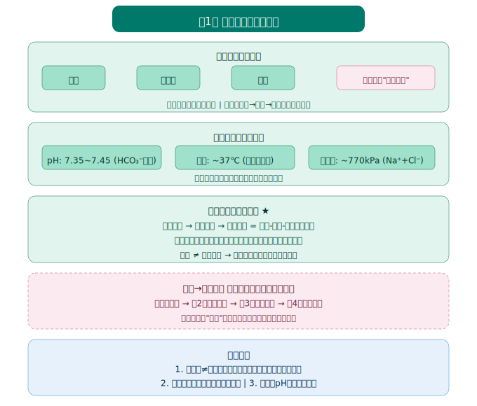
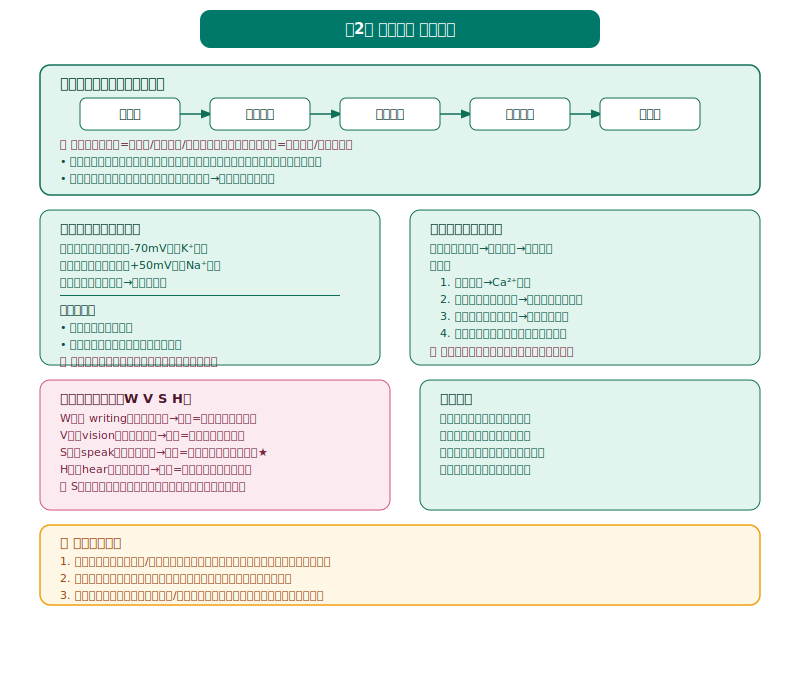
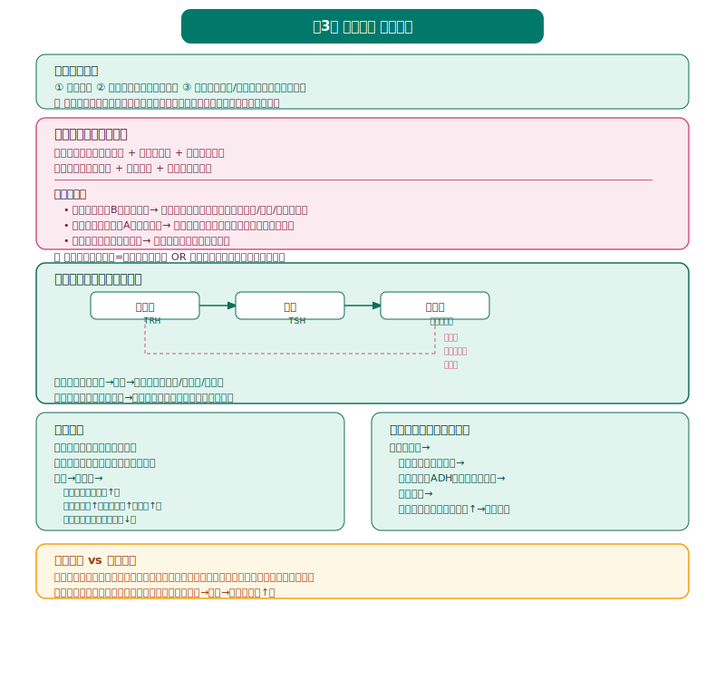
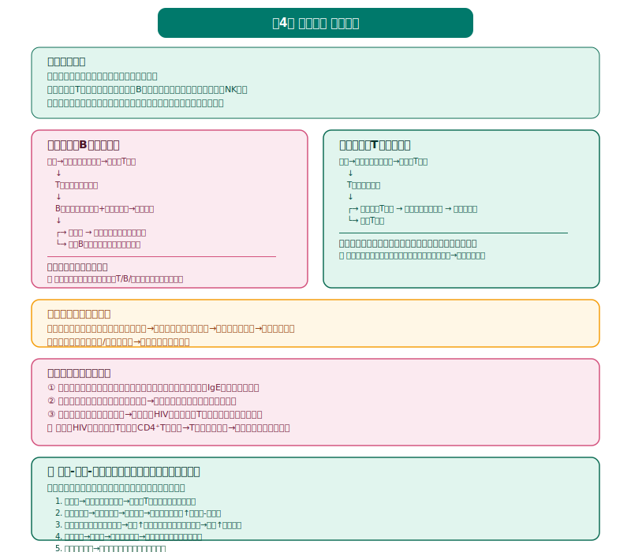
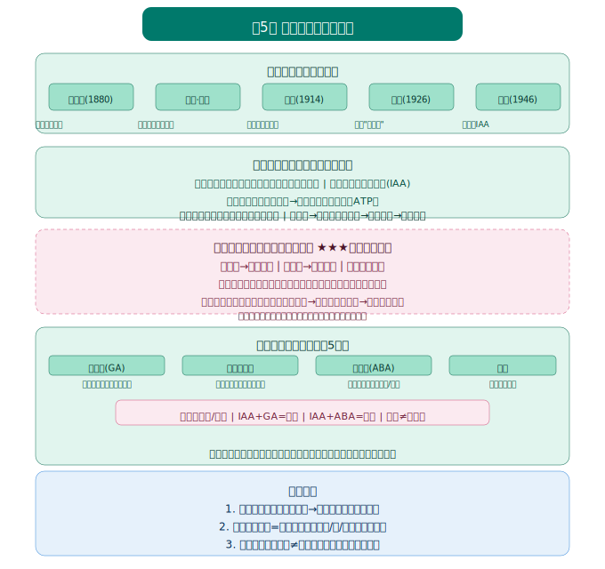

# 生物学选择性必修1《稳态与调节》知识图谱

> Eva · 西安（全国乙卷）· 人教版 · 2019版



---

## 总体框架

本书围绕"稳态"这一核心概念，从**内环境稳态 → 神经调节 → 体液调节 → 免疫调节 → 植物激素调节**五个层次展开，是高考**解答题最高频模块**（神经-体液-免疫综合题年年考）。

全书5章：
1. **人体的内环境与稳态** — 稳态的概念和调节机制
2. **神经调节** — 反射弧、兴奋传导、突触传递、分级调节
3. **体液调节** — 激素调节、血糖/体温/水盐调节、神经-体液关系
4. **免疫调节** — 免疫系统组成、特异性免疫、免疫失调、免疫应用
5. **植物生命活动的调节** — 生长素、其他植物激素、环境因素调节

---



## 第1章 人体的内环境与稳态 ★★★

> 地位：全书基础概念章，建立"稳态"核心观念，为后续四章奠基。

### 第1节 细胞生活的环境

#### 内环境组成

| 成分 | 定义 | 物质举例 |
|------|------|----------|
| 血浆 | 血液中的液体部分（含血浆蛋白） | 葡萄糖、氨基酸、激素、抗体 |
| 组织液 | 细胞间隙的液体 | 与血浆类似，但蛋白质含量低 |
| 淋巴液 | 淋巴管内的液体 | 与组织液类似 |

**关系：**
```
血浆 ←→ 组织液 ←→ 细胞内液
        ↓
       淋巴液 → 血浆（单向）
```

> 🔴 **易错：** 
> - 血红蛋白在**红细胞内**，不属于内环境成分
> - 呼吸酶、ATP合成酶在**细胞内**，不属于内环境
> - 属于内环境的：血浆蛋白、抗体、激素、葡萄糖、CO₂、尿素

#### 内环境理化性质

| 性质 | 正常值 | 调节机制 |
|------|--------|----------|
| 渗透压 | 770 kPa（约等渗） | 主要靠Na⁺、Cl⁻维持 |
| pH | 7.35~7.45 | 缓冲对（H₂CO₃/NaHCO₃、NaH₂PO₄/Na₂HPO₄）|
| 温度 | 37℃左右 | 体温调节 |

---

### 第2节 内环境的稳态

#### 稳态概念

**定义：** 正常机体通过调节作用，使各个器官、系统协调活动，共同维持内环境的**相对稳定状态**。

**调节机制：** 神经-体液-免疫调节网络

**意义：** 内环境稳态是机体进行正常生命活动的**必要条件**。

> 🔴 **易错：** 稳态不是"固定不变"，而是"动态平衡"（在一定范围内波动）。

#### 稳态失调实例

| 失调类型 | 原因 | 表现 |
|----------|------|------|
| 组织水肿 | 血浆蛋白减少（如肾炎、营养不良）| 组织液增多 |
| 酸中毒 | 乳酸过多（剧烈运动）| pH < 7.35 |
| 体温异常 | 产热≠散热 | 发热或低体温 |

---



## 第2章 神经调节 ★★★★★

> 地位：**全书最核心章节之一**，反射弧、兴奋传导、突触传递是高考必考，选择题+解答题都高频。

### 第1节 神经调节的结构基础

#### 神经系统结构

```
中枢神经系统：脑（大脑、小脑、脑干）+ 脊髓
周围神经系统：脑神经 + 脊神经
```

#### 反射弧（必考！）

**五部分（缺一不可）：**
```
感受器 → 传入神经 → 神经中枢 → 传出神经 → 效应器
```

> 🔴 **易错：** 
> - 没有感觉：可能是**感受器、传入神经、神经中枢**受损
> - 有感觉但无反应：可能是**传出神经、效应器**受损
> - 必须**完整反射弧**才能发生反射（缺任何一节都不行）

---

### 第2节 神经调节的基本方式

**反射类型对比：**

| 类型 | 是否先天 | 神经中枢 | 举例 |
|------|----------|----------|------|
| 非条件反射 | 先天 | 脊髓、脑干（低级中枢）| 膝跳反射、眨眼反射 |
| 条件反射 | 后天学习 | 大脑皮层（高级中枢）| 望梅止渴、听铃声分泌唾液 |

---

### 第3节 神经冲动的产生和传导 ★★★★★

#### 兴奋在神经纤维上的传导

**过程：**
1. 静息电位：**外正内负**（-70mV），K⁺外流
2. 动作电位：**外负内正**（+50mV），Na⁺内流
3. 局部电流：兴奋部位→未兴奋部位
4. 传导方向：**双向传导**（离体实验中）

> 🔴 **易错：** 
> - 在**反射弧中**（体内），兴奋传导是**单向的**（因为突触的存在）
> - 在**神经纤维上**（离体），兴奋传导是**双向的**

#### 兴奋在神经元之间的传递（突触传递）★★★★★

**突触结构：**
```
突触前膜 → 突触间隙 → 突触后膜
```

**传递过程：**
1. 兴奋到达突触小体 → Ca²⁺内流
2. 突触小泡与突触前膜融合 → 释放**神经递质**（胞吐）
3. 递质扩散到突触后膜 → 与受体结合
4. 引发突触后膜电位变化

**特点：**
- **单向传递**（递质只存在于突触前膜）
- **突触延搁**（有时间间隔）
- 递质作用：**兴奋性或抑制性**

> 🔴 **易错：** 
> - 神经递质**不进入**突触后神经元（只与受体结合）
> - 递质作用后被**分解或回收**（否则持续作用→肌肉痉挛）
> - 神经递质属于**内环境成分**

---

### 第4节 神经系统的分级调节

**分级调节：**
```
高级中枢（大脑皮层）→ 控制 → 低级中枢（脊髓、脑干）
```

**实例：**
- 排尿反射：脊髓（低级）→ 大脑皮层（高级可控制）
- 缩手反射：脊髓（低级）→ 大脑皮层（可抑制）

---

### 第5节 人脑的高级功能

| 功能区 | 功能 | 损伤表现 |
|--------|------|----------|
| 言语区W区 | 书写 | 失写症（不会写）|
| 言语区V区 | 阅读 | 失读症（看不懂）|
| 言语区S区 | 说话 | 运动性失语症（不会说）|
| 言语区H区 | 听懂 | 听觉性失语症（听不懂）|
| 记忆 | 短期记忆→长期记忆 | — |

> 🔴 **易错：** S区损伤→**能听懂、能看懂、能写字，但不会说话**（不是哑巴，是支配发音的肌肉正常但不会组织语言）

---



## 第3章 体液调节 ★★★★★

> 地位：与第2章神经系统紧密结合，高考**神经-体液调节综合题**年年考。

### 第1节 激素与内分泌系统

#### 激素调节特点

1. **微量高效**
2. **通过体液运输**（不通过导管，内分泌腺无导管）
3. **作用于靶器官、靶细胞**（有特异性受体）

> 🔴 **易错：** 
> - 激素**不提供能量**，也**不组成细胞结构**，只起**调节作用**
> - 激素**一经起作用就被灭活**（所以需要持续分泌）

#### 主要内分泌腺及激素

| 内分泌腺 | 激素 | 主要作用 | 分泌异常 |
|----------|------|----------|----------|
| 下丘脑 | 促激素释放激素、抗利尿激素 | 调节垂体、水平衡 | — |
| 垂体 | 生长激素、促激素 | 促进生长、调节其他腺体 | 幼年↓→侏儒症；幼年↑→巨人症 |
| 甲状腺 | 甲状腺激素 | 促进代谢、促进发育、提高神经兴奋性 | ↓→呆小症（智力低下）；↑→甲亢 |
| 胰岛 | 胰岛素、胰高血糖素 | 调节血糖 | 胰岛素↓→糖尿病 |
| 肾上腺 | 肾上腺素、皮质醇 | 应急反应、升高血糖 | — |
| 睾丸 | 雄激素 | 促进雄性生殖器官发育和精子生成 | — |
| 卵巢 | 雌激素、孕激素 | 促进雌性生殖器官发育和卵子生成 | — |

---

### 第2节 激素调节的过程 ★★★★★

#### 血糖调节

**血糖来源：** 食物消化吸收、肝糖原分解、非糖物质转化  
**血糖去路：** 氧化分解、合成糖原、转化为非糖物质

**激素调节：**
| 激素 | 分泌部位 | 作用 | 升高/降低血糖 |
|------|----------|------|--------------|
| 胰岛素 | 胰岛B细胞 | 促进组织细胞摄取、利用、储存葡萄糖 | ↓ |
| 胰高血糖素 | 胰岛A细胞 | 促进肝糖原分解、非糖物质转化 | ↑ |
| 肾上腺素 | 肾上腺髓质 | 促进肝糖原分解 | ↑ |

> 🔴 **易错：** 
> - 胰岛素**唯一降低血糖**的激素
> - 糖尿病原因：胰岛素分泌不足 **或** 胰岛素受体敏感性降低（胰岛素抵抗）

#### 甲状腺激素分泌的分级调节

```
下丘脑 → 促甲状腺激素释放激素（TRH）
    ↓
垂体 → 促甲状腺激素（TSH）
    ↓
甲状腺 → 甲状腺激素
    ↓
（负反馈）→ 抑制下丘脑和垂体
```

> 🔴 **易错：** 
> - **分级调节**：下丘脑→垂体→靶腺体
> - **负反馈调节**：靶腺体激素增多→抑制下丘脑和垂体
> - 缺碘→甲状腺激素合成不足→TSH分泌增多→甲状腺肿大（大脖子病）

#### 体温调节

**产热：** 骨骼肌（主要）、肝脏、褐色脂肪  
**散热：** 皮肤毛细血管舒张、汗腺分泌

**调节过程：**
```
寒冷刺激 → 冷觉感受器 → 下丘脑体温调节中枢
    ↓
    ├→ 骨骼肌战栗（产热↑）
    ├→ 皮肤毛细血管收缩（散热↓）
    ├→ 甲状腺激素分泌↑（产热↑）
    └→ 肾上腺素分泌↑（产热↑）
```

#### 水盐调节

**渗透压升高 → 下丘脑渗透压感受器 → 下丘脑分泌抗利尿激素（ADH）→ 垂体释放 → 肾小管和集合管重吸收水↑ → 尿量减少**

> 🔴 **易错：** 
> - 抗利尿激素（ADH）由**下丘脑合成**，**垂体释放**
> - ADH作用：**促进肾小管和集合管重吸收水**（尿量减少）

---

### 第3节 体液调节与神经调节的关系

| 比较 | 神经调节 | 体液调节 |
|------|----------|----------|
| 反应速度 | 迅速 | 较缓慢 |
| 作用范围 | 准确、局限 | 广泛 |
| 作用时间 | 短暂 | 较长 |
| 传递介质 | 神经冲动、神经递质 | 激素 |

**关系：** 体内大多数内分泌腺受**中枢神经系统**的调控（如寒冷→神经→甲状腺激素↑）。

---



## 第4章 免疫调节 ★★★★

> 地位：新冠之后高考必考，特异性免疫过程和免疫失调是重点。

### 第1节 免疫系统的组成和功能

#### 免疫系统组成

```
免疫系统
├── 免疫器官：骨髓、胸腺、脾、淋巴结、扁桃体
├── 免疫细胞：T细胞、B细胞、吞噬细胞、NK细胞
└── 免疫活性物质：抗体、细胞因子、溶菌酶
```

#### 免疫系统的功能

| 功能 | 定义 | 举例 |
|------|------|------|
| 免疫防御 | 抵御外来病原体 | 感冒痊愈 |
| 免疫自稳 | 清除衰老、损伤细胞 | 清除凋亡细胞 |
| 免疫监视 | 识别清除突变细胞 | 防止肿瘤发生 |

---

### 第2节 特异性免疫 ★★★★★

#### 体液免疫（B细胞介导）

**过程：**
```
抗原 → 吞噬细胞摄取处理 → 传递给T细胞
                           ↓
                      T细胞分泌细胞因子
                           ↓
                B细胞受刺激（抗原+细胞因子）→ 增殖分化
                           ↓
                ┌→ 浆细胞 → 产生抗体（与抗原结合）
                └→ 记忆B细胞（二次免疫更快更强）
```

#### 细胞免疫（T细胞介导）

**过程：**
```
抗原 → 吞噬细胞摄取处理 → 传递给T细胞
                           ↓
                T细胞增殖分化
                           ↓
                ┌→ 细胞毒性T细胞 → 与靶细胞密切接触 → 靶细胞裂解
                └→ 记忆T细胞
```

> 🔴 **易错：** 
> - **体液免疫**：抗体主要在**血浆**中，对付**细胞外**的病原体
> - **细胞免疫**：对付**细胞内**的病原体（如病毒、结核杆菌）
> - **二次免疫**：更快更强，因为**记忆细胞**的存在
> - 抗体由**浆细胞（效应B细胞）**产生，**T细胞、B细胞、记忆细胞都不能产生抗体**

#### 体液免疫 vs 细胞免疫对比

| 项目 | 体液免疫 | 细胞免疫 |
|------|----------|----------|
| 主要细胞 | B细胞 → 浆细胞 | T细胞 → 细胞毒性T细胞 |
| 作用对象 | 细胞外病原体 | 细胞内病原体、肿瘤细胞 |
| 作用方式 | 抗体与抗原结合 | 细胞毒性T细胞裂解靶细胞 |
| 联系 | 相互协作（大多数抗原需两者共同清除）| 相互协作 |

---

### 第3节 免疫失调

#### 免疫失调类型

| 类型 | 原因 | 举例 |
|------|------|------|
| 过敏反应 | 免疫过强（再次接触过敏原）| 荨麻疹、哮喘 |
| 自身免疫病 | 免疫系统攻击自身组织 | 类风湿性关节炎、系统性红斑狼疮 |
| 免疫缺陷病 | 免疫功能不足或缺陷 | 艾滋病（HIV攻击T细胞）、先天性免疫缺陷 |

> 🔴 **易错：** 
> - 过敏反应是**再次接触**过敏原才发生（第一次接触只产生抗体，不发病）
> - HIV攻击**辅助性T细胞**（CD4⁺T细胞），导致免疫功能几乎丧失

---

### 第4节 免疫学的应用

- 疫苗：灭活/减毒的病原体 → 刺激机体产生**记忆细胞** → 二次免疫更快更强
- 器官移植：HLA配型（半数以上HLA相同）→ 使用免疫抑制剂

---



## 第5章 植物生命活动的调节 ★★★

> 地位：植物激素调节，与动物激素调节形成对比，高考选择题常考。

### 第1节 植物生长素

#### 生长素发现史（经典实验）

| 科学家 | 实验 | 结论 |
|--------|------|------|
| 达尔文 | 胚芽鞘向光性实验 | 尖端产生"影响"，向下传递 |
| 鲍森·詹森 | 琼脂片实验 | "影响"可以通过琼脂片 |
| 拜尔 | 黑暗中实验 | "影响"分布不均匀导致弯曲 |
| 温特 | 琼脂块实验 | "影响"是化学物质→命名为生长素 |

#### 生长素的产生、运输、分布

- **合成部位：** 芽、幼嫩的叶、发育中的种子（色氨酸→生长素）
- **运输：** 极性运输（形态学上端→下端，主动运输）、非极性运输
- **分布：** 生长旺盛部位（胚芽鞘、芽、根尖分生区、发育中的种子）

#### 生长素的作用特点 ★★★

**两重性：** 低浓度促进生长，高浓度抑制生长

| 器官 | 最适浓度（mol/L）|
|------|-----------------|
| 根 | 10⁻¹⁰ |
| 芽 | 10⁻⁸ |
| 茎 | 10⁻⁴ |

> 🔴 **易错：** 
> - 顶端优势：顶芽（低浓度促进）→ 侧芽（高浓度抑制）
> - 根的向地性：近地侧生长素浓度高→抑制→根向下弯曲
> - 茎的背地性：近地侧生长素浓度高→促进更强→茎向上弯曲

---

### 第2节 其他植物激素

| 激素 | 合成部位 | 主要作用 |
|------|----------|----------|
| 赤霉素 | 幼芽、幼根、未成熟种子 | 促进细胞伸长、促进种子萌发 |
| 细胞分裂素 | 根尖 | 促进细胞分裂、延缓衰老 |
| 脱落酸 | 根冠、萎蔫叶片 | 抑制分裂、促进休眠、促进脱落 |
| 乙烯 | 植物各部位 | 促进果实成熟 |

**关系：**
- 协同作用：生长素+细胞分裂素（共同促进生长）
- 拮抗作用：赤霉素（促进萌发）vs 脱落酸（抑制萌发）

---

### 第3-4节 植物生长调节剂、环境因素调节

- **植物生长调节剂：** 人工合成的具有植物激素活性的物质（如NAA、2,4-D、乙烯利）
- **光：** 光敏色素（感受红光/远红光）→ 影响基因表达
- **温度：** 春化作用（低温诱导开花）
- **重力：** 淀粉体沉降 → 生长素分布不均 → 根向地、茎背地

---

## 全书核心综合题型

### Top 3 高考必考综合题

| 排名 | 综合题型 | 涉及章节 | 难度 |
|:---:|----------|----------|:----:|
| 1 | **神经-体液-免疫调节综合** | 第2+3+4章 | ★★★★★ |
| 2 | 血糖/体温/水盐调节综合 | 第3章 | ★★★★ |
| 3 | 特异性免疫过程分析 | 第4章 | ★★★★ |

### 神经-体液-免疫调节综合题思路

```
题目：病原体入侵人体，分析调节过程

答题模板：
1. 病原体→吞噬细胞摄取处理→传递给T细胞（免疫调节）
2. 病原体毒素→刺激下丘脑→神经调节→激素分泌（神经-体液）
3. 发热→体温调节中枢→甲状腺激素↑→产热↑（体液调节）
4. 抗体产生→浆细胞→与病原体结合（免疫调节）
5. 记忆细胞形成→二次免疫（免疫调节）
```

---

## 互动练习

<iframe src="interactive_practice.html" width="100%" height="600px"></iframe>

[→ 在新窗口打开互动练习](interactive_practice.html)

---

> 📝 最后更新：2026-05-31