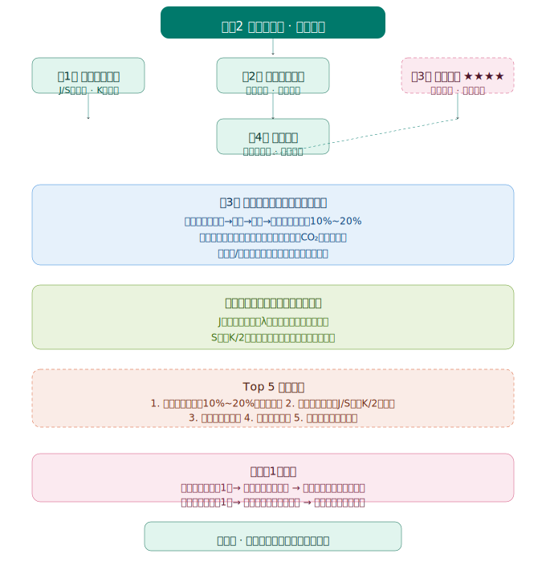
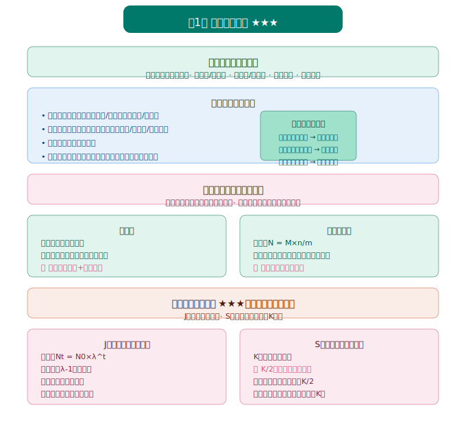
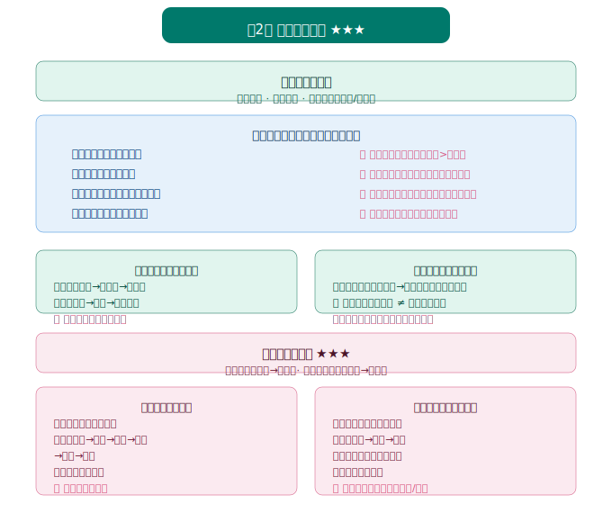
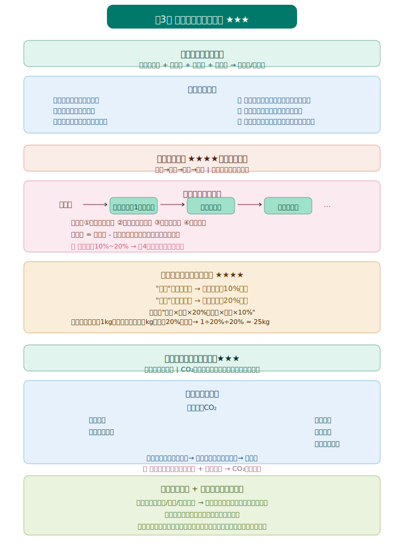

# 高中生物 选必2《生物与环境》知识图谱

> Eva · 西安（全国乙卷）· 人教版 · 2019版



---

## 一、第1章 种群及其动态 ★★★



---

## 总体框架

```
生物与环境（选必2）
├── 第1章 种群及其动态 → J/S型增长、种群特征、影响因素
├── 第2章 群落及其演替 → 群落结构、种间关系、演替类型
├── 第3章 生态系统及其稳定性 → 能量流动（10%定律）、物质循环、信息传递、稳定性
└── 第4章 人与环境 → 生物多样性、生态工程、生态环境保护
```

**高考权重：** ⭐⭐⭐⭐（每年解答题必考生态学，常结合碳中和、生态保护等热点）

**核心主线：** 个体（种群）→ 群体（群落）→ 系统（生态系统）→ 人与自然（环境保护）

---

## 第1章 种群及其动态 ⭐⭐⭐⭐

> 地位：生态学基础，种群数量是高考计算题的高频考点。

### 一、种群的概念与特征

**种群：** 一定区域内**同种生物所有个体**的总和。

#### 1.1 种群的数量特征（4大特征）

| 特征 | 定义 | 意义/应用 |
|------|------|----------|
| **种群密度** | 单位面积/体积中的个体数 | 最基本的数量特征 |
| **出生率/死亡率** | 单位时间内新出生/死亡个体数占总个体数的比例 | **直接决定**种群密度变化 |
| **迁入率/迁出率** | 单位时间内迁入/迁出个体数占总个体数的比例 | **直接决定**种群密度变化（城市人口） |
| **年龄结构** | 种群中不同年龄个体数的比例 | **预测**种群数量变化趋势 |
| **性别比例** | 种群中雌雄个体数的比例 | **影响**出生率，间接影响种群密度 |

**年龄结构三种类型：**
```
增长型：幼体多、成体少 → 种群数量将增长（典型：发展中国家人口）
稳定型：各年龄组比例适中 → 种群数量相对稳定
衰退型：幼体少、老年多 → 种群数量将衰退（典型：发达国家人口）
```

**🔴 易错提醒：**
- 种群密度是**最基本信息**，但不是决定种群数量的直接因素
- **直接决定**种群密度的是：出生率/死亡率、迁入率/迁出率
- 年龄结构只能**预测**趋势，不能直接决定当前种群密度

#### 1.2 种群密度的调查方法

| 方法 | 适用对象 | 关键操作 |
|------|----------|----------|
| **样方法** | 植物、活动能力弱的动物（如蚜虫） | 随机取样、样方大小适中、计数样方内+相邻两边个体 |
| **标记重捕法** | 活动能力强的动物 | 标记不影响活动、标记个体均匀混合、无大量死亡/出生 |
| **黑光灯诱捕法** | 趋光性昆虫 | — |
| **血球计数板计数** | 微生物（酵母菌） | 抽样检测、计数室体积换算 |

**标记重捕法计算公式：**
```
种群数量 N = (初捕数 M × 重捕数 n) ÷ 重捕中标记数 m
```

**🔴 易错提醒：**
- 样方法计数：**样方内所有个体 + 相邻两边**上的个体（避免重复/漏计）
- 标记重捕法的前提：标记个体在种群中**均匀分布**，调查期间无大量出生/死亡/迁入/迁出

---

### 二、种群数量的变化

#### 2.1 种群增长的"J"型曲线

**条件：** 理想条件（食物和空间充裕、气候适宜、无天敌）

**数学模型：** $N_t = N_0 \times \lambda^t$

- $N_0$：初始种群数量
- $\lambda$：种群数量是上一年种群数量的倍数（$\lambda > 1$ 增长）
- $t$：时间

**特点：** 增长率（$\lambda - 1$）**不变**，增长速率**逐年增大**。

**实例：** 外来物种入侵初期、实验室培养酵母菌（资源充足时）。

#### 2.2 种群增长的"S"型曲线

**条件：** 自然条件（资源和空间有限，存在环境阻力）

**环境容纳量（$K$值）：** 环境条件不受破坏的情况下，一定空间中所能维持的**最大种群数量**。

**增长特点：**
- 种群数量 $< K/2$ 时：增长速率**逐渐增大**
- 种群数量 $= K/2$ 时：增长速率**最大**（渔业捕捞、林业采伐的**最佳时期**）
- 种群数量 $> K/2$ 时：增长速率**逐渐减小**
- 种群数量 $= K$ 时：增长速率**为0**，种群数量**相对稳定**

**🔴 易错提醒：**
- $K$值是**环境容纳量**，不是固定不变的（环境变化，$K$值可能变化）
- 保护野生动物：改善环境，**提高$K$值**
- 防治有害生物：破坏环境，**降低$K$值**

#### 2.3 "J"型 vs "S"型对比

| 项目 | "J"型曲线 | "S"型曲线 |
|------|------------|------------|
| 前提条件 | 理想条件 | 自然条件（资源有限） |
| 增长模型 | $N_t = N_0 \lambda^t$ | 逻辑斯蒂增长 |
| 增长率 | 不变 | 逐渐减小 |
| 增长速率 | 持续增大 | 先增后减（$K/2$时最大） |
| $K$值 | 无 | 有 |

**🔴 高考高频考点：**
- **$K/2$的应用**：渔业捕捞后剩余量保持在$K/2$，使种群增长速率最快，有利于可持续发展
- **$K$值应用**：大熊猫保护区扩建→提高$K$值；鼠害防治→降低$K$值

#### 2.4 影响种群数量变化的因素

**自然因素：** 气候、食物、天敌、传染病、空间等

**人为因素：** 人类活动对自然界种群数量变化的影响越来越大

**意义：** 种群数量的变化是**种群研究的核心问题**，对有害动物的防治、野生生物资源的保护和利用具有重要意义。

---

### 三、探究·实践：培养液中酵母菌种群数量的变化

**实验原理：** 酵母菌在液体培养基中培养，种群数量随时间变化呈现"S"型增长。

**关键操作：**
1. 用**血球计数板**计数
2. 每天同一时间取样计数
3. 绘制**种群数量-时间**曲线

**注意事项：**
- 计数前需**振荡**试管使酵母菌均匀分布
- 死菌和活菌都被计数（用台盼蓝染色可区分死活菌）
- 对于压在方格线上的酵母菌：计数**相邻两边+顶角**

---



## 第2章 群落及其演替 ⭐⭐⭐

> 地位：群落是研究种群之上更高层次的生命系统，是高考选择题常考点。

### 一、群落的结构

**群落：** 同一时间内聚集在一定区域中**各种生物种群的集合**。

#### 1.1 群落的物种组成

**丰富度：** 群落中**物种数目的多少**。

- 丰富度是描述群落**物种多样性**的最重要指标
- 不同群落丰富度差异很大（热带雨林 > 温带森林 > 极地苔原）

#### 1.2 种间关系

| 关系类型 | 特点 | 实例 | 曲线模型 |
|----------|------|------|----------|
| **捕食** | 一种生物以另一种生物为食 | 狼捕食兔、鸬鹚捕鱼 | 被捕食者数量通常多于捕食者 |
| **竞争** | 两种或多种生物争夺资源和空间 | 牛和羊竞争草、大草履虫和双小核草履虫 | 一方占优势，另一方受抑制（甚至灭亡） |
| **互利共生** | 两种生物共同生活，相互依存，彼此有利 | 根瘤菌与豆科植物、地衣（真菌+藻类） | 同生共死（数量变化同步） |
| **寄生** | 一种生物（寄生者）寄居于另一种生物（寄主）体内或体表 | 蛔虫与人、菟丝子与大豆 | 寄生者受益，寄主受害 |

**🔴 易错提醒：**
- **竞争** vs **捕食**：竞争是"此消彼长"，捕食是"先增后减、后增先减"（被捕食者先变化）
- **互利共生** vs **寄生**：共生双方都受益，寄生只有一方受益

**判别曲线技巧：**
```
若两种生物数量变化同步（同增同减）→ 互利共生
若一种数量增加，另一种也增加，但随后第二种增加导致第一种减少 → 捕食
若一种数量增加，另一种数量减少 → 竞争（或寄生）
```

#### 1.3 群落的空间结构

**垂直结构：** 在**垂直方向**上的分层现象。

| 生态系统类型 | 分层原因 |
|--------------|----------|
| 森林生态系统 | 光照强度不同（乔木层、灌木层、草本层） |
| 池塘生态系统 | 光照、温度、食物（挺水植物、浮水植物、沉水植物） |

**水平结构：** 在**水平方向**上，由于地形、光照、湿度等因素，不同地段分布着不同种群，呈**镶嵌分布**。

**意义：** 提高了群落利用环境资源的能力。

**🔴 易错提醒：**
- 高山植被的垂直分布（从山脚到山顶）：是**气候变化**（温度、降水）导致的**地带性分布**，**不是**群落的垂直结构
- 群落的垂直结构是指**同一区域**内不同高度上的分层

---

### 二、群落的演替

**演替：** 随着时间的推移，一个群落被另一个群落**代替**的过程。

#### 2.1 初生演替 vs 次生演替

| 项目 | 初生演替 | 次生演替 |
|------|------------|------------|
| **起点** | 从来没有被植物覆盖的地面，或原有植被被彻底消灭 | 原有植被虽已不存在，但原有土壤条件基本保留 |
| **实例** | 裸岩、沙丘、火山岩、冰川泥上的演替 | 火灾过后的草原、过量砍伐的森林、弃耕农田 |
| **时间** | 经历时间长 | 经历时间短 |
| **过程** | 裸岩→地衣→苔藓→草本→灌木→森林 | 草本→灌木→森林（跳过地衣、苔藓阶段） |

**🔴 易错提醒：**
- 演替的**终点**不一定是森林（取决于气候条件，干旱地区可能停在草原或灌木阶段）
- **人类活动**往往会使群落演替按照**不同于自然演替的速度和方向**进行

#### 2.2 演替的过程（以裸岩上的初生演替为例）

```
裸岩阶段 → 地衣阶段（先驱物种，分泌有机酸加速岩石风化）→ 
苔藓阶段（进一步风化，积累土壤）→ 草本植物阶段（土壤加厚，小型动物出现）→ 
灌木阶段（遮荫，草本减少，动物种类增多）→ 森林阶段（乔木占优势，群落结构复杂）
```

**关键：** 每个阶段都为下一阶段创造了更好的条件（土壤加厚、遮荫、小气候改变）。

---



## 第3章 生态系统及其稳定性 ⭐⭐⭐⭐⭐

> 地位：**全书最核心章节！** 能量流动、物质循环是高考解答题必考内容，往往结合碳中和、生态环境保护等热点。

### 一、生态系统的结构

**生态系统：** 由**生物群落**与它的**无机环境**相互作用而形成的统一整体。

#### 1.1 生态系统的组成成分

| 成分 | 作用 | 实例 |
|------|------|------|
| **非生物的物质和能量** | 为生物提供物质和能量 | 阳光、热能、水、空气、无机盐 |
| **生产者** | 将无机物合成有机物，为消费者提供食物和栖息场所（**主要成分**） | 绿色植物、蓝细菌、光合细菌、化能合成细菌（硝化细菌） |
| **消费者** | 加快生态系统的物质循环；帮助植物传粉和传播种子 | 动物、寄生生物 |
| **分解者** | 将动植物遗体和动物排遗物分解成无机物（**关键成分**） | 细菌、真菌、腐生动物（蚯蚓、蜣螂） |

**🔴 易错提醒：**
- **生产者**一定是自养生物，主要是绿色植物（但不仅仅是植物，还包括化能合成细菌）
- **消费者**不一定是动物（寄生生物也是消费者）
- **分解者**不一定是微生物（蚯蚓、蜣螂也是分解者）
- **所有的**植物都是生产者？❌（寄生植物如菟丝子是消费者）
- **所有的**动物都是消费者？❌（蚯蚓、蜣螂是分解者）
- **所有的**微生物都是分解者？❌（硝化细菌是生产者，寄生真菌是消费者）

#### 1.2 食物链和食物网

**食物链：** 生态系统中，各种生物之间由于**食物关系**而形成的一种联系。

**食物网：** 许多食物链彼此相互交错连接形成的复杂营养结构。

**书写规则：**
- 生产者 → 初级消费者 → 次级消费者 → 三级消费者
- **箭头方向**：表示能量流动方向（被吃→吃）
- **营养级**：生产者为第1营养级，初级消费者为第2营养级，以此类推

**🔴 易错提醒：**
- 食物链中**不包含分解者**
- 食物链中**不包含非生物的物质和能量**
- 同一营养级的生物**不一定是一个物种**（如草→兔、草→鼠，兔和鼠都是第2营养级）
- 食物网中**营养级**的计算：从生产者（第1营养级）开始数

**食物网分析技巧：**
```
1. 数食物链：从生产者出发，到最高营养级，不重复、不遗漏
2. 某种生物数量变化对其他生物的影响：
   - 说"天敌减少，被捕食者数量增加" → 短期内增加，长期趋于稳定（受K值限制）
   - 说"某种生物减少，以其为食的生物数量减少"
```

---

### 二、生态系统的能量流动 ⭐⭐⭐⭐⭐

**能量流动：** 生态系统中能量的**输入、传递、转化和散失**的过程。

#### 2.1 能量流动的过程

**输入：** 生产者通过**光合作用**将太阳能转化为化学能，固定在有机物中。

**传递：** 沿着**食物链**（食物网）进行。

**转化：** 光能 → 化学能 → 热能（最终散失）

**散失：** 各营养级生物通过**呼吸作用**以热能形式散失（约95%以上）

#### 2.2 能量流动的特点

**1. 单向流动：** 不可逆，不能循环（热能不能被生物重新利用）

**2. 逐级递减：** 传递效率约为**10%~20%**（林德曼效率）

```
生产者（第1营养级）：100%
    ↓ 约10%~20%
初级消费者（第2营养级）：10%~20%
    ↓ 约10%~20%
次级消费者（第3营养级）：1%~4%
    ↓ 约10%~20%
三级消费者（第4营养级）：0.1%~0.8%
```

**🔴 高考高频考点：能量流动计算题**

**解题模型：**
```
已知：生产者固定能量为A
求：最高营养级获得能量范围？
答：按最大传递效率20%计算：A × (20%)^(n-1)
   按最小传递效率10%计算：A × (10%)^(n-1)
   （n为营养级数目）
```

**🔴 易错提醒：**
- **同化量** vs **摄入量**：同化量 = 摄入量 - 粪便量（粪便中的能量属于上一营养级）
- 每个营养级的能量去向：①呼吸作用散失 ②流入下一营养级 ③流向分解者 ④未被利用
- **最多**需要消耗生产者多少？→ 按**最小**传递效率10%计算
- **最少**需要消耗生产者多少？→ 按**最大**传递效率20%计算

#### 2.3 研究能量流动的意义

1. **帮助人们科学规划、设计人工生态系统**，使能量得到最有效的利用（如桑基鱼塘）
2. **帮助人们合理调整生态系统中的能量流动关系**，使能量持续高效地流向对人类最有益的部分（如除草、治虫）

---

### 三、生态系统的物质循环

**物质循环：** 组成生物体的**C、H、O、N、P、S**等元素，都在不断进行着从非生物环境到生物群落，又从生物群落到非生物环境的循环过程。

**特点：** 全球性、循环性

#### 3.1 碳循环

**碳的存在形式：**
- 非生物环境：CO₂、碳酸盐
- 生物群落：含碳有机物

**碳的循环途径：**

```
大气中的CO₂ 
    ↓ 光合作用/化能合成作用
生产者（含碳有机物）
    ↓ 摄食
消费者（含碳有机物）
    ↓ 呼吸作用、分解者的分解作用、化石燃料燃烧
大气中的CO₂
```

**🔴 易错提醒：**
- 碳从非生物环境进入生物群落：主要通过**光合作用**（还有化能合成作用）
- 碳从生物群落回到非生物环境：主要通过**呼吸作用**（还有分解者的分解作用、燃烧）
- **化石燃料**的燃烧是引起**温室效应**的主要原因

**温室效应：**
- 原因：化石燃料大量燃烧 + 森林砍伐 → 大气CO₂浓度升高
- 危害：全球气候变暖、冰川融化、海平面上升、极端气候事件增多
- 措施：减少化石燃料使用、开发新能源、植树造林、保护森林

#### 3.2 能量流动 vs 物质循环对比

| 项目 | 能量流动 | 物质循环 |
|------|----------|----------|
| 形式 | 光能 → 化学能 → 热能 | 元素（C、N、P等）在生物与非生物间循环 |
| 特点 | 单向流动、逐级递减 | 全球性、循环性 |
| 范围 | 生态系统各营养级之间 | 生物圈（全球性） |
| 联系 | 能量是物质循环的动力 | 物质是能量的载体 |

**口诀：** "能量是动力，物质是载体；能量单向不循环，物质循环全球性"

---

### 四、生态系统的信息传递

**信息类型：**

| 信息类型 | 实例 |
|----------|------|
| **物理信息** | 光、声、温度、湿度、磁力、颜色（花香、鸟鸣、蝙蝠回声定位） |
| **化学信息** | 植物生物碱、有机酸；动物性外激素 |
| **行为信息** | 蜜蜂跳舞、孔雀开屏、求偶炫耀 |

**信息传递的作用：**
1. **生命活动的正常进行**，离不开信息的作用（如蝙蝠回声定位）
2. **生物种群的繁衍**，离不开信息的传递（如植物开花需要光信息刺激）
3. **调节生物的种间关系**，维持生态系统的稳定（如狼和兔的信息传递）

**应用：**
- 提高农产品/畜产品的产量（如模拟动物信息吸引传粉动物）
- 对有害动物进行控制（如利用性外激素诱捕害虫）

---

### 五、生态系统的稳定性

**生态系统的稳定性：** 生态系统所具有的**保持或恢复**自身结构和功能相对稳定的能力。

#### 5.1 抵抗力稳定性 vs 恢复力稳定性

| 类型 | 定义 | 关系 |
|------|------|------|
| **抵抗力稳定性** | 生态系统抵抗外界干扰并使自身结构与功能保持原状的能力 | 一般：生态系统成分越复杂，抵抗力稳定性越高 |
| **恢复力稳定性** | 生态系统在受到外界干扰因素的破坏后恢复到原状的能力 | 一般：生态系统成分越简单，恢复力稳定性越高 |

**🔴 易错提醒：**
- 抵抗力稳定性和恢复力稳定性**不一定呈负相关**（如北极苔原生态系统，两者都低）
- **自我调节能力**的基础是**负反馈调节**

#### 5.2 提高生态系统稳定性的措施

1. 控制对生态系统的干扰程度，对生态系统的利用应该适度
2. 对人类利用强度较大的生态系统，应实施相应的物质和能量投入（如农田施肥）
3. 保护生物多样性，提高生态系统复杂性

---


## 第4章 人与环境 ⭐⭐⭐

> 地位：结合热点（碳中和、生物多样性保护、生态工程）考查，常出现在解答题最后一问。

### 一、人类活动对生态环境的影响

#### 1.1 全球性生态环境问题

| 问题 | 原因 | 危害 | 措施 |
|------|------|------|------|
| **全球气候变化（温室效应）** | 化石燃料燃烧、森林砍伐 | 冰川融化、海平面上升、极端气候 | 减少碳排放、植树造林、开发新能源 |
| **臭氧层破坏** | 氟利昂等物质的大量排放 | 紫外线增强，皮肤癌发病率增加 | 禁止氟利昂生产使用 |
| **酸雨** | 硫氧化物、氮氧化物大量排放 | 土壤酸化、湖泊酸化、建筑物腐蚀 | 减少化石燃料使用、烟气脱硫 |
| **土地荒漠化** | 植被破坏、过度放牧 | 可利用土地减少、沙尘暴 | 退耕还林还草、合理放牧 |
| **水污染** | 工业废水、农业化肥、生活污水 | 水体富营养化、重金属污染 | 污水处理、减量使用化肥农药 |
| **生物多样性丧失** | 栖息地破坏、过度捕捞/狩猎、外来物种入侵 | 生态系统功能受损 | 建立自然保护区、易地保护 |

#### 1.2 生态足迹

**生态足迹：** 维持一个人生存所需的生产资源和吸纳废物的土地及水域的面积。

**特点：** 生态足迹的值**越大**，代表人类所需的资源越多，对生态和环境的影响越大。

**中国的生态足迹：** 随着经济发展和人口增长，我国生态足迹持续增加，已出现**生态赤字**（生态足迹 > 生态承载力）。

---

### 二、生物多样性及其保护

#### 2.1 生物多样性的三个层次

| 层次 | 内容 |
|------|------|
| **基因多样性** | 所有生物拥有的全部基因（同种生物不同个体基因不同） |
| **物种多样性** | 所有生物种类的丰富程度 |
| **生态系统多样性** | 各种各样的生态系统（森林、草原、湿地、海洋等） |

#### 2.2 生物多样性的价值

| 价值类型 | 内容 | 实例 |
|----------|------|------|
| **直接价值** | 食用、药用、工业原料、科研、美学价值 | 青蒿素（药用）、水稻（食用） |
| **间接价值** | 生态功能（调节气候、保持水土、净化环境） | 森林保持水土、湿地蓄洪防旱 |
| **潜在价值** | 目前人类尚不清楚的价值 | 某种野生植物可能含有抗癌成分 |

**🔴 易错提醒：**
- 生物多样性的**间接价值**（生态功能）**远大于**直接价值
- 潜在价值：目前不知道，但未来可能有重要作用

#### 2.3 生物多样性丧失的原因

1. **生存环境的破坏**（最主要原因）：森林砍伐、湿地排水、栖息地碎片化
2. **掠夺式利用**：过度捕捞、滥捕乱猎
3. **环境污染**：水体污染、土壤污染、大气污染
4. **外来物种入侵**：水葫芦、福寿螺、红火蚁
5. **农业和林业品种单一化**：遗传多样性丧失

#### 2.4 生物多样性保护措施

| 措施 | 定义 | 实例 |
|------|------|------|
| **就地保护（最有效措施）** | 在原地建立自然保护区、国家公园 | 大熊猫自然保护区、三江源国家公园 |
| **易地保护** | 将保护对象迁出原地，在异地专门保护 | 动物园、植物园、濒危动物繁育中心 |
| **生物技术保护** | 利用生物技术对濒危物种的基因进行保护 | 建立精子库、种子库、基因库 |

**🔴 易错提醒：**
- **就地保护是最有效的措施**（保护生态系统 = 保护其中的所有物种）
- 保护生物多样性 ≠ 禁止开发和利用，而是**反对盲目地、掠夺式地**开发和利用

---

### 三、生态工程

**生态工程：** 人类应用**生态学和系统学**的基本原理和方法，通过系统设计、调控和技术组装，对已破坏的生态环境进行修复、重建，对造成环境污染和破坏的传统生产方式进行改善，并提高生态系统的生产力，从而促进人类社会和自然环境的和谐发展的系统工程技术或综合工艺过程。

#### 3.1 生态工程的基本原理

| 原理 | 内容 |
|------|------|
| **自生原理** | 生态系统具有自我组织、自我优化、自我调节、自我更新和维持的能力（通过选择生物组分并合理布设） |
| **循环原理** | 促进系统的物质迁移与转化，使前一个环节产生的废物尽可能被后一个环节利用 |
| **协调原理** | 生物与环境的协调与平衡（考虑环境承载力/$K$值） |
| **整体原理** | 生态系统建设要考虑社会-经济-自然复合系统（不仅要考虑自然生态系统的规律，还要考虑经济和社会的影响力） |

#### 3.2 生态工程的实例

| 类型 | 原理应用 | 实例 |
|------|----------|------|
| **农村综合发展型生态工程** | 物质循环再生、整体原理 | 北京郊区某村沼气工程（秸秆→食用菌/饲料→畜禽→粪便→沼气→沼渣→肥料） |
| **湿地生态恢复工程** | 自生、协调原理 | 厦门筼筜湖生态恢复（引潮入湖、清挖淤泥、修建环湖林荫道） |
| **矿区废弃地生态恢复工程** | 协调、整体原理 | 赤峰市元宝山矿区（平整土地、制造表土、植树种草） |
| **生态工程发展模式** | 循环、整体原理 | 桑基鱼塘（桑叶养蚕→蚕沙养鱼→塘泥肥桑） |

**🔴 易错提醒：**
- 生态工程的核心是**物质的多级循环利用**，实现"废物资源化"
- 生态工程追求的是**经济效益、生态效益、社会效益的统一**

---

## 高频考点总结

### Top 5 高频考点

1. **能量流动计算**（10% ~ 20%传递效率的应用）⭐⭐⭐⭐⭐
2. **种群增长曲线**（J型 vs S型，$K/2$的应用）⭐⭐⭐⭐
3. **种间关系判别**（捕食、竞争、互利共生、寄生的曲线分析）⭐⭐⭐⭐
4. **碳循环过程**（CO₂在生物群落与无机环境间的循环途径）⭐⭐⭐⭐
5. **生物多样性保护**（价值、丧失原因、保护措施）⭐⭐⭐

### 易错点集中提醒

| 易错点 | 正确理解 |
|--------|----------|
| 种群密度是"决定"种群数量的直接因素？ | ❌ 出生率/死亡率、迁入率/迁出率才是**直接决定**因素 |
| 所有的植物都是生产者？ | ❌ 寄生植物（菟丝子）是消费者 |
| 所有的动物都是消费者？ | ❌ 蚯蚓、蜣螂是分解者 |
| 食物链的起始一定是生产者？ | ✅ 正确 |
| 能量可以循环利用？ | ❌ 能量单向流动、逐级递减，不能循环 |
| 物质循环在生态系统内完成？ | ❌ 物质循环具有**全球性**，在生物圈范围内循环 |
| 抵抗力稳定性越高，恢复力稳定性越低？ | ⚠️ 一般如此，但北极苔原生态系统两者都低 |
| 保护生物多样性就是禁止开发利用？ | ❌ 是反对**盲目地、掠夺式地**开发利用 |

---

## 实验与探究

### 1. 调查草地中某种双子叶植物的种群密度（样方法）

**步骤：**
1. 确定调查对象（双子叶植物）
2. 选取样方（随机取样，样方大小适中）
3. 计数（样方内所有个体 + 相邻两边个体）
4. 计算种群密度（所有样方种群密度的平均值）

### 2. 调查当地某生态系统中的能量流动情况

**方法：** 测定各营养级的同化量、呼吸量、流向分解者的能量等

### 3. 探究土壤微生物的分解作用

**原理：** 土壤微生物能分解枯枝落叶等有机物

**对照实验：** 实验组（灭菌土壤）vs 对照组（自然土壤）

### 4. 设计制作生态缸，观察其稳定性

**要求：**
- 生态缸必须是**封闭**的（防止外界生物干扰）
- 生态缸中要能够进行**物质循环**和**能量流动**
- 采光用较强的**散射光**（避免阳光直射导致水温过高）
- 动物不宜太多、不宜太大（防止氧气不足）

---

> 📝 最后更新：2026-05-31

---

## 生态学综合专题

> 选必2最核心的解题模型合集，建议配合知识图谱一起学习。

### 一、能量流动计算题解题模型

#### 1.1 基础计算模型

**核心公式：** 相邻营养级间的传递效率 = 下一营养级同化量 ÷ 上一营养级同化量 × 100%

**解题步骤：**
1. 确定**生产者固定能量**或**最高营养级获得能量**
2. 判断是求"最多"还是"最少"需要消耗生产者
   - "最多"→ 按**最小**传递效率10%计算
   - "最少"→ 按**最大**传递效率20%计算
3. 注意**食物链长度**（营养级数目）

**例题模型：**
```
题目：在食物链"草→兔→狐"中，狐每增加1kg体重，至少需要草多少kg？
（传递效率按20%计算）

解法：
狐增加1kg → 需要兔：1 ÷ 20% = 5kg
兔增加5kg → 需要草：5 ÷ 20% = 25kg
答：至少需要草25kg。
```

#### 1.2 "最多/最少"问题速记

| 问题 | 计算方法 |
|------|----------|
| 求最高营养级**最多**获得多少能量 | 按**20%**传递效率，沿着**最短**食物链计算 |
| 求最高营养级**最少**获得多少能量 | 按**10%**传递效率，沿着**最长**食物链计算 |
| 求生产者在**最多**需要被消耗多少 | 按**10%**传递效率计算 |
| 求生产者在**最少**需要被消耗多少 | 按**20%**传递效率计算 |

**口诀：** "最多×最短×20%；最少×最长×10%"

#### 1.3 人为干预下的能量流动

**模型：** 人类除草、治虫 → 调整能量流动方向 → 使能量流向对人类最有益的部分

**计算：** 若人类将原本流向杂草的能量"截获"，这部分能量可以**更多**地流向农作物（进而流向人类）

---

### 二、食物网分析专题

#### 2.1 食物链计数方法

**规则：**
- 从**生产者**出发
- 到**最高营养级**结束
- 不重复、不遗漏
- **生产者数目** = 食物链数目（每条食物链始于一个生产者）

#### 2.2 生物数量变化分析

**模型：**
```
情景：食物网中某种生物数量减少
分析：
1. 以它为食物的生物（天敌）→ 数量减少
2. 它以之为食物生物（猎物）→ 数量增加（短期内）
3. 但若猎物数量增加→ 又会导致...（连锁反应）
```

**关键：** 分析时要注意**短期效应** vs **长期稳定状态**

**例题：**
```
食物网：草 → 鼠 → 狐
        草 → 虫 → 鸟
问：鼠大量减少，狐的数量如何变化？
答：狐的数量会减少（因为鼠是狐的食物之一，鼠减少→狐食物减少）
     但若虫的数量足够多，鸟也能成为狐的食物，则狐数量可能不显著减少
```

---

### 三、种群增长曲线分析

#### 3.1 "J"型 vs "S"型曲线判别

| 特征 | "J"型 | "S"型 |
|------|--------|--------|
| 坐标图特点 | 持续上升，无拐点 | 先升后平，有$K$值水平线 |
| 增长率 | 不变（$\lambda - 1$） | 逐渐减小 |
| 增长速率 | 持续增大 | 先增后减（$K/2$时最大） |

#### 3.2 $K$值和$K/2$的应用

**$K/2$的应用：**
- 渔业：捕捞后剩余量保持在$K/2$ → 种群增长速率最快 → 有利于可持续发展
- 林业：采伐后保留适当密度 → 促进林木快速恢复

**$K$值的应用：**
- 保护野生动物：改善环境 → 提高$K$值
- 防治有害生物：破坏环境 → 降低$K$值（如清除鼠类栖息地、食物来源）

---

### 四、碳循环图解分析

#### 4.1 碳循环图解判读

**图解识别技巧：**
```
1. 看到"大气中的CO₂" → 通常是起点或终点
2. 看到"光合作用"箭头 → 从非生物环境指向生产者
3. 看到"呼吸作用"箭头 → 从生物群落指向非生物环境
4. 看到"分解作用" → 从死者有机物流向无机环境
5. 看到"化石燃料燃烧" → 从化石流向大气CO₂
```

#### 4.2 温室效应与碳中和

**温室效应成因：**
- 化石燃料大量燃烧 → CO₂排放增加
- 森林砍伐 → 吸收CO₂能力下降

**碳中和：** 通过植树造林、节能减排等形式，抵消自身产生的CO₂排放量，实现CO₂"净零排放"。

**措施：**
1. 能源结构调整（可再生能源替代化石燃料）
2. 提高能源利用效率
3. 碳捕获与封存（CCS技术）
4. 增加碳汇（植树造林、保护森林、湿地恢复）

---

### 五、生物多样性保护综合题

#### 5.1 保护措施的判断

**判断技巧：**
```
题干关键词 → 对应措施
"建立自然保护区" → 就地保护（最有效）
"建立动物园/植物园" → 易地保护
"建立精子库/种子库" → 生物技术保护
```

#### 5.2 生物多样性价值判断

**判断技巧：**
```
直接价值：直接为人类所用（食用、药用、工业原料、科研、美学）
间接价值：生态功能（保持水土、调节气候、净化环境）
潜在价值：目前还不知道的用途
```

**🔴 高频考点：** 间接价值 > 直接价值（考查选择题）

---

### 六、互动练习

<iframe src="ecology_practice.html" width="100%" height="600px"></iframe>

[→ 在新窗口打开生态学专题练习](ecology_practice.html)

> 📝 最后更新：2026-05-31
