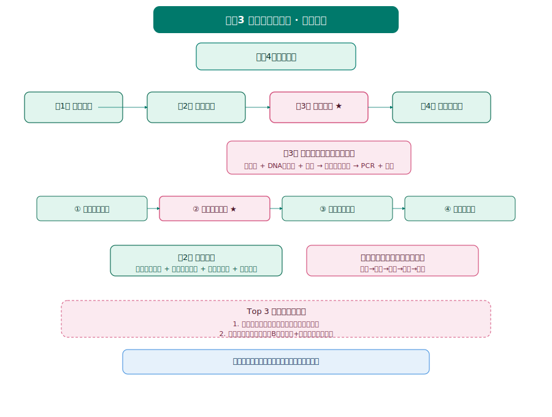
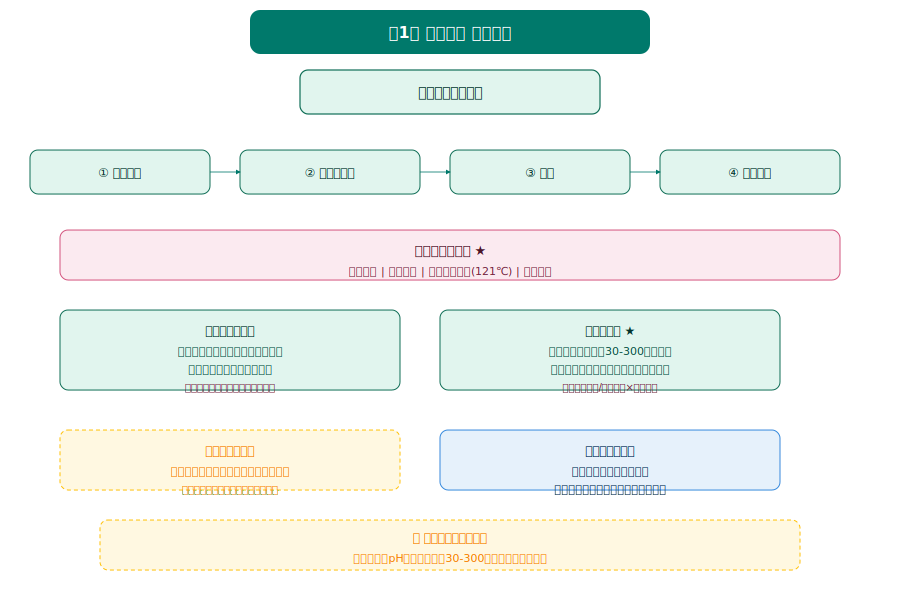
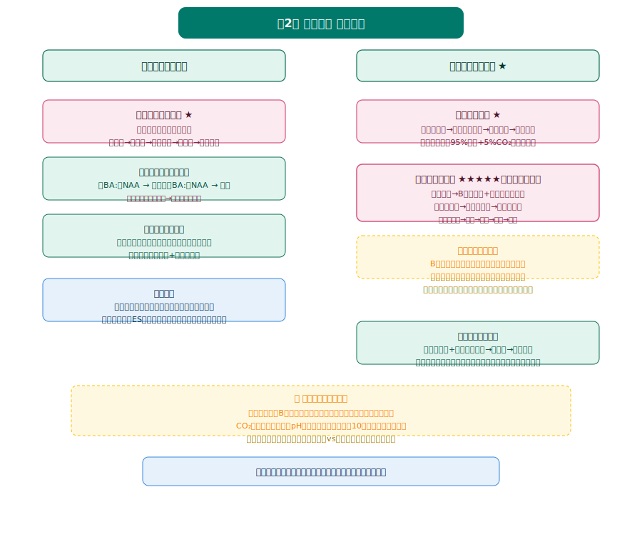
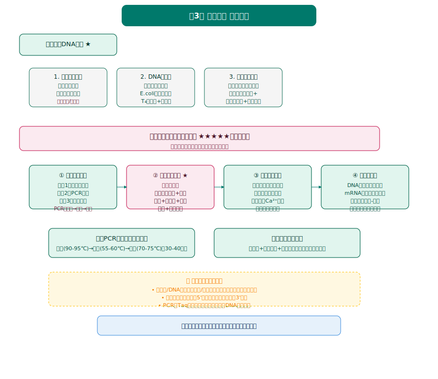
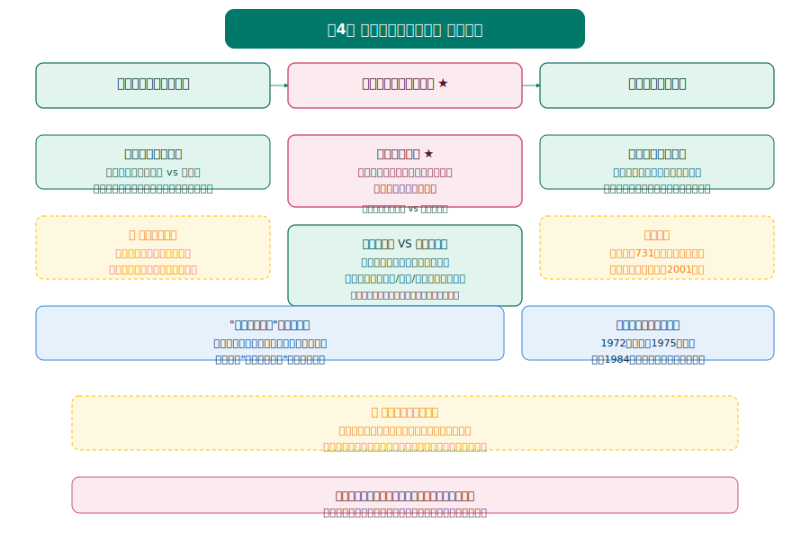

# 生物学选择性必修3《生物技术与工程》知识图谱

> Eva · 西安（全国乙卷）· 人教版 · 2019版



---

## 全书框架

| 章节 | 核心内容 | 高考权重 |
|:---:|------|:---:|
| 第1章 发酵工程 | 无菌技术、培养基配制、微生物分离与计数 | ⭐⭐ |
| 第2章 细胞工程 | 植物组织培养、动物细胞培养、单克隆抗体、胚胎工程 | ⭐⭐⭐⭐ |
| 第3章 基因工程 ★★★ | 限制酶/DNA连接酶/载体、四步操作程序、PCR、基因枪法/农杆菌转化 | ⭐⭐⭐⭐⭐ |
| 第4章 生物技术安全与伦理 | 转基因产品安全性、生殖性克隆、生物武器 | ⭐⭐ |

> 🔴 **高考提示：** 第3章"基因工程"是全书最核心内容，也是全国乙卷解答题高频考点（几乎每年都考基因工程大题）。第2章"单克隆抗体"也是高频考点。

---



## 第1章 发酵工程

### 一、发酵工程基本流程

```
菌种选育 → 培养基配制 → 灭菌 → 接种 → 发酵 → 产品分离提纯
```

### 二、无菌技术 ★

| 方法 | 适用对象 | 原理 |
|------|----------|------|
| **灼烧灭菌** | 接种环、试管口、瓶口 | 火焰灼烧，彻底灭菌 |
| **干热灭菌** | 玻璃器皿、金属器具 | 160-170℃加热1-2h |
| **高压蒸汽灭菌** | 培养基、无菌水 | 121℃、100kPa、15-30min |
| **过滤除菌** | 不耐高温的液体（如维生素溶液、抗生素溶液） | 用G6玻璃砂漏斗或滤膜 |

> 🔴 **易错提醒：** 培养基灭菌是**先调pH，再灭菌**（避免灭菌后pH变化）；操作过程要在**酒精灯火焰旁**进行（无菌区）。

### 三、微生物的基本培养技术

#### 3.1 培养基配制

**基本成分：**
| 成分 | 作用 | 常用物质 |
|------|------|----------|
| 碳源 | 提供碳元素、能源 | 葡萄糖、蔗糖 |
| 氮源 | 提供氮元素（合成蛋白质、核酸） | 蛋白胨、牛肉膏、(NH₄)₂SO₄ |
| 水 | 溶剂、参与代谢 | — |
| 无机盐 | 维持渗透压、酶活性 | NaCl、KH₂PO₄ |
| 特殊需求 | 满足特定微生物生长 | 维生素、生长因子 |

**选择培养基：** 加入某种化学物质，抑制不需要的微生物生长，促进目的微生物生长。
- 例：加入**青霉素**（抑制细菌细胞壁合成）→ 选择真菌
- 例：加入**高浓度NaCl**（抑制不耐盐细菌）→ 选择金黄色葡萄球菌

#### 3.2 微生物的纯培养（酵母菌纯培养实验）

**实验流程：**
1. 制备马铃薯葡萄糖琼脂（PDA）培养基 → 灭菌
2. 倒平板（超净工作台，酒精灯火焰旁）
3. 接种（划线分离法/涂布分离法）
4. 培养（28-30℃，2-3天）
5. 观察菌落（形态、颜色、大小）

> 🔴 **易错提醒：** 划线分离法的关键是"**先后不重叠**"——每次划线从上次划线末端开始，逐步稀释，最终得到单菌落。

#### 3.3 微生物的选择培养和计数 ★

**选择培养：** 用以选择特定微生物的培养基进行培养（如：以尿素为唯一氮源 → 选择能分解尿素的细菌）。

**计数方法对比：**

| 方法 | 原理 | 优点 | 缺点 |
|------|------|------|------|
| **稀释涂布平板法** | 菌落数 × 稀释倍数 | 准确，可分离纯种 | 操作繁琐，耗时 |
| **显微镜直接计数法** | 血细胞计数板 | 快速 | 死活细胞都计数，结果偏大 |

**公式：** 每克样品中菌落数 = (平板上菌落数 ÷ 涂布体积) × 稀释倍数

> 🔴 **易错提醒：** 只有落在**30-300个菌落**之间的平板才可用于计数（太少误差大，太多重叠难数）。

---



## 第2章 细胞工程 ★★★

> 地位：细胞工程是高考解答题高频考点，特别是**单克隆抗体**几乎每年都考。

### 一、植物细胞工程

#### 1.1 植物组织培养技术 ★

**原理：** 植物细胞的**全能性**（已分化的细胞仍具有发育成完整个体的潜能）。

**基本流程：**
```
外植体（叶片/茎段）→ 脱分化 → 愈伤组织 → 再分化 → 胚状体/丛芽 → 完整植株
```

| 阶段 | 激素比例（BA : NAA） | 结果 |
|------|------------------------|------|
| 诱导愈伤组织 | 低BA : 高NAA | 脱分化，形成愈伤组织 |
| 诱导生芽 | 高BA : 低NAA | 再分化，形成芽 |
| 诱导生根 | 低/无BA : 高NAA | 形成根 |

> 🔴 **易错提醒：** 
> - 植物组织培养**全程无菌操作**！
> - 脱分化：已分化细胞 → 未分化愈伤组织
> - 再分化：愈伤组织 → 根/芽分化

#### 1.2 植物细胞工程的应用

- **快速繁殖（微型繁殖）：** 保持优良品种遗传特性，快速大量繁殖
- **作物脱毒：** 用**茎尖**（病毒极少）进行组织培养，获得脱毒苗
- **培育人工种子：** 胚状体 + 人工种皮 → 人工种子（优点：保持性状、繁殖快）

### 二、动物细胞工程 ★★★

#### 2.1 动物细胞培养 ★

**基本流程：**
```
取动物组织 → 胰蛋白酶处理（分散成单个细胞）→ 原代培养 → 传代培养
```

**关键条件：**
| 条件 | 要求 |
|------|------|
| 无菌无毒环境 | 灭菌处理、添加抗生素、定期更换培养液 |
| 营养 | 葡萄糖、氨基酸、无机盐、维生素、动物血清（提供生长因子） |
| 温度和pH | 36.5±0.5℃、pH 7.2-7.4 |
| 气体环境 | 95%空气（O₂）+ 5% CO₂（维持pH） |

> 🔴 **易错提醒：** 
> - 胰蛋白酶处理目的：**分散细胞，避免接触抑制**
> - CO₂作用：**维持培养液pH**（不是提供碳源！）
> - 10代以内：遗传物质不变；10-50代：遗传物质可能改变；50代以上：可能产生癌变的细胞系

#### 2.2 动物细胞融合与单克隆抗体 ★★★★★

**单克隆抗体制备（高考必考！）：**

```
① 免疫小鼠（注射抗原）→ 脾中提取B淋巴细胞
② 将B淋巴细胞与骨髓瘤细胞融合
③ 用选择培养基筛选：只有杂交瘤细胞能存活
④ 克隆化培养和抗体检测：筛选出能产生特异性抗体的杂交瘤细胞
⑤ 体内/体外培养杂交瘤细胞 → 提取单克隆抗体
```

**记忆口诀：** "**免疫→融合→选择→检测→生产**"

| 细胞类型 | 在选择培养基中能否存活 | 原因 |
|----------|---------------------|------|
| B淋巴细胞 | ❌ 不能 | 不能无限增殖 |
| 骨髓瘤细胞 | ❌ 不能 | 缺乏HGPRT酶或TK酶（不能利用补救合成途径） |
| **杂交瘤细胞** | ✅ 能 | 继承了B细胞的HGPRT/TK酶 + 骨髓瘤细胞的无限增殖能力 |

> 🔴 **易错提醒：** 
> - B淋巴细胞**不能无限增殖**；骨髓瘤细胞**不能产生抗体**
> - 杂交瘤细胞**既能无限增殖，又能产生特异性抗体**
> - 单克隆抗体优点：**特异性强、灵敏度高、可大量制备**

#### 2.3 动物体细胞核移植和克隆动物

**原理：** 动物细胞核具有**全能性**（克隆羊多莉的培育证明）。

**基本流程：**
```
供体细胞核（如体细胞）→ 去核卵母细胞 → 电融合/化学诱导 → 重组胚 → 胚胎移植 → 代孕母体 → 克隆动物
```

> 🔴 **易错提醒：** 克隆动物的**核基因来自供核个体，质基因来自去核卵母细胞**。

### 三、胚胎工程

#### 3.1 胚胎工程的理论基础

| 阶段 | 时间（人） | 主要事件 |
|------|-----------|----------|
| 受精卵 → 桑椹胚 | 0-3天 | 卵裂（细胞数目增加，总体积不变） |
| 桑椹胚 → 囊胚 | 4-5天 | 出现**内细胞团**（发育成胎儿）和**滋养层**（发育成胎膜、胎盘） |
| 囊胚 → 原肠胚 | 6-7天 | 出现三个胚层（外胚层、中胚层、内胚层） |

#### 3.2 胚胎工程技术

- **体外受精：** 精子获能 + 卵子成熟培养 → 受精 → 早期胚胎
- **胚胎移植：** 将早期胚胎移植到**同种、生理状态相同**的受体子宫内
- **胚胎分割：** 将早期胚胎分割，产生同卵双胎/多胎（后代遗传物质完全相同）
- **胚胎干细胞（ES细胞）：** 来自囊胚内细胞团，具有**全能性**，可分化为各种组织细胞

---



## 第3章 基因工程 ★★★★★

> 地位：**全书最核心章节**！全国乙卷每年几乎都考基因工程解答题，务必熟练掌握四步操作程序。

### 一、重组DNA技术的基本工具

#### 1.1 限制性内切核酸酶（限制酶）★

- **作用：** 识别特定核苷酸序列，在**特定位点**切割DNA（产生黏性末端或平末端）
- **特点：** 专一性（一种限制酶只能识别一种特定序列）
- **例子：** EcoRI 识别 `GAATTC`，切割位点在G和A之间

```
  5'—G  AATTC—3'   →   5'—G     AATTC—3'
  3'—CTTAA  G—5'       3'—CTTAA     G—5'
      ↑切割位点                ↑黏性末端
```

#### 1.2 DNA连接酶 ★

- **作用：** 连接两个DNA片段之间的**磷酸二酯键**
- **两种DNA连接酶：**
  - **E·coli DNA连接酶：** 只能连接黏性末端
  - **T₄ DNA连接酶：** 既能连接黏性末端，也能连接平末端

#### 1.3 基因进入受体细胞的载体 ★

**常用载体：** 质粒、噬菌体衍生物、动植物病毒

**质粒作为载体的条件：**
| 条件 | 原因 |
|------|------|
| 有复制原点 | 在受体细胞中自我复制 |
| 有多个限制酶切位点 | 便于插入目的基因 |
| 有标记基因（如抗性基因） | 便于筛选重组细胞 |
| 对受体细胞无害 | 不影响受体细胞正常生理 |

> 🔴 **易错提醒：** 
> - 限制酶切割的是**磷酸二酯键**（不是氢键！）
> - DNA连接酶连接的也是**磷酸二酯键**（不是氢键！）

### 二、基因工程的基本操作程序 ★★★★★

> **这是全书最核心的内容，必须熟记四步！**

```
第1步：目的基因的筛选与获取
第2步：基因表达载体的构建 ← 核心步骤！
第3步：将目的基因导入受体细胞
第4步：目的基因的检测与鉴定
```

#### 2.1 第1步：目的基因的筛选与获取

**获取目的基因的方法：**
| 方法 | 适用情况 |
|------|----------|
| 从基因文库中获取 | 不知道目的基因序列 |
| PCR技术扩增 | 已知部分或全部序列，且序列较短 |
| 人工合成 | 基因较小，且核苷酸序列已知 |

**PCR技术（高考高频考点）：**

```
PCR流程（需在PCR仪中进行）：
1. 变性（90-95℃）：双链DNA解旋为单链
2. 退火（55-60℃）：引物与单链DNA结合
3. 延伸（70-75℃）：Taq酶（耐高温DNA聚合酶）合成新链
→ 重复30-40个循环，目的基因扩增2ⁿ倍
```

> 🔴 **易错提醒：** PCR中用的是**Taq酶**（从嗜热菌中分离，耐高温），而不是普通DNA聚合酶！

#### 2.2 第2步：基因表达载体的构建 ★★★

**核心步骤！** 只有构建表达载体，目的基因才能在受体细胞中稳定存在并表达。

**表达载体的组成：**
```
启动子 + 目的基因 + 终止子 + 标记基因 + 复制原点
```

| 组件 | 作用 |
|------|------|
| **启动子** | RNA聚合酶识别和结合的部位，驱动基因转录 |
| **目的基因** | 要表达的目标基因 |
| **终止子** | 给予RNA聚合酶转录终止信号 |
| **标记基因** | 筛选含有重组载体的受体细胞（如抗性基因） |
| **复制原点** | 使载体在受体细胞中复制 |

> 🔴 **易错提醒：** 
> - **启动子在基因的上游**（5'端），**终止子在基因的下游**（3'端）
> - 基因组文库 vs cDNA文库：基因组文库含有**全部基因（含内含子）**；cDNA文库只含有**表达的基因（无内含子）**

#### 2.3 第3步：将目的基因导入受体细胞

| 受体细胞类型 | 导入方法 | 适用情况 |
|---------------|----------|----------|
| **植物细胞** | 农杆菌转化法（常用）、基因枪法、花粉管通道法 | 双子叶植物常用农杆菌转化法 |
| **动物细胞** | **显微注射法** | 培育转基因动物（如超级小鼠） |
| **微生物细胞** | 感受态细胞法（Ca²⁺处理） | 大肠杆菌等原核细胞 |

> 🔴 **易错提醒：** 
> - 农杆菌转化法：农杆菌Ti质粒上的**T-DNA**可以整合到植物细胞染色体DNA上
> - 显微注射法：将目的基因直接注射到**受精卵的原核**中

#### 2.4 第4步：目的基因的检测与鉴定

| 检测层次 | 方法 | 目的 |
|-----------|------|------|
| DNA水平 | DNA分子杂交（Southern印迹） | 检测目的基因是否插入受体细胞染色体DNA |
| mRNA水平 | 分子杂交（Northern印迹） | 检测目的基因是否转录出mRNA |
| 蛋白质水平 | **抗原-抗体杂交** | 检测目的基因是否翻译出蛋白质 |
| 个体水平 | 抗虫/抗病接种实验、功能测定 | 检测转基因生物是否表现出预期性状 |

> 🔴 **易错提醒：** 
>
> - 个体生物学水平的鉴定是**最终鉴定**（例如：抗虫转基因植物 → 让害虫食用，观察是否死亡）

### 三、基因工程的应用

- **农牧业：** 转基因抗虫棉（Bt毒蛋白基因）、转基因耐储藏番茄（反义基因技术）
- **医药卫生：** 基因工程药物（胰岛素、干扰素、乙肝疫苗）、基因治疗（将正常基因导入患者细胞）
- **食品工业：** 转基因食品（如转基因大豆、转基因玉米）

### 四、蛋白质工程的原理和应用

> 蛋白质工程是**基因工程的延伸**。

**基本思路（中心法则的逆推）：**
```
预期蛋白质功能 → 设计预期蛋白质结构 → 推测氨基酸序列 → 推测DNA脱氧核苷酸序列 → 改造/合成基因 → 表达出改造后的蛋白质
```

> 🔴 **易错提醒：** 蛋白质工程改造的是**基因**，而不是直接改造蛋白质（因为蛋白质不能自我复制，基因可以）！

---



## 第4章 生物技术的安全性与伦理问题

### 一、转基因产品的安全性

**两个对立观点：**
| 观点 | 理由 |
|------|------|
| 转基因产品安全 | 经过严格安全评价； billions人食用未发现危害 |
| 转基因产品不安全 | 可能产生过敏原；基因污染；长期影响不确定 |

> 🔴 **高考答题要点：** 我国态度是"**研究上大胆，推广上慎重，管理上严格**"。要基于证据和逻辑理性看待，不能人云亦云。

### 二、关注生殖性克隆人

**我国政府态度：** 不赞成、不允许、不支持、不接受任何生殖性克隆人实验。

**原因：**
1. 克隆人冲击现有伦理道德观念
2. 克隆技术尚不成熟，可能孕育出有严重生理缺陷的个体
3. 克隆人是对人类尊严的侵犯

> 🔴 **区分：** 生殖性克隆（产生新个体）VS 治疗性克隆（产生细胞/组织/器官用于治疗）——我国**禁止生殖性克隆，但支持治疗性克隆研究**。

### 三、禁止生物武器

**我国立场：** 支持《禁止生物武器公约》，反对生物武器及其技术和设备的扩散。

---

## 全书核心综合题型

### Top 3 高考必考综合题

| 排名 | 综合题型 | 涉及章节 | 难度 |
|:---:|----------|----------|:----:|
| 1 | **基因工程四步操作程序** | 第3章 | ★★★★★ |
| 2 | **单克隆抗体制备** | 第2章 | ★★★★ |
| 3 | **PCR技术与电泳鉴定** | 第3章 | ★★★★ |

### 基因工程大题答题模板

```
题目：利用基因工程技术生产某种药用蛋白

答题模板：
第1步（获取目的基因）：
  → 从cDNA文库中获取 / 用PCR技术扩增（需要引物、Taq酶、dNTP）
  
第2步（构建表达载体）：
  → 用同种限制酶切割目的基因和载体（产生相同黏性末端）
  → 用DNA连接酶连接（形成重组DNA分子）
  → 表达载体组成：启动子 + 目的基因 + 终止子 + 标记基因
  
第3步（导入受体细胞）：
  → 若受体是微生物：Ca²⁺处理法（感受态细胞）
  → 若受体是动物细胞：显微注射法
  → 若受体是植物细胞：农杆菌转化法
  
第4步（检测与鉴定）：
  → DNA水平：DNA分子杂交（检测是否插入）
  → mRNA水平：分子杂交（检测是否转录）
  → 蛋白质水平：抗原-抗体杂交（检测是否翻译）
  → 个体水平：功能性实验（最终鉴定）
```

---

## 互动练习

<iframe src="interactive_practice.html" width="100%" height="600px"></iframe>

[→ 在新窗口打开互动练习](interactive_practice.html)

> 📝 最后更新：2026-05-31
